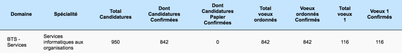
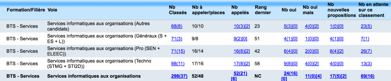

<!--more-->

L’orientation scolaire des jeunes bacheliers français est un sujet sensible. Le fonctionnement du portail [Admission Post-Bac](http://www.admission-postbac.fr/) (APB), pierre angulaire du dispositif d’orientation, est source [d’interrogations](http://www.studyrama.com/revision-examen/bac/admission-postbac-fr/apb-vos-questions-nos-reponses-sur-les-phases-d-84327) et [d’angoisses](http://www.francetvinfo.fr/bac/demoralises-decourages-les-lyceens-face-a-la-galere-des-admissions-post-bac_1489753.html) pour de nombreux élèves et leurs familles.

Pendant plusieurs années, j’ai été amené à piloter le recrutement d’une section de BTS dans un lycée public. Voici comment les choses se passent de l’intérieur.

> Ce témoignage est personnel et n’engage ni mon établissement, ni l’institution Education Nationale.

### TL:DR pour les candidats

Voici quelques conseils pour maximiser vos chances d’être retenu(e) dans une formation sélective sur APB :

* Construisez-vous _sur plusieurs années_ un dossier scolaire d’élève méritant(e).
* Dans vos bulletins, évitez à tout pris les critiques sur le (manque de) travail, l’attitude en classe et les absences répétées.
* Envisagez un projet d’orientation en cohérence avec votre parcours. Dans le cas contraire, préparez-vous à devoir justifier votre choix.
* Soignez et personnalisez votre lettre de motivation.
* Essayez de rencontrer l’équipe pédagogique de la formation ciblée pour vous présenter et leur expliquer votre projet.
* Soyez réactif et restez optimiste pendant la phase d’admission.

### APB pour les établissements d’accueil

Une très grande majorité des établissements d’enseignement supérieur français utilisent le portail APB pour gérer leur recrutement. Ils disposent d’une version adaptée à leurs besoins présentée dans [ce document](https://documentation.admission-postbac.fr/guide_usr_destinataire/A_Les_informations_de_base_05-01-2016.pdf).

A partir du mois de mai, un établissement présent sur APB peut consulter la liste complète des candidatures pour sa formation.

L’ordre des voeux des candidats n’est pas accessible aux formations. La seule information donnée par APB est le total de voeux 1, autrement dit le nombre de candidats ayant classé la formation en première position dans leur liste de vœux.

Courant mai, chaque établissement d’accueil examine toutes ces candidatures et génère un **classement** qui sera utilisé par APB afin d’affecter les candidats. Pour une formation sélective, le classement répond à un double objectif :

* Retenir des candidats ayant le profil pour réussir dans la formation.
* Sélectionner un maximum de candidats ayant placé la formation dans leurs tous premiers voeux. En effet, ce sont les plus susceptibles de venir pour de bon plutôt que d’aller voir ailleurs : la concurrence existe aussi entre les établissements !

### Le classement des candidatures

Il n’existe pas de règle absolue pour classer les candidats à une formation. Chaque établissement est libre de choisir ses critères et d’appliquer sa propre politique.

#### L’examen des dossiers

Le portail APB permet aux établissements d’accéder au dossier scolaire des candidats, qui comprend notamment leurs bulletins des dernières années (notes + appréciations) ainsi que leurs résultats au bac pour les candidats déjà scolarisés dans le supérieur et en réorientation. Les établissements peuvent exploiter ces notes afin de calculer des moyennes servant à classer les candidats.

A ce critère **quantitatif** s’ajoute presque toujours un critère **qualitatif** lié à l’étude du dossier de candidature. Pour la formation dont j’ai eu la responsabilité, chaque dossier se voyait attribué une note qualitative qui comptait pour un tiers de la note finale.

Les avis et appréciations des différents bulletins sont examinés avec soin : un élève souvent qualifié de “sérieux” ou de “travailleur” verra sa candidature favorisée. A l’inverse, les mentions fortement négatives (“aucun travail”, “trop de bavardages”, etc) ainsi qu’un nombre élevé d’absences non justifiées sont des signaux d’alarme qui entraineront systématiquement une pénalisation, voire un rejet pur et simple de la candidature.

D’après mon expérience personnelle en BTS, un établissement choisira un candidat moyen mais méritant plutôt qu’un bon candidat au dossier problématique. Un “des difficultés, mais fait des efforts” sera mieux perçu qu’un “n’exploite pas son potentiel”.

Afin d’être certain de compléter ses effectifs, un établissement classe toujours bien plus de dossiers qu’il n’a de places disponibles. En revanche, les candidatures rejetées ne sont pas classées : dans ce cas, le candidat ne peut plus rejoindre la formation durant la phase d’admission (voir plus loin).

#### Comment sortir du lot ?

Comme je l’ai évoqué plus haut, chaque formation tente “à l’aveugle” de classer en priorité des candidats réellement désireux de la rejoindre. Comme l’ordre des voeux est inaccessible aux établissements d’accueil, c’est au candidat d’agir afin de démontrer sa volonté réelle d’intégrer une formation. Les deux possibilités à sa disposition sont :

* Personnaliser et soigner sa **lettre de motivation** afin de justifier explicitement son choix. La lecture de cette lettre fait partie intégrante de l’examen du dossier. Attention aux lettres trop génériques qui sentent le copier/coller, ou pire à une candidature en BTS qui commence par “Mon grand intérêt pour le DUT…” (j’en lis tous les ans). Toute candidature “exotique”, tout changement de filière et/ou d’académie doit impérativement être justifié en détail dans la lettre.
* Rencontrer l’équipe pédagogique par le biais des **salons** et des **journées portes ouvertes**. Ce sera l’occasion d’avoir une vision plus concrète de la formation et de vérifier la validité d’un projet d’orientation. Les établissements conservent souvent les coordonnées de leurs visiteurs et bonifient leur candidature quand ils les retrouvent quelques semaines plus tard dans APB.

#### Les contraintes externes

La liberté de recrutement des établissements du supérieur est soumise à certaines contraintes, comme le nombre de places disponibles. Récemment, de nouvelles règles concernant l’origine scolaire des candidats ont vu le jour. Elles font suite à la volonté ministérielle d’offrir des débouchés à toutes les séries du baccalauréat, en particulier les sections technologiques (vers les IUT) et professionnelles (vers les BTS).

Concrètement, les IUT se voient imposer un pourcentage minimal de bacheliers technologiques dans leur recrutement, et les BTS un pourcentage minimal de bacheliers professionnels. Pour l’académie de Lyon, les pourcentages de 2016 varient entre 6% et 50% selon le type de BTS. Ces chiffres sont destinés à augmenter dans les années à venir.
> Les établissements privés sous contrat, pourtant tout aussi concernés que les établissements publics par ces exigences, sont pour l’instant très peu nombreux à les appliquer. Cette situation injuste devra évoluer.

Conséquence logique : **il devient plus difficile d’intégrer un BTS ou un IUT après un baccalauréat général**. C’est une donnée importante à prendre en compte dès la classe de Seconde pour choisir son orientation.

Afin d’affiner leur recrutement et de respecter ces contraintes, les établissement d’accueil définissent souvent des **groupes** de candidats selon leur série d’origine au baccalauréat. Il n’y a plus un classement unique mélangeant tous les dossiers, mais un classement pour chaque groupe.

### La phase d’admission

Début juin commence sur APB la phase d’admission. A trois reprises, le logiciel exploite les classements remontés par chaque établissement et les voeux des candidats pour leur proposer (ou pas) une affectation.

Les établissements d’accueil suivent attentivement les résultats d’admission afin d’éviter de se retrouver en déficit de candidats. Durant cette phase, chaque établissement a une vue actualisée au jour le jour de l’état de son recrutement.

Il peut se passer beaucoup de choses pendant la phase d’admission :

* Certains candidats sortent des classements en cas de départ en apprentissage ou vers une formations hors APB, d’échec au baccalauréat ou de démission.
* Les établissements peuvent rectifier leurs **données d’appel**, c’est-à-dire le nombre de candidats qu’ils souhaitent appeler pour chacun de leurs groupes. C’est notamment le cas lorsqu’une liste de classement est épuisée (plus aucun candidat à appeler dans un groupe).

Les candidats doivent surveiller avec attention l’évolution des résultats d’admission, afin de respecter les délais de réponse imposés par APB. Malgré l’incertitude et le stress inhérents à cette phase, il faut essayer de rester optimiste et positif : les propositions d’APB ne peuvent évoluer que dans leur sens, et il est fréquent que des situations se débloquent entre le début et la fin de la phase d’admission.

### Conclusion

J’espère que ce rapide tour d’horizon vous aura permis de mieux comprendre comment les établissements de formation peuvent gérer leur recrutement post-bac.

Bonne orientation avec APB !
