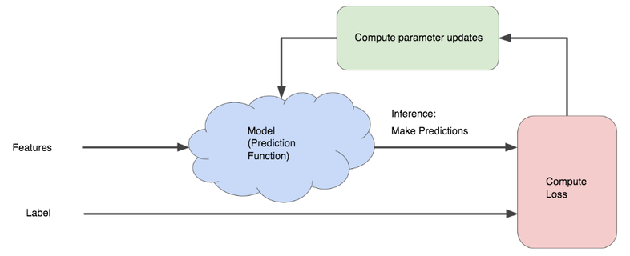
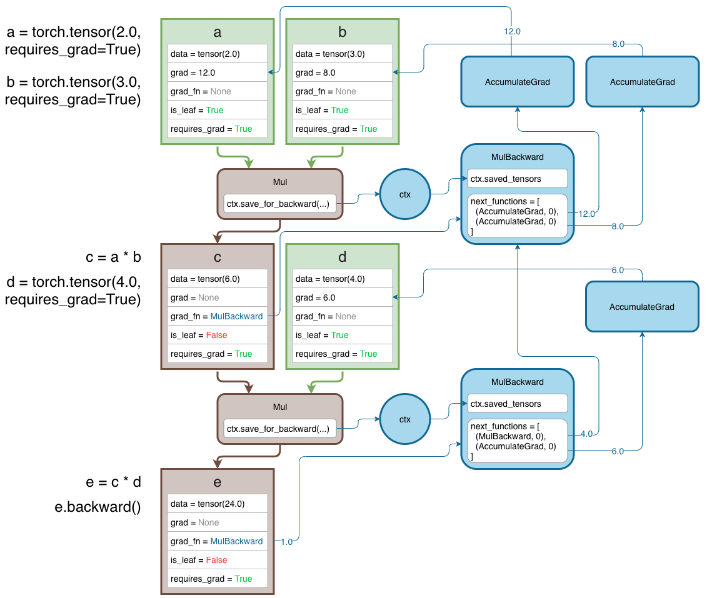

<!--more-->

> This post is (hopefully) the first in a series about implementing Machine Learning concepts and algorithms by hand. Stay tuned!

## Motivation

Since I started teaching Machine Learning, I embarked on an everlasting quest to deepen (no pun intended 😉) my understanding of its foundations. Learning to train a model through [scikit-learn](https://scikit-learn.org) or [Keras](https://keras.io/) is one thing, knowing how these libraries get the work done is another.

One subject that recently caught my attention is [automatic differentiation](https://en.wikipedia.org/wiki/Automatic_differentiation), often abbreviated *autodifferentiation*, *autodiff*, *AD* or (quite inappropriately) *autograd*. In a nutshell, automatic differentiation is a family of techniques for efficiently computing derivatives of numeric functions.

It's an intriguing topic in itself, at the intersection of mathematics and computer science. What makes it even more interesting is the fact that autodiff is at the heart of modern Deep Learning frameworks like [PyTorch](https://pytorch.org) or [TensorFlow](https://www.tensorflow.org/).

### Gradient descent 101

> You may skip this paragraph if you already know about gradient descent.

The Machine Learning models spearheading recent breakthroughs (and many others!) are trained from examples using *gradient-based optimization*.

At each step of this iterative process, two things happen sequentially:

1. The difference between the actual and expected outputs of the model, called *loss* or *cost* function, is computed.
1. The model's internal parameters (for example, the connection weights of a neural network) are adjusted in order to lower the loss. More precisely, they are updated in the opposite direction of the loss function *gradient*.

[](https://developers.google.com/machine-learning/crash-course/reducing-loss/an-iterative-approach)

The gradient of a multivariable function expresses the variation of this function relative to the variation of its variables. In other words, it tells us how much the function value changes when we make a tiny change to each of its variables.

During model training, we can treat input data and expected results as constants. The loss function variables are the model's parameters. Thus, computing the gradient of the loss function with respect to these parameters tells us how to adjust them: since we want to lower the value of the loss, we have to update each of the parameters in the opposite direction of its gradient.

This step is repeated until a minimum of the loss function is reached, corresponding to the optimal values for the model parameters. The whole process is called [gradient descent](https://developers.google.com/machine-learning/crash-course/reducing-loss/gradient-descent) (GD).


### Autodiff to the rescue

Training a model through GD requires a hefty amount of gradient computations. Being able to execute these operations quickly and reliably is critical for success.

Off-the-shelf Machine Learning models like [Logistic Regression](https://en.wikipedia.org/wiki/Logistic_regression) or [MultiLayer Perceptron](https://en.wikipedia.org/wiki/Multilayer_perceptron) have fairly simple and well-defined ways of computing the loss function gradient. This is not true for more recent, deeper models, which mix a [complex architecture](https://arxiv.org/abs/1512.03385) with [huge amounts of parameters](https://arxiv.org/abs/2005.14165). Computing gradients becomes an algorithmically challenging and resource-hungry task.

This is where autodifferentiation comes to the rescue. Frameworks like PyTorch or TensorFlow provide automatic and efficient computation of gradients for any sequence of operations, including math expressions but also algorithms using branching, loops or recursion. This gives researchers and engineers the freedom to create arbitrary complex models without bothering with the low-level yet critical task of computing gradients.

Some experts in the field even believe in the advent of a [new paradigm](https://medium.com/@karpathy/software-2-0-a64152b37c35), sometimes called [differentiable programming](https://en.wikipedia.org/wiki/Differentiable_programming), that would create software by assembling dynamic, parameterized modules trained through gradient-based optimization rather than hardcoding rules in an imperative way.



## Mathematical aspects

Now that the big picture is set, let's try to understand how the magic happens. To do so, we need to dive into the mathematical side of things. The paper [Automatic differentiation in machine learning: a survey](https://arxiv.org/abs/1502.05767) (Baydin et al., 2015) provides a nice overview of the subject.

### What autodiff is not

First, autodifferentiation is not to be confused with *numerical* nor *symbolic* differentiation.

[Numerical differentiation](https://en.wikipedia.org/wiki/Numerical_differentiation) approximates derivatives by using local values of the functions.

$$f'(x) = \lim_{h\rightarrow0} \frac{f(x+h)-f(x)}{h}$$

[Symbolic differentiation](https://en.wikipedia.org/wiki/Computer_algebra) applies mathematical derivation rules for obtaining exact derivative expressions.

Both approaches have their pros and cons, but are generally not very well suited to the context of Machine Learning:

- numerical differentiation is subject to rounding errors and suffers from a $O(n)$ complexity for a gradient in $n$ dimensions ;
- symbolic differentiation can lead to *expression swell* (exponentially large symbolic expressions), like in the following example.

$$f(x) = 16x(1-x)(1-2x)^2\\\\
f'(x) = 16(1−x)(1−2x)^2 −16x(1−2x)^2 − 64x(1 − x)(1 − 2x)$$

### Forward mode autodiff

### Reverse mode autodiff

The gradient $\nabla f$ of a function $f$ is a vector of partial derivatives w.r.t. each variable of $f$.

## Teardown of existing autodiff engines

Upon researching the topic of automatic differentiation, i came across and studied several interesting, Python-based implementations. Here is a brief synthesis for each of these projects, sorted by ascending order of complexity.

### micrograd

When he's not working at Tesla, [Andrej Karpathy](https://karpathy.github.io/) seems to enjoy publishing minimalist implementations of complex topics. The [micrograd](https://github.com/karpathy/micrograd) library is his attempt at creating the tiniest possible autodiff engine.

In about 100 LOC, this little gem implements reverse-mode autodiff for scalar values. On top of it, a PyTorch-like API lets you define and train neural networks.

Here's a glimpse of what **micrograd** can do.

```python
from micrograd.engine import Value

# Create a managed scalar value
x = Value(-4.0)
z = 2 * x + 2 + x  # z = -10
q = z.relu() + z * x  # q = 40
h = (z * z).relu()  # h = 100
y = h + q + q * x  # y = -20
# Compute gradients w.r.t. input values
y.backward()
assert x.grad == 46  # dy/dx
```

Technically speaking, **micrograd** defines several attributes for each autodiff-managed value:

- `.data` is the wrapped scalar.
- `.grad` (also a scalar) is the value of the gradient w.r.t. this value.
- `._backward` is the function implementing the chain rule to compute the gradients for the operation that created the current value.
- `._prev` is the set of values involved in the computation of the current one.

```python
class Value:
    """ stores a single scalar value and its gradient """
    def __init__(self, data, _children=(), _op=''):
        self.data = data
        self.grad = 0
        # internal variables used for autograd graph construction
        self._backward = lambda: None
        self._prev = set(_children)
```

Each operation on a managed value creates a new value as result. The `_backward()` function is defined as a nested function to gain access to its input and output values.

For example, here's how the multiplication operation is implemented in **micrograd**.

```python
def __mul__(self, other):
    other = other if isinstance(other, Value) else Value(other)
    out = Value(self.data * other.data, (self, other), '*')
    def _backward():
        self.grad += other.data * out.grad
        other.grad += self.data * out.grad
    out._backward = _backward
    return out
```

When it's time to backpropagate, a topogical list of all involved values is recursively built. For each of them (in reverse order), the `_backward()` function is called to apply the chain rule and compute all gradients.

```python
def backward(self):
    # topological order all of the children in the graph
    topo = []
    visited = set()
    def build_topo(v):
        if v not in visited:
            visited.add(v)
            for child in v._prev:
                build_topo(child)
            topo.append(v)
    build_topo(self)

    # go one variable at a time and apply the chain rule to get its gradient
    self.grad = 1
    for v in reversed(topo):
        v._backward()
```

All in all, **micrograd** is a pretty brilliant take on the autodiff subject, albeit limited (by design) to scalar values and first-order gradients.

### joelgrad

[Joel Grus](https://joelgrus.com/) also likes to create pedagogical resources on Machine Learning-related topics (you may have heard of him for [other](https://joelgrus.com/2016/05/23/fizz-buzz-in-tensorflow/) [reasons](https://docs.google.com/presentation/d/1n2RlMdmv1p25Xy5thJUhkKGvjtV-dkAIsUXP-AL4ffI/edit#slide=id.g362da58057_0_1) 😃). After coding a [Keras-like library](https://github.com/joelgrus/joelnet), he published a simple [autodiff engine](https://github.com/joelgrus/autograd) with a series of livecoding videos.



here is it in action.

```python
from autograd.tensor import Tensor

t1 = Tensor([[1, 2, 3], [4, 5, 6]], requires_grad=True)  # (2, 3)
t2 = Tensor([[7, 8, 9]], requires_grad=True)  # (1, 3)
t3 = t1 * t2
assert t3.data.tolist() == [[7, 16, 27], [28, 40, 54]]
t3.backward(Tensor([[1, 1, 1], [1, 1, 1]]))
assert t1.grad.data.tolist() == [[7, 8, 9], [7, 8, 9]]
assert t2.grad.data.tolist() == [[5, 7, 9]]
```

At the heart of this library is a `Tensor` class wrapping a [NumPy](https://numpy.org/) array into its `.data` attribute. Other notable attributes for this class are:

- `.requires_grad` which indicates if gradient should be computed for this tensor.
- `.depends_on` which is the list of dependencies towards other tensors. Each dependency is a `(tensor, function)` tuple.
- `.grad` which stores the gradient w.r.t. this tensor.

```python
class Dependency(NamedTuple):
    tensor: 'Tensor'
    grad_fn: Callable[[np.ndarray], np.ndarray]

class Tensor:
    def __init__(
        self,
        data: Arrayable,
        requires_grad: bool = False,
        depends_on: List[Dependency] = None,
    ) -> None:
        self._data = ensure_array(data)
        self.requires_grad = requires_grad
        self.depends_on = depends_on or []
        self.grad: Optional["Tensor"] = None
```

> Notice the use of [type annotations](https://docs.python.org/3/library/typing.html) to make the code more readable.

Tensor operations create an output tensor with dependencies. For each input tensor, a nested function `grad_fnX()` will compute and return the gradient of the operation w.r.t. this tensor.

For example, here's the code for the multiplication operation.

```python
def _mul(t1: Tensor, t2: Tensor) -> Tensor:
    data = t1.data * t2.data
    requires_grad = t1.requires_grad or t2.requires_grad
    depends_on: List[Dependency] = []

    if t1.requires_grad:
        def grad_fn1(grad: np.ndarray) -> np.ndarray:
            grad = grad * t2.data
            # ... (handle broadcasting)
            return grad
        depends_on.append(Dependency(t1, grad_fn1))

    if t2.requires_grad:
        def grad_fn2(grad: np.ndarray) -> np.ndarray:
            grad = grad * t1.data
            # ... (handle broadcasting)
            return grad
        depends_on.append(Dependency(t2, grad_fn2))

    return Tensor(data,
                  requires_grad,
                  depends_on)
```

Backpropagation is implemented in the `backward()` method of the `Tensor` class. The received gradient is accumulated into the `.grad` attribute of the current tensor. For each dependency, the gradient is computed through the `grad_fn` function and passed to the subsequent `backward()` call on the associated tensor. The computational graph is thus traversed in reverse order.

```python
def backward(self, grad: 'Tensor' = None) -> None:
    assert self.requires_grad, "called backward on non-requires-grad tensor"
    if grad is None:
        if self.shape == ():
            grad = Tensor(1.0)
        else:
            raise RuntimeError("grad must be specified for non-0-tensor")
    self.grad.data = self.grad.data + grad.data  # type: ignore
    for dependency in self.depends_on:
        backward_grad = dependency.grad_fn(grad.data)
        dependency.tensor.backward(Tensor(backward_grad))
```

This library is another inspirational example of what can be done to create an autodiff engine.

### autodidact

Through this [blog post](https://towardsdatascience.com/pytorch-autograd-understanding-the-heart-of-pytorchs-magic-2686cd94ec95), I discovered [autodidact](https://github.com/mattjj/autodidact), an autodiff engine written by [Matt Johnson](https://people.csail.mit.edu/mattjj/). **autodidact** is a pedagogical implementation of [Autograd](https://github.com/hips/autograd), one of the first Python libraries to support autodifferentiation whose main authors now work on [JAX](https://github.com/google/jax).

Below is an example use.

```python
import autograd.numpy as np  # Thinly-wrapped NumPy
from autograd import grad

def tanh(x):
    y = np.exp(-2.0 * x)
    return (1.0 - y) / (1.0 + y)

grad_tanh = grad(tanh)  # Obtain its gradient function
grad_tanh(1.0)  # Evaluate the gradient at x=1.0: 0.41997434161402603
(
    tanh(1.0001) - tanh(0.9999)
) / 0.0002  # Compare to finite differences: 0.41997434264973155
```

TODO

### PyTorch

Last but not least is [PyTorch](https://pytorch.org/), the Deep Learning heavyweight competing with [TensorFlow](https://www.tensorflow.org/) for the hearts of researchers, data scientists and Machine Learning engineers worldwide.

Both frameworks provide powerful autodifferentiation capacities. However, PyTorch's autodiff package, named [autograd](https://pytorch.org/docs/stable/autograd.html), was baked in right from the start and feels a little bit more natural to me. I therefore chose to concentrate on it.

The [official tutorial](https://pytorch.org/tutorials/beginner/blitz/autograd_tutorial.html#sphx-glr-beginner-blitz-autograd-tutorial-py) gives a good overview of what **autograd** is all about. Here's a small excerpt.

```python
import torch

x = torch.ones(2, 2, requires_grad=True)  # [[1., 1.], [1., 1.]]
y = x + 2  # [[3., 3.], [3., 3.]]
z = y * y * 3  # [[27., 27.], [27., 27.]]
out = z.mean()  # 27.
# Compute gradients w.r.t. input values
out.backward()
print (x.grad)  # [[4.5000, 4.5000], [4.5000, 4.5000]]
```

Fine, but what's going on under the hood? To answer this questions, one has to dive into the internals of the framework. This is no small feat, given the sheer volume of PyTorch's code base and the fact that computation-heavy tasks are written as heavily optimized C++ code.

The article [How to understand Pytorch Source Code?](https://jimmy-shen.medium.com/how-to-understand-pytorch-source-code-1fdbdbbf007e) gives many heplful pointers for understanding how PyTorch works. In particular, the following video by [Elliot Waite](https://twitter.com/elliotwaite) clearly explains how the framework maintains a backward graph for computing tensor gradients.



The following schema, borrowed from the previous video, shows how the backward counterparts of tensor operations form a *Directed Acyclic Graph* (DAG) that will be traversed during backpropagation.

> Since this part of PyTorch is implemented in C++, it is a symbolic rather than an exact representation.



Another good advice given in the aforementioned article is to travel back in time to 2016, when PyTorch was still in its infancy. That means it had a simpler architecture and most functions were still coded in Python, rather than in C++.

Here are a few relevant links regarding the early versions of **autograd**:

- [Source code for v0.1.1](https://github.com/pytorch/pytorch/tree/v0.1.1/torch/autograd).
- [Documentation for v.0.1.12](https://pytorch.org/docs/0.1.12/notes/autograd.html).
- [Tutorial for 0.2.0_4](http://seba1511.net/tutorials/beginner/blitz/autograd_tutorial.html).

Back then, operations on tensors were represented as a hierarchy of `Function` classes. Each subclass overrode [template methods](https://en.wikipedia.org/wiki/Template_method_pattern) `forward()` and `backward()` to compute the output and the gradients of the operation.

For example, the following piece of code, extracted from the v0.1.1 codebase, was the implementation of the multiplication operation.

```python
class Mul(Function):
    def forward(self, a, b):
        self.input = (a, b)
        return a.mul(b)

    def backward(self, grad_output):
        return grad_output.mul(self.input[1]), grad_output.mul(self.input[0])
```

Autograd-managed tensors were at this time instances of the late `Variable` class. They had a `.creator` attribute that pointed to the function of which they were an output. This was an entry point to a DAG consisting of `Function` objects  as nodes, and references between them as edges. By traversing this graph from any `Variable` to the leaves (inputs), it was possible to automatically compute the gradients using `backward()` methods.

The **autograd** architecture evolved quite a bit in a few months' time. Among many changes:

- the `Variable` class was rendered obsolete by the [Variable-Tensor merge](https://github.com/pytorch/pytorch/issues/13638) completed in PyTorch v0.4;
- the `.requires_grad` flag was introduced to allow for fine-grained exclusion of subgraphs from gradient computation;
- the `.grad_fn` attribute replaced `.creator` as the entry point into the backward DAG.

<https://www.cs.toronto.edu/~rgrosse/courses/csc321_2018/slides/lec10.pdf>
