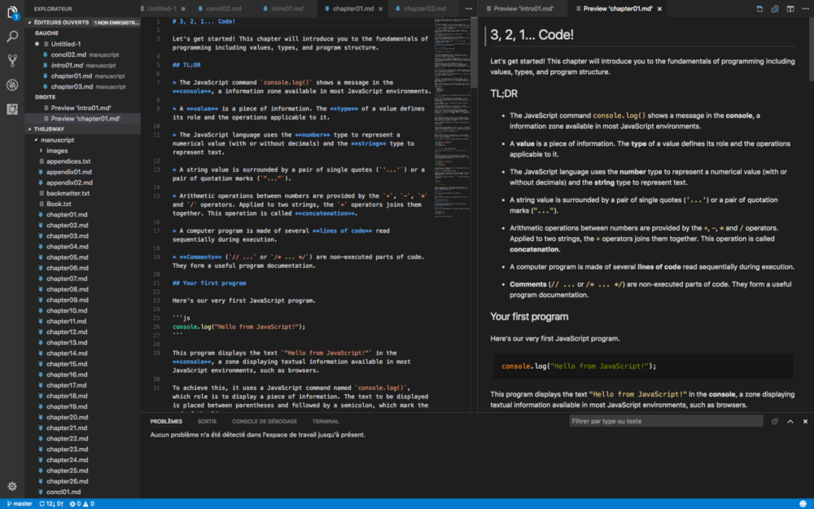
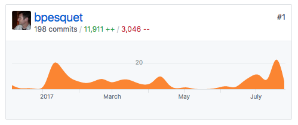
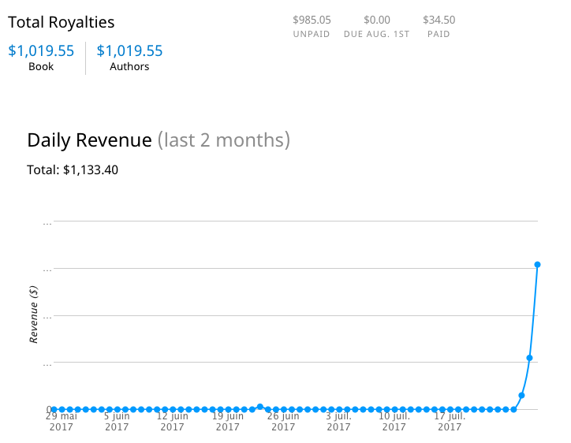

I am the author of [The JavaScript Way](https://github.com/bpesquet/thejsway), a self-published open source book for learning to code. Despite the lack of any initial audience, it topped GitHub trending charts worldwide during its launch.

This is the story of this unexpected success.

### Project inception

At the beginning of this project, I [explained]() why I started it and went over some of my initial choices. In short:

* There was a need for a book teaching modern JavaScript to beginners.
* I decided to self-publish this book and write it in the open on [GitHub](https://github.com). Doing so, I was hoping to reach as many people as possible. Also, to leverage the great [collaborative model](https://en.wikipedia.org/wiki/Open-source_model) that is at the heart of open source.
* The book would have a Creative Commons [BY-NC-SA](https://creativecommons.org/licenses/by-nc-sa/4.0/) license. It allows anyone to share or build upon my work as long as some rules are observed. In particular, no commercial purposes outside of mine are allowed.

Also, some key factors in the decision were:

* Text is still a great medium to convey knowledge. So, the choice of a book instead of some video-based material.
* I already authored two online courses on the same topic ([here](https://openclassrooms.com/courses/learn-the-basics-of-javascript) and [there](https://openclassrooms.com/courses/use-javascript-on-the-web)). The feedback for them has been very positive, so I knew that I had some pretty solid content at hand.
* I wanted to hone my JavaScript skills, and knew firsthand that teaching something is a great way to master it.

What I lacked was an initial audience, something often seen as a critical asset for this kind of project. Since someone has to start somewhere, I went on anyway.

### Choosing a business model

Every creator faces the same dilemma. How to share your work with the world that would make an impact and also be profitable? There is no definitive answer to this age-old question.

The digital revolution has turned things upside down for authors. It has lowered the distribution and sharing costs to zero. In our “reputation economy”, content creators must battle to gain consumer attention. As a new player in this field, meeting success will be very difficult if all your content sits behind a paywall. Some of it _has_ to be available for free.

For authors, the most common marketing tactic is now to split your work into several parts. The first one free, gives potential customers a glimpse of your content and style. In the hope that hooked up customers will buy the other parts.

Kyle Simpson’s alternative [choice](https://github.com/getify/You-Dont-Know-JS/blob/master/CONTRIBUTING.md#reading-experience-chaptersection-links-etc) for its quite successful [You Don’t Know JS](https://github.com/getify/You-Dont-Know-JS) book series appealed to me. Like him, I decided to give away the entire book content for free, but let users pay for a better reading experience through the ebook version.

Taking example from [another self-published bestseller](https://leanpub.com/rprogramming), I chose to include coding exercises and projects right into the book, but sell their solutions as an extra.

This “hybrid” business model seemed a reasonable balance between openness and potential profit.

### Building an audience (or not)

Another common marketing advice is building some audience through a mailing list, using some existing content (for example, your own blog) as a magnet.

I don’t like this approach very much and didn’t want to bother my readers with any subscription.

I also considered launching a crowdfunding campaign. Without any initial audience, this seemed to me as a lot of work for a very uncertain outcome, so I shied away from it. Maybe next time!

### Tools and process

The very best file format for authoring _any_ book (not only technical ones) is **plain text**. No need for a dedicated editor. No interoperability issue. The ability to use a [version control](https://en.wikipedia.org/wiki/Version_control) system like [Git](https://git-scm.com/) to keep track of changes.

Among the various text-based markup languages available. I chose [Markdown](https://en.wikipedia.org/wiki/Markdown) because I already knew and liked its syntax. Markdown is also a first-class citizen on GitHub, which was essential for this project.

A self-published author needs a toolchain to transform the raw manuscript files into various ebook formats (PDF, EPUB, MOBI). For me, the [Leanpub](https://leanpub.com) platform ticked all the boxes: Markdown support, integration with GitHub and a fair royalty structure (90% minus 50 cents per sale).

I used the free text editor [Visual Studio Code](https://code.visualstudio.com/) for authoring the book files on my computer. It has great Markdown support out of the box and a very convenient side-by-side file preview (see image below). Extensions like [Markdown Shortcuts](https://marketplace.visualstudio.com/items?itemName=mdickin.markdown-shortcuts) and [markdownlint](https://marketplace.visualstudio.com/items?itemName=DavidAnson.vscode-markdownlint) can be installed to become even more productive.

After all tools were chosen, I drafted the book outline (a very important first step) using my previous courses as a basis. Then I dived into the writing process.

### Early publishing

Leanpub’s motto is “Publish early, publish often”. The platform empowers you to publish early drafts of your work. Receive feedback and create traction, enabling an [MVP](https://en.wikipedia.org/wiki/Minimum_viable_product)-like approach to book authoring.

It’s a great idea on paper… Which unfortunately didn’t work at all for me. One month after the writing process started, I made the book public on Leanpub. By that time, the ebook price was $0, so anyone could get it for free.

I told my personal network about it, [twitted](https://twitter.com/bpesquet/status/836354787616641024) about it, submitted it to [Reddit](https://www.reddit.com/r/javascript/comments/5wmw8q/the_javascript_way_a_new_book_for_learning_modern/) and [Hacker News](https://news.ycombinator.com/item?id=13749641). I also reached out to other book authors or prominent individuals. I also reached out to Kyle Simpson, [Robin Wieruch](https://www.robinwieruch.de/) and freeCodeCamp’s [Quincy Larson](https://twitter.com/ossia), looking for advice and support.

The outcome was a mixed bag. A few GitHub stars, a handful of messages on Twitter and Reddit. An HN thread that went out-of-topic and got buried. Execution was poor, the lack of any initial audience was too much of a disadvantage there.

A majority of comments were like “Ping me back when it’s finished”. People may not want to invest time to read in-progress books, which is understandable after all.

But, individual responses from Kyle, Robin and Quincy were hearthwarming. They played a big role in keeping me motivated. I’m very thankful to them.

### The writing phase

Even after this underwhelming early launch, I was still convinced that my book was worth something. I didn’t want to give up after having already spent dozens of hours on it. Using an unchanged book outline, I went for a no-feedback route and kept on writing all by myself until the book got finished.

That was the hardest part. Spending countless hours, day after day, only to see things take shape very slow. Inevitably, doubts surface: how could it ever succeed? Is this all a giant waste of time? Why am I inflicting this to myself?

The key to overcome these obstacles is **putting the right amount of pressure on yourself**. If your time commitment is too scarce, you will lose motivation and give up. But, trying to move forward too fast, neglecting other important aspects of your life along the way, is risky on many levels.

After all, this was only a side project. Low risk, low pressure! Self-publishing means I had no deadlines to meet, which can be both a blessing and a curse. I tried to use this to my advantage: I was free to invest time in something I believed into, but at my own pace.

I found a reasonable balance (about 10–15 hours a week) between work, personal life and the writing process. Limited long and hazardous breaks. This [article on side projects](https://open.buffer.com/side-projects-creative-hobbies/) gives useful advice to keep things going during this phase.

Luckily, I had some existing material to build upon. Some experience writing content on my own… And also a very understanding spouse ;)

### Launch day

After eight months of steady work and a few last hours feverishly spent fixing things here and there, my book was ready at last!

The upside of writing in a vacuum like I did is that your book launch becomes a pretty big event. After such a huge time investment, it’s a great feeling (and also a huge relief) to show your finished creation to the world.

For lack of anything better, I reused my previous launch strategy. [Twitter](https://twitter.com/bpesquet/status/890564975596630017), [Reddit](https://www.reddit.com/r/javascript/comments/6poszc/the_javascript_way_a_new_book_for_learning_modern/) and [Hacker News](https://news.ycombinator.com/item?id=14865043) ([timing submissions](https://www.quora.com/When-is-the-best-time-to-post-on-Hacker-News-to-get-and-stay-long-on-the-front-page) for most visibility). Also, the same nice people that kept me motivated after the early launch.

To my astonishment, the result was this time overwhelmingly positive. Kyle Simpson and Quincy Larson kindly tweeted about the book to their dozens of thousands of followers.



Hour after hour, I watched in awe of disbelief as rave comments and retweets piled into my inbox. I finally knew that my book would have an impact.

Launch is also the blissful moment where the magic of open source happens. People can read and share your book for free. Creating traction without any marketing effort. But they can also improve its quality through contributions using GitHub [issues](https://guides.github.com/features/issues/) and [pull requests](https://help.github.com/articles/about-pull-requests/).

Since I’m not an English native and didn’t have an editor by my side to proof check the content. I knew that my book contained many typos and errors at launch. I hoped people would help to spot and correct them, and wasn’t disappointed.

Here are a few figures gathered two days after launch:

* The book repository on GitHub had more than **51k views** from **17k unique visitors**. The bulk of this traffic came from Hacker News, followed by Reddit.
* It gained more than **2,400 stars**, and becoming the **#1 trending repo**worldwide for a day.
* The Hacker News story climbed to **#5 rank** on the front page, generating more than a hundred comments.
* Readers submitted **30 pull requests**, correcting many of the book’s initial mistakes. Small typos for the most part, but also grammatical improvements and even a few coding errors.
* I already received **two translation requests**, to Spanish and Chinese.

All in all, far more than what I could dream of.

### Financial outcome

Can an open source book be profitable after all? Of course, it’s too soon to tell. Two days after launch, it became Leanpub’s bestselling book of the week, with more than **$1,000** in royalties.

Profitability was not the reason this project was started in the first place. Yet the hybrid pricing model, with free sources and paid ebook/corrections, will ultimately contribute to the book’s reputation while making for some welcome passive income.

Later on, I may create a paperback version of the book (Maybe [Amazon CreateSpace](https://www.createspace.com/)) if there is any demand for it. An interactive online course offering a richer user experience is already under way.

Most importantly, I have the deep satisfaction of having contributed something meaningful to the community. Thousands of people around the world will use my book to learn to code, improve at JavaScript and it may change their lives for the better.

And that is priceless.

### Conclusion

It wasn’t all roses, but self-publishing a successful open source book without any prior audience is definitely possible.

I hope this little story has entertained you. I also hope it might inspire you to start a creative project on your own, be it a book or something completely different.

I look forward to see what you will achieve!
