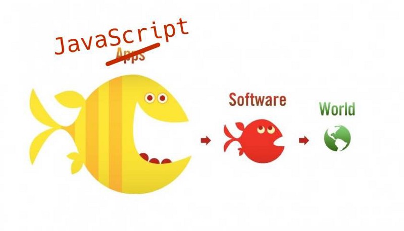

<!--more-->

Pour plusieurs générations de développeurs et d’enseignants en informatique, le langage JavaScript a une image fortement négative. Mal fichu, plein de limitations et de défauts. il serait tout juste bon à animer des pages Web et rien de plus.

Tout cela était vrai à l’époque où JavaScript n’était qu’un langage de script peu standardisé et cantonné au petit monde des navigateurs Web.

Mais les choses ont changé.

Je résume ici les principaux arguments développés dans l’excellent article [Why you should embrace JavaScript](https://medium.com/triled-engineering/why-you-should-embrace-javascript-64b2b8209145#.geu6ljwjh) de [Maarten Huijsmans](https://medium.com/u/326ef1bd6e31), dont je vous recommande la lecture.

* Unique langage de programmation reconnu par tous les navigateurs Web, JavaScript est maintenant implanté côté serveur grâce à [Node.js](https://nodejs.org/) et pour le développement d’applications mobiles multi-plateformes, avec des outils comme [Cordova](https://cordova.apache.org/), [Ionic](http://ionic.io/) ou [React Native](https://facebook.github.io/react-native/). On le retrouve dans le monde du stockage de données ([MongoDB](https://www.mongodb.org/)) et dans celui, encore en chantier, des objets connectés.
* Les optimisations réalisées pour accélérer le rendu des sites Web dans les navigateurs ont boosté les performances du langage.
* Il dispose d’un foisonnant écosystème de composants centré autour de la plate-forme [npm](https://www.npmjs.com/) et d’une immense communauté de développeurs.
* Ses défauts de jeunesse sont peu à peu gommés par les évolutions du langage, et notamment la norme [ES6/ES2015](https://babeljs.io/docs/learn-es2015/).

On peut ajouter d’autres aspects qui jouent en faveur de JavaScript.

* Une fois ses spécificités digérées, le langage JavaScript s’avère riche et peut offrir une belle expérience de développement. De nombreux outils sont apparus pour faciliter la vie (et donc augmenter la productivité) du développeur JavaScript : détection d’erreurs et de maladresses dans le code, débogage, optimisation, etc. Lisez [cet article](https://medium.com/javascript-scene/must-see-javascript-dev-tools-that-put-other-dev-tools-to-shame-aca6d3e3d925#.h2bej6zam) d’[Eric Elliott](https://medium.com/u/c359511de780) pour découvrir des outils essentiels tels que [Babel](http://babeljs.io/) ou [ESLint](http://eslint.org/).
* Maîtriser JavaScript est nécessaire pour créer les applications Web de demain. Tous les services modernes qui offrent sur le Web une [expérience utilisateur](https://fr.wikipedia.org/wiki/Exp%C3%A9rience_utilisateur) proche de celle d’une application native ([Google Docs](https://fr.wikipedia.org/wiki/Google_Documents), [Uber](https://www.uber.com/), [AirBnb](http://www.airbnb.com/)…) font un usage intensif de JavaScript, souvent par le biais de _frameworks_ comme [AngularJS](https://angularjs.org/) ou de librairies comme [React](https://facebook.github.io/react/).
* Pour les développeurs, le marché français de l’emploi avant bac+5 est centré sur le Web. A l’heure actuelle, la compétence en JavaScript est recherchée par de nombreux employeurs : c’est donc un atout précieux pour l’employabilité.

Qu’on le veuille ou non, JavaScript est partout. L’ignorer, c’est laisser le monde du développement logiciel avancer sans vous. Le combattre, c’est gaspiller du temps et de l’énergie.

Et si vous l’adoptiez plutôt ?
