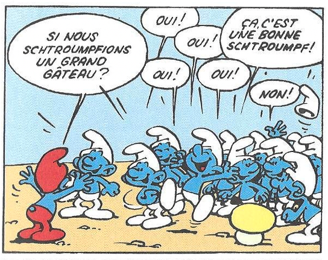

<!-- Apply header and footer to first slide only -->
<!-- _header: " " -->
<!-- _footer: "[Baptiste Pesquet](https://www.bpesquet.fr)" -->
<!-- headingDivider: 5 -->

# Artificial Intelligence: past, present, future(s)

<!-- Show pagination, starting with second slide -->
<!-- paginate: true -->

## A brief history of AI

### A recent discipline

Kickoff: [1956 Dartmouth workshop on Artificial Intelligence](https://en.wikipedia.org/wiki/Dartmouth_workshop).

> "AI is the science and engineering of making intelligent machines." ([John McCarthy](<https://en.wikipedia.org/wiki/John_McCarthy_(computer_scientist)>))

> "AI is the science of making machines do things that would require intelligence if done by men." ([Marvin Minsky](https://en.wikipedia.org/wiki/Marvin_Minsky))

*Image credits: the Marvin Minsky family*

### High ambitions

> "Every aspect of learning or any other feature of intelligence can in principle be so precisely described that a machine can be made to simulate it." ([Dartmouth workshop proposal](http://jmc.stanford.edu/articles/dartmouth/dartmouth.pdf), 1956)

> "Machines will be capable, within twenty years, of doing any work a man can do." ([Herbert Simon](https://en.wikipedia.org/wiki/Herbert_A._Simon), 1965)

> "In for three to eight years we will have a machine with the general intelligence of an average human being." ([Marvin Minsky](https://en.wikipedia.org/wiki/Marvin_Minsky), 1970)

### What is intelligence, by the way?

Controversial definition, varying in what its abilities are and whether or not it is quantifiable [[Legg and Hutter, 2007](http://dl.acm.org/citation.cfm?id=1565458)].

> "Intelligence is the ability to perceive or infer information; and to retain it as knowledge to be applied to adaptive behaviors within an environment or context [[Radha R. Sharma, 2008](https://journals.sagepub.com/doi/10.1177/097226290801200108)]."

> "Intelligence is what you use when you don't know what to do." ([Jean Piaget](https://en.wikipedia.org/wiki/Jean_Piaget))

### The AI landscape

- Main fields of research:
  - **Problem solving** (e.g. search algorithms, constraint solving).
  - **Reasoning** and **decision making** (e.g. logic, knowledge representation).
  - **Machine Learning** (e.g. systems that improve with experience).
  - **Real-world interactions** (e.g. computer vision, natural language understanding).
- Either purely **software**-based, or embedded in **hardware** devices.

### A highly interdisciplinary field

### A tumultuous history

*Image credits: [David Lavenda](https://fr.slideshare.net/slideshow/ai-and-productivity/76251478)*

### Two competing approaches

*Image credits: [[Cardon et al., 2018](https://doi.org/10.3917/res.211.0173)]*

### How to define AI?

> "AI is an **interdisciplinary** field aiming at **understanding** and **imitating** the mechanisms of **cognition** and **reasoning**, in order to **assist** or **substitute** humans in their activities." ([Commission d'enrichissement de la langue française](https://fr.wikipedia.org/wiki/Commission_d%27enrichissement_de_la_langue_fran%C3%A7aise), 2018)

> "[AI is whatever hasn't been done yet](https://en.wikipedia.org/wiki/AI_effect)." ([Larry Tesler](https://en.wikipedia.org/wiki/Larry_Tesler))

## AI's booming present

### Machine Learning: a new paradigm

> "The field of study that gives computers the ability to learn without being explicitly programmed." ([Arthur Samuel](https://en.wikipedia.org/wiki/Arthur_Samuel_(computer_scientist)), 1959).

#### Algorithm #1: K-Nearest Neighbors

Prediction is based on the $k$ nearest neighbors of a data sample.

#### Algorithm #2: Decision Trees

Build a **tree-like structure** based on a series of learned questions on the data.

#### Algorithm #3: Artificial Neural Networks

Layers of **loosely neuron-inpired computation units** that can approximate any continuous function.

*Image credits: [3Blue1Brown](https://www.3blue1brown.com/topics/neural-networks)*

### The Deep Learning tsunami

Subfield of Machine Learning consisting of **multilayered neural networks** trained on vast amounts of **data**.

*Image credits: [[Krizhevsky et al., 2012](https://papers.nips.cc/paper_files/paper/2012/hash/c399862d3b9d6b76c8436e924a68c45b-Abstract.html)]*

In a decade,  outperformed previous SOTA approaches in many fields (computer vision, language, processing, and much more).

### From labs to everyday life in 25 years

*Image credits: [Yann LeCun](http://yann.lecun.com/exdb/lenet/)*

*Image credits: [Matthew Brennan](https://x.com/mbrennanchina)*

### Reasons for success

*Image credits: [DeepMind](https://www.youtube.com/playlist?list=PLqYmG7hTraZCDxZ44o4p3N5Anz3lLRVZF)*

### Case study: Large Language Models

*Image credits: [Shutterstock](https://www.shutterstock.com/fr/image-photo/chatgpt-concept-artificial-intelligence-modern-tool-2273533539)*

- **Model**: a function $f$ defining the relationship between inputs (data) and outputs (results).

$$f(inputs) = outputs$$

- LLM: a (very) large model designed for language processing tasks.
- Kickoff: [ChatGPT](https://openai.com/index/chatgpt/), November 2022.

#### T for *Transformer*...

- Neural network architecture designed to handle **sequential data**.
- Cheaper to train and easier to parallelize than previous approaches.

*Image credits: [[Vaswani et al., 2017](http://arxiv.org/abs/1706.03762)]*

#### G for *Generative*...

- The next word is predicted via an **attention**-powered statistical analysis of the other words.
- This process can be repeated to produce entire texts.

*Image credits: [Welch Labs](https://www.youtube.com/watch?v=0VLAoVGf_74)*

*Image credits: [Peyo](https://fr.wikipedia.org/wiki/Peyo)*

#### P for *Pretrained*

- Models like ChatGPT contain **billions** of internal parameters.
- They are trained on humongous amounts of data (whole parts of the Internet).
- These processes have **huge energetical costs**.

*Image credits: [Getty](https://www.gettyimages.fr/)*

## The uncertain future(s) of AI

### AI's growing impact on individuals and society

AI has more and more social and societal implications:

- Job market transformation.
- Human/machine interactions.
- Trust and acceptability.
- Legal aspects and regulation ([AI hallucination cases](https://www.damiencharlotin.com/hallucinations/)).
- Fairness.
- Ethics.
- Privacy and usage of personal data.
- ...

### Which AI will prevail?

- **Substitutive intelligence**: replacement of men by machines.
- **Augmented intelligence**: human-centered AI for performance augmentation & autonomy enhancement.
- **Hybrid intelligence**: human-machine collaboration on complex tasks.

### The AGI debate

- AGI = **Artificial General Intelligence**
  - The ability to perform any task as well as a human.
- Related concept: **strong AI** (intentionality anc consciousness).
- Are recent models *sparks of AGI* [[Buceck et al., 2023](https://arxiv.org/abs/2303.12712)] or merely *stochastic parrots* [[Bender et al. 2021](https://dl.acm.org/doi/10.1145/3442188.3445922)]?

### The technological singularity

*Image credits: [Bernard Claverie](https://www.youtube.com/watch?v=hxL-FwGPGhM)*

### The Chinese room argument

Is showing intelligent behavior the same as being intelligent? [[Searle, 1980s](https://iep.utm.edu/chinese-room-argument/)]

*Image credits: [elementsofai](https://course.elementsofai.com/1)*

### The human brain: a masterpiece of evolution

- Approx. **86 billions neurons** in 1.4 kg.
- Typical energy consumption: *20 W (!)*
- So much of it is still unknown.

### Babies are outstanding learners

*Image credits: [Emmanuel Dupoux](https://videolectures.net/videos/icml09_dupoux_hib)*

## Thanks for your attention!

Any questions?

*Image credits: [Adobe Stock](https://stock.adobe.com/ch_fr/images/friendly-ai-chatbot-robot-character-waving-simple-3d-blue-background-illustration-generative-ai/565068563)*
