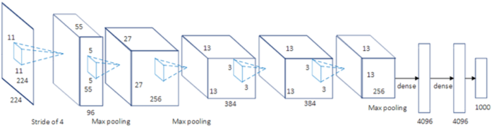

<!-- Apply header and footer to first slide only -->
<!-- _header: "" -->
<!-- _footer: "[Baptiste Pesquet](https://www.bpesquet.fr)" -->
<!-- headingDivider: 5 -->

# Artificial Intelligence: past, present, future(s)

<!-- Show pagination, starting with second slide -->
<!-- paginate: true -->

## A brief history of AI

### A recent discipline

Kickoff: [1956 Dartmouth workshop on Artificial Intelligence](https://en.wikipedia.org/wiki/Dartmouth_workshop).

> "AI is the science and engineering of making intelligent machines." ([John McCarthy](<https://en.wikipedia.org/wiki/John_McCarthy_(computer_scientist)>))

> "AI is the science of making machines do things that would require intelligence if done by men." ([Marvin Minsky](https://en.wikipedia.org/wiki/Marvin_Minsky))

### High hopes

> "Every aspect of learning or any other feature of intelligence can in principle be so precisely described that a machine can be made to simulate it." ([Dartmouth workshop proposal](http://jmc.stanford.edu/articles/dartmouth/dartmouth.pdf), 1956)

> "Machines will be capable, within twenty years, of doing any work a man can do." ([Herbert Simon](https://en.wikipedia.org/wiki/Herbert_A._Simon), 1965)

> "In for three to eight years we will have a machine with the general intelligence of an average human being." ([Marvin Minsky](https://en.wikipedia.org/wiki/Marvin_Minsky), 1970)

### What is intelligence, by the way?

Controversial definition, varying in what its abilities are and whether or not it is quantifiable.

> "Intelligence is the ability to perceive or infer information; and to retain it as knowledge to be applied to adaptive behaviors within an environment or context." ([Radha R. Sharma](https://journals.sagepub.com/doi/10.1177/097226290801200108))

> "Intelligence is what you use when you don't know what to do." ([Jean Piaget](https://en.wikipedia.org/wiki/Jean_Piaget))

### The AI landscape

- Main fields of research:
  - **Problem solving** (e.g. search algorithms, constraint solving).
  - **Reasoning** and **decision making** (e.g. logic, knowledge representation).
  - **Machine Learning** (e.g. systems that improve with experience).
  - **Real-world interactions** (e.g. computer vision, natural language understanding).
- Either purely **software**-based, or embedded in **hardware** devices.

### A highly interdisciplinary field

### A tumultuous history

### Two competing approaches

### How to define AI?

> "AI is an **interdisciplinary** field aiming at **understanding** and **imitating** the mechanisms of **cognition** and **reasoning**, in order to **assist** or **substitute** humans in their activities." ([Commission d'enrichissement de la langue française](https://fr.wikipedia.org/wiki/Commission_d%27enrichissement_de_la_langue_fran%C3%A7aise), 2018)

> "[AI is whatever hasn't been done yet](https://en.wikipedia.org/wiki/AI_effect)." ([Larry Tesler](https://en.wikipedia.org/wiki/Larry_Tesler))

## AI's booming present

### Machine Learning: a new paradigm

> "The field of study that gives computers the ability to learn without being explicitly programmed." ([Arthur Samuel](https://en.wikipedia.org/wiki/Arthur_Samuel_(computer_scientist)), 1959).

#### Algorithm #1: K-Nearest Neighbors

Prediction is based on the `k` nearest neighbors of a data sample.

#### Algorithm #2: Decision Trees

Build a tree-like structure based on a series of discovered questions on the data.

#### Algorithm #3: Artificial Neural Networks

Layers of loosely neuron-inpired computation units that can approximate any continuous function.

### The Deep Learning tsunami

Subfield of Machine Learning consisting of multilayered neural networks trained on vast amounts of data.

> Krizhevsky et al., “ImageNet Classification with Deep Convolutional Neural Networks,”, ([NeurIPS](https://papers.nips.cc/paper_files/paper/2012/hash/c399862d3b9d6b76c8436e924a68c45b-Abstract.html), 2012).

In a decade,  outperformed previous SOTA approaches in many fields (computer vision, language, processing, and much more).

### From labs to everyday life in 25 years

### Reasons for success

### Case study: Large Language Models

- *Model*: a function $f$ defining the relationship between inputs (data) and outputs (results).

$$f(inputs) = outputs$$

- LLM: a (very) large model dedicated to interact with human language.
- [Introducting ChatGPT](https://openai.com/index/chatgpt/) (November 2022).

#### T for *Transformer*...

> Vaswani et al., “Attention Is All You Need” ([arXiv](http://arxiv.org/abs/1706.03762), 2017).

- Neural network architecture designed to handle sequential data.
- Cheaper to train and easier to parallelize than previous approaches.

#### G for *Generative*...

- The next word is predicted via an attention-powered statistical analysis of the other words.
- This process can be repeated to produce entire texts.

#### P for *Pretrained*

## The uncertain future(s) of AI

### Negative externalities

### The Chinese room argument

### The technological singularity

## Credits and resources

- [Elements of AI: What is AI?](https://course.elementsofai.com/1)
- [Comment fonctionne ChatGPT ? Décrypter son nom pour comprendre les modèles de langage](https://theconversation.com/comment-fonctionne-chatgpt-decrypter-son-nom-pour-comprendre-les-modeles-de-langage-206788)
