<!-- Apply header and footer to first slide only -->
<!-- _header: "  " -->
<!-- _footer: "[Baptiste Pesquet](https://www.bpesquet.fr)" -->
<!-- headingDivider: 5 -->

# Introduction to the theory of decision-making

<!-- Show pagination, starting with second slide -->
<!-- paginate: true -->

## Terminology

### Decision and decision-making

A **decision** is "a deliberative process that results in the commitment to a categorical proposition." [[Gold and Shadlen, 2007]](https://www.annualreviews.org/content/journals/10.1146/annurev.neuro.29.051605.113038)

People make thousands of (big and small) decisions everyday. A few examples:

- Choosing what pair of socks to wear.
- Deciding on a TV series to watch.
- Choosing one's next car/bike.

**Decision-making** designates the cognitive process(es) resulting in a decision.

### The sequential nature of decision-making

Humans and animals make their decisions after a **deliberation** phase.

Many decisions are based on information that unfolds over time (example: cues for solving an homicide).

Even if all informative data is immediately available (example: a chess position), it has to be treated **sequentially** by our nervous system, reflecting its inability to process information simultaneously.

### From stimulus to response

**Decision-making** can be formalized as the mapping from a stimulus to a response.

Time between stimulus and response execution is called **Reaction Time** or **Response Time** (RT) [[Forstmann et al., 2016]](https://www.annualreviews.org/content/journals/10.1146/annurev-psych-122414-033645), [[Myers et al., 2022]](https://www.frontiersin.org/journals/psychology/articles/10.3389/fpsyg.2022.1039172/full).

$$RT = T_e+T_d+T_r$$

$T_{er}= T_e+T_r$ is called **non-decision time**.

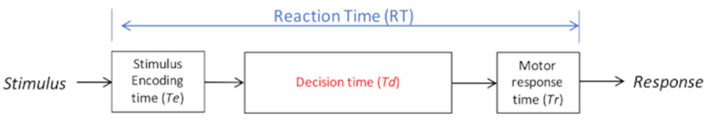

### Speed/accuracy tradeoff

All decisions are made under time pressure [[Forstmann et al., 2016]](https://www.annualreviews.org/content/journals/10.1146/annurev-psych-122414-033645). The balance between response time and accuracy is called the **speed/accuracy trade-off**.

It is at least partially under conscious control: decision-makers can decide to make faster decisions at the expense of an higher error rate, or slower, more accurate decisions [[Ratcliff et al., 2016]](https://www.sciencedirect.com/science/article/pii/S1364661316000255?via%3Dihub). This complicates the interpretation of behavioral data.

Ideally, what is needed is a way to evaluate data that considers not only accuracy and speed, but the interaction between them [[Myers et al., 2022]](https://www.frontiersin.org/journals/psychology/articles/10.3389/fpsyg.2022.1039172/full).

## Modeling speeded decision-making

### Context

One approach to understanding decision-making is through **computational models**.

Several models have been developed to account for the speed/accuracy trade-off and explain how people and animals make decisions under time pressure.

Historically, most research on the dynamics of decision-making has been focused on simple, repeatable problems involving fast binary-choice decisions with one correct answer.

#### Task examples

- Lexical decision tasks: pressing one key if the stimulus is a word or another if it is a non-word.
- [Stroop tasks](https://en.wikipedia.org/wiki/Stroop_effect).
- Saccadic flanker tasks: moving the eye in the direction indicated by a central stimulus, ignoring the directionality of flanker stimuli.
- *Random Dot Kinematogram* (RDK): judging whether a subset of dots move to the left or to the right.

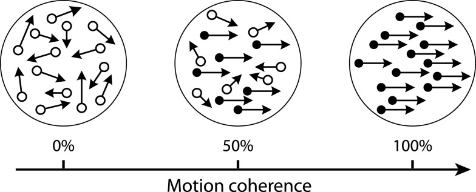

#### Measures of interest

- Response times (RTs) for correct responses and for error responses.
- Distributions of RTs across trials.
- Proportion of correct responses (accuracy).

### The cognitive processes of decision-making

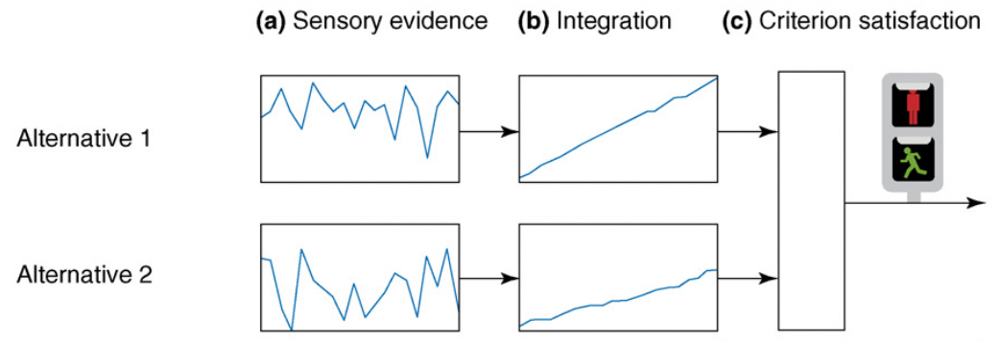

[[Bogacz, 2007]](https://www.sciencedirect.com/science/article/pii/S1364661307000290?via%3Dihub)

### Sequential sampling

A popular class of models assumes that, on each trial, the decision maker accumulates noisy samples of information from the environment until a **threshold** of evidence is reached.

Such accumulation-to-threshold models are known as **sequential sampling models**, a.k.a. **evidence accumulation models**.

Different approaches to sequential sampling coexist. A key distinction is the number of **accumulators** (structures for gathering evidence in favor of one response) and whether they are independent from one another.

An accumulator is also called a **Decision Variable** (DV).

#### Example: sequential sampling for RDK

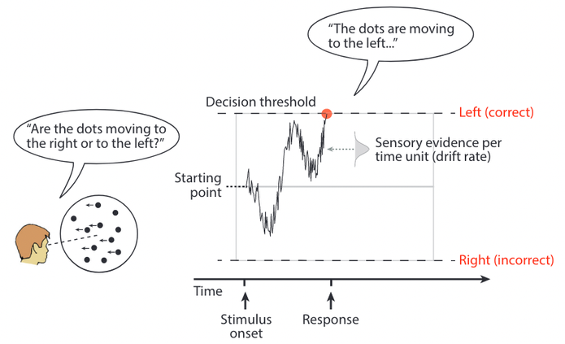

#### The sequential sampling model family

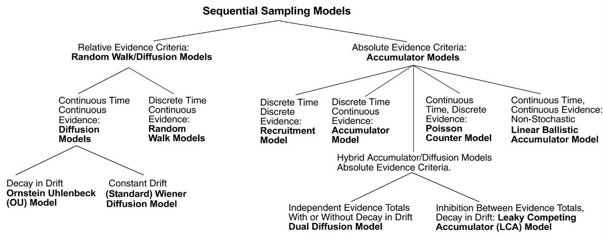

### Accumulator models

These models, also known as **race models**,  have independent accumulators (typically one per possible choice) and an **absolute** evidence response rule (two fixed thresholds, one for each accumulator). The process stops once one of the accumulators reaches its threshold.

### Random walk models

These models use a **relative** evidence rule: a response is initiated as soon as the difference in accumulated evidence reaches a predefined threshold, also called a **criterion**.

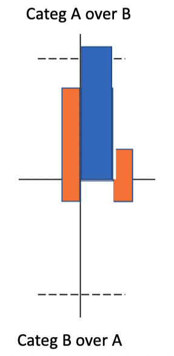

#### Problem example: the gambler's ruin

Two gamblers A and B have a (possibly different) starting capital and play a series of independant games against each other. Every game has a fixed chance $p$ of being won by gambler A. After each game, the winner obtains one unit of the other player’s capital. The process continues until one of the gamblers is bankrupt.

This problem can be modelised as a random walk, with $p$ representing the **drift** of the process. Depending on the value of $p$, the process will drift towards one of the thresholds (gambler B’s bankruptcy if $p>0.5$).

#### Mathematical formulation

- $K$: number of possible states of the world. For binary choices, $K=2$.
- $h_k, k \in [1,K]$: hypothesis (state). Examples: dot movement type, presence of a stimulus, etc.
- $H_k, k \in [1,K]$: choice associated with hypothesis $h_k$.
- $P(h_k)$: probability that $h_k$ is true before obtaining any evidence about it.
- $n$: number of evidences received.
- $e_i, i \in [1,n]$: evidence (noisy information) and guiding commitment to a particular hypothesis $h_k$.
- $P(e_i|h_k)$: likelihood (values that $e_i$ can attain when $h_k$ is true).

#### Sequential Probability Ratio Test

Particular form of **sequential analysis** for binary decisions ($K=2$) where the DV is constructed from multiple, independent pieces of evidence $e_1, e_2, \dots, e_n$ as the logarithm of the likelihood ratio between hypotheses $h_1$ and $h_2$.

$$DV_n = \sum_{i=1}^n log_e \frac{P(e_i|h_1)}{P(e_i|h_2)} = \sum_{i=1}^n w_i$$

- $w_i, i \in [1,n]$: weight of the $i$th evidence.

The DV is updated with new pieces of evidence until reaching a criterion.

SPRT is the most efficient statistical test for deciding between two hypotheses on this kind of problem: it achieves a desired error rate with the smallest number of samples, on average [Wald and Wolfowitz, 1948).

#### Problem example: trick or fair coin

Two coins are placed in a bag: one is fair (50% chance of obtaining heads or tails when tossing it), the other not (60/40). One of the coins is drawn from the bag: is it a trick ($h_1$) or a fair ($h_2$) coin? How many tosses are needed for this decision?

$$\forall i \in[1,n], w_i=
    \begin{cases}
      \log_e \frac{P(e_{heads}|h_1)}{P(e_{heads}|h_2)} = \log_e \frac{0.6}{0.5} = 0.182 & \text{if toss gives "heads"} \\
      \log_e \frac{P(e_{tails}|h_1)}{P(e_{tails}|h_2)} = \log_e \frac{0.4}{0.5} = -0.223 & \text{if toss gives "tails"}
    \end{cases}$$

$$\text{If}\ DV_n \ge \frac{1-\alpha}{\alpha}, \text{answer "trick".}\ \text{If}\ DV_n \le \frac{\alpha}{1-\alpha}, \text{answer "fair".}$$

With $\alpha = P(H_2|h_1) = P(H_1|h_2)$ the probability of misidentifying a coin.

For $\alpha=0.05$, a decision happens when $|DV_n| \ge \log_e(19)$.

### Diffusion models

When the evidence is continously sampled from a distribution in infinitesimal time steps, the process is termed **diffusion** with drift $v$. When $v$ is constant, this process is known as [Brownian motion](https://en.wikipedia.org/wiki/Brownian_motion) or Wiener diffusion process [[Gold and Shadlen, 2007]](https://www.annualreviews.org/content/journals/10.1146/annurev.neuro.29.051605.113038).

> The diffusion models for decision-making are not to be confused with the [diffusion models of Machine Learning](https://en.wikipedia.org/wiki/Diffusion_model).

#### The Diffusion Decision Model

This model, also called **Drift Diffusion Model (DDM)**, is a sequential sampling model for binary choices in continuous environments [[Ratcliff and McKoon, 2008]](https://direct.mit.edu/neco/article-abstract/20/4/873/7299/The-Diffusion-Decision-Model-Theory-and-Data-for?redirectedFrom=fulltext).

Originally designed in the 1970's [Ratcliff, 1978], it has recently experienced a surge in popularity. A growing body of literature is using the DDM to elucidate the cognitive processes of decision-making.

##### Parameters

|Name|Description|Typical range|Implements|
|-|-|-|-|
|$a$|Boundary separation|$[0.5,2]$ (in arbitrary units)|Speed/accuracy trade-off|
|$z$|Starting point|$[0,1]$ (as proportion of $a$)|Response bias|
|$v$|Drift rate|$[-5,5]$|Speed of evidence accumulation processing|
|$T_{er}$|Non-decision time|$[0.1,0.5]$ (in seconds)|Neurological processes for stimulus encoding and motor response|

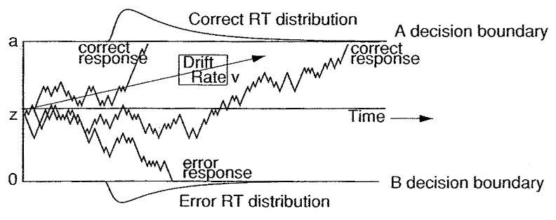

##### Mathematical formulation

The DDM assumes that evidence accumulation is governed by:

$$dx = vdt + sW$$

- $x$: accumulated evidence.
- $v$: drift rate (speed of evidence accumulation).
- $dt$: time unit. When $dt = 0$, the integration process is continuous in time.
- $W$: within-trial accumulation white noise.
- $s$: standard deviation of $W$.

##### Advantages

- Experimental validation has shown that:
  - DDM parameters do capture recognizable, and at least partly separable, cognitive processes.
  - DDM provides an explanation for some of the dynamics of neuronal activity in brains.
- Several software packages like [HDDM](https://hddm.readthedocs.io/en/latest/) facilitate fitting the model to experimental data, or generating simulated data.

##### Applications

###### Behavioral analysis

- **Aging**: DDM-based studies showed that older adults had slower non-decision times and set wider boundaries, but their drift rates were not always lower than those of young adults.
- **IQ**: DDM-based analyses showed that drift rate varied with IQ, but boundary separation and nondecision time did not.
- Other studies showed that **sleep deprivation** and **alcohol consumption** lower drift rate, but have either small or no effect on boundary separation and non-decision time.
- ...

###### Low-level neuroscience

Studies [[Gold and Shadlen, 2001]](https://www.sciencedirect.com/science/article/pii/S1364661300015679?via%3Dihub) uses DDM as inspiration to interpret neuron firing rates in monkeys as evidence accumulation until a threshold is reached.

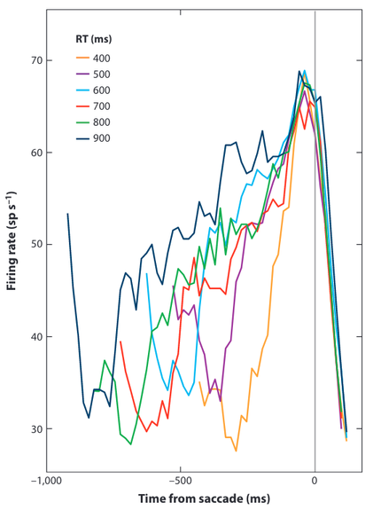

###### High-level neuroscience

Studies correlate parameter estimates from DDM models to the blood-oxygen-level dependent signal obtained from fMRI experiments in perceptual decision-making.

##### Extension to dynamic thresholds

Collapsing-bound models translate the fact that in some cases, decisions are based on less and less evidence as time passes.

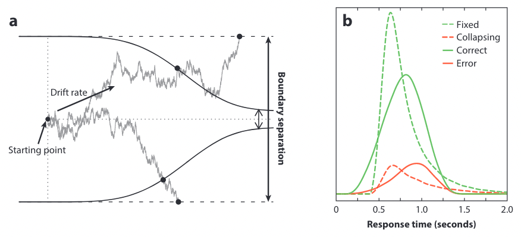

### Hybrid models

#### The Leaky Competing Accumulator model

This model [Usher and McClelland, 2001] is based on gradual and stochastic accumulation of information in non-linear decision units with **leakage** (or decay of activation) and competition through **lateral inhibition**.

### Relationships between models

Cortical models ([Shadlen and Newsome, 2001], [Usher and McClelland, 2001], [[Wang, 2002]](https://www.sciencedirect.com/science/article/pii/S0896627302010929?via%3Dihub)) can be reduced to the diffusion model for parameter values that optimize their performance [[Bogacz, 2007]](https://www.sciencedirect.com/science/article/pii/S1364661307000290?via%3Dihub).

---

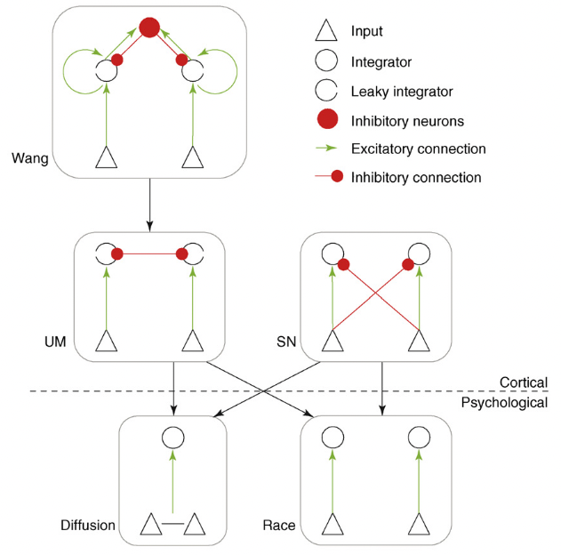

### Multiple-choice decisions

#### Multihypothesis Sequential Probability Ratio Test

- Extension of SPRT to ternary choices in which the rate of integration depends on the fixation of the visual stimulus, as measured through eye-tracking [[Krajbich and Rangel, 2011]](https://www.pnas.org/doi/full/10.1073/pnas.1101328108).
- A DV is computed for each item based on the evidence accumulated for that item compared with the highest accumulated evidence for the other items (*best-vs-next* approach).

---

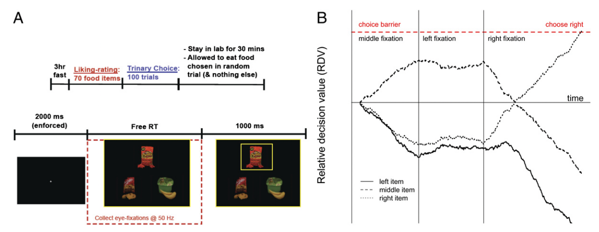

#### Hick's law

- Increasing the number of choices will increase the decision time *logarithmically*.
- Race models with one accumulator per possible choice produce the opposite trend (more accumulators $\Rightarrow$ faster RT).

#### The Advantage Linear Ballistic Accumulator model

In this model [[Van Ravenzwaaij et al., 2020]](https://psycnet.apa.org/doiLanding?doi=10.1037%2Frev0000166), each of the $n$ possible choices is associated to $n-1$ accumulators, each of them driven by the difference ("advantage") in evidence versus another response.

##### ALBA model for binary choice

$$v_{1-2} = v_0 + w_d(S_1 - S_2) + w_s(S_1 + S_2)$$

$$v_{2-1} = v_0 + w_d(S_2 - S_1) + w_s(S_1 + S_2)$$

- $v_{i-j}$: drift rate for the accumulator associated with the advantage of stimulus $i$ over $j$.
- $S_i$: evidence for stimulus $i$.
- $v_0$: bias parameter.
- $w_d \in \mathbb{R}^+$: difference weight.
- $w_s \in \mathbb{R}^+$: sum weight.

##### ALBA model for ternary choice

*Win-all* strategy: all accumulators for a choice need to reach their threshold before commiting to a decision.

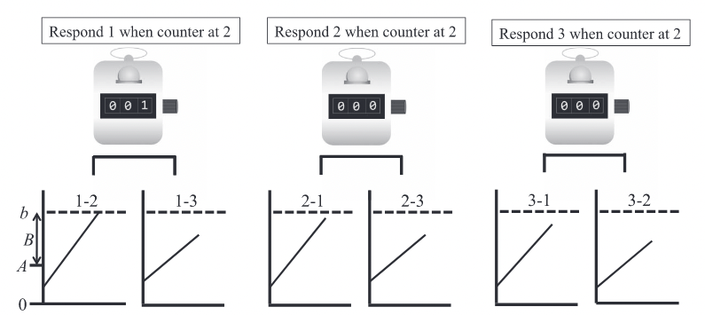

## Learning and decision-making

### Intertwined cognitive processes

- Learning processes refine the internal preferences and representations that inform decisions.
- The outcomes of decisions underpin feedback-driven learning.

### Bridging the modeling gap

- **Feedback-driven learning models**, typically using *softmax* to map action values to choices, do not provide a description of the cognitive processes that lead to a specific decision, and disregard RT.

- **Evidence accumulation models** like the DDM are typically applied to tasks that minimize the influence of learning. Very few attempts have been made to adapt these models to situations in which decisions are followed by **rewards**, thereby producing **learning effects**.

- Recent efforts are trying to combine [Reinforcement Learning](https://github.com/bpesquet/mlcourse/blob/main/notes/rl_introduction/README.md) and EAM into joint models that should be able to:
  - predict choices and RT;
  - describe how learning affects the decision process.

### Common choices

#### Model design

The RL-EAM model family has two components:
- a **learning** component, using RL to update options' value representations (the expected rewards for each choice), known as *Q-values*,  after each trial;
- a **decision** component, relying on a EAM to map value representations to the final choice for a trial.

#### Q-values update

All models update the Q-values of possible choices according to the *delta update rule*:

$$Q_{i,t+1} = Q_{i,t} + \alpha(r_t - Q_{i,t})$$

- $Q_{i,t}$: value representation of choice $i$ on trial $t$.
- $r_t$: reward received on trial $t$.
- $\alpha \in [0,1]$: learning rate.

The difference $r_t - Q_{i,t}$ between actual reward and value representation is called the *reward prediction error*.

### The RL-DDM model

This model [[Fontanesi et al., 2019]](https://link.springer.com/article/10.3758/s13423-018-1554-2) assumes that the drift rate depends linearly on the difference of value representations between the two possible choices.

$$v_t = w(Q_{1,t}-Q_{2,t})$$

$$dx = w(Q_1-Q_2)dt + sW$$

- $v_t$: drift rate at time step $t$.
- $w$: weighting factor.

### The RL-Racing Diffusion model

This model assumes that accumulators independently accrue evidence for one choice option each, both racing toward a common threshold (assuming no response bias).

$$v_t = V_0 + wQ_i$$

$$dx_i = (V_0 + wQ_i)dt +sW$$

- $x_i$: accumulated evidence for choice $i$.
- $V_0$: drift rate in the absence of any evidence, identical accross accumulators (additive urgency signal).

### The RL-Advantage Racing Diffusion model

This model [[Miletić et al., 2021]](https://elifesciences.org/articles/63055) uses an ALBA architecture [[Van Ravenzwaaij et al., 2020]](https://psycnet.apa.org/doiLanding?doi=10.1037%2Frev0000166) as its decision component.

$$dx_1 = \big(V_0 + w_d(Q_1 - Q_2) + w_s(Q_1 + Q_2)\big)dt + sW$$

$$dx_2 = \big(V_0 + w_d(Q_2 - Q_1) + w_s(Q_1 + Q_2)\big)dt + sW$$

### Model comparison

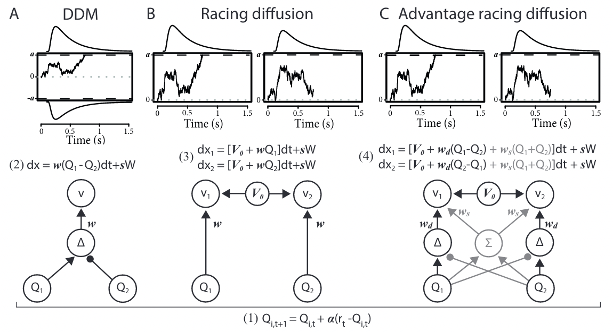

### Multi-alternative RL-ARD

Its ALBA decision model extends naturally to multi-alternative choice tasks.

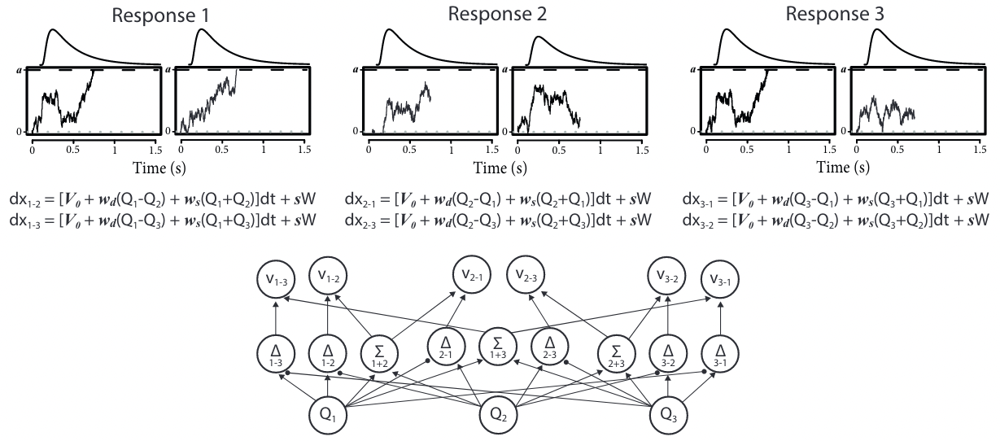
