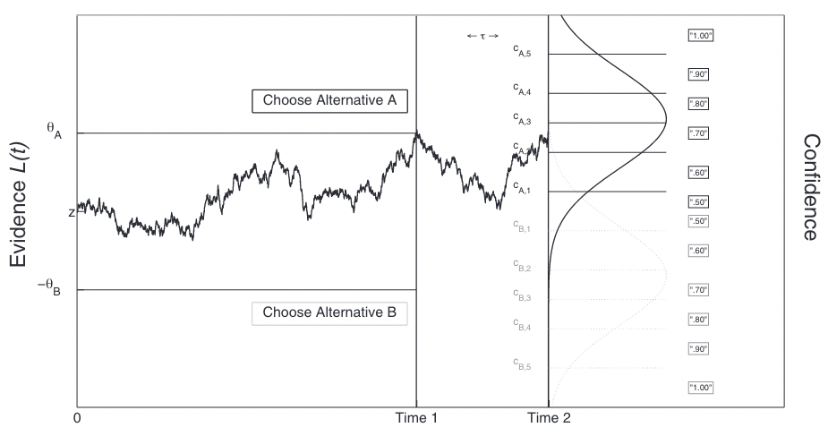

<!-- Apply header and footer to first slide only -->
<!-- _header: "   " -->
<!-- _footer: "[Baptiste Pesquet](https://www.bpesquet.fr)" -->
<!-- headingDivider: 5 -->

# Towards metacognitive agents: integrating confidence in sequential decision-making

<!-- Show pagination, starting with second slide -->
<!-- paginate: true -->

## Confidence in natural cognition

### Decision-making as a sequential process

- A **decision** is a deliberative process leading to a **choice**.
- Decision-makers need **time** to collect and process informative cues.
- Decision-making is often modeled as an **accumulation-to-threshold** process [[Gold and Shadlen, 2007](https://www.annualreviews.org/doi/10.1146/annurev.neuro.29.051605.113038)].
- The balance between response time and accuracy (when available) is called the **Speed/Accuracy Trade-off** [[Heitz, 2014](https://www.frontiersin.org/journals/neuroscience/articles/10.3389/fnins.2014.00150/full)].

### Models of sequential decision-making

For binary choices, a popular model is the **Diffusion Decision Model** [[Ratcliff and McKoon, 2008](https://direct.mit.edu/neco/article/20/4/873-922/7299)].

*Image credits: [[Forstmann et al., 2016](https://doi.org/10.1146/annurev-psych-122414-033645)]*

Multi-alternative decisions are often modeled as a **race** between accumulators for each possible choice.

*Image credits: [[Krajbich and Rangel, 2011](https://www.annualreviews.org/doi/10.1146/annurev-vision-111815-114630)]*

### Confidence in decision-making

- **Uncertainty** is inherent to all stages of neural computation [[Fleming, 2024](https://doi.org/10.1146/annurev-psych-022423-032425)].
  - It refers to probabilistic representations of information in the brain.
- **Confidence** quantifies the degree of **certainty** associated with a decision.
  - It refers to scalar values derived from those distributions [[Meyniel et al., 2015](https://linkinghub.elsevier.com/retrieve/pii/S0896627315008284)].
- More formally, confidence can be defined as the **probability** that a choice is correct given the evidence [[Pouget et al., 2016](https://www.nature.com/articles/nn.4240)].

### Computing confidence in sequential decision-making models

In **decisional focus models**, confidence is directly indexed by the state of evidence at the time of choice.

*Image credits: [Kepecs et al., 2008](https://www.nature.com/articles/nature07200)*

**Post-decisional focus models** posit that evidence accumulation goes on after decision time to account for confidence.

*Image credits: [Pleskac and Busemeyer, 2008](https://doi.apa.org/doi/10.1037/a0019737)*

### Confidence as a doorway to metacognition

- **Metacognition** is the ability to **monitor** and **regulate** one's cognitive processes [[Flavell, 1979](https://www.semanticscholar.org/paper/Metacognition-and-Cognitive-Monitoring%3A-A-New-Area-Flavell/ee652f0f63ed5b0cfe0af4cb4ea76b2ecf790c8d)].
  - Example: should I study more (or differently) for this exam?
- As part of metacognitive monitoring, confidence judgments may inform the processes of **cognitive control** [[Fleming and Lau, 2014](http://journal.frontiersin.org/article/10.3389/fnhum.2014.00443/abstract)].

### An emerging field: the neuroscience of confidence

- **Parietal cortex** is related to evidence accumulation during decision-making.
- **Multiple brain areas** seem involved in confidence formation and reporting:

  - antero-medial PFC.
  - anterior PFC and temporal lobe.
  - Brodmann area 46.
  - ventral striatum.

*Image credits: [[Grimaldi et al., 2015](https://linkinghub.elsevier.com/retrieve/pii/S0149763415001025)]*

## Proposed approach

### Agent architecture

Model combining:

- a **decision module** based on an evidence accumulation model;
- a **metacognitive module** in which confidence is used to tune the decision hyperparameters: decision threshold and evidence integration rate [[Desender and Verguts, 2024](http://biorxiv.org/lookup/doi/10.1101/2024.10.03.616475)].

### Experimental validation

Model was assessed on a classic **perceptual task**: Random Dot Motion discrimination.

*Included image credits: [[Mamassian, 2016](https://www.annualreviews.org/doi/10.1146/annurev-vision-111815-114630)]*

### Preliminary results

- Confidence is **correlated** with dot motion coherence, as is (oppositely) decision time.
- Model is able to implement the **SAT**.

### Future works

- Refine the hyperparameters tuning process.
- Add different metacognitive strategies.
- Implement model on a human/robot collaborative task.
- ...

## Thanks for your attention!

Any questions?
