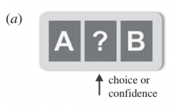
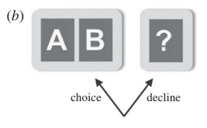
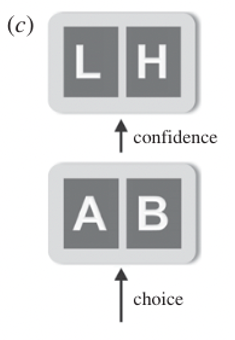
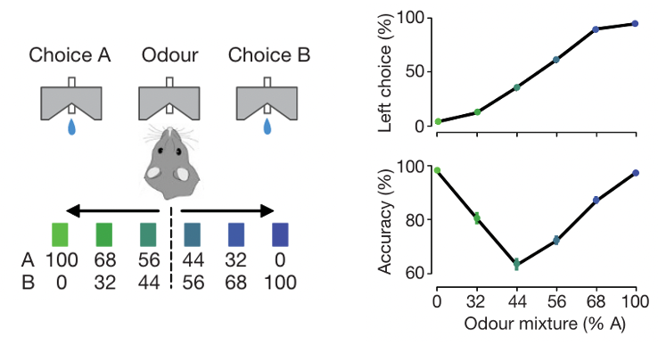
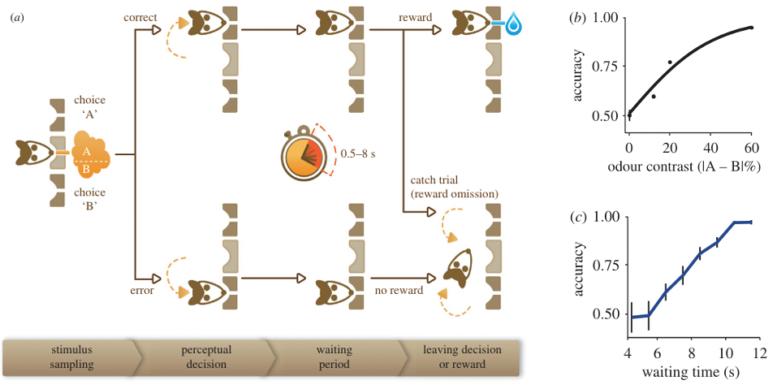
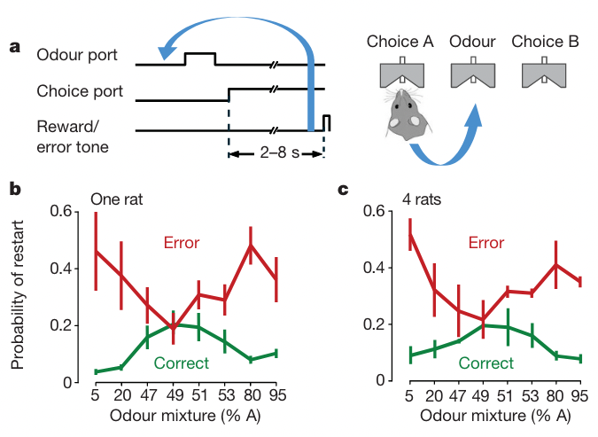
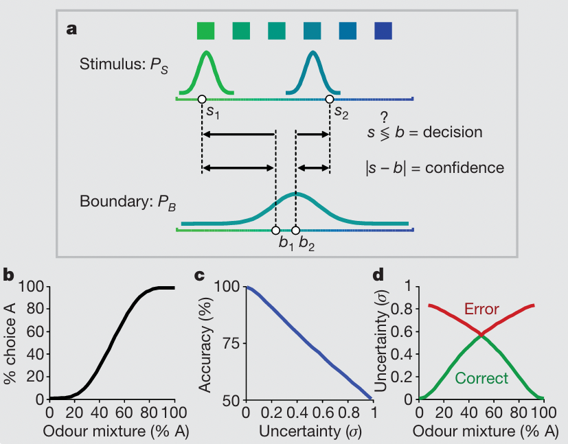
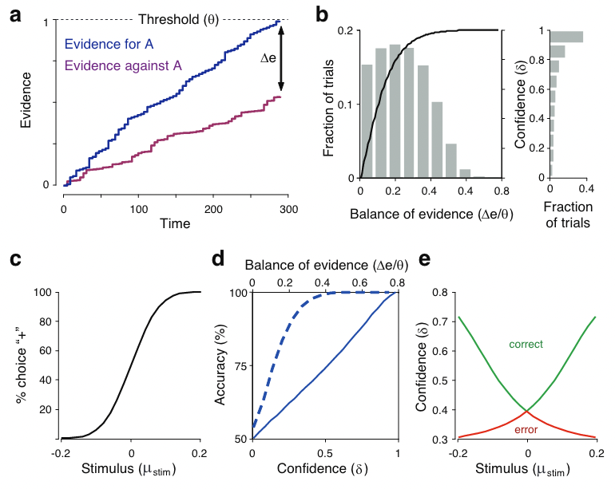
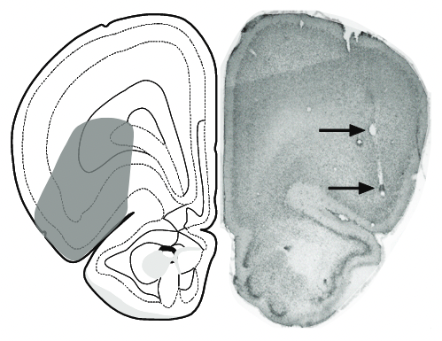
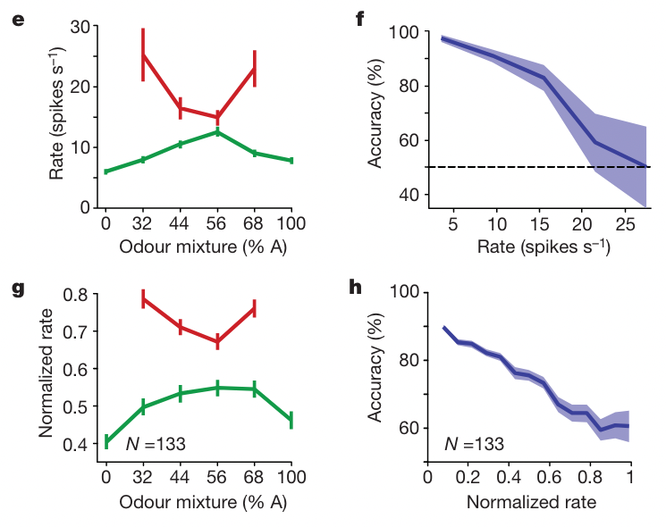

<!-- Apply header and footer to first slide only -->
<!-- _header: "  " -->
<!-- _footer: "[Baptiste Pesquet](https://www.bpesquet.fr)" -->
<!-- headingDivider: 3 -->

# Papers review: Kepecs' framework for decision confidence

<!-- Show pagination, starting with second slide -->
<!-- paginate: true -->

## Papers

Adam Kepecs et al., “Neural Correlates, Computation and Behavioural Impact of Decision Confidence,” Nature 455, no. 7210 (September 2008): 227–31, <https://doi.org/10.1038/nature07200>.

Adam Kepecs and Zachary F. Mainen, “A Computational Framework for the Study of Confidence in Humans and Animals,” Philosophical Transactions of the Royal Society B: Biological Sciences 367, no. 1594 (May 19, 2012): 1322–37, <https://doi.org/10.1098/rstb.2012.0037>.

## Scope

- Humans and other animals must often make decisions on the basis of imperfect evidence.
- Lttle is/was known about how the brain computes confidence estimates about decisions.
- Issue is explored combining behavioral analysis, computational modeling and neural recordings.

## Behavioral study of confidence

### Behavioral reports of confidence

- Explicit reports (via textual or numerical ratings) are only accessible to humans.
- Only implicit reports are possible for non-humans.

### Confidence report protocols

#### Uncertain option

- Add a third choice, the "uncertain option", to the available responses.
- Pioneered in experimental psychology nearly a century ago.
- Has been applied to monkeys, dolphins, rats and pigeons.
- Can be interpreted as a three-choice task solved by learning stimulus-response categories, without necessitating confidence estimations.

---

#### Decline (opt-out) option

- Add option of accepting or declining the test.
- Has been applied to monkeys, pigeons and rats.
- Rather than confidence, attention or motivation could explain the choice to answer or not.

---

#### Post-decision wagering

- The binary choice is followed by a bet on the reward. If the decision is correct, the wager amount is kept.
- Contrary to previous protocols, both choice and confidence are obtained on each trial.

---

#### Decision restart

- After choice, subjects are given the option to either wait for their (potential) reward or abort the trial and start again.
- Form of post-decision wagering suitable to animals.

### Experimental task

- Rats were trained to perform an odour categorization task, with water as a reward.
- On each trial, a binary mixture of two pure odorants was delivered.
- The decision difficulty was defined by the mixture ratio (50/50 = hardest).
- A variable reward delay was introduced.

### Task variation

To assess confidence, reward delay was increased and decision restart was added.

### Results

## Computational modeling of confidence

### Defining confidence

- Confidence = estimate by the decision-maker of the probability that the decision is correct.
- Confidence is a form of uncertainty.

### Simple confidence model

#### Formulation

- Stimulus $s_i$ for the $i$th trial is defined as the log ratio of the odour mixture with Gaussian additive noise $\eta_{stim} \sim \mathcal{N}(0, \sigma_{stim})$.
- Choice boundary $b_i$ is fixed at 0 with additive noise $\eta_{bound} \sim \mathcal{N}(0, \sigma_{bound})$.
- Choice is computed by comparing stimulus and boundary.
- Distance between them provides an estimate of decision confidence.

$$s_i = log \frac{[A]}{[B]} + \eta_{stim}$$

$$b_i = \eta_{bound}$$

$$c_i = \{ \text{left}|s_i< b_i; \text{right}|s_i \geq b_i\ \}$$

$$d_i = |s_i-b_i|$$

---

#### Confidence calibration

- The distance $d_i$ must be calibrated and normalized to become a veridical estimator of decision outcome (linear relationship with accuracy).
- Sigmoid-like functions provide a good solution to this problem.
- Decision confidence $\delta_i$ is defined as the result of the calibration process.
- Decision uncertainty $\sigma_i$ is defined as its contrary.

$$\delta_i = f(d_i) = \text{tan}(|s_i-b_i|)$$

$$\sigma_i = 1 - \delta_i$$

---

#### Results

### Evidence accumulation model

#### Formulation

- This class of models is able to account for other features of behavior, such as decision time ([more details](../decision-making/)).
- In a race model, decision confidence can be estimated as the distance ${\Delta e}_i$ between the accumulators once an accumulator reaches the threshold $\theta_i$.
- The balance of evidence $BoE$ results from the normalization of this distance.
- Calibration is necessary to turn confidence into a veridical estimator of decision outcome.

$${BoE}_i = {\Delta e}_i/\theta_i$$

$$\delta_i = f({BoE}_i) = \frac{2}{1+ e^{\frac{1}{3}{\Delta e}_i / \theta_i}}$$

---

#### Results

## Neural correlates of confidence

### Experimental setup

- Single neuron activity was recorded in rats' OFC during the olfactory mixture categorization task.
- The analysis was focused on the reward-anticipation period, assumed to be associated with confidence estimations.

### Results

### Interpretation

- The firing rates of many single neurons in the OFC of rats match closely to the predictions of confidence models.
- These cannot be readily explained by alternative mechanisms, such as learning stimulus–outcome associations.
- Rats not only show a neural correlate of decision confidence, but they can use such information in subsequent decisions to guide adaptive behaviour.

## Takeaways

- Behavioral findings, computational modeling and neural correlates were integrated into a coherent framework for decision confidence.
- Confidence estimations may be a fundamental and ubiquitous component of decision-making in the brain.
- Estimating the confidence in a choice is little more complex than calculating the choice itself, and within reach of non-humans.
