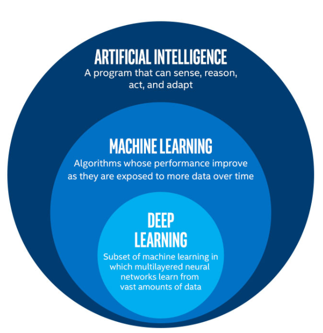
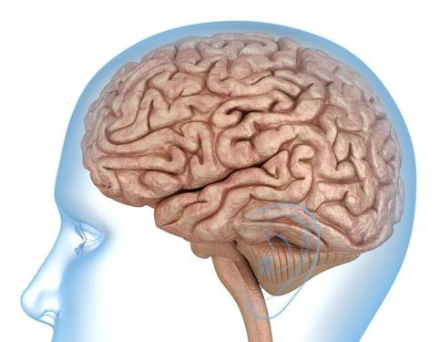
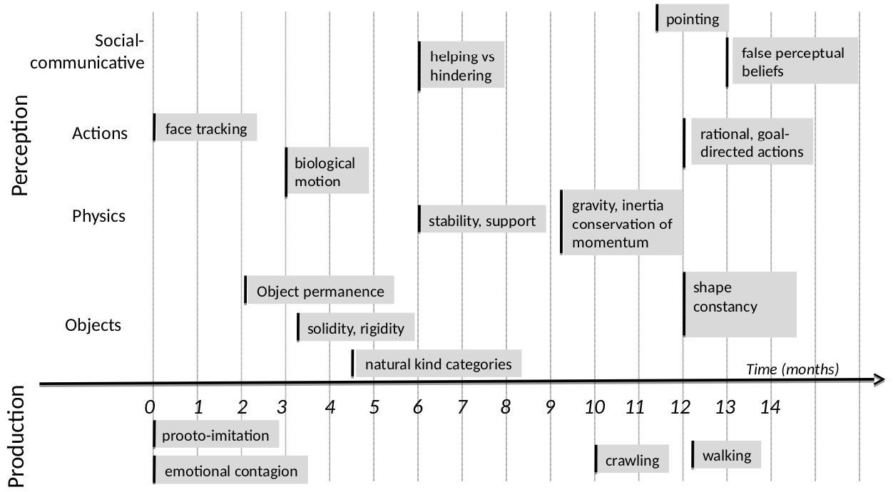

## Summary

- What Is AI, Actually?
- How Do Machines Learn?
- Should We Be Scared Of AI?

---

## What Is AI, Actually?

---

## The original ambition of AI

> "AI is the science and engineering of making intelligent machines." ([John McCarthy](https://en.wikipedia.org/wiki/John_McCarthy_(computer_scientist)))

> "Every aspect of learning or any other feature of intelligence can in principle be so precisely described that a machine can be made to simulate it." ([Dartmouth Workshop](https://en.wikipedia.org/wiki/Dartmouth_workshop), 1956)

> "AI is the science of making machines do things that would require intelligence if done by men." ([Marvin Minsky](https://en.wikipedia.org/wiki/Marvin_Minsky))

---

## A technical definition of AI

> "AI refers to systems that **display** intelligent behavior by analysing their **environment** and taking **actions** - with some degree of **autonomy** - to achieve specific **goals**." ([EC, 2018](https://ec.europa.eu/newsroom/dae/document.cfm?doc_id=51625))

AI systems can be either:

- Purely **software**-based (e.g. voice assistants, search engines, face recognition systems).
- Embedded in **hardware** devices (e.g. robots, autonomous cars, drones).

---

## Main areas of research

- **Problem solving** (e.g. search algorithms, constraint solving).
- **Reasoning** and **decision making** (e.g. logic, knowledge representation).
- **Machine Learning**.
- **Real-world interactions** (e.g. computer vision, natural language understanding, robotics).

---

## AI is a moving target

As soon as AI successfully solves a problem, the problem is no longer considered a part of AI.

> "[AI is whatever hasn't been done yet](https://en.wikipedia.org/wiki/AI_effect)."

---

## The tumultuous history of AI

---

## AI is a highly interdisciplinary field

---

## AI is a social science

AI has many social and societal implications:

- Job market transformation.
- Human/machine interactions.
- Trust and acceptability.
- Legal aspects and regulation.
- Fairness.
- Ethical use.
- Personal data.
- ...

---

## AI comes in different flavours

- **Substitutive intelligence**: replacement of men by machines.
- **Augmented intelligence**: human-centered AI for performance augmentation & autonomy enhancement.
- **Hybrid intelligence**: human-machine collaboration on complex tasks.

---

## A broader definition of AI

> "AI is an **interdisciplinary** field aiming at **understanding** and **imitating** the mechanisms of **cognition** and **reasoning**, in order to **assist** or **substitute** humans in their activities." ([Commission d'enrichissement de la langue française](https://fr.wikipedia.org/wiki/Commission_d%27enrichissement_de_la_langue_fran%C3%A7aise), 2018)

---

## How Do Machines Learn?

---

## Machine Learning in a nutshell

Set of techniques for giving machines the ability to find **patterns** and extract **rules** from data, in order to:

- **Identify** or **classify** elements.
- Detect **tendencies**.
- Make **predictions**.

As more data is fed into the system, results get better: performance improves with experience.

a.k.a. **Statistical Learning**.

---

---

---

## A new paradigm

---

## The Machine Learning workflow

1. **Frame** the problem.
1. Collect, analyze and prepare **data**.
1. Select and train several **models** on data.
1. **Tune** the most promising model.
1. **Deploy** the model to production.

---

## ML is not a silver bullet!

- Some use cases are a better fit for ML than others:
  - Difficulty to express the actions as rules.
  - Data too complex for traditional analytical methods.
  - Performance > interpretability.
- Data quality is paramount.

---

## Algorithm #1: K-Nearest Neighbors

Prediction is based on the `k` nearest neighbors of a data sample.

---

## Algorithm #2: Decision Trees

Build a tree-like structure based on a series of discovered questions on the data.

---

## Algorithm #3: Neural Networks

- Layers of loosely neuron-inpired computation units.
- Can approximate any continuous function.

---

---

## Training a network

---

## The Deep Learning tsunami

- Multilayered neural networks trained on (generally) vast amounts of data.

- Since 2010, outperformed previous state-of-the-art techniques in many fields (language translation, image and scene recognition...).

---

---

---

## From labs to everyday life

---

## Should We Be Scared Of AI?

---

## AI is altering the job market...

- Machines outperform humans in a growing list of cognitive tasks.
- Repetitive tasks are most exposed (even complex ones, like medical diagnosis or financial analysis).
- Entire industries are on the verge of disruption (example: truck-based transportation, first employer in the U.S.).

---

## ... For better or worse

- Net impact of AI on job quantity is unknown.
- Most jobs will be **transformed**, not replaced by AI.
  - Boring and repetitive stuff will be automated.
  - AI will add new insight to help human decision.
- Human/machine interactions will multiply.
- Their quality will be a key factor of performance for organizations.

---

## Real or fake?

---

## AGI is very far away

- Current AI systems are **weak**: highly tuned to perform well in one task.
- **Artificial General Intelligence** a.k.a. **strong AI**, the ability to perform any task as well as a human, is out of reach.

---

## The intelligence debate

- Despite their complexity, ML and DL algorithms can be viewed as merely [curve fitting](https://diginomica.com/ai-curve-fitting-not-intelligence).
- On the contrary, some AI researchers envision DL as a new form of **algorithmic reasoning**, somehow mimicking the human brain.

---

## The human brain is a masterpiece

- Approx. 86 billions neurons in 1.4 kg.
- Typical energy consumption: 20 W (!)
- So much of it is still unknown.

---

## Babies are outstanding learners

---

## Any questions?

