## Sommaire

- Présentation de ASP.NET Core
- Le framework ASP.NET Core MVC
- Routage et environnement
- Interactions avec une base de données
- Création d'API web
- Création de vues HTML

---

## Présentation d'ASP.NET Core

---

### Histoire d'ASP.NET Core

- A l'origine, .NET (Framework) incluait une technologie de création de pages web dynamiques nommée **ASP.NET** (_Active Server Pages_).
- **ASP.NET Core** est une réécriture d'ASP.NET basée sur .NET (Core).
- Standard actuel pour le développement web sous .NET.

---

### Points-clés d'ASP.NET Core

- Permet de créer des applications web et des services web (API) utilisés comme _backends_ par des clients riches ou des applications mobiles.
- Léger, moderne et modulaire.
- Inclut des technologies facilitant la gestion des pages dynamiques, des appels temps réel, des tests, etc.
- Déployable sur plusieurs serveurs web : Kestrel, Apache, nginx, etc.
- Multi-plateformes et [open source](https://github.com/dotnet/aspnetcore).

---

{}

### Rappel : le fonctionnement du web

Le web est basé sur un modèle **client/serveur** :

- Le client (navigateur, application mobile, robot d'indexation, etc) envoie une demande (**requête**) au serveur.
- Le serveur prépare sa **réponse** à la requête du client, puis la lui renvoie.

---


{}

---

### Rappel : le protocole HTTP

- _HyperText Transfer Protocol_.
- Socle technique du web.
- Equivalent sécurisé : **HTTPS**.
- Basé sur des **commandes** textuelles exprimant les différentes actions possibles : _GET_, _PUT_, _POST_, etc).

---

{}

### UI web générée côté serveur

Structure HTML contenant les données générée côté serveur, puis renvoyée au client.

- Peu d'exigences techniques côté client (navigateur simple, trafic réseau limité).
- Accès BD et contrôles centralisés.
- Exemples d'usages : sites dynamiques, blogs, CMS...

---

[](https://www.growth-rocket.com/blog/a-closer-look-at-client-side-server-side-rendering/)

{}

---

{}

### UI web générée côté client

Squelette HTML (sans données) initialement renvoyé au client. Ensuite, DOM mis à jour dynamiquement grâce à des appels asynchrones du client vers le serveur.

- Interactions riches avec l'utilisateur.
- Capacités matérielles et logicielles du client utilisables.
- Exemples d'usages : tableau de bord interactif, applications collaboratives...

---

[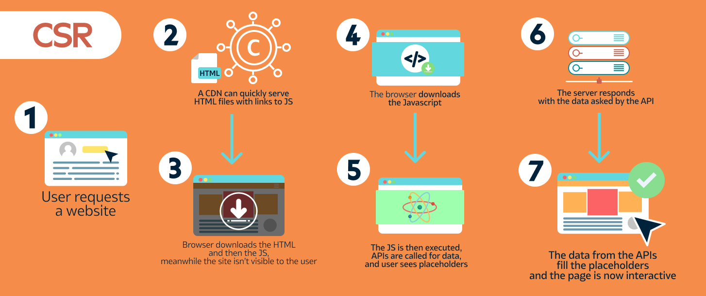](https://www.growth-rocket.com/blog/a-closer-look-at-client-side-server-side-rendering/)

{}

---

### L'offre technique ASP.NET Core

- UI générée côté serveur : **Razor Pages**, **MVC**.
- UI générée côté client : **Blazor**, **SPA** avec Angular ou React.
- Une approche hybride est possible (exemple : MVC + Blazor).

---

## Le framework ASP.NET Core MVC

---

### L'architecture MVC

- _Model-View-Controller_ (_Modèle-Vue-Contrôleur_).
- Décomposition d’une application en trois grandes parties :
  - **Modèle** : accès aux données et logique métier (_business logic_).
  - **Vue** : affichage et interactions avec l’utilisateur.
  - **Contrôleur** : dynamique de l’application, lien entre Modèle et Vue.
- Application du principe de séparation des responsabilités.

---

### MVC : un peu d'histoire

- Apparu à la fin des années 1970 pour le langage OO **Smalltalk**. Objectif : séparer le code de l’IHM de la logique applicative.
- Appliqué depuis dans de très nombreux contextes et langages :
  - web côté serveur : frameworks Symfony (PHP), Django (Python), Rails (Ruby), etc.
  - web côté client : frameworks Angular, Ember (JavaScript), etc.
  - desktop : bibliothèque Swing (Java), etc.

---

[](https://symfony.com/doc/current/index.html)

---

### Avantages et inconvénients

- Avantages :

  - Séparation nette des responsabilités => couplage faible, cohésion forte, maintenance et évolutions facilitées.
  - Standard connu et bien établi.

- Inconvénients :
  - Complexification de l’architecture.
  - Rigidité.

---

### ASP.NET Core MVC

- Framework de création d'applications web basées sur l'architecture MVC.
- Implémente de nombreux services et bonnes pratiques, parmi lesquels :
  - Routage des requêtes entrantes.
  - Gestion des pages dynamiques.
  - Authentification.
  - Injection de dépendance.
  - Tests.
  - ...

---

### Creation d'une application ASP.NET Core MVC

```bash
dotnet new mvc -o {AppName}
cd {AppName}
dotnet new gitignore
```

---

### Structure de l'application créée

<https://github.com/ensc-glog/MvcMovie>


---

### Les contrôleurs

- Créés dans le répertoire `Controllers/`.
- Définis dans l'espace de noms `{AppName}/Controllers`.
- Héritent des classes abstraites `Controller` (vues HTML) ou `ControllerBase` (API web).
- Définissent les points d'entrée dans l'application sous la forme de méthodes d'action annotables.

---

### Exemple de contrôleur

```csharp
namespace MvcMovie.Controllers;

public class HomeController : Controller
{
    // ...
    public IActionResult Index()
    {
        return View();
    }
    public IActionResult Privacy()
    {
        return View();
    }
    // ...
}
```

---

### Les modèles

- Créés dans le répertoire `Models/`.
- Définis dans l'espace de noms `{AppName}/Models`.
- Implémentent la logique métier de l'application sous la forme de classes **POCO** (_Plain Old CLR Objects_) souvent associées à des tables BD.

---

### Les vues

- Créées dans le répertoire `Views/{ControllerName}` sous la forme de fichiers [Razor](https://learn.microsoft.com/en-us/aspnet/core/razor-pages/?view=aspnetcore-6.0&tabs=visual-studio) (`.cshtml`).
- Représentent l'interface utilisateur (UI) de l'application.

```csharp
@{
    ViewData["Title"] = "Home Page";
}

<div class="text-center">
    <h1 class="display-4">Welcome</h1>
    <p>Learn about <a href="https://docs.microsoft.com/aspnet/core">building Web apps with ASP.NET Core</a>.</p>
</div>

```

---

### Code et librairies client

- Regroupés dans le répertoire `wwwroot/`.
- Rassemblent les fichiers CSS et JavaScript utilisés côté client.
- Intègrent par défaut Bootstrap et jQuery.

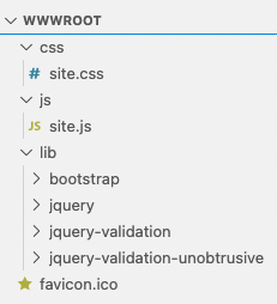

---

### Le fichier appsettings.json

Centralise les paramètres de configuration de l'application.

```json
{
  "Logging": {
    "LogLevel": {
      "Default": "Information",
      "Microsoft.AspNetCore": "Warning",
      "Microsoft.EntityFrameworkCore.Database.Command": "Information"
    }
  }
}
```

---

### Le fichier Program.cs

- Configure les services utilisés et le _pipeline_ de gestion des requêtes HTTP entrantes.
- Démarre l'application.

```csharp
var builder = WebApplication.CreateBuilder(args);
// Add services to the container.
builder.Services.AddControllersWithViews();
var app = builder.Build();
// ...
app.UseHttpsRedirection();
app.UseStaticFiles();
app.UseRouting();
app.UseAuthorization();

app.MapControllerRoute(
    name: "default",
    pattern: "{controller=Home}/{action=Index}/{id?}");

app.Run();

```

---

### Lancement de l'application

- En ligne de commande avec `dotnet run` ou depuis VS Code, après avoir généré les _assets_.
- Compile le code puis écoute un port aléatoire > 1000 pour attendre les requêtes HTTP entrantes sur la machine locale.
- Recompilation nécessaire après tout changement.

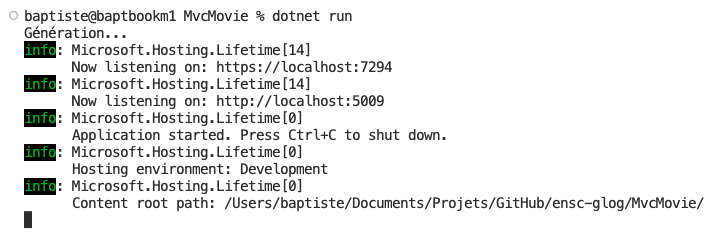

---

## Routage et environnement

---

### Routage des requêtes

- Associe les requêtes HTTP entrantes au code à exécuter (méthodes des contrôleurs).
- Permet à l'application web d'utiliser des URL propres et _SEO-friendly_, plutôt que des noms de fichiers.
- [Plus d'informations](https://docs.microsoft.com/en-us/aspnet/core/mvc/controllers/routing?view=aspnetcore-5.0).

---

### Routage par convention

- Permet de définir globalement la correspondance entre le format de l'URL et la méthode d'action d'un contrôleur à exécuter.
- Format par défaut : `/{ControllerName}/{ActionName}?{Parameters}`.
- Exemple : `https://myapp/Student/Details?code=137` appelle la méthode `Details` du contrôleur `StudentController`, en lui passant un paramètre nommé `code` ayant la valeur 137.

---

### Configuration du routage par convention dans Program.cs

```csharp
app.MapControllerRoute(
    name: "default",
    pattern: "{controller=Home}/{action=Index}/{id?}");
```

`Home`, `Index` et `id` sont resp. les noms par défaut du contrôleur, de l'action et du paramètre (optionnel).

---

### Exemple : ajout d'un contrôleur

Dans le fichier `Controllers/HelloController.cs`.

```csharp
using Microsoft.AspNetCore.Mvc;

namespace MvcMovie.Controllers;

public class HelloController : ControllerBase
{
    // GET: /Hello/
    public string Index()
    {
        return "Hello World!";
    }
}
```

---

### Utilisation du contrôleur créé

- L'URL <https://localhost:{port}/hello> est automatiquement routée vers la méthode `Index` de la classe `HelloController`.
- Même résultat avec <https://localhost:{port}/hello/index>,  `Index` étant le nom de l'action par défaut.

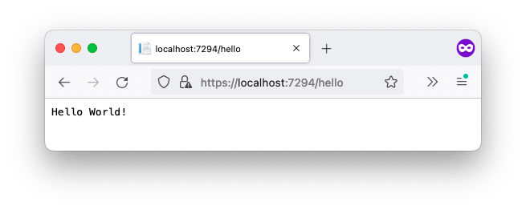

---

### Passage de paramètres à un contrôleur

- On définit des paramètres dans l'URL via la syntaxe `?{name1}={value1}&{name2}=...`
- Leurs valeurs sont passées aux méthodes d'actions des contrôleurs.

```csharp
using System.Text.Encodings.Web;
// ...
public class HelloController : ControllerBase
{
    // ...
    // GET: /Hello/Welcome/ 
    public string Welcome(string name, int numTimes = 1)
    {
        // Prevents injection attacks
        return HtmlEncoder.Default.Encode($"Hello {name}, NumTimes is: {numTimes}");
    }
}

```

---

### Exemple : passage de paramètres au contrôleur créé

- L'URL <https://localhost:{port}/hello/welcome> est automatiquement routée vers la méthode `Welcome` de la classe `HelloController`.
- On peut définir (ou pas) les valeurs des paramètres `name` et `numTimes`.

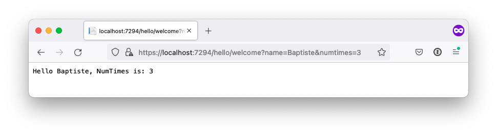

---

### Environnements

- Permettent d'adapter la configuration de l'application au contexte (développement, test ou production).
- Définis par la variable d'environnement `ASPNETCORE_ENVIRONMENT`. En l'absence de cette variable, l'environnement est de type Production.
- [Plus d'informations](https://docs.microsoft.com/en-us/aspnet/core/fundamentals/environments?view=aspnetcore-5.0).

---

### Définition de l'environnement avec Visual Studio Code

Dans le fichier `./vscode/launch.json`

```json
{
  "version": "0.2.0",
  "configurations": [
    {
      "name": ".NET Core Launch (web)",
      # ...
      "env": {
        "ASPNETCORE_ENVIRONMENT": "Development"
      },
      # ...
    }
  ]
}

```

---

### Configuration de l'application selon l'environnement détecté

Dans le fichier `Program.cs`.

```csharp
// Configure the HTTP request pipeline.
if (!app.Environment.IsDevelopment())
{
    app.UseExceptionHandler("/Home/Error");
    // The default HSTS value is 30 days. You may want to change this for production scenarios, see https://aka.ms/aspnetcore-hsts.
    app.UseHsts();
}
else
{
    app.UseDeveloperExceptionPage();
}
```

---

## Interactions avec une base de données

---

### EF Core et ASP.NET Core

- Entity Framework Core est la solution de persistance par défaut sous ASP.NET Core.
- Après son installation, on configure l'application pour [associer](https://docs.microsoft.com/en-us/ef/core/dbcontext-configuration/) un contexte BD à chaque requête HTTP entrante.
- Il est ensuite utilisé par les contrôleurs pour interagir avec la base de données.

---

### Exemple : ajout d'une classe métier

Dans le fichier `Models/Movie.cs`.

```csharp
using System.ComponentModel.DataAnnotations;

namespace MvcMovie.Models;

public class Movie
{
    public int Id { get; set; }

    [StringLength(100, MinimumLength = 3)]
    public string Title { get; set; } = null!;

    [Display(Name = "Release Date"), DataType(DataType.Date)]
    public DateTime ReleaseDate { get; set; }

    [StringLength(30)]
    public string Genre { get; set; } = null!;
}
````

---

### Création du contexte BD

Dans le fichier `Data/MvcMovieContext.cs`.

```csharp
using Microsoft.EntityFrameworkCore;
using MvcMovie.Models;

namespace MvcMovie.Data;

public class MvcMovieContext : DbContext
{
    public DbSet<Movie> Movies { get; set; } = null!;
    public string DbPath { get; private set; }

    public MvcMovieContext()
    {
        // Path to SQLite database file
        DbPath = "MvcMovie.db";
    }

    // The following configures EF to create a SQLite database file locally
    protected override void OnConfiguring(DbContextOptionsBuilder options)
    {
        // Use SQLite as database
        options.UseSqlite($"Data Source={DbPath}");
        // Optional: log SQL queries to console
        options.LogTo(Console.WriteLine, new[] { DbLoggerCategory.Database.Command.Name }, LogLevel.Information);
    }
}
```

---

### Synchronisation de la base de données avec le modèle

Réalisée via des migrations.

```bash
# Create a new migration
dotnet ef migrations add {MigratioName}

# Sync DB with most recent migrations
dotnet ef database update
```

---

### Configuration de l'application pour EF Core

Dans le fichier `Program.cs`.

```csharp
// ...
using MvcMovie.Data;

var builder = WebApplication.CreateBuilder(args);

// Add services to the container.
builder.Services.AddControllersWithViews();
// Attach an EF Core database context to each query
builder.Services.AddDbContext<MvcMovieContext>();
// ...
```

---

### Gestion des fichiers temporaires SQLite

Edition du fichier `.gitignore` pour ignorer ces fichiers.

```bash
# Ignore SQLite temp files
*.db-shm
*.db-wal
# ...
```

---

### Remplissage de la base de données

Classe `SeedData` créée dans le répertoire `Models/`.

```csharp
using MvcMovie.Data;

namespace MvcMovie.Models;

public class SeedData
{
    public static void Init()
    {
        using (var context = new MvcMovieContext())
        {
            // Look for existing content
            if (context.Movies.Any())
            {
                return;   // DB already filled
            }

            // Add several movies
            context.Movies.AddRange(
                new Movie
                {
                    Title = "When Harry Met Sally",
                    ReleaseDate = DateTime.Parse("1989-2-12"),
                    Genre = "Romantic Comedy",
                },
                // ...
                new Movie
                {
                    Title = "Rio Bravo",
                    ReleaseDate = DateTime.Parse("1959-4-15"),
                    Genre = "Western"
                }
            );

            // Commit changes into DB
            context.SaveChanges();
        }
    }
}
```

---

### Exécution du code de remplissage

Dans le fichier `Program.cs`.

```csharp
using MvcMovie.Data;
using MvcMovie.Models;

var builder = WebApplication.CreateBuilder(args);

// Add services to the container.
builder.Services.AddControllersWithViews();
// Attach an EF Core database context to each query
builder.Services.AddDbContext<MvcMovieContext>();

var app = builder.Build();

// Seed data into DB
SeedData.Init();
// ...
```

---

## Création d'API web

---

### La notion d'API

- Une **API** (_Application Programming Interface_) est un point d'entrée programmatique dans un système.
- Elle fournit un moyen d'interagir avec ce système.
- Les API permettent aux développeurs d'intégrer des services externes dans leurs applications.

---

### Spécificités des API web

- Une **API web** (appelée parfois service web) est une API accessible via les technologies du web : HTTP ou HTTPS.
- Les API web utilisent le plus souvent le format de donnée **JSON**.
- Certaines sont librement utilisables mais la plupart nécessitent une authentification du client.

---

{}

### Le format JSON

- JSON = JavaScript Object Notation.
- Format de description de données structurées inspiré de la syntaxe des objets JavaScript.
- Contenu JSON = ensemble de paires champ/valeur.
- Types de valeur possibles : nombres, chaînes, booléens, tableaux, objets.
- A supplanté XML comme format standard pour les échanges de données via des API web.

---

### Exemple de contenu JSON

```json
{
  "cars": [
    {
      "model": "Peugeot",
      "color": "blue",
      "checkups": [2015, 2017]
    },
    {
      "model": "Citroën",
      "color": "white",
      "checkups": [2003, 2005, 2007, 2009, 2011, 2013]
    }
  ]
}
```

{}

---

### Exemples d'API web

- [PokéAPI](https://pokeapi.co/)
- [Star Wars API](https://swapi.dev/)
- [Wikipedia](https://en.wikipedia.org/w/api.php?)
- [Spotify](https://developer.spotify.com/documentation/web-api/)
- [OMDb API](https://www.omdbapi.com/)
- ...

---

### Outils pour la gestion des API web

- N'importe quel navigateur pour les tests basiques.
- Extension [RESTClient](https://addons.mozilla.org/fr/firefox/addon/restclient/) pour Firefox.
- [Postman](https://www.getpostman.com/).
- ...

---

### Les API RESTful

- **REST** (_REpresentational State Transfer_) est un ensemble de principes pour créer des API : client/serveur, pas de gestion d'état, etc.
- Une API web _RESTful_ (conforme au standard REST) expose une interface basée sur les commandes HTTP. Exemples :
  - `GET /<ResourceName>/<id>` pour accéder à une ressource.
  - `POST /<ResourceName>` (avec les informations nécessaires dans le corps de la requête) pour la créer.

---

### Fonctionnement d'une API web avec ASP.NET Core MVC

[](https://learn.microsoft.com/en-us/aspnet/core/tutorials/first-web-api?view=aspnetcore-6.0&tabs=visual-studio)

---

### Création d'un contrôleur d'API

- Dans le répertoire `Controllers/`.
- Hérite de la classe `ControllerBase`.
- Associé aux routes du type `api/{ApiControllerName}/`.

---

### Exemple de contrôleur d'API

- Dans le fichier `Controllers/MovieApiController.cs`.
- La conversion au format JSON est implicite.

```csharp
using Microsoft.AspNetCore.Mvc;
using Microsoft.EntityFrameworkCore;
using MvcMovie.Data;
using MvcMovie.Models;

namespace MvcMovie.Controllers;

[Route("api/[controller]")]
[ApiController]
public class MovieApiController : ControllerBase
{
    private readonly MvcMovieContext _context;

    public MovieApiController(MvcMovieContext context)
    {
        _context = context;
    }

    // GET: api/MovieApi
    public async Task<ActionResult<IEnumerable<Movie>>> GetMovies()
    {
        return await _context.Movies.ToListAsync();
    }
}
```

---

### Requêtes synchrones

[](https://code-maze.com/asynchronous-programming-with-async-and-await-in-asp-net-core/)

---

### Requêtes asynchrones

[](https://code-maze.com/asynchronous-programming-with-async-and-await-in-asp-net-core/)

---

### Résultat de l'appel à l'API

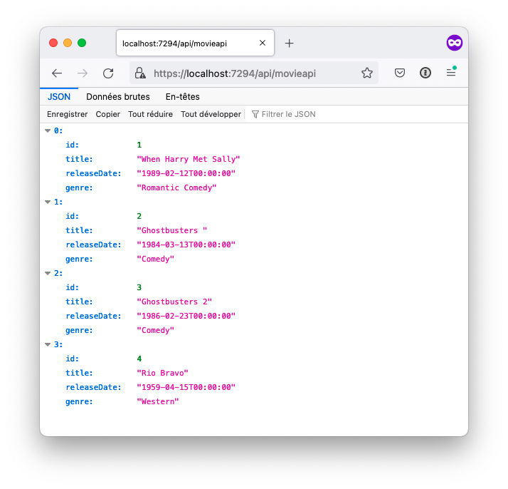

---

### Accès à un élément

```csharp
// ...
[Route("api/[controller]")]
[ApiController]
public class MovieApiController : ControllerBase
{
    // ...
    // GET: api/MovieApi/5
    [HttpGet("{id}")]
    public async Task<ActionResult<Movie>> GetMovie(int id)
    {
        var movie = await _context.Movies.FindAsync(id);
        if (movie == null)
            return NotFound();
        return movie;
    }
}
```

---

### Test d'accès

Envoyer une requête HTTP GET vers l'URL <https://localhost:{port}/api/movieapi/{movieId}>.

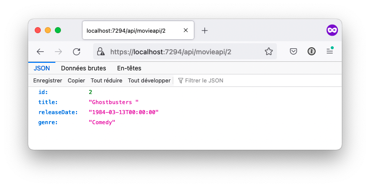

---

### Gestion des références circulaires

- La sérialisation JSON d'objets métier peut être compliquée par la présence d'associations bidirectionnelles.
- Dans ces cas, il faut configurer l'application (fichier `Program.cs`) pour [ignorer ou préserver les références circulaires](https://learn.microsoft.com/en-us/dotnet/standard/serialization/system-text-json/preserve-references?pivots=dotnet-6-0).

```csharp
using System.Text.Json.Serialization;
// ...

var builder = WebApplication.CreateBuilder(args);

// Add services to the container.
// Ignore circular references when serializing objects into JSON
builder.Services.AddControllersWithViews().AddJsonOptions(x =>
    x.JsonSerializerOptions.ReferenceHandler = ReferenceHandler.IgnoreCycles);
// ...
```

---

### Création d'un élément

```csharp
// ...
[Route("api/[controller]")]
[ApiController]
public class MovieApiController : ControllerBase
{
    // ...
    // POST: api/MovieApi
    // To protect from overposting attacks, see https://go.microsoft.com/fwlink/?linkid=2123754
    [HttpPost]
    public async Task<ActionResult<Movie>> PostMovie(Movie movie)
    {
        _context.Movies.Add(movie);
        await _context.SaveChangesAsync();

        return CreatedAtAction(nameof(GetMovie), new { id = movie.Id }, movie);
    }
}
```

---

### Test de création

- Envoyer une requête HTTP POST en spécifiant la valeur du champ `Content-type` à `application/json`.
- Le contenu JSON de la requête doit inclure les propriétés obligatoires du nouvel élément.
- Exemple avec l'outil [curl](https://curl.se/):

```bash
curl -X POST -k -H 'Content-Type: application/json' -i https://localhost:{port}/api/movieapi/ --data '{
    "Title": "1941",
    "ReleaseDate": "1979-12-14T00:00:00",
    "Genre": "Comedy"
}'
```

---

### Mise à jour d'un élément existant

```csharp
// ...
[Route("api/[controller]")]
[ApiController]
public class MovieApiController : ControllerBase
{
    // ...
    // PUT: api/MovieApi/5
    // To protect from overposting attacks, see https://go.microsoft.com/fwlink/?linkid=2123754
    [HttpPut("{id}")]
    public async Task<IActionResult> PutMovie(int id, Movie movie)
    {
        if (id != movie.Id)
            return BadRequest();

        _context.Entry(movie).State = EntityState.Modified;
        try
        {
            await _context.SaveChangesAsync();
        }
        catch (DbUpdateConcurrencyException)
        {
            if (!MovieExists(id))
                return NotFound();
            else
                throw;
        }
        return NoContent();
    }

    // Returns true if a movie with specified id already exists
    private bool MovieExists(int id)
    {
        return _context.Movies.Any(m => m.Id == id);
    }
}
```

---

### Test de mise à jour

- Envoyer une requête HTTP PUT vers l'élément à modifier, en spécifiant la valeur du champ `Content-type` à `application/json`.
- Le contenu JSON de la requête doit inclure toutes les propriétés de l'élément modifié.
- Exemple avec l'outil [curl](https://curl.se/):

```bash
curl -X PUT -k -H 'Content-Type: application/json' -i https://localhost:7294/api/movieapi/5 --data '{
    "Id": 5,
    "Title": "1941 (movie)",
    "ReleaseDate": "1979-12-14T00:00:00",
    "Genre": "Comedy"
}'
```

---

### Suppression d'un élément

```csharp
// ...
[Route("api/[controller]")]
[ApiController]
public class MovieApiController : ControllerBase
{
    // ...
    // DELETE: api/MovieApi/5
    [HttpDelete("{id}")]
    public async Task<IActionResult> DeleteMovie(int id)
    {
        var movie = await _context.Movies.FindAsync(id);
        if (movie == null)
            return NotFound();

        _context.Movies.Remove(movie);
        await _context.SaveChangesAsync();

        return NoContent();
    }
    // ...
```

---

### Test de suppression

Envoyer une requête HTTP DELETE vers l'URL <https://localhost:{port}/api/movieapi/{movieId}>.

---

### Récapitulatif : API créée

| Route                       | Description            |
| --------------------------- | ---------------------- |
| `GET /api/MovieApi`         | Renvoie tous les films |
| `GET /api/MovieApi/{id}`    | Renvoie un film        |
| `POST /api/MovieApi`        | Ajoute un nouvel film  |
| `PUT /api/MovieApi/{id}`    | Met à jour un film     |
| `DELETE /api/MovieApi/{id}` | Supprime un film       |

---

## Création de vues HTML

---

### Correspondance entre contrôleurs et vues

- Dans une méthode d'action `{ActionName}` d'un contrôleur `Controllers/{CtrlName}Controller`, l'appel de `View()`déclenche le rendu de la vue `Views/{CtrlName}/{ActionName}.cshtml`.
- Le résultat HTML de ce rendu constitue la réponse HTTP renvoyée par le serveur au client.
- Nécessite que le contrôleur hérite de `Controller` et non `ControllerBase`.

---

### La syntaxe des vues

- [Razor](https://learn.microsoft.com/en-us/aspnet/core/mvc/views/razor?view=aspnetcore-6.0) est un langage de balisage permettant d'inclure du code C# dans des pages web.
- Le symbole `@` permet de basculer du HTML au C# dans la page. Il peut être suivi :
  - d'une expression implicite sans espaces `@maVariable`
  - d'une expression explicite entre parenthèses `@(nb1 + nb2)`
  - d'un [mot-clé Razor](https://learn.microsoft.com/en-us/aspnet/core/mvc/views/razor?view=aspnetcore-6.0#razor-reserved-keywords).
  - d'un bloc de code C# entre accolades `@{...}`.

---

### Structure commune des vues

- Par défaut, toutes les vues partagent une structure commune définie dans le fichier `Views/Shared/_Layout.cshtml`.
- Dans ce layout, la fonction `@RenderBody()` permet de générer le contenu spécifique de la vue à afficher.
- Les éléments externes (exemples : inclusions CSS ou JavaScript) peuvent être rassemblés dans des **sections** affichées par le layout.

---

### Exemple de layout

```html
<!DOCTYPE html>
<html lang="en">
  <head>
    <meta charset="utf-8" />
    <title>@ViewData["Title"] - Movie App</title>
    <!-- ... -->
  </head>
  <body>
    <header><!-- ... --></header>
    <div class="container">
      <main role="main" class="pb-3">@RenderBody()</main>
    </div>
    <footer><!-- ... --></footer>
    <script src="~/lib/jquery/dist/jquery.min.js"></script>
    <!-- ... -->
    @await RenderSectionAsync("Scripts", required: false)
  </body>
</html>
```

---

### Exemple : rendu d'une vue

Méthode d'action associée à la route `/Hello` dans le fichier `Controllers/HelloController.cs`.

```csharp
using Microsoft.AspNetCore.Mvc;

namespace MvcMovie.Controllers;

public class HelloController : Controller // not ControllerBase!
{
    // 
    // GET: /Hello/
    public IActionResult Index()
    {
        // Renders Views/Hello/Index.cshtml
        return View();
    }
    // ...
}
```

---

### Exemple : possibilités de base

Fichier `Views/Hello/Index.cshtml`.

```html
@*
    This view demonstrates some possibilities of the Razor syntax.
    (This is a server-side comment, by the way).
*@

<h2>Hello ASP.NET Core MVC!</h2>

@{
    @* Some info about a famous monument. *@
    string monument = "Eiffel Tower";
    int year = 1889;
}

<p>The @monument was inaugurated in @year. It is @(DateTime.Now.Year - year) years old!</p>
```

---

### Exemple : structures de contrôle et tableaux

```html
@{
    string[] colors = { "blue", "brown", "black" };
}
@if (colors.Length > 0)
{
    <p>A few colors:</p>
    <ul>
    @foreach (string color in colors)
        {
            <li>Color: @color</li>
        }
    </ul>
}
```

([Plus de détails](https://learn.microsoft.com/en-us/aspnet/core/mvc/views/razor?view=aspnetcore-6.0#control-structures))

---

### Blocs de code Razor

- Définis par la syntaxe `@{...}`.
- Le code C# contenu n'est pas rendu (= pas ajouté au résultat HTML renvoyé).
- A l'intérieur d'un bloc,
  - les balises HTML permettent de basculer du C# au HTML.
  - la balise `<text>` permet de demander explicitement le rendu HTML d'un contenu C# sans balises.

---

### Exemple : blocs Razor et fonctions

```html
<p>
    @{
        void RenderStrong(string value)
        {
            <strong>@value</strong>
        }

        int count = 5;
        while (count > 0)
        {
            <text>@count... </text>
            count--;
        }
        RenderStrong("BOOM!");
    }
</p>
```

---

### Liens

- Comme en HTML, les balises `<a>` sont utilisées pour les créer.
- Les attributs `asp-controller`, `asp-action`, `asp-route-id` et `asp-route-{paramName}` permettent la navigation entre actions.

```html
@{
    string visitorName = "Garance";
}
<p>
    Here's an <a href="https://fr.wikipedia.org/wiki/Tour_Eiffel">external link</a>,
    a <a asp-controller="Home" asp-action="Index">link to the home page</a>
    and a <a asp-action="Welcome" asp-route-name="@visitorName" asp-route-numtimes="5">link with parameters</a>.
</p>
```

---

### Exemple : vue générée

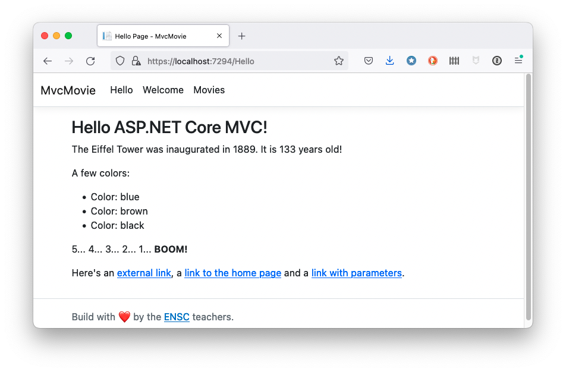

---

### Envoi de données aux vues : ViewData

Approche _faiblement typée_ : on rassemble les paramètres de la vue dans un dictionnaire nommé [ViewData](https://learn.microsoft.com/en-us/aspnet/core/mvc/views/overview?view=aspnetcore-6.0#weakly-typed-data-viewdata-viewdata-attribute-and-viewbag).

```csharp
using Microsoft.AspNetCore.Mvc;

namespace MvcMovie.Controllers;

public class HelloController : Controller
{
    // ...
    // GET: /Hello/Welcome/ 
    public IActionResult Welcome(string name, int numTimes = 0)
    {
        ViewData["Message"] = "Hello " + name;
        ViewData["NumTimes"] = numTimes;
        return View();
    }
}
```

---

### Exemple d'utilisation de ViewData

Dans le fichier `Views/Hello/Welcome.cshtml`.

```csharp
@{
    ViewData["Title"] = "Welcome";
    int numTimes = (int)ViewData["NumTimes"]!;
}

<h2>Welcome!</h2>
<ul>
    @for (int i = 0; i < numTimes; i++)
    {
        <li>@ViewData["Message"]</li>
    }
</ul>
```

---

### Résultat obtenu

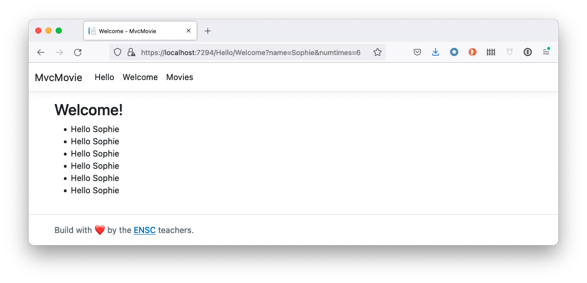

---

### Envoi de données aux vues : @model

- Approche _fortement typée_ : dans une vue, la directive [@model](https://learn.microsoft.com/en-us/aspnet/core/mvc/views/razor?view=aspnetcore-6.0#model) définit le type du modèle (= la source de données) passé à la vue.
- Dans cette vue :
  - l'instance associée est accessible via la propriété (typée) `Model` ;
  - `@Html.DisplayNameFor` renvoie le nom d'une propriété du modèle ([explication](https://stackoverflow.com/questions/61925486/html-displaynamefor-list-vs-ienumerable-in-razor)).
  - `@Html.DisplayFor` renvoie la valeur d'une propriété du modèle.

---

### Exemple : liste des films (contrôleur)

Fichier `Controllers/MovieController.cs`.

```csharp
using Microsoft.AspNetCore.Mvc;
using Microsoft.EntityFrameworkCore;
using MvcMovie.Data;

namespace MvcMovie.Controllers;

public class MovieController : Controller
{
    private readonly MvcMovieContext _context;

    public MovieController(MvcMovieContext context)
    {
        _context = context;
    }

    // GET: Movie
    public async Task<IActionResult> Index()
    {
        var movies = await _context.Movies.OrderBy(m => m.Title).ToListAsync();
        return View(movies);
    }
}
```

---

### Exemple : liste des films (vue)

Fichier `Views/Movie/Index.cshtml`.

```html
@model IEnumerable<MvcMovie.Models.Movie>

@{
    ViewData["Title"] = "Movies";
}

<h2>Movies</h2>
<p>
    <a asp-action="Create">Create New</a>
</p>
<table class="table">
    <thead>
        <tr>
            <th>
                @Html.DisplayNameFor(model => model.Title)
            </th>
            <th>
                @Html.DisplayNameFor(model => model.ReleaseDate)
            </th>
            <th>
                @Html.DisplayNameFor(model => model.Genre)
            </th>
            <th></th>
        </tr>
    </thead>
    <tbody>
        @foreach (var item in Model)
        {
            <tr>
                <td>
                    @Html.DisplayFor(modelItem => item.Title)
                </td>
                <td>
                    @Html.DisplayFor(modelItem => item.ReleaseDate)
                </td>
                <td>
                    @Html.DisplayFor(modelItem => item.Genre)
                </td>
                <td>
                    <a asp-action="Edit" asp-route-id="@item.Id">Edit</a> |
                    <a asp-action="Details" asp-route-id="@item.Id">Details</a> |
                    <a asp-action="Delete" asp-route-id="@item.Id">Delete</a>
                </td>
            </tr>
        }
    </tbody>
</table>
```

---

### Exemple : liste des films (résultat)

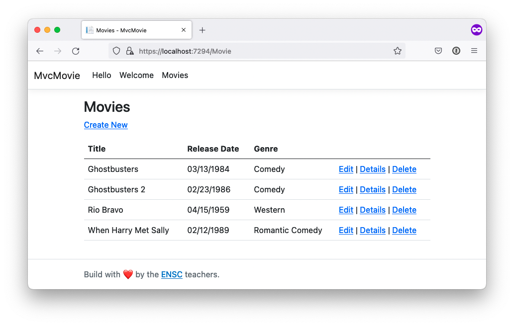

---

### Envoi de données aux vues : ViewModel

- Approche _fortement typée_ : on définit une classe spécifique pour porter les données de la vue.
- Utile quand les données nécessaires à la vue sont issues de différentes classes métier.
- Principe du patron [MVVM](https://learn.microsoft.com/en-us/dotnet/architecture/maui/mvvm) (_Model-View-ViewModel_).
- [Plus de détails](https://learn.microsoft.com/en-us/aspnet/core/mvc/views/overview?view=aspnetcore-6.0#strongly-typed-data-viewmodel).

---

### Exemple : détails sur un film (contrôleur)

Méthode d'action associée à la route `/Movie/Details/{Id}`.

```csharp
using Microsoft.AspNetCore.Mvc;
using Microsoft.EntityFrameworkCore;
using MvcMovie.Data;

namespace MvcMovie.Controllers;

public class MovieController : Controller
{
    // ...
    // GET: Movies/Details/5
    public async Task<IActionResult> Details(int? id)
    {
        if (id == null)
        {
            return NotFound();
        }

        var movie = await _context.Movies
            .FirstOrDefaultAsync(m => m.Id == id);
        if (movie == null)
        {
            return NotFound();
        }
        return View(movie);
    }
}
```

---

### Exemple : détails sur un film (vue)

Fichier `Views/Movie/Details.cshtml`.

```html
@model MvcMovie.Models.Movie

@{
    ViewData["Title"] = "Details";
}

<h2>@Html.DisplayFor(model => model.Title)</h2>
<div>
    <hr />
    <dl class="row">
        <dt class="col-sm-3">
            @Html.DisplayNameFor(model => model.ReleaseDate)
        </dt>
        <dd class="col-sm-9">
            @Html.DisplayFor(model => model.ReleaseDate)
        </dd>
        <dt class="col-sm-3">
            @Html.DisplayNameFor(model => model.Genre)
        </dt>
        <dd class="col-sm-9">
            @Html.DisplayFor(model => model.Genre)
        </dd>
    </dl>
</div>
<div>
    <a asp-action="Edit" asp-route-id="@Model.Id">Edit</a> |
    <a asp-action="Index">Back to List</a>
</div>
```

---

### Exemple : détails sur un film (résultat)

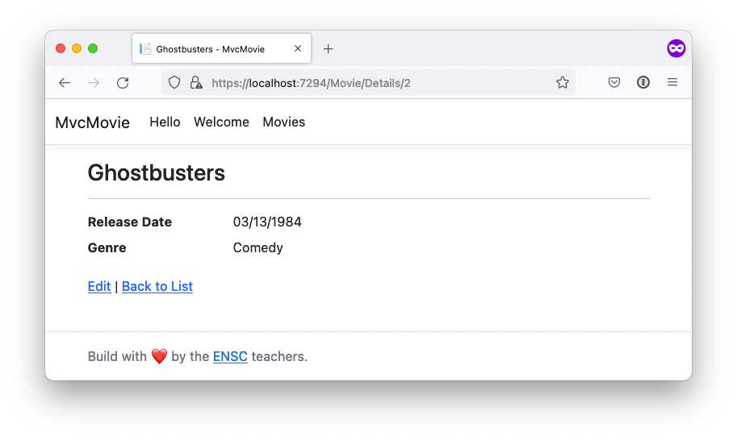

---

### Envoi de données depuis une vue

- S'effectue via un **formulaire** dont la soumission déclenche l'envoi au serveur d'une requête HTTP POST.
- Les champs du formulaire sont implicitement associés aux paramètres de l'action du contrôleur qui reçoit la requête POST.
- Les [annotations du modèle](https://learn.microsoft.com/en-us/aspnet/core/mvc/models/validation?view=aspnetcore-6.0#built-in-attributes) définissent des [règles de validation](https://learn.microsoft.com/en-us/aspnet/core/tutorials/first-mvc-app/validation?view=aspnetcore-6.0) automatiquement vérifiées côté client et utilisables côté serveur.

---

### Exemple : classe métier annotée

Fichier `Models/Movie.cs`.

```csharp
using System.ComponentModel.DataAnnotations;

namespace MvcMovie.Models;

public class Movie
{
    public int Id { get; set; }

    [StringLength(100, MinimumLength = 3)]
    public string Title { get; set; } = null!;

    [Display(Name = "Release Date"), DataType(DataType.Date)]
    public DateTime ReleaseDate { get; set; }

    [StringLength(30)]
    public string Genre { get; set; } = null!;
}
```

---

### Exemple : formulaire d'ajout d'un film (contrôleur)

Méthode d'action associée à une requête HTTP GET vers la route `/Movie/Create`.

```csharp
using Microsoft.AspNetCore.Mvc;
using Microsoft.EntityFrameworkCore;
using MvcMovie.Data;

namespace MvcMovie.Controllers;

public class MovieController : Controller
{
    // ...
    // GET: Movie/Create
    public IActionResult Create()
    {
        return View();
    }
}
```

---

### Exemple : formulaire d'ajout d'un film (vue)

Fichier `Views/Movie/Create.cshtml`.

```html
@model MvcMovie.Models.Movie

@{
    ViewData["Title"] = "Create";
}

<h2>Create a Movie</h2>
<hr />
<div class="row">
    <div class="col-md-4">
        <form asp-action="Create">
            <div asp-validation-summary="ModelOnly" class="text-danger"></div>
            <div class="form-group">
                <label asp-for="Title" class="control-label"></label>
                <input asp-for="Title" class="form-control" />
                <span asp-validation-for="Title" class="text-danger"></span>
            </div>
            <div class="form-group">
                <label asp-for="ReleaseDate" class="control-label"></label>
                <input asp-for="ReleaseDate" class="form-control" />
                <span asp-validation-for="ReleaseDate" class="text-danger"></span>
            </div>
            <div class="form-group">
                <label asp-for="Genre" class="control-label"></label>
                <input asp-for="Genre" class="form-control" />
                <span asp-validation-for="Genre" class="text-danger"></span>
            </div>
            <div class="form-group">
                <input type="submit" value="Create" class="btn btn-primary" />
            </div>
        </form>
    </div>
</div>

<div>
    <a asp-action="Index">Back to List</a>
</div>

@section Scripts {
@{await Html.RenderPartialAsync("_ValidationScriptsPartial");}
}
```

---

### Exemple : formulaire d'ajout d'un film (résultat)

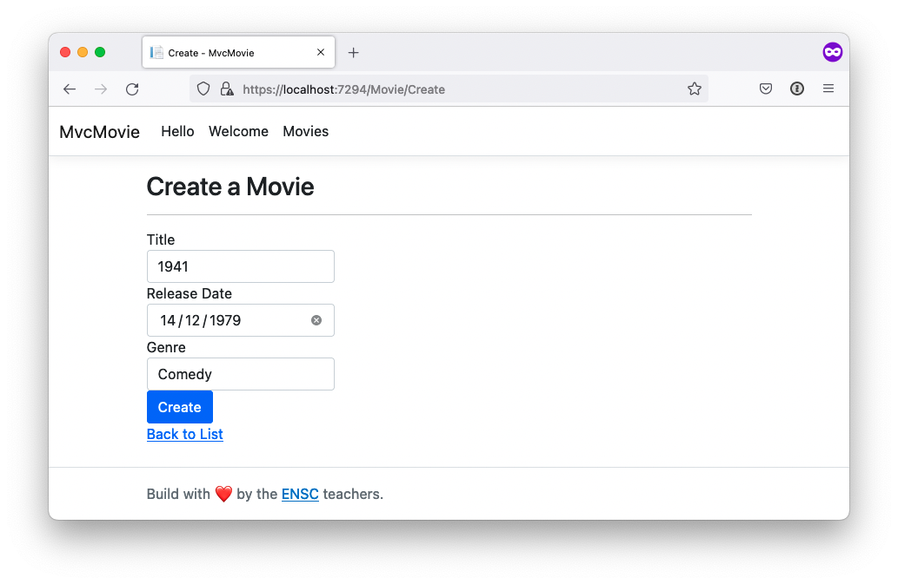

---

### Exemple : ajout d'un film (contrôleur)

Méthode d'action associée à une requête HTTP POST vers la route `/Movie/Create`.

```csharp
using Microsoft.AspNetCore.Mvc;
using Microsoft.EntityFrameworkCore;
using MvcMovie.Data;
using MvcMovie.Models;

namespace MvcMovie.Controllers;

public class MovieController : Controller
{
    // ...
    // POST: Movie/Create
    // To protect from overposting attacks, enable the specific properties you want to bind to.
    // For more details, see http://go.microsoft.com/fwlink/?LinkId=317598.
    [HttpPost]
    [ValidateAntiForgeryToken]
    public async Task<IActionResult> Create([Bind("Id,Title,ReleaseDate,Genre")] Movie movie)
    {
        // Apply model validation rules
        if (ModelState.IsValid)
        {
            _context.Add(movie);
            await _context.SaveChangesAsync();
            return RedirectToAction(nameof(Index));
        }
        // At this point, something failed: redisplay form
        return View(movie);
    }
}
```

---

### Exemple : ajout d'un film (résultat)

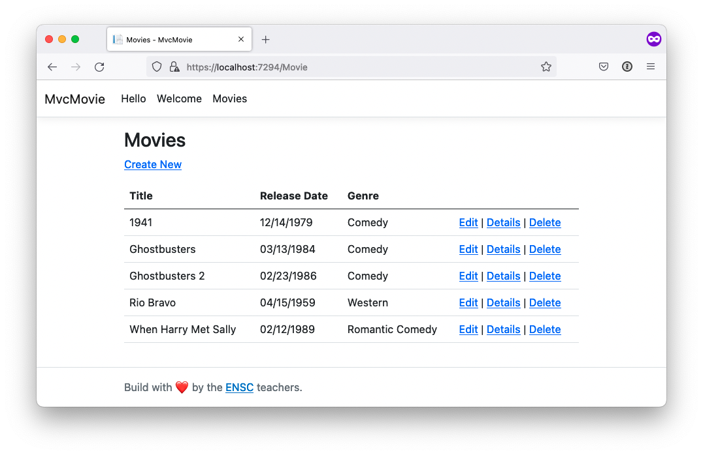

---

### Exemple : formulaire de mise à jour d'un film (contrôleur)

Méthode d'action associée à une requête HTTP GET vers la route `/Movie/Edit/{Id}`.

```csharp
using Microsoft.AspNetCore.Mvc;
using Microsoft.EntityFrameworkCore;
using MvcMovie.Data;
using MvcMovie.Models;

namespace MvcMovie.Controllers;

public class MovieController : Controller
{
    // ...
    // GET: Movies/Edit/5
    public async Task<IActionResult> Edit(int? id)
    {
        if (id == null)
        {
            return NotFound();
        }

        var movie = await _context.Movies.FindAsync(id);
        if (movie == null)
        {
            return NotFound();
        }
        return View(movie);
    }
}
```

---

### Exemple : formulaire de mise à jour d'un film (vue)

Fichier `Views/Movie/Edit.cshtml`.

```html
@model MvcMovie.Models.Movie

@{
    ViewData["Title"] = "Edit";
}

<h2>Edit a Movie</h2>
<hr />
<div class="row">
    <div class="col-md-4">
        <form asp-action="Edit">
            <div asp-validation-summary="ModelOnly" class="text-danger"></div>
            <input type="hidden" asp-for="Id" />
            <div class="form-group">
                <label asp-for="Title" class="control-label"></label>
                <input asp-for="Title" class="form-control" />
                <span asp-validation-for="Title" class="text-danger"></span>
            </div>
            <div class="form-group">
                <label asp-for="ReleaseDate" class="control-label"></label>
                <input asp-for="ReleaseDate" class="form-control" />
                <span asp-validation-for="ReleaseDate" class="text-danger"></span>
            </div>
            <div class="form-group">
                <label asp-for="Genre" class="control-label"></label>
                <input asp-for="Genre" class="form-control" />
                <span asp-validation-for="Genre" class="text-danger"></span>
            </div>
            <div class="form-group">
                <input type="submit" value="Save" class="btn btn-primary" />
            </div>
        </form>
    </div>
</div>

<div>
    <a asp-action="Index">Back to List</a>
</div>

@section Scripts {
@{await Html.RenderPartialAsync("_ValidationScriptsPartial");}
}
```

---

### Exemple : formulaire de mise à jour d'un film (résultat)

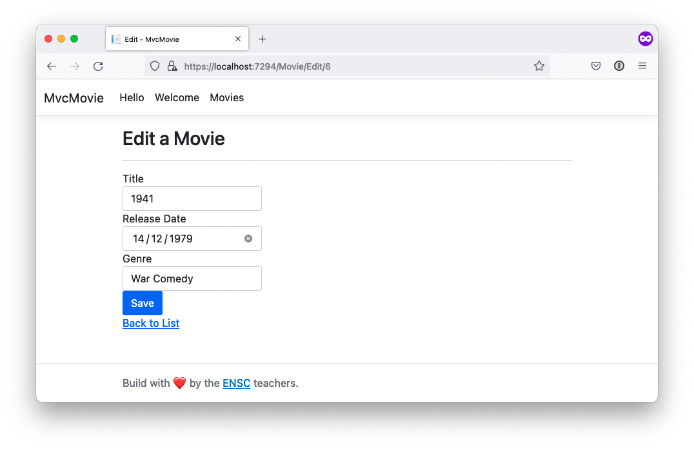

---

### Exemple : mise à jour d'un film (contrôleur)

Méthode d'action associée à une requête HTTP POST vers la route `/Movie/Edit`.

```csharp
using Microsoft.AspNetCore.Mvc;
using Microsoft.EntityFrameworkCore;
using MvcMovie.Data;
using MvcMovie.Models;

namespace MvcMovie.Controllers;

public class MovieController : Controller
{
    // ...
    // POST: Movies/Edit/5
    // To protect from overposting attacks, enable the specific properties you want to bind to.
    // For more details, see http://go.microsoft.com/fwlink/?LinkId=317598.
    [HttpPost]
    [ValidateAntiForgeryToken]
    public async Task<IActionResult> Edit(int id, [Bind("Id,Title,ReleaseDate,Genre")] Movie movie)
    {
        if (id != movie.Id)
        {
            return NotFound();
        }

        if (ModelState.IsValid)
        {
            try
            {
                _context.Update(movie);
                await _context.SaveChangesAsync();
            }
            catch (DbUpdateConcurrencyException)
            {
                if (!MovieExists(movie.Id))
                {
                    return NotFound();
                }
                else
                {
                    throw;
                }
            }
            return RedirectToAction(nameof(Index));
        }
        return View(movie);
    }

    private bool MovieExists(int id)
    {
        return _context.Movies.Any(e => e.Id == id);
    }
}
```

---

### Exemple : mise à jour d'un film (résultat)


---

### Exemple : avertissement avant suppression d'un film (contrôleur)

Méthode d'action associée à la route `Movie/Delete/{Id}`.

```csharp
using Microsoft.AspNetCore.Mvc;
using Microsoft.EntityFrameworkCore;
using MvcMovie.Data;
using MvcMovie.Models;

namespace MvcMovie.Controllers;

public class MovieController : Controller
{
    // ...
    // GET: Movies/Delete/5
    public async Task<IActionResult> Delete(int? id)
    {
        if (id == null)
        {
            return NotFound();
        }

        var movie = await _context.Movies
            .FirstOrDefaultAsync(m => m.Id == id);
        if (movie == null)
        {
            return NotFound();
        }

        return View(movie);
    }
}
```

---

### Exemple : avertissement avant suppression d'un film (vue)

```html
@model MvcMovie.Models.Movie

@{
    ViewData["Title"] = "Delete";
}

<h2>Delete a Movie</h2>

<h4>Are you sure?</h4>
<div>
    <hr />
    <dl class="row">
        <dt class="col-sm-3">
            @Html.DisplayNameFor(model => model.Title)
        </dt>
        <dd class="col-sm-9">
            @Html.DisplayFor(model => model.Title)
        </dd>
        <dt class="col-sm-3">
            @Html.DisplayNameFor(model => model.ReleaseDate)
        </dt>
        <dd class="col-sm-9">
            @Html.DisplayFor(model => model.ReleaseDate)
        </dd>
        <dt class="col-sm-3">
            @Html.DisplayNameFor(model => model.Genre)
        </dt>
        <dd class="col-sm-9">
            @Html.DisplayFor(model => model.Genre)
        </dd>
        </dd>
    </dl>

    <form asp-action="Delete">
        <input type="hidden" asp-for="Id" />
        <input type="submit" value="Delete" class="btn btn-danger" /> |
        <a asp-action="Index">Back to List</a>
    </form>
</div>
```

---

### Exemple : avertissement avant suppression d'un film (résultat)

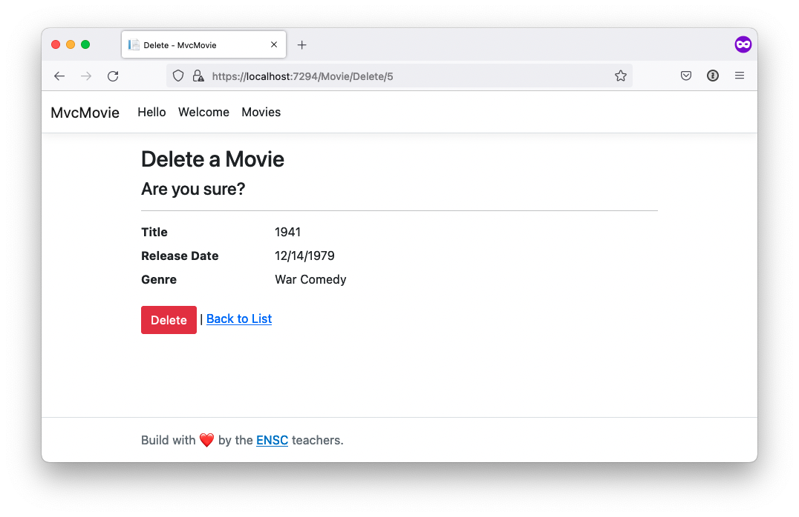

---

### Exemple : suppression d'un film (contrôleur)

Méthode d'action associée à une requête HTTP POST vers la route `Movie/Delete`.

```csharp
using Microsoft.AspNetCore.Mvc;
using Microsoft.EntityFrameworkCore;
using MvcMovie.Data;
using MvcMovie.Models;

namespace MvcMovie.Controllers;

public class MovieController : Controller
{
    // ...
    // POST: Movies/Delete/5
    [HttpPost, ActionName("Delete")]
    [ValidateAntiForgeryToken]
    public async Task<IActionResult> DeleteConfirmed(int id)
    {
        var movie = await _context.Movies.FindAsync(id);
        _context.Movies.Remove(movie!);
        await _context.SaveChangesAsync();
        return RedirectToAction(nameof(Index));
    }
}
```

---

### Exemple : suppression d'un film (résultat)

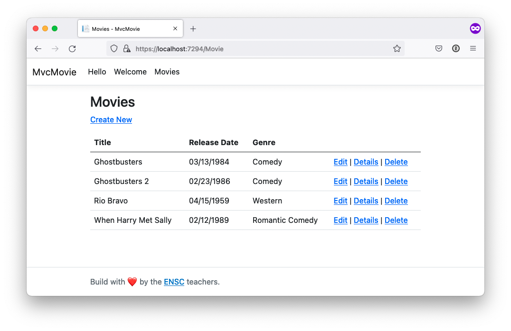

---

## To be continued


