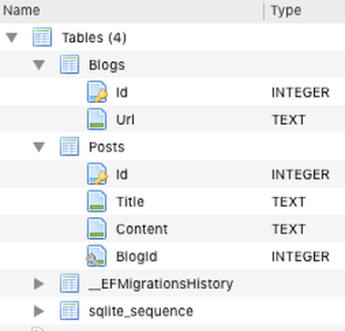

## Sommaire

- Introduction à .NET
- Présentation de ASP.NET Core
- Le framework ASP.NET Core MVC
- Mécanismes fondamentaux
- Création d'API web
- Interactions avec une base de données
- Tests

---

## Introduction à .NET

---

### Aux origines de .NET

- Plate-forme de développement d'applications créée par Microsoft en 2002.
- Réponse à la domination du langage Java (multi-plateformes).
- Inclut plusieurs langages de programmation : C#, VB.NET, F#, PowerShell...
- Uniquement disponible sous Windows.
- Licence propriétaire.

---

[](https://en.wikipedia.org/wiki/.NET_Framework)

---

{}

### Architecture technique de .NET

- Une application .NET s'exécute dans un environnement contrôlé appelé **CLR** (_Common Language Runtime_).
- La compilation du code source produit un résultat indépendant du système d'exploitation, conformément à un standard nommé **CLI** (_Common Language Infrastructure_).

---

[](https://en.wikipedia.org/wiki/Common_Language_Infrastructure)

{}

---

### .NET Framework et .NET Core

- [2004](https://www.mono-project.com/docs/about-mono/history/) : le projet **Mono**, indépendant de Microsoft, débute le portage de .NET vers Linux.
- [2014](https://devblogs.microsoft.com/dotnet/net-core-is-open-source/) : Microsoft publie **.NET Core**, la première version open source et multi-plateformes de .NET. La version WIndows-only de .NET est renommée **.NET Framework**.
- [2019](https://devblogs.microsoft.com/dotnet/net-core-is-the-future-of-net/) : la nouvelle version de .NET Core est renommée **.NET**, et .NET Framework passe en mode maintenance.

---

[](https://devblogs.microsoft.com/dotnet/introducing-net-5/)

---

### La ligne de commande .NET

- **.NET CLI** (_Command Line Interface_) permet d'interagir avec .NET depuis un terminal.
- Nécessite que .NET soit installé sur la machine.
- Syntaxe : `dotnet <commande> <options>`

---

### Création d'une application

`> dotnet new <template> -o <output directory>`

| Type d'application      | Template   |
| ----------------------- | ---------- |
| Console                 | `console`  |
| Bibliothèque de classes | `classlib` |
| ASP.NET (vide)          | `web`      |
| ASP.NET (API)           | `webapi`   |
| ASP.NET (MVC)           | `mvc`      |

---

### Création d'un fichier .gitignore

`> dotnet new gitignore`

- Le fichier `.gitignore` permet d'exclure certains fichiers/dossiers de la gestion des versions avec [Git](https://git-scm.com/). Il le plus souvent s'agit de fichiers locaux (exemple : configuration de l'environnement de développement) ou de fichiers recréés systématiquement par le processus de génération de l'application.
- Cette commande crée un fichier `.gitignore` adapté aux projets .NET.

---

### Gestion des packages

`> dotnet add package <name>`

- Utilise [NuGet](https://www.nuget.org/) pour télécharger un package et l'ajouter au projet.
- Vérifie la compatibilité du package à installer avec le projet.

`> dotnet list package`

- Liste les packages installés pour un projet.

---

### Lancement d'une application

`> dotnet run`

Si nécessaire, effectue la restauration des dépendances du projet (équivalent de `dotnet restore`).

---

### Surveillance des changements

`> dotnet watch run`

Pour une application web, jnjecte un script qui met à jour le contenu affiché par le navigateur lorsque des fichiers surveillés sont modifiés.

---

### Autres possibilités

- Nettoyage, test, publication, gestion des packages installés, etc.
- [Plus d'informations](https://docs.microsoft.com/en-us/dotnet/core/tools/).

---

## Présentation d'ASP.NET Core

---

### Histoire d'ASP.NET Core

- A l'origine, .NET (Framework) incluait une technologie de création de pages web dynamiques nommée **ASP.NET** (_Active Server Pages_).
- **ASP.NET Core** est une réécriture d'ASP.NET basée sur .NET (Core).
- Standard actuel pour le développement web sous .NET.

---

### Points-clés d'ASP.NET Core

- Permet de créer des applications web et des services web (API) utilisés comme _backends_ par des clients riches ou des applications mobiles.
- Léger, moderne et modulaire.
- Inclut des technologies facilitant la gestion des pages dynamiques, des appels temps réel, des tests, etc.
- Déployable sur plusieurs serveurs web : Kestrel, Apache, nginx, etc.
- Multi-plateformes et [open source](https://github.com/dotnet/aspnetcore).

---

### UI générée côté serveur

Code HTML et CSS généré côté serveur, puis renvoyée au client.

- Peu d'exigences techniques côté client (navigateur simple, trafic réseau limité).
- Accès BD et contrôles centralisés.
- Exemples d'usages : sites dynamiques, blogs, CMS.

---

### UI générée côté client

Structure HTML (DOM) mise à jour dynamiquement côté client grâce à des appels asynchrones au serveur.

- Interactions riches avec l'utilisateur.
- Capacités matérielles et logicielles du client utilisables.
- Exemples d'usages : tableau de bord interactif, applications collaboratives.

---

### L'offre technique ASP.NET Core

- UI générée côté serveur : **Razor Pages**, **MVC**.
- UI générée côté client : **Blazor**, **SPA** avec Angular ou React.
- Une approche hybride est possible (exemple : MVC + Blazor).

---

## Le framework ASP.NET Core MVC

---

{}

### Rappel : le fonctionnement du web

Le web est basé sur un modèle **client/serveur** :

- Le client (navigateur, application mobile, robot d'indexation, etc) envoie une demande (**requête**) au serveur.
- Le serveur prépare sa **réponse** à la requête du client, puis la lui renvoie.

---


{}

---

### Le protocole HTTP

- _HyperText Transfer Protocol_.
- Socle technique du web.
- Equivalent sécurisé : **HTTPS**.
- Basé sur des **commandes** textuelles exprimant les différentes actions possibles : _GET_, _PUT_, _POST_, etc).

---

### L'architecture MVC

- _Model-View-Controller_ (_Modèle-Vue-Contrôleur_).
- Décomposition d’une application en trois grandes parties :
  - **Modèle** : accès aux données et logique métier (_business logic_).
  - **Vue** : affichage et interactions avec l’utilisateur.
  - **Contrôleur** : dynamique de l’application, lien entre Modèle et Vue.
- Application du principe de séparation des responsabilités.

---

### MVC : un peu d'histoire

- Apparu à la fin des années 1970 pour le langage OO **Smalltalk**. Objectif : séparer le code de l’IHM de la logique applicative.
- Appliqué depuis dans de très nombreux contextes et langages :
  - web côté serveur : frameworks Symfony (PHP), Django (Python), Rails (Ruby), etc.
  - web côté client : frameworks Angular, Ember (JavaScript), etc.
  - desktop : bibliothèque Swing (Java), etc.

---

[](https://symfony.com/doc/current/index.html)

---

### Avantages et inconvénients

- Avantages :

  - Clarification de l’architecture.
  - Séparation nette des responsabilités => couplage faible, cohésion forte, maintenance et évolutions facilitées.

- Inconvénients :
  - Complexification de l’architecture.
  - Rigidité.

---

### ASP.NET Core MVC

- Framework de création d'applications web basées sur l'architecture MVC.
- Implémente de nombreux services et bonnes pratiques, parmi lesquels :
  - Routage des requêtes entrantes.
  - Gestion des pages dynamiques.
  - Authentification.
  - Injection de dépendance.
  - Tests.
  - ...

---

### Structure d'une application ASP.NET Core MVC


---

### Les contrôleurs

- Créés dans le répertoire `Controllers/`.
- Héritent de la classe abstraite `Controller`.
- Définissent les points d'entrée dans l'application sous la forme de méthodes d'action annotables.

```csharp
public class MoviesController : Controller
{
    // GET: Movies/Details/5
    public async Task<IActionResult> Details(int? id)
    {
        //...
    }

    // POST: Movies/Delete/5
    [HttpPost, ActionName("Delete")]
    [ValidateAntiForgeryToken]
    public async Task<IActionResult> DeleteConfirmed(int id)
    {
        // ...
    }
```

---

### Les modèles

- Créés dans le répertoire `Models/`.
- Implémentent la logique métier de l'application sous la forme de classes **POCO** (_Plain Old CLR Objects_) souvent associées à des tables BD.

```csharp
public class Movie
{
    public int Id { get; set; }

    [StringLength(60, MinimumLength = 3)]
    public string Title { get; set; }

    [Display(Name = "Release Date"), DataType(DataType.Date)]
    public DateTime ReleaseDate { get; set; }
    // ...
```

---

### Les vues

- Créés dans le répertoire `Views/[Controller]` sous la forme de fichiers Razor (`.cshtml`).
- Représentent l'interface utilisateur (UI) de l'application.

```csharp
@{
    ViewData["Title"] = "About";
}
<h2>@ViewData["Title"].</h2>
<h3>@ViewData["Message"]</h3>

<p>Use this area to provide additional information.</p>
```

---

### Code et librairies client

- Regroupés dans le répertoire `wwwroot/`.
- Rassemblent les fichiers CSS et JavaScript utilisés côté client.
- Incluent par défaut Bootstrap et jQuery.

---

### Le fichier appsettings.json

Centralise les paramètres de configuration de l'application.

```json
{
  "Logging": {
    "LogLevel": {
      "Default": "Information",
      "Microsoft": "Warning",
      "Microsoft.Hosting.Lifetime": "Information",
      "Microsoft.EntityFrameworkCore.Database.Command": "Information"
    }
  },
  "AllowedHosts": "*",
  "ConnectionStrings": {
    "MvcMovieContext": "Data Source=MvcMovieContext-8719dcdb-c317-48bf-9cd8-a4c4167ce370.db"
  }
}
```

---

{}

### Le fichier Startup.cs

Contient la classe `Startup` qui permet :

- la configuration des services utilisés par l'application ;
- la définition du _pipeline_ de gestion des requêtes HTTP entrantes.

---

### Exemple de classe Startup

```csharp
public class Startup
{
    // Use this method to add services to the container.
    public void ConfigureServices(IServiceCollection services)
    {
        services.AddControllersWithViews();
    }
    // Use this method to configure the HTTP request pipeline.
    public void Configure(IApplicationBuilder app, IWebHostEnvironment env)
    {
        app.UseHttpsRedirection();
        app.UseStaticFiles();
        app.UseRouting();
        app.UseAuthorization();
        app.UseEndpoints(endpoints =>
        {
            endpoints.MapDefaultControllerRoute();
        });
    }
}
```

{}

---

## Mécanismes fondamentaux

---

{}

### Routage des requêtes

- Associe les requêtes HTTP entrantes au code à éxécuter (méthodes des contrôleurs).
- Permet à l'application web d'utiliser des URL propres et _SEO-friendly_, plutôt que des noms de fichiers.
- [Plus d'informations](https://docs.microsoft.com/en-us/aspnet/core/mvc/controllers/routing?view=aspnetcore-5.0).

---

### Routage par convention

- Permet de définir globalement la correspondance entre le format de l'URL et la méthode d'action d'un contrôleur à exécuter.
- Format par défaut : `/[Controller]/[ActionName]/[Parameters]`.
- Exemple : `https://myapp/Student/Details/Code=137` appelle la méthode `Details` du contrôleur `StudentController`, en lui passant un paramètre nommé `Code` ayant la valeur 137.

---

### Configuration du routage par convention dans Startup

```csharp
public void Configure(IApplicationBuilder app, IWebHostEnvironment env)
{
    // ...
    app.UseEndpoints(endpoints =>
    {
        endpoints.MapControllerRoute(
            name: "default",
            pattern: "{controller=Home}/{action=Index}/{id?}");
    });
}
```

`Home`, `Index` et `id` sont resp. les noms par défaut du contrôleur, de l'action et du paramètre (optionnel).

{}

---

### Scaffolding

`> dotnet-aspnet-codegenerator [arguments]`

- Permet de générer le code source pour les opérations élémentaires **CRUD** (_Create, Read, Update, Delete_) liées à une classe du Modèle.
- [Plus d'informations](https://docs.microsoft.com/en-us/aspnet/core/fundamentals/tools/dotnet-aspnet-codegenerator?view=aspnetcore-5.0).
- [Exemple de résultat](https://github.com/ensc-glog/MvcMovie/commit/f5c4ec45033f5509ec736bc1bebf010f200921f0).

---

### Database context

- Hérite de la classe abstraite `DbContext`.
- Spécifie les classes du modèle à sauvegarder dans la base de données.

```csharp
public class MvcMovieContext : DbContext
{
    public MvcMovieContext(DbContextOptions<MvcMovieContext> options)
        : base(options)
    {}
    public DbSet<MvcMovie.Models.Movie> Movie { get; set; }
}
```

```csharp
public void ConfigureServices(IServiceCollection services)
{
    // ...
    services.AddDbContext<MvcMovieContext>(options =>
            options.UseSqlite(Configuration.GetConnectionString("MvcMovieContext")));
}
```

---

### Migrations

`> dotnet ef migrations add InitialCreate`

`> dotnet ef database update`

- Permettent à la base de données d'être synchronisée avec les évolutions du Modèle, sans perte de données.
- Migration = évolution incrémentale depuis la migration précédente.

---

{}

### Envoi de données aux vues : ViewData

Approche _faiblement typée_ : on utilie un dictionnaire standard.

```csharp
public IActionResult Welcome(string name, int numTimes = 1)
{
    ViewData["Message"] = "Hello " + name;
    ViewData["NumTimes"] = numTimes;
    return View();
}
```

---

### Utilisation dans la vue

```csharp
@{
    ViewData["Title"] = "Welcome";
}
<h2>Welcome</h2>
<ul>
    @for (int i = 0; i < (int)ViewData["NumTimes"]; i++)
    {
        <li>@ViewData["Message"]</li>
    }
</ul>
```

{}

---

{}

### Envoi de données aux vues : ViewModel

Approche _fortement typée_ : on définit une classe pour porter les données de la vue.

```csharp
public class Address
{
    public string Name { get; set; }
    public string Street { get; set; }
    public string City { get; set; }
    public string State { get; set; }
    public string PostalCode { get; set; }
}
```

---

### Utilisation dans le contrôleur

```csharp
public IActionResult Contact()
{
    var viewModel = new Address()
    {
        Name = "Microsoft",
        Street = "One Microsoft Way",
        City = "Redmond",
        State = "WA",
        PostalCode = "98052-6399"
    };
    return View(viewModel);
}
```

---

### Utilisation dans la vue

```html
@model WebApplication1.ViewModels.Address

<h2>Contact</h2>
<address>
  @Model.Street<br />
  @Model.City, @Model.State @Model.PostalCode<br />
  <abbr title="Phone">P:</abbr> 425.555.0100
</address>
```

{}

---

{}

### View layout

- Par défaut, toutes les vues partagent une structure commune définie dans le fichier `Views/Shared/_Layout.cshtml`.
- Dans ce layout, la fonction `@RenderBody()` permet de générer le contenu spécifique de la vue à afficher.
- Les éléments spécifiques à une vue (exemples : inclusions CSS ou JavaScript) peuvent être rassemblés dans des **sections** affichées par le layout.

---

### Exemple de layout

```html
<!DOCTYPE html>
<html lang="en">
  <head>
    <meta charset="utf-8" />
    <title>@ViewData["Title"] - Movie App</title>
    <!-- ... -->
  </head>
  <body>
    <header><!-- ... --></header>
    <div class="container">
      <main role="main" class="pb-3">@RenderBody()</main>
    </div>
    <footer><!-- ... --></footer>
    <script src="~/lib/jquery/dist/jquery.min.js"></script>
    <!-- ... -->
    @await RenderSectionAsync("Scripts", required: false)
  </body>
</html>
```

{}

---

{}

### Validation des données

L'annotation des classes du Modèle permet de définir des **règles de validation** qui seront automatiquement vérifiées à la fois côté serveur et côté client.

```csharp
using System.ComponentModel.DataAnnotations;
public class LoginViewModel
{
    [Required]
    [EmailAddress]
    public string Email { get; set; }

    [Required]
    [DataType(DataType.Password)]
    public string Password { get; set; }

    [Display(Name = "Remember me?")]
    public bool RememberMe { get; set; }
}
```

---

### Validation dans le contrôleur

```csharp
public async Task<IActionResult> Login(LoginViewModel model, string returnUrl = null)
{
    // Check model validation rules
    if (ModelState.IsValid)
    {
      // ... (nominal case: work with the model)
    }
    // At this point, something failed: redisplay form
    return View(model);
}
```

{}

---

{}

### Environnements

- Permettent d'adapter la configuration de l'application au contexte (développement, test ou production).
- Définis par la variable d'environnement `ASPNETCORE_ENVIRONMENT`. En l'absence de cette variable, l'environnement est de type Production.
- [Plus d'informations](https://docs.microsoft.com/en-us/aspnet/core/fundamentals/environments?view=aspnetcore-5.0).

---

### Définition de l'environnement avec Visual Studio Code

Fichier `./vscode/launch.json`

```json
{
  "version": "0.2.0",
  "configurations": [
    {
      "name": ".NET Core Launch (web)",
      # ...
      "env": {
        "ASPNETCORE_ENVIRONMENT": "Development"
      },
      # ...
    }
  ]
}

```

---

### Configuration de l'application selon l'environnement détecté

```csharp
public void Configure(IApplicationBuilder app, IWebHostEnvironment env)
{
    if (env.IsDevelopment())
    {
        app.UseDeveloperExceptionPage();
    }
    if (env.IsProduction() || env.IsStaging())
    {
        app.UseExceptionHandler("/Error");
    }
    // ...
```

{}

---

## Création d'API web

---

### La notion d'API

Une **API** (_Application Programming Interface_) est un point d'entrée programmatique dans un système.

Elle fournit un moyen d'interagir avec ce système.

Les API permettent aux développeurs d'intégrer des services externes dans leurs applications.

---

### Spécificités des API web

Une **API web** (appelée parfois service web) est une API accessible via les technologies du web : HTTP ou HTTPS.

Les API web utilisent le plus souvent le format de donnée **JSON**.

Certaines sont librement utilisables, d'autres nécessitent une authentification du client.

---

### Exemples d'API web

- [PokéAPI](https://pokeapi.co/)
- [Star Wars API](https://swapi.dev/)
- [Wikipedia](https://en.wikipedia.org/w/api.php?)
- [Spotify](https://developer.spotify.com/documentation/web-api/)
- [OMDb API](https://www.omdbapi.com/)

([Source](https://shkspr.mobi/blog/2016/05/easy-apis-without-authentication/))

---

### Outils pour la gestion des API web

- N'importe quel navigateur pour les tests basiques.
- Extension [RESTClient](https://addons.mozilla.org/fr/firefox/addon/restclient/) pour Firefox.
- [Postman](https://www.getpostman.com/).

---

### Les API RESTful

- **REST** (_REpresentational State Transfer_) est un ensemble de principes pour créer des API : client/serveur, pas de gestion d'état, etc.
- Une API web _RESTful_ (conforme au standard REST) expose une interface basée sur les commandes HTTP. Exemples :
  - `GET /<ResourceName>/<id>` pour accéder à une ressource.
  - `POST /<ResourceName>` (avec les informations nécessaires dans le corps de la requête) pour la créer.

---

{}

### Le format JSON

- JSON = JavaScript Object Notation.
- Format de description de données structurées inspiré de la syntaxe des objets JavaScript.
- Contenu JSON = ensemble de paires champ/valeur.
- Types de valeur possibles : nombres, chaînes, booléens, tableaux, objets.
- A supplanté XML comme format standard pour les échanges de données via des API web.

---

### Exemple de contenu JSON

```json
{
  "cars": [
    {
      "model": "Peugeot",
      "color": "blue",
      "checkups": [2015, 2017]
    },
    {
      "model": "Citroën",
      "color": "white",
      "checkups": [2003, 2005, 2007, 2009, 2011, 2013]
    }
  ]
}
```

{}

---

### Création d'une API web avec ASP.NET Core

`> dotnet-aspnet-codegenerator controller -name <ControllerName> -m <ModelName> -async -api [other arguments]`

Crée un contrôleur `<ControllerName>` qui :

- expose une API web pour la classe `<ModelName>` du Modèle ;
- renvoie des données au format JSON et non des vues HTML.

---

### Principe de fonctionnement


---

### Exemple de contrôleur d'API

```csharp
[Route("api/[controller]")]
[ApiController]
public class TodosApiController : ControllerBase
{
  // ...
}
```

- Hérite de la classe `ControllerBase` et non pas de `Controller` comme les contrôleurs "classiques".
- Associé aux routes du type `api/TodosApi/<Argument?>`.

---

### API générée

| Route                     | Description               |
| ------------------------- | ------------------------- |
| GET /api/TodosApi         | Renvoie tous les éléments |
| GET /api/TodosApi/{id}    | Renvoie un élément        |
| POST /api/TodosApi        | Ajoute un nouvel élément  |
| PUT /api/TodosApi/{id}    | Met à jour un élément     |
| DELETE /api/TodosApi/{id} | Supprime un élément       |

---

### Exemple de méthode d'API

```csharp
// GET: api/TodosApi/5
[HttpGet("{id}")]
public async Task<ActionResult<Todo>> GetTodo(int id)
{
    var todo = await _context.Todo.FindAsync(id);

    if (todo == null)
    {
        return NotFound();
    }

    return todo;
}
```

---

{}

### Programmation asynchrone

- Exemple : la préparation d'un petit déjeuner.

  1. Verser le café dans une tasse.
  1. Faire chauffer la poêle, puis faire cuire deux œufs au plat.
  1. Faire frire trois tranches de bacon.
  1. Faire toaster deux tranches de pain.
  1. Étaler le beurre et la confiture sur les toasts.
  1. Verser du jus d’orange dans un verre.

- La plupart de ces tâches peuvent être exécutées simultanément.

---

### Exécution séquentielle (synchrone)

[](https://docs.microsoft.com/en-us/dotnet/csharp/programming-guide/concepts/async/)

---

### Exécution asynchrone

[](https://docs.microsoft.com/en-us/dotnet/csharp/programming-guide/concepts/async/)

{}

---

### Appels synchrones

[](https://code-maze.com/asynchronous-programming-with-async-and-await-in-asp-net-core/)

---

### Appels asynchrones

[](https://code-maze.com/asynchronous-programming-with-async-and-await-in-asp-net-core/)

---

## Interactions avec une base de données

---

### Les données persistantes

- Ne disparaissent pas entre deux utilisations d'une application.
- Contraire : données _volatiles_.
- Indispensable pour une très grande majorité des applications (données métier, configuration, etc).
- Leur stockage nécessite :
  - un support dédié, appelé parfois mémoire de masse (disque dur/SSD, mémoire Flash, etc) ;
  - un format adapté.

---

### Les SGBDR et leurs avantages

- Standard actuel pour la gestion de données persistantes.
- Technologie connue depuis les années 1970.
- Fiabilité.
- Capacité à gérer de forts volumes de données.
- Sécurité (authentification, réplication, etc).
- Langage d’interrogation (SQL) standard.
- Offre logicielle riche : de ORACLE à SQLite en passant par PostgreSQL, MySQL/MariaDB ou SQL Server.

---

### Le modèle relationnel

- Unité de représentation : table.
- Caractéristiques : colonnes.
- Entité : tuple (ligne).
- Types de données : simples (nombres, chaîne, date, etc).
- Identifiant : explicite (clé primaire).
- Relations entre éléments : jointures SQL.
- Concepts spécifiques : déclencheurs, procédures stockées...

---

### Le modèle objet

- Unité de représentation : classe.
- Caractéristiques : propriétés et méthodes.
- Entité : objet.
- Types de données : simples ou complexes.
- Identifiant : implicite (référence mémoire).
- Relations entre éléments : navigation des associations.
- Concepts spécifiques : encapsulation, héritage, interfaces...

---

{}

### Object/Relational Mapping (O/RM)

- Lien entre une base de données et les objets manipulés par l’application.
- Deux modèles très éloignés ("[impedance mismatch](https://en.wikipedia.org/wiki/Object%E2%80%93relational_impedance_mismatch)").
- Pas de solution idéale.

---

### ["O/RM is the Vietnam of Computer Science"](https://blog.codinghorror.com/object-relational-mapping-is-the-vietnam-of-computer-science/)


{}

---

### Solutions possibles pour l'O/RM

- Approches radicales : suppression du SGBDR (utilisation d'une autre technologie de stockage) ou des objets (programmation procédurale ou fonctionnelle).
- O/RM manuel : gestion de la (dé)connexion, requêtage avec SQL puis transformation des résultats en objets, etc doivent être codées.
- O/RM automatisé : utilisation d'un outil dédié pour gérer les problématiques précédentes. Le requêtage SQL est effectué par l'outil.

---

### O/RM automatisé, un bon choix ?

- Avantages :
  - Automatisation de la gestion du _mapping_.
  - Diminution du volume de code.
  - Mise en œuvre de bonnes pratiques.
  - Performances (le plus souvent).
- Inconvénients :
  - Nécessité de maitriser un outil dédié.
  - Certaines limitations liées à l’outil.
  - Aspect "boîte noire".
  - Performances (dans certains cas).

---

### Entity Framework Core

- Outil d'O/RM [open source](https://github.com/dotnet/efcore) maintenu par Microsoft.
- Supporte de nombreux SGDBR : SQL Server, SQLite, MySQL/MariaDB, PostgreSQL, etc.
- Standard pour l'accès aux données persistantes dans l'environnement ASP.NET Core.

---

### SQLite

- SGBDR minimaliste mais suffisamment fiable, complet et performant pour la plupart des usages standards.
- Toute la base de données tient dans un seul fichier de quelques dizaines/centaines de Ko.
- ["Le SGBD le plus utilisé dans le monde"](https://sqlite.org/mostdeployed.html).

[](https://sqlite.org)

---

### Installation d'EF Core pour SQLite

`> dotnet tool install --global dotnet-ef`

`> dotnet add package Microsoft.EntityFrameworkCore.Design`

`> dotnet add package Microsoft.EntityFrameworkCore.Sqlite`

---

### Support de SQLite par EF Core

- Des [fournisseurs de données](https://docs.microsoft.com/en-us/ef/core/providers/?tabs=dotnet-core-cli) permettent l'utilisation de EF Core avec un grand nombre de sources de données, dont SQLite.
- Son fournisseur possède cependant certaines petites [limitations](https://docs.microsoft.com/en-us/ef/core/providers/sqlite/limitations).

---

### Principe de fonctionnement d'EF Core

- **Modèle** : un ensemble de classes POCO, parfois appelées _classes métier_, qui modélisent les entités manipulées par l'application.
- **Contexte BD** : une classe qui représente une session d'échange avec une base de données (_unité de travail_) et permet les opérations de lecture/écriture de données. Elle spécifie les classes du modèle à sauvegarder dans la base de données.

---

### Exemple de modèle


---

### Implémentation du modèle

```csharp
public class Blog
{
    public int Id { get; set; }
    public string Url { get; set; }
    public ICollection<Post> Posts { get; } = new List<Post>();
}

public class Post
{
    public int Id { get; set; }
    public string Title { get; set; }
    public string Content { get; set; }
    public int BlogId { get; set; }
    public Blog Blog { get; set; }
}
```

---

### Exemple de contexte BD

```csharp
public class BloggingContext : DbContext
{
    public DbSet<Blog> Blogs { get; set; }
    public DbSet<Post> Posts { get; set; }
    public string DbPath { get; private set; }

    public BloggingContext()
    {
        DbPath = "EFGetStarted.db";
    }

    protected override void OnConfiguring(DbContextOptionsBuilder options)
        => options.UseSqlite($"Data Source={DbPath}");
}
```

---

### Migrations

- Approche _**code first**_ : le modèle objet constitue la modélisation de référence. La base de données est automatiquement synchronisée avec lui.
- [Migrations](https://docs.microsoft.com/en-us/ef/core/managing-schemas/migrations/?tabs=dotnet-core-cli) : modifications incrémentales du schéma relationnel reflétant les évolutions du modèle.

---

### Commandes liées aux migrations

`> dotnet ef migrations add <MigrationName>`

Crée une nouvelle migration dans le répertoire **Migrations/** du projet. Elle contient les mises à jour à réaliser au niveau du schéma relationnel pour le synchroniser avec le modèle objet.

`> dotnet ef database update`

Synchronise la base de données configurée par le contexte BD avec la migration la plus récente.

---

### Exemple extrait d'une migration

```csharp
migrationBuilder.CreateTable(
    name: "Blogs",
    columns: table => new
    {
        Id = table.Column<int>(type: "INTEGER", nullable: false)
            .Annotation("Sqlite:Autoincrement", true),
        Url = table.Column<string>(type: "TEXT", nullable: true)
    },
    constraints: table =>
    {
        table.PrimaryKey("PK_Blogs", x => x.Id);
    });
```

---

### Résultat de la mise à jour BD



(Capture d'écran de [DB Browser pour SQLite](https://sqlitebrowser.org/)).

La colonne `BlogId` est une clé étrangère vers la colonne `Id` de la table `Blog`.

---

### Opérations CRUD

```csharp
using (var context = new BloggingContext())
{
    context.Add(new Blog { Url = "http://blogs.msdn.com/adonet" });
    context.SaveChanges();

    // Retrieve blog with lowest id
    var blog = context.Blogs
        .OrderBy(b => b.Id)
        .First();

    blog.Url = "https://devblogs.microsoft.com/dotnet";
    blog.Posts.Add(
        new Post { Title = "Hello World", Content = "I wrote an app using EF Core!" });
    context.SaveChanges();

    context.Remove(blog);
    context.SaveChanges();
}
```

---

{}

### Requêtage avec LINQ

[Language Integrated Query (LINQ)](https://docs.microsoft.com/en-us/dotnet/csharp/programming-guide/concepts/linq/) est le langage standard pour le requêtage en C#, quelle que soit la source de données (SGBDR, XML, service web, etc).

```csharp
using (var context = new BloggingContext())
{
    // Retrieve a list of blogs with a rating greater than 3,
    // ordered by URL
    var blogs = context.Blogs
        .Where(b => b.Rating > 3)
        .OrderBy(b => b.Url)
        .ToList();
}
```

---

### Exemples d'utilisation de LINQ

```csharp
using (var context = new BloggingContext())
{
    // Get all blogs
    var blogs = context.Blogs.ToList();
    // Get a specific blog
    var blog = context.Blogs
        .Single(b => b.Id == 1);
    // Get all blogs containing "dotnet" in their URL
    var blogs = context.Blogs
        .Where(b => b.Url.Contains("dotnet"))
        .ToList();
}
```

([Plus de détails](https://docs.microsoft.com/en-us/ef/core/querying/))

---

### Syntaxe alternative pour LINQ

Pour plus de souplesse, il est possible de manipuler des requêtes LINQ en tant que variables.

```csharp
using (var context = new BloggingContext())
{
    // Get all blogs containing "dotnet" in their URL
    var query = from b in context.Blogs
                select b;
    query = query.Where(b => b.Url.Contains("dotnet"));
    var blogs = query.ToList();
}
```

{}

---

### Sauvegarde des modifications

La méthode `SaveChanges()` de la classe `DbContext` implante dans la base de données tous les changements ayant eu lieu depuis l'ouverture de la session liée au contexte BD.

```csharp
using (var context = new BloggingContext())
{
    var blog = new Blog { Url = "http://sample.com" };
    context.Blogs.Add(blog);
    context.SaveChanges();
}
```

---

### Configuration du modèle

Effectuée via des [annotations](https://docs.microsoft.com/en-us/ef/core/modeling/entity-properties?tabs=data-annotations%2Cwithout-nrt) dans les classes du modèle.

```csharp
public class Blog
{
    public int Id { get; set; }

    [StringLength(200, MinimumLength = 7), Required]
    public string Url { get; set; }

    [Display(Name = "Average Rating")]
    [Column(TypeName = "decimal(5, 2)")]
    [DisplayFormat(NullDisplayText = "No rating")]
    public decimal? Rating { get; set; }

    // ...
```

---

### Propriétés obligatoires et optionnelles

- Une propriété est considérée comme optionnelle si elle peut contenir `null`. La colonne BD associée accepte les valeurs nulles.
- L'attribut `[Required]` permet de rendre obligatoire une propriété ayant un type référence (exemple : `string`).
- L'utilisation d'un [type nullable](https://docs.microsoft.com/en-us/dotnet/csharp/language-reference/builtin-types/nullable-value-types) (exemples : `int?`, `bool?) rend la propriété optionnelle.

---

### Clés primaires

- Une propriété nommée `Id` ou `<Classe>Id` est considérée comme clé primaire.
- Par défaut, une stratégie d'[auto-génération des valeurs](https://docs.microsoft.com/en-us/ef/core/modeling/generated-properties?tabs=data-annotations) est utilisée.
- [Plus de détails](https://docs.microsoft.com/en-us/ef/core/modeling/keys?tabs=data-annotations).

---

{}

### Relations entre classes

- Une propriété utilisant un type autre que scalaire est dite **propriété de navigation**.
- La détection d'une propriété de navigation entraine la création d'une **relation** entre les deux classes impliquées.
- Cette relation se traduit dans la base de données par la création d'une **clé étrangère** dans la table associée à la classe dépendante (fille) de la relation.

---

### Relation un-à-plusieurs

- Propriété de navigation de type collection dans la classe principale (mère).
- Propriété de navigation et d'une propriété de clé étrangère dans la classe dépendante (fille).

```csharp
public class Blog
{
    public int Id { get; set; }
    // ...
    public List<Post> Posts { get; set; }
}
public class Post
{
    public int Id { get; set; }
    // ...
    public int BlogId { get; set; }
    public Blog Blog { get; set; }
}
```

---

### Relation un-à-un

```csharp
public class Blog
{
    public int Id { get; set; }
    // ...
    public BlogImage BlogImage { get; set; }
}
public class BlogImage
{
    public int Id { get; set; }
    public byte[] Image { get; set; }
    public string Caption { get; set; }
    public int BlogId { get; set; }
    public Blog Blog { get; set; }
}
```

---

### Relation plusieurs-à-plusieurs

Entraîne la création d'une table de jointure contenant deux clés étrangères dans la base de données.

```csharp
public class Post
{
    public int Id { get; set; }
    // ...
    public ICollection<Tag> Tags { get; set; }
}
public class Tag
{
    public string Id { get; set; }
    public ICollection<Post> Posts { get; set; }
}
```

{}

---

### Chargement des relations

- Les méthodes `.Include()` et `.ThenInclude()` permettent de spécifier les données associées à inclure dans les résultats d'une requête.
- Ce mécanisme est appelé [chargement hâtif](https://docs.microsoft.com/en-us/ef/core/querying/related-data/eager) (_eager loading_).

```csharp
using (var context = new BloggingContext())
{
    // Load posts for each blog
    // Uncomment the .ThenInclude line to load post author
    var blogs = context.Blogs
        .Include(blog => blog.Posts)
        // .ThenInclude(post => post.Author)
        .ToList();
}
```

---

### EF Core et ASP.NET Core

- Un contexte BD est [associé](https://docs.microsoft.com/en-us/ef/core/dbcontext-configuration/) à chaque requête HTTP entrante dans le fichier `Startup.cs`.
- Il est ensuite utilisé par les contrôleurs pour interagir avec la base de données.

```csharp
public class Startup
{
    //...

    public void ConfigureServices(IServiceCollection services)
    {
        services.AddControllersWithViews();

        services.AddDbContext<MvcMovieContext>(options =>
                options.UseSqlite(Configuration.GetConnectionString("MvcMovieContext")));
    }
```

---

### Affichage des requêtes SQL exécutées par EF Core

Ajout de la ligne ci-dessous dans le fichier `appsettings.json`.

```json
{
  "Logging": {
    "LogLevel": {
      # ...
      "Microsoft.EntityFrameworkCore.Database.Command": "Information"
    }
  },
  # ...
}
```

---

## Tests

---

### Typologie des tests

- **Test unitaire** (TU) : vérifie un composant individuel de l'application.
- **Test d'intégration** : vérifie les interactions entre différents composants de l'application, y compris des composants externes comme une base de données ou un service web.
- **Test fonctionnel (ou test de validation)** : vérifie que l'application fonctionne comme prévu du point de vue de l'utilisateur.

---

### Tests unitaires Vs tests d'intégration

- Ils sont tous deux automatisés.
- Les TU isolent le composant à tester du reste de l'application à l'aide de _test doubles_ (parfois appelés _dummies_, _stubs_ ou encore _mocks_) qui simulent le comportement des autres composants. Leur exécution est rapide.
- Les tests d'intégration se basent sur les véritables composants de l'application. Leur mise en place est souvent plus complexe et leur exécution plus lente.

---

### Quelle stratégie adopter ?

- Vouloir tester tous les scénarios et configurations possibles est coûteux et pas forcément efficace.
- Il est préférable de se concentrer sur les éléments-clés offrant le meilleur rapport coût/bénéfices : composants essentiels, opérations élémentaires (CRUD), principaux services de l'application...
- Des _smoke tests_ vérifiant uniquement le renvoi d'un code HTTP de succès pour chaque route peuvent constituer un premier filet de sécurité.

---

### Etapes d'un test : le patron AAA

- _Arrange_ : préparation du test.
  - Lancement de l'application ;
  - Préparation de la base de données ;
  - ...
- _Act_ : réalisation des opérations à tester.
- _Assert_ : vérification des résultats des actions précédentes au moyen d'[assertions](<https://en.wikipedia.org/wiki/Assertion_(software_development)>).

---

### Création d'un projet de test .NET

`> dotnet new xunit -o <TestProjectName>`

[xUnit](https://xunit.net/) est un framework de tests unitaires _open source_ pour la plate-forme .NET.

`> dotnet add ./<TestProjectName>/<TestProjectName>.csproj reference ./<ProjectName>/<ProjectName>.csproj`

Ajoute au projet de test une référence vers le projet à tester (les deux étant situés dans le même répertoire parent).

---

### Exemple de classe de test

`[Fact]` indique une méthode de test.

```csharp
using Xunit;

namespace Prime.UnitTests.Services
{
    public class PrimeService_IsPrimeShould
    {
        [Fact]
        public void IsPrime_InputIs1_ReturnFalse()
        {
            // Arrange
            var primeService = new PrimeService();
            // Act
            bool result = primeService.IsPrime(1);
            // Assert
            Assert.False(result, "1 should not be prime");
        }
    }
}
```

---

### Initialisation du test

Permet d'éviter la duplication de code.

```csharp
ppublic class PrimeService_IsPrimeShould
{
    private readonly PrimeService _primeService;

    public PrimeService_IsPrimeShould()
    {
        // Create instance of tested class
        _primeService = new PrimeService();
    }
    // ...
```

---

### Paramétrage des méthodes de test

```csharp
    // ...
    [Theory]
    [InlineData(2)]
    [InlineData(3)]
    [InlineData(5)]
    [InlineData(7)]
    public void IsPrime_PrimesLessThan10_ReturnTrue(int value)
    {
        var result = _primeService.IsPrime(value);

        Assert.True(result, $"{value} should be prime");
    }
}
```

---

### Exécution des tests

`> dotnet test`


---

### Configuration d'un projet de test pour ASP.NET Core

`> dotnet add package Microsoft.AspNetCore.Mvc.Testing -v 5.0.12`

Ajoute un package dédié aux tests dans cet environnement, ici dans une version adaptée à .NET 5.

---

### Exemple de classe de test

```csharp
using System.Threading.Tasks;
using Microsoft.AspNetCore.Mvc.Testing;
using Xunit;

namespace MvcMovie.Tests
{
    public class HomeControllerTests
    : IClassFixture<WebApplicationFactory<MvcMovie.Startup>>
    {
        private readonly WebApplicationFactory<MvcMovie.Startup> _factory;

        public HomeControllerTests(WebApplicationFactory<MvcMovie.Startup> factory)
        {
            _factory = factory;
        }
        // ...
```

---

### Smoke testing d'un contrôleur

```csharp
    // ...
    [Theory]
    [InlineData("/")]
    [InlineData("/Home/Index")]
    [InlineData("/Home/Privacy")]
    public async Task Get_EndpointsReturnSuccessAndCorrectContentType(string url)
    {
        // Arrange
        var client = _factory.CreateClient();
        // Act
        var response = await client.GetAsync(url);
        // Assert
        response.EnsureSuccessStatusCode(); // Status Code 200-299
        Assert.Equal("text/html; charset=utf-8",
            response.Content.Headers.ContentType.ToString());
    }
}
```
