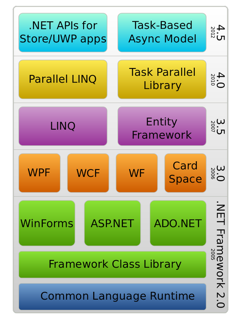
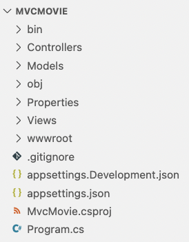

## Sommaire

- Introduction à .NET
- Qu'est-ce qu'ASP.NET Core ?
- Le framework ASP.NET Core MVC
- Mécanismes fondamentaux
- Création d'API web

---

## Introduction à .NET

---

### Aux origines de .NET

- Plate-forme de développement d'applications créée par Microsoft en 2002.
- Réponse à la domination du langage Java (multi-plateformes).
- Inclut plusieurs langages de programmation : C#, VB.NET, F#, PowerShell...
- Uniquement disponible sous Windows.
- Licence propriétaire.

---

[](https://en.wikipedia.org/wiki/.NET_Framework)

---

{}

### Architecture technique de .NET

- Une application .NET s'exécute dans un environnement contrôlé appelé **CLR** (_Common Language Runtime_).
- La compilation du code source produit un résultat indépendant du système d'exploitation, conformément à un standard nommé **CLI** (_Common Language Infrastructure_).

---

[](https://en.wikipedia.org/wiki/Common_Language_Infrastructure)

{}

---

### .NET Framework et .NET Core

- [2004](https://www.mono-project.com/docs/about-mono/history/) : le projet **Mono**, indépendant de Microsoft, débute le portage de .NET vers Linux.
- [2014](https://devblogs.microsoft.com/dotnet/net-core-is-open-source/) : Microsoft publie **.NET Core**, la première version open source et multi-plateformes de .NET. La version WIndows-only de .NET est renommée **.NET Framework**.
- [2019](https://devblogs.microsoft.com/dotnet/net-core-is-the-future-of-net/) : la nouvelle version de .NET Core est renommée **.NET**, et .NET Framework passe en mode maintenance.

---

[](https://devblogs.microsoft.com/dotnet/introducing-net-5/)

---

## La ligne de commande .NET

---

### Introduction

- **.NET CLI** (_Command Line Interface_) permet d'interagir avec .NET depuis un terminal.
- Nécessite que .NET soit installé sur la machine.
- Syntaxe : `dotnet <commande> <options>`

---

### Création d'une application

`> dotnet new <template> -o <output directory>`

| Type d'application      | Template   |
| ----------------------- | ---------- |
| Console                 | `console`  |
| Bibliothèque de classes | `classlib` |
| ASP.NET (vide)          | `web`      |
| ASP.NET (API)           | `webapi`   |
| ASP.NET (MVC)           | `mvc`      |

---

### Ajout de packages

`> dotnet add package <name>`

- Utilise [NuGet](https://www.nuget.org/) en arrière-plan.
- Vérifie la compatibilité du package à installer avec le projet.

---

### Listage des packages installés

`> dotnet list package`

---

### Lancement d'une application

`> dotnet run`

Si nécessaire, effectue la restauration des dépendances du projet (équivalent de `dotnet restore`).

---

### Surveillance des changements

`> dotnet watch run`

Pour une application web, jnjecte un script qui met à jour le contenu affiché par le navigateur lorsque des fichiers surveillés sont modifiés.

---

### Autres possibilités

- Nettoyage, test, publication, gestion des packages installés, etc.
- [Plus d'informations](https://docs.microsoft.com/en-us/dotnet/core/tools/).

---

## Qu'est-ce qu'ASP.NET Core ?

---

### Histoire d'ASP.NET Core

- A l'origine, .NET (Framework) incluait une technologie de création de pages web dynamiques nommée **ASP.NET** (_Active Server Pages_).
- **ASP.NET Core** est une réécriture d'ASP.NET basée sur .NET (Core).
- Standard actuel pour le développement web sous .NET.

---

### Points-clés d'ASP.NET Core

- Permet de créer des applications web et des services web (API) utilisés comme _backends_ par des clients riches ou des applications mobiles.
- Léger, moderne et modulaire.
- Inclut des technologies facilitant la gestion des pages dynamiques, des appels temps réel, des tests, etc.
- Déployable sur plusieurs serveurs web : Kestrel, Apache, nginx, etc.
- Multi-plateformes et [open source](https://github.com/dotnet/aspnetcore).

---

### UI générée côté serveur

Code HTML et CSS généré côté serveur, puis renvoyée au client.

- Peu d'exigences techniques côté client (navigateur simple, trafic réseau limité).
- Accès BD et contrôles centralisés.
- Exemples d'usages : sites dynamiques, blogs, CMS.

---

### UI générée côté client

Structure HTML (DOM) mise à jour dynamiquement côté client grâce à des appels asynchrones au serveur.

- Interactions riches avec l'utilisateur.
- Capacités matérielles et logicielles du client utilisables.
- Exemples d'usages : tableau de bord interactif, applications collaboratives.

---

### L'offre technique ASP.NET Core

- UI générée côté serveur : **Razor Pages**, **MVC**.
- UI générée côté client : **Blazor**, **SPA** avec Angular ou React.
- Une approche hybride est possible (exemple : MVC + Blazor).

---

## Le framework ASP.NET Core MVC

---

{}

### Rappel : le fonctionnement du web

Le web est basé sur un modèle **client/serveur** :

- Le client (navigateur, application mobile, robot d'indexation, etc) envoie une demande (**requête**) au serveur.
- Le serveur prépare sa **réponse** à la requête du client, puis la lui renvoie.

---


{}

---

### Le protocole HTTP

- _HyperText Transfer Protocol_.
- Socle technique du web.
- Equivalent sécurisé : **HTTPS**.
- Basé sur des **commandes** textuelles exprimant les différentes actions possibles : _GET_, _PUT_, _POST_, etc).

---

### L'architecture MVC

- _Model-View-Controller_ (_Modèle-Vue-Contrôleur_).
- Décomposition d’une application en trois grandes parties :
  - **Modèle** : accès aux données et logique métier (_business logic_).
  - **Vue** : affichage et interactions avec l’utilisateur.
  - **Contrôleur** : dynamique de l’application, lien entre Modèle et Vue.
- Application du principe de séparation des responsabilités.

---

### MVC : un peu d'histoire

- Apparu à la fin des années 1970 pour le langage OO **Smalltalk**. Objectif : séparer le code de l’IHM de la logique applicative.
- Appliqué depuis dans de très nombreux contextes et langages :
  - web côté serveur : frameworks Symfony (PHP), Django (Python), Rails (Ruby), etc.
  - web côté client : frameworks Angular, Ember (JavaScript), etc.
  - desktop : bibliothèque Swing (Java), etc.

---

[](https://symfony.com/doc/current/index.html)

---

### Avantages et inconvénients

- Avantages :

  - Clarification de l’architecture.
  - Séparation nette des responsabilités => couplage faible, cohésion forte, maintenance et évolutions facilitées.

- Inconvénients :
  - Complexification de l’architecture.
  - Rigidité.

---

### ASP.NET Core MVC

- Framework de création d'applications web basées sur l'architecture MVC.
- Implémente de nombreux services et bonnes pratiques, parmi lesquels :
  - Routage des requêtes entrantes.
  - Gestion des pages dynamiques.
  - Authentification.
  - Injection de dépendance.
  - Tests.
  - ...

---

### Structure d'une application ASP.NET Core MVC



---

### Les contrôleurs

- Créés dans le répertoire `Controllers/`.
- Héritent de la classe abstraite `Controller`.
- Définissent les points d'entrée dans l'application sous la forme de méthodes d'action annotables.

```csharp
public class MoviesController : Controller
{
    // GET: Movies/Details/5
    public async Task<IActionResult> Details(int? id)
    {
        //...
    }

    // POST: Movies/Delete/5
    [HttpPost, ActionName("Delete")]
    [ValidateAntiForgeryToken]
    public async Task<IActionResult> DeleteConfirmed(int id)
    {
        // ...
    }
```

---

### Les modèles

- Créés dans le répertoire `Models/`.
- Implémentent la logique métier de l'application sous la forme de classes **POCO** (_Plain Old CLR Objects_) souvent associées à des tables BD.

```csharp
public class Movie
{
    public int Id { get; set; }

    [StringLength(60, MinimumLength = 3)]
    public string Title { get; set; }

    [Display(Name = "Release Date"), DataType(DataType.Date)]
    public DateTime ReleaseDate { get; set; }
    // ...
```

---

### Les vues

- Créés dans le répertoire `Views/[Controller]` sous la forme de fichiers Razor (`.cshtml`).
- Représentent l'interface utilisateur (UI) de l'application.

```csharp
@{
    ViewData["Title"] = "About";
}
<h2>@ViewData["Title"].</h2>
<h3>@ViewData["Message"]</h3>

<p>Use this area to provide additional information.</p>
```

---

### Code et librairies client

- Regroupés dans le répertoire `wwwroot/`.
- Rassemblent les fichiers CSS et JavaScript utilisés côté client.
- Incluent par défaut Bootstrap et jQuery.

---

### Le fichier appsettings.json

Centralise les paramètres de configuration de l'application.

```json
{
  "Logging": {
    "LogLevel": {
      "Default": "Information",
      "Microsoft": "Warning",
      "Microsoft.Hosting.Lifetime": "Information",
      "Microsoft.EntityFrameworkCore.Database.Command": "Information"
    }
  },
  "AllowedHosts": "*",
  "ConnectionStrings": {
    "MvcMovieContext": "Data Source=MvcMovieContext-8719dcdb-c317-48bf-9cd8-a4c4167ce370.db"
  }
}
```

---

{}

### Le fichier Startup.cs

Contient la classe `Startup` qui permet :

- la configuration des services utilisés par l'application ;
- la définition du _pipeline_ de gestion des requêtes HTTP entrantes.

---

### Exemple de classe Startup

```csharp
public class Startup
{
    // Use this method to add services to the container.
    public void ConfigureServices(IServiceCollection services)
    {
        services.AddControllersWithViews();
    }
    // Use this method to configure the HTTP request pipeline.
    public void Configure(IApplicationBuilder app, IWebHostEnvironment env)
    {
        app.UseHttpsRedirection();
        app.UseStaticFiles();
        app.UseRouting();
        app.UseAuthorization();
        app.UseEndpoints(endpoints =>
        {
            endpoints.MapDefaultControllerRoute();
        });
    }
}
```

{}

---

## Mécanismes fondamentaux

---

{}

### Routage des requêtes

- Associe les requêtes HTTP entrantes au code à éxécuter (méthodes des contrôleurs).
- Permet à l'application web d'utiliser des URL propres et _SEO-friendly_, plutôt que des noms de fichiers.
- [Plus d'informations](https://docs.microsoft.com/en-us/aspnet/core/mvc/controllers/routing?view=aspnetcore-5.0).

---

### Routage par convention

- Permet de définir globalement la correspondance entre le format de l'URL et la méthode d'action d'un contrôleur à exécuter.
- Format par défaut : `/[Controller]/[ActionName]/[Parameters]`.
- Exemple : `https://myapp/Student/Details/Code=137` appelle la méthode `Details` du contrôleur `StudentController`, en lui passant un paramètre nommé `Code` ayant la valeur 137.

---

### Configuration du routage par convention dans Startup

```csharp
public void Configure(IApplicationBuilder app, IWebHostEnvironment env)
{
    // ...
    app.UseEndpoints(endpoints =>
    {
        endpoints.MapControllerRoute(
            name: "default",
            pattern: "{controller=Home}/{action=Index}/{id?}");
    });
}
```

`Home`, `Index` et `id` sont resp. les noms par défaut du contrôleur, de l'action et du paramètre (optionnel).

{}

---

### Scaffolding

`> dotnet-aspnet-codegenerator [arguments]`

- Permet de générer le code source pour les opérations élémentaires **CRUD** (_Create, Read, Update, Delete_) liées à une classe du Modèle.
- [Plus d'informations](https://docs.microsoft.com/en-us/aspnet/core/fundamentals/tools/dotnet-aspnet-codegenerator?view=aspnetcore-5.0).
- [Exemple de résultat](https://github.com/ensc-glog/MvcMovie/commit/f5c4ec45033f5509ec736bc1bebf010f200921f0).

---

### Database context

- Hérite de la classe abstraite `DbContext`.
- Spécifit les classes du Modèle à sauvegarder dans la base de données.

```csharp
public class MvcMovieContext : DbContext
{
    public MvcMovieContext(DbContextOptions<MvcMovieContext> options)
        : base(options)
    {}
    public DbSet<MvcMovie.Models.Movie> Movie { get; set; }
}
```

```csharp
public void ConfigureServices(IServiceCollection services)
{
    // ...
    services.AddDbContext<MvcMovieContext>(options =>
            options.UseSqlite(Configuration.GetConnectionString("MvcMovieContext")));
}
```

---

### Migrations

`> dotnet ef migrations add InitialCreate`

`> dotnet ef database update`

- Permettent à la base de données d'être synchronisée avec les évolutions du Modèle, sans perte de données.
- Migration = évolution incrémentale depuis la migration précédente.

---

{}

### Envoi de données aux vues : ViewData

Approche _faiblement typée_ : on utilie un dictionnaire standard.

```csharp
public IActionResult Welcome(string name, int numTimes = 1)
{
    ViewData["Message"] = "Hello " + name;
    ViewData["NumTimes"] = numTimes;
    return View();
}
```

---

### Utilisation dans la vue

```csharp
@{
    ViewData["Title"] = "Welcome";
}
<h2>Welcome</h2>
<ul>
    @for (int i = 0; i < (int)ViewData["NumTimes"]; i++)
    {
        <li>@ViewData["Message"]</li>
    }
</ul>
```

{}

---

{}

### Envoi de données aux vues : ViewModel

Approche _fortement typée_ : on définit une classe pour porter les données de la vue.

```csharp
public class Address
{
    public string Name { get; set; }
    public string Street { get; set; }
    public string City { get; set; }
    public string State { get; set; }
    public string PostalCode { get; set; }
}
```

---

### Utilisation dans le contrôleur

```csharp
public IActionResult Contact()
{
    var viewModel = new Address()
    {
        Name = "Microsoft",
        Street = "One Microsoft Way",
        City = "Redmond",
        State = "WA",
        PostalCode = "98052-6399"
    };
    return View(viewModel);
}
```

---

### Utilisation dans la vue

```html
@model WebApplication1.ViewModels.Address

<h2>Contact</h2>
<address>
  @Model.Street<br />
  @Model.City, @Model.State @Model.PostalCode<br />
  <abbr title="Phone">P:</abbr> 425.555.0100
</address>
```

{}

---

{}

### View layout

- Par défaut, toutes les vues partagent une structure commune définie dans le fichier `Views/Shared/_Layout.cshtml`.
- Dans ce layout, la fonction `@RenderBody()` permet de générer le contenu spécifique de la vue à afficher.
- Les éléments spécifiques à une vue (exemples : inclusions CSS ou JavaScript) peuvent être rassemblés dans des **sections** affichées par le layout.

---

### Exemple de layout

```html
<!DOCTYPE html>
<html lang="en">
  <head>
    <meta charset="utf-8" />
    <title>@ViewData["Title"] - Movie App</title>
    <!-- ... -->
  </head>
  <body>
    <header><!-- ... --></header>
    <div class="container">
      <main role="main" class="pb-3">@RenderBody()</main>
    </div>
    <footer><!-- ... --></footer>
    <script src="~/lib/jquery/dist/jquery.min.js"></script>
    <!-- ... -->
    @await RenderSectionAsync("Scripts", required: false)
  </body>
</html>
```

{}

---

{}

### Validation des données

L'annotation des classes du Modèle permet de définir des **règles de validation** qui seront automatiquement vérifiées à la fois côté serveur et côté client.

```csharp
using System.ComponentModel.DataAnnotations;
public class LoginViewModel
{
    [Required]
    [EmailAddress]
    public string Email { get; set; }

    [Required]
    [DataType(DataType.Password)]
    public string Password { get; set; }

    [Display(Name = "Remember me?")]
    public bool RememberMe { get; set; }
}
```

---

### Validation dans le contrôleur

```csharp
public async Task<IActionResult> Login(LoginViewModel model, string returnUrl = null)
{
    // Check model validation rules
    if (ModelState.IsValid)
    {
      // ... (nominal case: work with the model)
    }
    // At this point, something failed: redisplay form
    return View(model);
}
```

{}

---

{}

### Environnements

- Permettent d'adapter la configuration de l'application au contexte (développement, test ou production).
- Définis par la variable d'environnement `ASPNETCORE_ENVIRONMENT`. En l'absence de cette variable, l'environnement est de type Production.
- [Plus d'informations](https://docs.microsoft.com/en-us/aspnet/core/fundamentals/environments?view=aspnetcore-5.0).

---

### Définition de l'environnement avec Visual Studio Code

Fichier `./vscode/launch.json`

```json
{
  "version": "0.2.0",
  "configurations": [
    {
      "name": ".NET Core Launch (web)",
      # ...
      "env": {
        "ASPNETCORE_ENVIRONMENT": "Development"
      },
      # ...
    }
  ]
}

```

---

### Configuration de l'application selon l'environnement détecté

```csharp
public void Configure(IApplicationBuilder app, IWebHostEnvironment env)
{
    if (env.IsDevelopment())
    {
        app.UseDeveloperExceptionPage();
    }
    if (env.IsProduction() || env.IsStaging())
    {
        app.UseExceptionHandler("/Error");
    }
    // ...
```

{}

---

## Création d'API web

---
