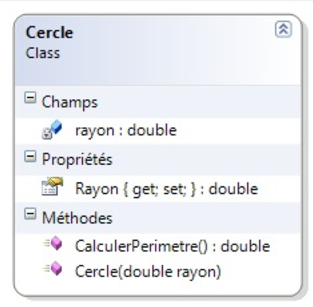
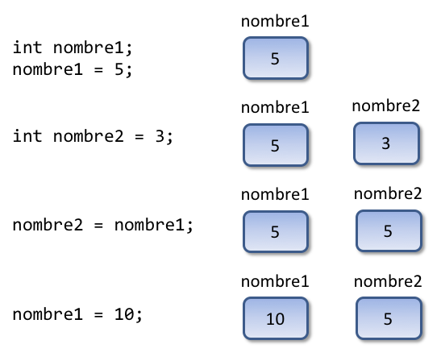
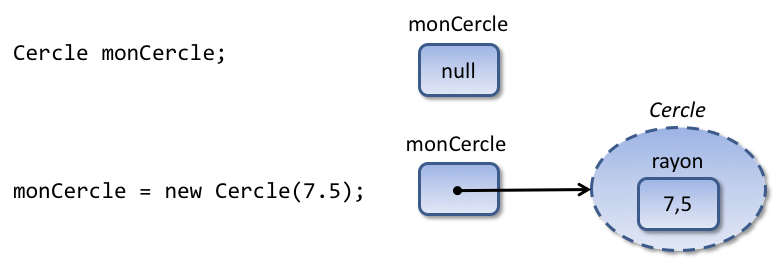
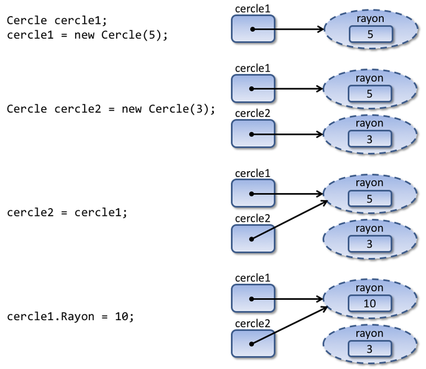
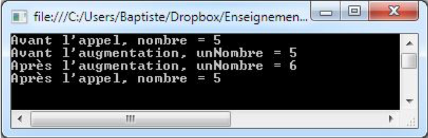
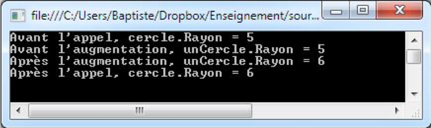
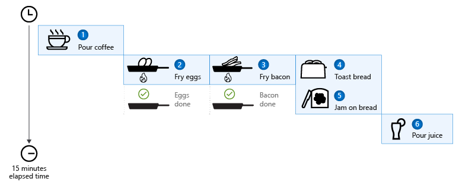

## Sommaire

- Rappels sur la POO
- Gestion des objets en mémoire
- Gestion des exceptions
- Possibilités syntaxiques récentes

---

## Rappels sur la POO

---

### La POO en bref

- **Objet** : entité qui modélise (représente) un élément du domaine étudié.
- Objet = état + actions.
- Objet != **classe** :

  - Classe : modèle d’objet (type).
  - Objet : exemplaire concret, **instance** d’une classe.

- **POO** : paradigme d'écriture de logiciels sous forme d’objets en interaction

---

### Représentation graphique d'une classe

Le standard : diagramme de classes **UML**.


---

### Notion de propriété en C\#

- Propriété au sens de la majorité des langages à objets = **attribut** ou **champ**.
- Propriété au sens du C# = **accesseur** vers un attribut.
- Les propriétés permettent de concilier accès aux données de l’objet et **encapsulation**.

---

### Propriété avec attribut explicite

Déclaration explicite de l’attribut (le plus souvent **privé**).

```c#
private string titulaire;
public string Titulaire {
    get { return titulaire; }
    set { titulaire = value; }
}
// ...
monCompte.Titulaire = "Marco";
```

Avantage : possibilité de contrôles dans les accesseurs (validation de la novuelle valeur, etc).

---

### Propriété auto-implémentée

Création implicite de l’attribut par le langage.

```csharp
public string Titulaire { get; set; }
// ...
monCompte.Titulaire = "Marco";
```

- Avantage : concision.
- Bien adaptée aux cas simples (sans besoin de logique).

---

## Gestion des objets en mémoire

---

### Classe d'exemple



---

### Affectation entre entiers

```csharp
int nombre1;
nombre1 = 5;

int nombre2 = 3;
nombre2 = nombre1;

nombre1 = 10;

Console.WriteLine("nombre1 = " + nombre1); // 10
Console.WriteLine("nombre2 = " + nombre2); // 5
```

---

{}

### Affectation entre objets

```csharp
Cercle cercle1;
cercle1 = new Cercle(5);

Cercle cercle2 = new Cercle(3);
cercle2 = cercle1;

cercle1.Rayon = 10;

Console.WriteLine("cercle1.Rayon = " + cercle1.Rayon); // 10
Console.WriteLine("cercle2.Rayon = " + cercle2.Rayon); // ?
```

---


{}

---

{}

### Types valeur

- Type pour lequel la valeur est directement stockée dans la variable.
- Types de bases C# : `int`, `float`, `double`...
- Création d’une variable => réservation d’une zone mémoire pour stocker sa valeur.

---



{}

---

{}

### Types référence

- Type pour lequel l'instanciation d’un exemplaire déclenche la réservation d’une zone mémoire pour ses données, mais la "valeur" de l’exemplaire est une **référence** vers cette zone.
- Exemples : objets et tableaux.

---



{}

---

{}

### Types référence et affectation

- La valeur de la variable source (une référence) est copiée dans la variable cible.
- Les deux variables _pointent_ vers la même zone mémoire

---



{}

---

{}

### Passage d’un type valeur en paramètre

```csharp
static void Main(string[] args) {
    int nombre = 5;
    Console.WriteLine("Avant l'appel, nombre = " + nombre); // 5
    Augmenter(nombre);
    Console.WriteLine("Après l'appel, nombre = " + nombre); // ?
}
static void Augmenter(int unNombre) {
    Console.WriteLine("Avant l'augmentation, unNombre = " + unNombre);
    unNombre = unNombre + 1;
    Console.WriteLine("Après l'augmentation, unNombre = " + unNombre);
}
```

---

### Résultat de l'exécution



- La valeur de l’argument (un nombre entier) est copiée dans le paramètre.
- Argument et paramètre correspondent à des zones mémoire différentes.

---


{}

---

{}

### Passage d’un objet en paramètre

```csharp
static void Main(string[] args) {
    Cercle cercle = new Cercle(5);
    Console.WriteLine("Avant l'appel, cercle.Rayon = " + cercle.Rayon); // 5
    AugmenterRayon(cercle);
    Console.WriteLine("Après l'appel, cercle.Rayon = " + cercle.Rayon); // ?
}
static void AugmenterRayon(Cercle unCercle) {
    Console.WriteLine("Avant l'augmentation, unCercle.Rayon = " + unCercle.Rayon);
    unCercle.Rayon = unCercle.Rayon + 1;
    Console.WriteLine("Après l'augmentation, unCercle.Rayon = " + unCercle.Rayon);
}
```

---

### Résultat de l'exécution



- La valeur de l’argument (une **référence**) est copiée dans le paramètre.
- Argument et paramètre pointent vers la même zone mémoire.

---


{}

---

### Mode de passage des paramètres en C\#

- Par défaut, **tous les paramètres sont passés par valeur**.
- Types valeur : valeur copiée de l’argument vers le paramètre => zones mémoire distinctes.
- Types référence : référence copiée de l’argument vers le paramètre => même zone mémoire.
- Possibilité de modifier ce comportement avec les mots-clés `ref` et `out`.

---

## Gestion des exceptions

---

### Introduction

- **Exception** : évènement qui apparaît pendant le déroulement d'un programme et qui empêche la poursuite normale de son exécution
  - Exemples : BD inaccessible, fichier non trouvé, bug interne…
- Gestion des exceptions : technique de gestion des erreurs dans un programme
- Avantage : séparation du code applicatif du code de gestion des erreurs

---

### Les exceptions : syntaxe

```csharp
try {
    // code susceptible de lever des exceptions
}
catch (Exception e) {
    // code de gestion de l’exception apparue
}
finally {
    // code exécuté systématiquement
}
```

```csharp
// levée d’une nouvelle exception
throw new Exception("Message d’erreur");
```

---

{}

### Les exceptions : dynamique

- Une exception levée remonte la chaîne des appels dans l'ordre inverse.
- Issues possibles :
  - interception dans un bloc `catch`.
  - arrêt brutal du programme.

---


{}

---

### La hiérarchie des exceptions


---

### Création de classes d'exceptions

Potentiellement utile pour distinguer différentes catégories d'erreur, avec des données spécifiques.


---

### Exceptions et bonnes pratiques (1/3)

- Lever une exception uniquement pour signaler qu’une exécution normale n’est plus possible.
- Ne pas utiliser les exceptions pour des situations non exceptionnelles (succès d’une recherche, fin d’une itération, etc).

```csharp
i = 0;
trouve = false;
while (!trouve) {
  i++;
  if (i == 10)
    throw new Exception("Fin de la boucle"); // Antipattern
  else // ...
}
```

---

{}

### Exceptions et bonnes pratiques (2/3)

- Intercepter les exceptions uniquement si un traitement approprié est possible (message d’erreur, nouvelle tentative, etc)
- Sinon, la laisser remonter la chaîne des appels vers un meilleur endroit.

---

```csharp
try {
  // ...
}
catch (Exception e) {
  throw e; // Antipattern : bloc inutile
}
```

```csharp
try {
  // ...
}
catch (Exception) {
  // Antipattern : exception "avalée"
}
```

{}

---

### Exceptions et bonnes pratiques (3/3)

- Bien réfléchir avant de créer ses propres classes d’exception.
  - En deça d’une certaine complexité, utiliser la classe standard `Exception` suffit souvent.
  - Toujours inclure le mot _Exception_ dans le nom de la classe.
- Code de gestion des erreurs `<<` code applicatif.

---

## Possibilités syntaxiques récentes

---

{}

### Variables sans type explicite

Le mot-clé `var` permet de déclarer des variables _implicitement typées_.

```csharp
int i = 10; // Typage explicite
var i = 10; // Typage implicite
```

Usage possible 1 : simplification du code de création d'objets (pas de répétition du type)

```csharp
var l = new List<int>();
l.Add(3);
// ...
```

---

Usage possible 2 : non-nécessité de créer un type spécifique pour le résultat d'une opération.

```csharp
// var est nécessaire car la clause SELECT définit un type anonyme
var custQuery = from cust in customers
                where cust.City == "Bordeaux"
                select new { cust.Name, cust.Phone };
// Var est nécessaire car chaque élément de la collection est un type anonyme
foreach (var item in custQuery)
{
    Console.WriteLine("Nom={0}, Téléphone={1}", item.Name, item.Phone);
}
```

{}

---

### Chaînes de caractères interpolées

Placé juste avant le début d'une chaîne, le caractère `$` permet d'y insérer des expressions entre accolades `{...}` qui seront évaluées pour produire la valeur de la chaîne.

```csharp
string name = "Clément";
var date = DateTime.Now;

Console.WriteLine("Hello, {0}! Today is {1}", name, date.DayOfWeek);
Console.WriteLine($"Hello, {name}! Today is {date.DayOfWeek}");
// Ces deux lignes produisent un résultat identique, similaire à :
// "Hello, Clément! Today is Monday"
```

---

### Types valeur nullables

Un type valeur auquel on accole le caractère `?` peut stocker la valeur `null` en plus de sa plage de valeurs habituelle.

```csharp
int a = null; // Erreur: ce type de peut stocker que des valeurs entières
int? b = null; // OK
int c = b ?? -1; // Conversion vers le type int
```

Les types nullables facilitent la gestion des valeurs indéfinies (exemple : absence de valeur pour une colonne dans une BD).

---

### Annotations

Les **annotations**, également appelées _attributs_, permettent d'ajouter des **métadonnées** (des informations supplémentaires) à certains éléments du code : types, méthodes, propriétés...

```csharp
[Serializable]
public class ClasseExemple
{
    // Les instances de cette classe sont sérialisables
}
```

```csharp
// Cette propriété est associée à un type BD spécifique
[DataType(DataType.Date)]
public DateTime ReleaseDate { get; set; }
```

---

{}

### Programmation asynchrone

- Exemple : la préparation d'un petit déjeuner.

  1. Verser le café dans une tasse.
  1. Faire chauffer la poêle, puis faire cuire deux œufs au plat.
  1. Faire frire trois tranches de bacon.
  1. Faire toaster deux tranches de pain.
  1. Étaler le beurre et la confiture sur les toasts.
  1. Verser du jus d’orange dans un verre.

- La plupart de ces tâches peuvent être exécutées simultanément.

---

### Exécution séquentielle (synchrone)

[](https://docs.microsoft.com/en-us/dotnet/csharp/programming-guide/concepts/async/)

---

### Exécution asynchrone

[](https://docs.microsoft.com/en-us/dotnet/csharp/programming-guide/concepts/async/)

---

### Les mots-clés async et await

Placé dans la signature d'une méthode, le mot-clé `async` permet l'utilisation de `await` dans le corps de cette méthode.

Placé devant une expression, le mot-clé `await` déclenche l'attente asynchrone de la fin de cette opération. Contrairement au comportement synchrone standard, le contexte d'exécution (_thread_) courant n'est pas bloqué par cette attente.

---

```csharp
public async Task DoSomethingAsync()
{
    // Asynchronously wait 100ms
    await Task.Delay(100);
}
```

{}
