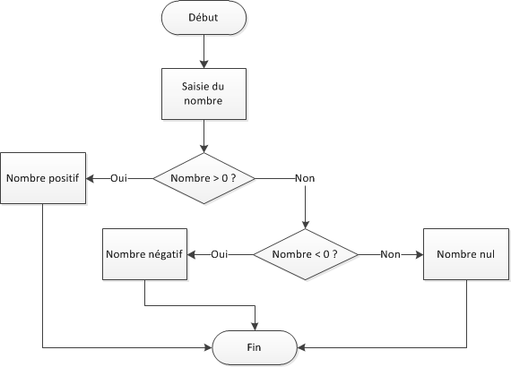

## Sommaire

- Introduction à .NET
- La notion de programme
- Premiers pas avec C#
- Guide de codage C\#
- Variables, valeurs et types
- Expressions
- Conditions et alternatives
- Structures répétitives
- Sous-programmes

---

## Introduction à .NET

---

### Aux origines de .NET

- Plate-forme de développement d'applications créée par Microsoft en 2002.
- Réponse à la domination de Java (premier langage multi-plateformes).
- Inclut plusieurs langages de programmation : C#, VB.NET, F#, PowerShell...
- A l'origine :
  - Uniquement disponible sous Windows.
  - Licence propriétaire.

---

[](https://en.wikipedia.org/wiki/.NET_Framework)

---

{}

### Architecture technique de .NET

- Une application .NET s'exécute dans un environnement contrôlé appelé [CLR](https://github.com/dotnet/runtime/blob/main/docs/design/coreclr/botr/intro-to-clr.md) (_Common Language Runtime_).
- La compilation du code source produit un résultat indépendant du système d'exploitation, conformément à un standard nommé **CIL** (_Common Intermediate Language_).

---

[](https://en.wikipedia.org/wiki/Common_Language_Infrastructure)

{}

---

### .NET Framework et .NET Core

- [2004](https://www.mono-project.com/docs/about-mono/history/) : le projet **Mono**, indépendant de Microsoft, débute le portage de .NET vers Linux.
- [2014](https://devblogs.microsoft.com/dotnet/net-core-is-open-source/) : Microsoft publie **.NET Core**, la première version open source et multi-plateformes de .NET. La version WIndows-only de .NET est renommée **.NET Framework**.
- [2019](https://devblogs.microsoft.com/dotnet/net-core-is-the-future-of-net/) : la nouvelle version de .NET Core est renommée **.NET**, et .NET Framework passe en mode maintenance.

---

### .NET 5+ : multiplateforme par défaut

La version actuelle est .NET 6 (2021).

[](https://devblogs.microsoft.com/dotnet/announcing-net-6/)

---

### La ligne de commande .NET

- **.NET CLI** (_Command Line Interface_) permet d'interagir avec .NET depuis un terminal.
- Nécessite que .NET soit installé sur la machine.
- Syntaxe : `dotnet <commande> <options>`

---

### Création d'une application

`> dotnet new <template> -o <output directory>`

| Type d'application      | Template   |
| ----------------------- | ---------- |
| Console                 | `console`  |
| Bibliothèque de classes | `classlib` |
| ASP.NET (vide)          | `web`      |
| ASP.NET (API)           | `webapi`   |
| ASP.NET (MVC)           | `mvc`      |

---

### Création d'un fichier .gitignore

`> dotnet new gitignore`

- Le fichier `.gitignore` permet d'exclure certains fichiers/dossiers de la gestion des versions avec [Git](https://git-scm.com/). Il le plus souvent s'agit de fichiers locaux (exemple : configuration de l'environnement de développement) ou de fichiers recréés systématiquement par le processus de génération de l'application.
- Cette commande crée un fichier `.gitignore` adapté aux projets .NET.

---

### Gestion des packages

`> dotnet add package <name>`

- Utilise [NuGet](https://www.nuget.org/) pour télécharger un package et l'ajouter au projet.
- Vérifie la compatibilité du package à installer avec le projet.

`> dotnet list package`

- Liste les packages installés pour un projet.

---

### Lancement d'une application

`> dotnet run`

Si nécessaire, effectue la restauration des dépendances du projet (équivalent de `dotnet restore`).

---

### Surveillance des changements

`> dotnet watch run`

Pour une application web, jnjecte un script qui met à jour le contenu affiché par le navigateur lorsque des fichiers surveillés sont modifiés.

---

### Autres possibilités

- Nettoyage, test, publication, gestion des packages installés, etc.
- [Plus d'informations](https://docs.microsoft.com/en-us/dotnet/core/tools/).

---

## La notion de programme

---

### Qu'est-ce qu'un programme ?

- **Programme** (application, logiciel) : implémentation (réalisation) d'un algorithme sous la forme d'un ensemble de commandes textuelles appelées **instructions**.
- Ces instructions sont spécifiques à un langage de programmation.
- Elles sont ensuite traduites dans un langage compris par (le processeur de) la machine qui exécute le programme.
- L'ensemble des instructions d'un programme est appelé son **code source**.

---

### Au plus près de la machine : l'assembleur

Jeu d'instructions élémentaires comprises par une famille de processeurs.

```asm
str:
 .ascii "Bonjour\n"
 .global _start

_start:
movl $4, %eax
movl $1, %ebx
movl $str, %ecx
movl $8, %edx
int $0x80
movl $1, %eax
movl $0, %ebx
int $0x80
```

---

### Langages compilés

- **Compilation** = phase de traduction du code source en langage machine, puis exécution du résultat de la compilation.
  - Performances optimales.
  - Permet de détecter les erreurs syntaxiques avant l'exécution.
  - Recompilation nécessaire sur un nouvel environnement.
  - Exemples : C, C++.

---

### Langages interprétés

- **Interprétation** = exécution du code source d'un programme ligne après ligne.
  - Pas de phase de compilation (gain de temps).
  - Code directement portable d'un environnement à l'autre.
  - Performances inférieures aux langages compilés.
  - Détection tardive des erreurs syntaxiques (durant l'exécution).
  - Exemples : Python, JavaScript, PHP.

---

### Langages pseudo-compilés

- Code source compilé vers un format intermédiaire multi-plaformes ("_Write once, run anywhere_").
  - Erreurs syntaxiques détectées à la compilation.
  - Evite les recompilations.
  - Nécessite que l'environnement soit supporté par la plate-forme d'exécution du code intermédiaire.
  - Exemples : Java, C#.

---

### Notion d'algorithme

> "Un algorithme est une méthode de calcul qui indique la démarche à suivre pour résoudre une série de problèmes équivalents en appliquant dans un ordre précis une suite finie de règles." (Académie Française)

---

{}

### Exemple d'algorithme

```txt
Début
    Sortir une casserole
    Mettre de l'eau dans la casserole
    Ajouter du sel
    Mettre la casserole sur le feu
    Tant que l'eau ne bout pas
    Attendre
    Sortir les pâtes du placard
    Verser les pâtes dans la casserole
    Tant que les pâtes ne sont pas cuites
        Attendre
    Verser les pâtes dans une passoire
    Egoutter les pâtes
    Verser les pâtes dans un plat
    Goûter
    Tant que les pâtes sont trop fades
        Ajouter du sel
        Goûter
    Si on préfère le beurre à l'huile
        Ajouter du beurre
    Sinon
        Ajouter de l'huile
Fin
```

---


{}

---

### Le rôle du programmeur

- Créer des programmes qui réalisent de manière fiable les tâches attendues.
- Maîtriser la complexité qui apparaît inévitablement lorsque les fonctionnalités du programme évoluent.

> "Le programmeur est un créateur d'univers dont il est seul responsable." (Joseph Weizenbaum).

---

## Premiers pas avec C\#

---

### C\# en quelques mots

- Langage de programmation apparu en 2002 avec la première version de .NET (Framework).
- Syntaxe très inspirée de Java et de C++.
- Typage statique, orienté objet.
- Permet de créer une grande variété d'applications (bureau, web, mobile, cloud, etc).
- Version associée à .NET 6 : C# 10.

---

### Coder en C\#

- Environnements de développement intégré (IDE) :
  - [Visual Studio](https://visualstudio.microsoft.com/fr/)
  - [Rider](https://www.jetbrains.com/rider/)
- Editeurs de code :
  - [Visual Studio Code](https://code.visualstudio.com/)
  - [Atom](https://atom.io/)
  - [Sublime Text](https://www.sublimetext.com/)
  - ~~Notepad++~~

---

### Création d'une application console avec .NET

- Type d'application basique qui s'exécute dans un terminal.
- UI pauvre, interactions limitées au clavier.
- Création d'un projet console .NET nommé **HelloCSharp** :

```bash
# Le projet est créé dans le sous-répertoire HelloCSharp
dotnet new console -o HelloCSharp
```

---

### Résultat obtenu


---

### Le fichier .csproj

Décrit la configuration du projet.

```xml
<Project Sdk="Microsoft.NET.Sdk">

  <PropertyGroup>
    <OutputType>Exe</OutputType>
    <TargetFramework>net6.0</TargetFramework>
    <ImplicitUsings>enable</ImplicitUsings>
    <Nullable>enable</Nullable>
  </PropertyGroup>

</Project>
```

---

### Le fichier Program.cs

Fichier source principal contenant le code C#.

```csharp
// See https://aka.ms/new-console-template for more information
Console.WriteLine("Hello, World!");
```

---

### Exécution du programme

```bash
# Cette commande doit être lancée dans le répertoire HelloCSharp
dotnet run
```


---

### Littéraux

- Un littéral est une valeur donnée explicitement dans le code source.
- Exemples : `2`, `3.14`, `"Hello World!"`.
- Séparateur décimal : le point `.`
- Chaînes de caractères (texte) : guillemets doubles `"..."`.

---

### Instructions

- Une instruction est un ordre écrit dans le code.
- Elles se terminent par `;` en C#.
- Elles peuvent être regroupées dans des **blocs** délimités par des accolades `{ ... }`.
- Durant l'exécution, chaque instruction est "lue" séquentiellement et produit un résultat.

---

### Commentaires

- Rôle : expliquer _aux humains_ certaines parties du code.
- Syntaxe :  `//...` (monoligne) ou `/* ... */` (multilignes).
- Peuvent être ajoutés/supprimés automatiquement par les éditeurs de code et les IDE.

---

## Guide de codage C\#

---

### Nommage des identifiants

- Un **identifiant** est le nom donné à un élément du code créé par le développeur.
- Ils doivent commencer par une lettre ou un _underscore_ `_`.
- Ils sont sensibles à la casse (distinction majuscules/minuscules).
- Au sein d'un bloc, le même identifiant ne peut pas être attribué à des éléments distincts.

---

### Mots réservés du C\#

abstract
as
base
bool
break
byte
case
catch
char
checked
class
const
continue
decimal
default
delegate
do
double
else
enum
event
explicit
extern
false
file finally
fixed
float
for
foreach
goto
if
implicit
in
int
interface
internal
is
lock
long
namespace
new
null
object
operator
out
override
params
private
protected
public
readonly
ref
return
sbyte
sealed
short
sizeof
stackalloc
static
string
struct
switch
this
throw
true
try
typeof
uint
ulong
unchecked
unsafe
ushort
using
virtual
void
volatile
while

---

### Conventions de nommage

- Plus l'élément est utilisé dans le code, plus il faut le nommer avec soin.
- Notation [camelCase](https://fr.wikipedia.org/wiki/Camel_case) : `totalFacturesClient`.
  - Pas d'underscores entre les mots (!= Python).
- Notation PascalCase (première lettre en majuscule) pour certains éléments (fonctions, méthodes, structures, classes) : `CompteBancaire`.
- Pas d'accents ! (même si ça fonctionne)

---

### Formatage du code

- Pas plus d'une instruction par ligne.
- Longueur maximum d'une ligne : 80-ish caractères.
- Accolades ouvrantes et fermantes sur des lignes distinctes.
- Indentation = 4 espaces.
- ... Utiliser le formateur automatique de son éditeur/IDE !
  - Activer le formatage à la sauvegarde pour plus de confort.

---

### Formatage des commentaires

- Placer les commentaires sur des lignes distinctes.
- Débuter par une majuscule et terminer par un point.
- Laisser un espace entre le symbole de début et le texte.

```csharp
// Ceci est un commentaire tellement long qu'il est réparti
// sur plusieurs lignes.

/*
Encore
un
commentaire.
*/
```

---

### Ressources

- [C# Coding Conventions](https://learn.microsoft.com/en-us/dotnet/csharp/fundamentals/coding-style/coding-conventions)
- [C# Coding Style](https://github.com/dotnet/runtime/blob/main/docs/coding-guidelines/coding-style.md)
- [Visual Studio Code - Formatting](https://code.visualstudio.com/docs/editor/codebasics#_formatting)

---

## Variables, valeurs et types

---

### Valeur Vs type

- **Valeur** = morceau d'information utilisée dans un programme.
- Chaque valeur possède un **type** qui détermine :
  - son encodage en mémoire ;
  - la plage des valeurs possibles ;
  - les opérations permises.
- C# est un langage à **typage statique** : les types doivent être explicitement précisés (!= Python).

---

### Variables

- **Variable** = zone de stockage d'information dans la mémoire allouée au programme.
  - Sorte de "boîte" dans laquelle on range des choses.
- Caractérisée par :
  - son nom (identifiant) ;
  - sa valeur ;
  - son type.

---

### Déclaration d'une variable

- Type défini explicitement à la déclaration.
- Valeur modifiée par l'opérateur d'affectation `=`.
  - Ne pas confondre avec l'égalité mathématique !
- Possibilité de définir la valeur initiale au moment de la déclaration.

```csharp
int x; // Déclaration : aucune valeur dans la variable x
x = 3; // Affectation de la valeur 3 à x

int y = 5; // Déclaration et initialisation de la variable y
y = "Coucou"; // NOK : valeur incompatible avec le type de y
```

---

### Portée d'une variable

- **Portée** (_scope_) = portion du code source dans laquelle une variable est visible et donc utilisable.
- L'unité de portée est le bloc de code `{ ... }` ainsi que ses sous-blocs éventuels.
- En l'absence d'accolades, un bloc par défaut est implicitement défini.

```csharp
int a = 1;
{
    a = 2; // OK : a est déclarée dans le bloc parent
    int b = 4; // La portée de b se limite au bloc actuel
}
Console.WriteLine(a); // OK : a est déclarée dans le bloc courant
Console.WriteLine(b); // NOK : b n'est pas visible ici
```

---

### Types prédéfinis

Extrait du vaste éventail de [types prédéfinis du C#](https://learn.microsoft.com/en-us/dotnet/csharp/language-reference/builtin-types/built-in-types) :

|Mot-clé|Nom complet|Description|
|---------|----|-|-|
|[int](https://learn.microsoft.com/en-us/dotnet/csharp/language-reference/builtin-types/integral-numeric-types)|`System.Int32`|Entier (signé)|
|[double](https://learn.microsoft.com/en-us/dotnet/csharp/language-reference/builtin-types/floating-point-numeric-types)|`System.Double`|Réel|
|[bool](https://learn.microsoft.com/en-us/dotnet/csharp/language-reference/builtin-types/bool)|`System.Boolean`|Booléen|
|[char](https://learn.microsoft.com/en-us/dotnet/csharp/language-reference/builtin-types/char)|`System.Char`|Caractère|
|[string](https://learn.microsoft.com/en-us/dotnet/csharp/language-reference/builtin-types/reference-types#the-string-type)|`System.String`|Chaîne de caractères|

---

### Valeurs prédéfinies

Plusieurs valeurs constantes sont associées à certains types.

```csharp
int i = int.MaxValue; // Plus grande valeur gérée par int
int j = int.MinValue; // Plus petite valeur gérée par int

double a = double.MaxValue; // Plus grande valeur gérée par double
double b = double.MinValue; // Plus petite valeur gérée par double
double c = double.Epsilon; // Plus petite valeur réelle positive
double d = double.NaN; // Pas un nombre (Not a Number)
double e = double.PositiveInfinity; // +∞
double f = double.NegativeInfinity; // −∞
```

---

### Notation suffixée

- Les litéraux réels sont considérés par défaut comme ayant le type `double`.
- Dans certaines situations, il est utile de préciser explicitement le type souhaité en utilisant la **notation suffixée**.

```csharp
float f = 1.2f; // Réel sur 32 bits
double d = 1.2d; // Réel sur 64 bits
decimal m = 1.2m; // Réel sur 128 bits
```

---

### Types valeur Vs types référence

Les types C# se divisent en deux catégories.

- [Types valeur](https://learn.microsoft.com/en-us/dotnet/csharp/language-reference/builtin-types/value-types) : la variable contient directement la valeur qu'elle stocke.

- [Types référence](https://learn.microsoft.com/en-us/dotnet/csharp/language-reference/keywords/reference-types) : la variable contient une référence vers la valeur ($\approx$ son adresse dans la mémoire). Cette _indirection_ permet d'optimiser certaines opérations (comparaison, copie, etc).

Tous les exemples précédents sont des types valeur, sauf `string` (mais qui s'utilise comme un type valeur).

---

### Hiérarchie des types C\#

[](https://learn.microsoft.com/en-us/dotnet/csharp/fundamentals/types/)

---

### Types valeur nullables

- Le mot-clé [null](https://learn.microsoft.com/en-us/dotnet/csharp/language-reference/keywords/null) indique l'absence de référence.
- C'est la "valeur" par défaut des variables de type référence.
- Un type valeur est _non-nullable_ par défaut. Il peut devenir [nullable]((https://learn.microsoft.com/en-us/dotnet/csharp/language-reference/builtin-types/nullable-value-types)) en le suffixant par `?`.

```csharp
int a = null; // NOK : type valeur non nullable
int? b = null; // OK, type nullable
```

---

### Types référence nullables

- Depuis C# 8, on peut paramétrer un projet C# afin que les types référence deviennent _non-nullables_, cad [qu'on ne puisse pas leur affecter](https://learn.microsoft.com/en-us/dotnet/csharp/language-reference/builtin-types/nullable-reference-types) `null` ou une valeur potentiellement égale à `null`.
  - C'est le cas par défaut avec .NET 6.
  - Objectif : améliorer la sûreté du code.
- Le préfixage par `?` autorise `null`.

```csharp
string s; // OK, valeur de s = null (variable inutilisable en l'état)
s = null; // NOK, type référence non nullable (C# 8+)
string? t = null; // OK, type nullable
```

---

### Conversions de types implicites

- En C#, le type d'une variable ne peut plus être modifié après sa déclaration (typage statique).

- Une [conversion implicite](https://learn.microsoft.com/en-us/dotnet/csharp/programming-guide/types/casting-and-type-conversions#implicit-conversions) a lieu quand la nouvelle valeur est directement compatible avec le type actuel (exemples : entier vers entier de plus grande précision, entier vers réel).

```csharp
int i = "Bonjour"; // NOK, valeur incompatible avec le type int

int n = 2147483647;
double d = n; // OK, conversion implicite
// Le type entier long peut stocker n'importe quel int
long l = n; // OK, conversion implicite
```

---

### Conversions de types explicites

- [Transtypage](https://learn.microsoft.com/en-us/dotnet/csharp/programming-guide/types/casting-and-type-conversions#explicit-conversions) (_cast_) : on force le type de la nouvelle valeur en la préfixant par le nouveau type entre parenthèses.
  - Perte possible d'information.
  - Potentiellement dangereux !
- Fonctions de conversion C# : `{type}.Parse` ou `Convert.To{type}`.

```csharp
int x = (int)12.3; // OK : transtypage possible, x vaut 12

int y = int.Parse("123"); // OK, y vaut 123
int z = int.Parse("12.3"); // NOK : nouvelle valeur non entière
 ```

---

### Booléens

- Le type [bool](https://learn.microsoft.com/en-us/dotnet/csharp/language-reference/builtin-types/bool) représente une valeur booléenne `true` ou `false`.
- Booléen nullable : `bool?`
- Un conversion explicite est requise vers/depuis les types entier : toutes les valeurs non-zéro sont converties à `true`.

```csharp
bool b = true;

bool? n = null; // OK : type nullable

bool p = Convert.ToBoolean(1); // p vaut true
bool q = Convert.ToBoolean(0); // r vaut false
```

---

### Caractères

- Le type [char](https://learn.microsoft.com/en-us/dotnet/csharp/language-reference/builtin-types/char) représente un caractère alphanumérique [Unicode](https://en.wikipedia.org/wiki/Unicode).
- On peut lui affecter un caractère litéral délimité par des guillemets simples `''` ou sa [valeur Unicode](https://en.wikipedia.org/wiki/List_of_Unicode_characters#Basic_Latin) transtypée.
- Le caractère d'échappement est `\`.
- La conversion est implicite vers les principaux types entiers et réels.

```csharp
char c = 'a';
int cVal = c; // cVal vaut 97, la valeur Unicode de 'a'
char cBis = (char)97; // Initialisation à partir de la valeur Unicode
```

---

### Séquences d'échappement

Extrait de la [liste complète des séquences d'échappement C#](https://docs.microsoft.com/en-us/dotnet/csharp/programming-guide/strings/#string-escape-sequences) :

|Séquence|Valeur|
|---------|----|
|`\'`|Guillemet simple|
|`\"`|Guillemet double|
|`\\`|Antislash|
|`\n`|Saut de ligne|
|`\t`|Tabulation|

---

### Chaînes de caractères

- Le type [string](https://learn.microsoft.com/en-us/dotnet/csharp/language-reference/builtin-types/reference-types#the-string-type) représente une séquence de caractères Unicode.
- L'instruction `{chaîne}.Length` renvoie le nombre de caractères d'une chaîne.
- La syntaxe entre crochets `[]` permet d'accéder à un caractère de la chaîne à partir de son rang.

```csharp
string s = "abc";
char premier = s[0]; // 'a'
char dernier = s[s.Length - 1]; // 'c'
```

---

### Chaînes verbatim

Placé devant son début, le caractère `@` permet de créer une [chaîne verbatim](https://learn.microsoft.com/en-us/dotnet/csharp/language-reference/tokens/verbatim) dans laquelle on peut ajouter des caractères spéciaux sans les échapper.

```csharp
// Ces deux chaînes contiennent "c:\Windows\Temp"
string c1 = "c:\\Windows\\Temp";
string c2 = @"c:\Windows\Temp";
```

---

### Void

- Le mot-clé [void](https://learn.microsoft.com/en-us/dotnet/csharp/language-reference/builtin-types/void) est utilisé pour indiquer l'absence de valeur de retour par une instruction.
- Une variable ou une expression ne peut pas être de type `void`.

---

## Expressions

---

### Définition d'une expression

- Une [expression](https://learn.microsoft.com/en-us/dotnet/csharp/language-reference/language-specification/expressions) est une combinaison de variables, de valeurs et d'opérateurs.
- Toute expression qui renvoie une valeur possède un type.
- Le résultat d'une expression peut être inclus dans une autre expression.

---

### Opérateurs arithmétiques

|Opérateur|Rôle|
|---------|----|
|`+`|Addition|
|`-`|Soustraction|
|`*`|Multiplication|
|`/`|Division|
|`%`|Modulo|

---

### Opérateurs de comparaison

Ne pas confondre `==` et `=` (affectation) !

|Opérateur|Rôle|
|---------|----|
|`==`|Egal à|
|`!=`|Différent de|
|`<`|Inférieur|
|`<=`|Inférieur ou égal|
|`>`|Supérieur|
|`>=`|Supérieur ou égal|

---

### Opérateurs logiques

|Opérateur|Rôle|
|---------|----|
|`&&`|ET logique|
|`\|\|`|OU logique|
|`!`|NON logique|

---

### Priorité des opérateurs

Elle est gérée comme en mathématiques à l'aide de parenthèses `()`.

```csharp
let e = 3 + 2 * 4; // e contient la valeur 11
int f = (3 + 2) * 4; // f contient la valeur 20
```

---

### Division entière

- Une division entre deux entiers donne un résultat de type entier.
- Pour obtenir un résultat réel, il faut que l'un des deux opérandes soit de type réel ou que le résultat soit explicitement converti.

```csharp
int q = 5 / 2; // q vaut 2
int r = 5 % 2; // r vaut 1

double d = 5 / 2.0; // d vaut 2,5
double e = 5 / 2d; // e vaut 2,5
double f = (double)5 / 2; // f vaut 2,5

int z = 0;
int g = 5 / z; // NOK, division par zéro à l'exécution
```

---

### Incrémentation et décrémentation

- Les opérateurs `++` et `--` permettent resp. d'augmenter et de diminuer de 1 la valeur d'une variable.
- Ils équivalent à `variable = variable ± 1`.
- Attention, le résultat renvoyé par l'expression est différent selon la position de l'opérateur (pré- ou post-incrémentation/décrémentation).

```csharp
int a = 3;
a++; // a vaut 4
int b = a++; // a vaut 5, b vaut 4 !
int c = ++a; // a et c valent 6
```

---

### Opérateurs combinés d'affectation

- De la forme `variable {opérateur}= valeur`, ils équivalent à `variable = variable {operateur} valeur`
- Ils permettent de raccourcir certaines expressions.

```csharp
int i = 10;
i += 5; // Equivaut à i = i + 5, donc i vaut 15
i /= 3; // i vaut 5
```

---

### Dépassement de capacité

- Les types numériques ont une taille finie en mémoire, et donc une capacité limitée.
- Dans certaines circonstances, les limites des plages de valeur peuvent être dépassées

```csharp
int x = int.MaxValue; // Plus grand int possible
x++;
Console.WriteLine(x == int.MinValue); // true !
```

---

### Erreurs d'arrondi

L'arithmétique sur les types à virgule flottante peut entrainer des imprécisions et des erreurs d'arrondi.

```csharp
Console.WriteLine(5.32 + 2.23); // 7,550000000000001
Console.WriteLine(5.32m + 2.23m); // 7,55
```

---

### Concaténation de chaînes

Elle s'effectue à l'aide de l'opérateur `+` lorsqu'au moins l'une des deux opérandes est une chaîne.

```csharp
string s = "I " + "feel " + "good!";
Console.WriteLine(s);

int nbFamilles = 5;
string ecole = "ENSC";
string t = "Il y a " + nbFamilles + " familles à l'" + ecole;
Console.WriteLine(t); // "Il y a 5 familles à l'ENSC"
```

---

### Interpolation de chaînes

- Placé devant son début, le caractère `$` permet de créer une [chaîne interpolée](https://learn.microsoft.com/en-us/dotnet/csharp/language-reference/tokens/interpolated) dans laquelle on peut ajouter des expressions entre accolades `{}`.
- Ces expressions seront évaluées au moment du calcul de la valeur de la chaîne interpolée.

```csharp
int nbFamilles = 5;
string ecole = "ENSC";
string u = $"Il y a {nbFamilles} familles à l'{ecole}";
Console.WriteLine(u); "Il y a 5 familles à l'ENSC"
```

---

## Conditions et alternatives

---

### La notion de condition

- Une expression dont l'évaluation produit une valeur booléenne peut être utilisée comme **condition**.
- Quand la valeur d'une condition est vraie, on dit que la condition est _vérifiée_.
- Elles peuvent être **composées** en utilisant des opérateurs logiques et des parenthèses.

```csharp
int a = 3;

Console.WriteLine(a == 3); // true
Console.WriteLine(a != 3); // false
```

---

### Tables de vérité des opérateurs logiques

```csharp
// ET logique
Console.WriteLine(true && true); // true
Console.WriteLine(true && false); // false
Console.WriteLine(false && true); // false
Console.WriteLine(false && false); // false

// OU logique
Console.WriteLine(true || true); // true
Console.WriteLine(true || false); // true
Console.WriteLine(false || true); // true
Console.WriteLine(false || false); // false

// NON logique
Console.WriteLine(!true); // false
Console.WriteLine(!false); // true
```

---

### Evaluation abrégée

Dans une condition composée avec `&&`, la seconde sous-condition n'est évaluée que si la première vaut `true` ([évaluation abrégée](https://learn.microsoft.com/en-us/dotnet/csharp/language-reference/operators/boolean-logical-operators#conditional-logical-and-operator-)).

```csharp
int a = 3;
string s = "Hi";

Console.WriteLine((a == 3) && (s == "Hello")); // false
Console.WriteLine((a == 3) || (s == "Hello")); // true

// La sous-condition (s == "Hi") n'est pas évaluée
// puisque (a != 3) vaut false
Console.WriteLine((a != 3) && (s == "Hi")); // false
```

---

### L'instruction conditionnelle if

- L'instruction `if` permet de soumettre l'exécution d'une partie du programme à une condition, qui doit être vérifiée.
- Le bloc de code associé est délimité par des accolades (!= Python).
- Lorsque ce bloc se réduit à une seule instruction, ces accolades peuvent être omises.

```csharp
if (condition) {
    // Instructions exécutées si la condition est vérifiée
}

if (condition)
    // Seule instruction exécutée si la condition est vérifiée
```

---

### L'alternative avec if/else

- Associée à un `if`, le mot-clé `else` permet d'exprimer une **alternative**.
- Si la condition du `if` est vérifiée, alors les instructions du bloc de code associé seront exécutées, sinon ce seront celles du bloc associé au `else`.
- L'instruction `if/else` permet de créer un branchement logique dans le code.

```csharp
if (condition) {
    // Instructions exécutées si la condition est vérifiée
}
else {
    // Instructions exécutées si la condition n'est pas vérifiée
}
```

---

{}

### Instructions if/else imbriquées

```csharp
int nombre = 1;
if (nombre > 0)
{
    Console.WriteLine($"{nombre} est positif");
}
else
{   // nombre <= 0
    if (nombre < 0)
    {
        Console.WriteLine($"{nombre} est négatif");
    }
    else
    {   // nombre == 0
        Console.WriteLine($"{nombre} est nul");
    }
}
```

---

### Flux d'exécution de l'exemple précédent



---

### Version abrégée de l'exemple précédent

- Le second `if/else` constitue une seule instruction : les accolades peuvent donc être omises.
- Pas de `elif` en C# !

```csharp
int nombre = 1;

if (nombre > 0)
    Console.WriteLine($"{nombre} est positif");
else if (nombre < 0)
    Console.WriteLine($"{nombre} est négatif");
else
    Console.WriteLine($"{nombre} est nul");
```

{}

---

### La conditionnelle ternaire

- L'instruction `?:` renvoie la valeur d'une expression parmi deux, selon la valeur d'une condition booléenne : `(condition) ? valeur_si_vraie : valeur_si_fausse`

- Appelée [instruction conditionnelle ternaire](https://learn.microsoft.com/en-us/dotnet/csharp/language-reference/operators/conditional-operator), elle constitue une alternative plus concise au `if/else` dans certains scénarions.

```csharp
double temperature = 38.5;
string etat = (temperature > 38) ? "malade" : "bien portant";
Console.WriteLine(etat); // "malade"
```

---

### L'instruction de choix switch

L'instruction `switch` permet d'exécuter un bloc parmi plusieurs selon la valeur d'une expression.

```csharp
string meteo = "orage";
switch (meteo)
{
    case "soleil":
        Console.WriteLine("Sortez en t-shirt");
        break;
    case "vent":
        Console.WriteLine("Sortez en coupe-vent");
        break;
    default:
        Console.WriteLine("Restez au chaud à la maison !");
        break;
}
```

---

## Structures répétitives

---

### La boucle while

- L'instruction `while` permet de répéter des instructions tant qu'une condition est vérifiée.
- Ce type d'instruction est souvent appelée **boucle**.
- Avant chaque tour de boucle, la condition du `while` est évaluée :
  - Si elle est vraie, le bloc associé au `while` (appelé _corps de la boucle_) est exécuté, puis la condition est de nouveau évaluée.
  - Sinon, l'exécution de la boucle est terminée.

```csharp
while (condition) {
    // Instructions exécutées tant que la condition est vérifiée
}
```

---

### Le danger des boucles infinies

- L'exécution d'une boucle `while` dont la condition ne peut pas devenir fausse ne s'arrête jamais.
- On parle alors de **boucle infinie**, qui nécessite une interruption externe brutale.

```csharp
int nombre = 1;
while (nombre <= 5)
{
    Console.WriteLine(nombre);
    // nombre n'est jamais modifiée => condition toujours vraie
}
```

---

### La boucle for

- Cette boucle permet de répéter des instructions en exécutant une instruction après chaque tour.
  - L'**initialisation** se produit une seule fois, au début de l'exécution.
  - La **condition** est évaluée avant chaque tour de boucle afin d'effectuer un nouveau tour ou de sortir de la boucle.
  - L'**étape** est réalisée après chaque tour de boucle.

```csharp
for (initialisation; condition; étape) {
    // Instruction executées tant que la condition est vérifiée
}
```

---

### Compteur de boucle

- La boucle `for` est fréquemment utilisée avec une variable (appelée _compteur_) qui permet d'identifier et de numéroter les tours de boucle.
- Le compteur peut également être exploité dans le corps de la boucle.
  - Sauf exception rare, il ne doit pas y être modifié !
- Il est souvent nommé `i`, `j` ou `k`.

```csharp
int i;
for (i = 1; i <= 5; i++)
{
    Console.WriteLine(i);
}
Console.WriteLine(i); // 6
```

---

### Déclaration du compteur de boucle

Afin de limiter sa portée au corps de la boucle, on peut déclarer la variable compteur dans l'initialisation d'une boucle `for`.

```csharp
for (int i = 0; i < 5; i++)
{
    Console.WriteLine(i + 1);
}
Console.WriteLine(i); // NOK : i est inaccessible ici
```

---

### Choix entre un while et un for

- La boucle `for` intègre la gestion du compteur, mais implique que le nombre de tours de boucle soit connu à l'avance.
- Les scénarios où le nombre de tours ne peut pas être prévu à l'avance sont plus simples à écrire avec un `while`. En revanche, attention aux boucles infinies !

---

### La boucle do... while

Variante de la boucle `while` dans laquelle le corps de la boucle est toujours exécuté au moins une fois.

```csharp
do
{
    // Instructions exécutées tant que la condition est vérifiée
}
while (condition);
```

---

## Sous-programmes

---

### Exemple d'algorithme monobloc

```txt
Début
    Sortir une casserole
    Mettre de l'eau dans la casserole
    Ajouter du sel
    Mettre la casserole sur le feu
    Tant que l'eau ne bout pas
    Attendre
    Sortir les pâtes du placard
    Verser les pâtes dans la casserole
    Tant que les pâtes ne sont pas cuites
        Attendre
    Verser les pâtes dans une passoire
    Egoutter les pâtes
    Verser les pâtes dans un plat
    Goûter
    Tant que les pâtes sont trop fades
        Ajouter du sel
        Goûter
    Si on préfère le beurre à l'huile
        Ajouter du beurre
    Sinon
        Ajouter de l'huile
Fin
```

---

### Exemple d'algorithme modularisé

```text
Début
    Faire bouillir de l'eau
    Cuire les pâtes dans l'eau
    Egoutter les pâtes
    Assaisonner les pâtes
Fin
```

La recette est décomposée en sous-étapes :

- Gain en concision et en facilité d'interprétation
- Apparition de tâches plus élémentaires (_Cuire_, _Egoutter_, etc) qu'on peut envisager de réutiliser dans d'autres recettes.

---

### Qu'est-ce qu'un sous-programme ?

- Regroupement d'instructions qui réalise une tâche donnée.
- Identifié par un nom (PascalCase en C#).
  - Comporte souvent un verbe à l'infinitif pour exprimer une action.
- Appelé parfois **procédure** ou **fonction** (voir plus loin).

```csharp
// Définition du sous-programme DireBonjour
void DireBonjour()
{
    Console.WriteLine("Bonjour !");
}

Console.WriteLine("Début du programme");
DireBonjour(); // Appel du sous-programme DireBonjour
Console.WriteLine("Fin du programme");
```

---

### Ordre de définition

Sauf cas particulier (voir plus loin), l'utilisation peut précéder la définition dans le code.

```csharp
Console.WriteLine("Début du programme");
DireBonjour(); // "Bonjour !"
Console.WriteLine("Fin du programme");

void DireBonjour()
{
    Console.WriteLine("Bonjour !");
}
```

---

### Dynamique d'utilisation d'un sous-programme


---

### Avantages des sous-programmes

- Permettent de décomposer un problème complexe en sous-parties plus élémentaires.
- Facilitent la maintenance, la réutilisation et les évolutions ultérieures.
- Evitent la duplication de code.

---

### Type de retour

- Le mot-clé `return` provoque la fin de l'exécution d'un sous-programme et définit l'expression associée comme sa **valeur de retour**.
- Le type de cette expression doit être précisé dans la définition de la fonction.
- Un sous-programme C# ne peut avoir qu'une seule valeur de retour.

```csharp
string DireBonjour2()
{
    return "Bonjour !";
}

Console.WriteLine("Début du programme");
string message = DireBonjour2();
Console.WriteLine(message); // "Bonjour !"
Console.WriteLine("Fin du programme");
```

---

### Procédure Vs fonction

- Un sous-programme sans valeur de retour est parfois appelé une **procédure**.
- Un sous-programme avec une valeur de retour est parfois appelé une **fonction**.

```csharp
// Procédure
void DireBonjour()
{
    Console.WriteLine("Bonjour !");
}

/// Fonction
string DireBonjour2()
{
    return "Bonjour !";
}
```

---

### Nécessité d'une valeur de retour pour les fonctions

- La valeur doit également être compatible avec le type de retour précisé dans la définition.
- Dans les cas contraires : erreur à la compilation.

```csharp
// NOK : aucune valeur de retour (pas de return)
int CalculerUnTruc()
{
    Console.WriteLine("Je calcule...");
}
// NOK : tous les chemins de code ne retournent pas une valeur
int CalculerUnTruc2()
{
    if (2 > 3)
        return 1;
}
// NOK : conversion implicite impossible d'une chaîne vers un entier
int CalculerUnTruc3()
{
    return "1";
}
```

---

### Non-utilisation de la valeur de retour d'une fonction

Ne provoque pas d'erreur, mais risque de perte d'information.

```csharp
Console.WriteLine("Début du programme");
DireBonjour2(); // N'affiche rien !
Console.WriteLine("Fin du programme");
```

---

### Variables locales

- On peut déclarer des variables dans le corps d'une fonction.
- Elle sont dites _locales_ : leur portée se limite à la fonction.

```csharp
string DireBonjour3()
{
    string message = "Bonjour !";
    return message;
}

Console.WriteLine(DireBonjour3()); "Bonjour !"
Console.WriteLine(message); // NOK : message n'existe pas ici
```

---

### Variables locales et nommage

Il est possible de déclarer des variables portant des noms identiques mais ayant des portées différentes.

```csharp
string DireBonjour4()
{
    // Déclaration d'une variable locale message
    string message = "Bonjour";
    return message + " !";
}

// Déclaration d'une variable message dans le programme principal
string message = DireBonjour4();
Console.WriteLine(message); // "Bonjour !"
```

---

### Variables globales

Visibles dans tous les sous-programmes si elles sont déclarées avant.

```csharp
string message = "Bonjour";

string DireBonjour5()
{
    return message + " !";
}

Console.WriteLine(DireBonjour5()); // "Bonjour !"
```

---

### Masquage d'une variable globale par une variable locale

- La déclaration locale masque la déclaration globale dans le corps du sous-programme.
- Pas d'erreur de compilation.

```csharp
string message = "Bonjour";

string DireBonjour6()
{
    // La variable locale message masque la variable globale du même nom
    string message = "Hello";
    return message + " !";
}

Console.WriteLine(DireBonjour6()); // "Hello !"
```

---

### Variables locales Vs variables globales

- On favorise l'utilisation de variables locales pour :
  - concevoir les sous-programmes comme des entités autonomes et réutilisables ;
  - limiter le risque d'**effet de bord** (modification inattendue d'une variable globale dans un sous-programme).
- De manière générale, on essaie de :
  - déclarer les variables au plus près de leur utilisation ;
  - limiter au strict nécessaire la portée des variables.

---

### Passage de paramètres

- Paramètre = information dont le sous-programme a besoin pour jouer son rôle.
- Leur liste (types + noms) est définie juste après le nom du sous-programme.
- La **signature** d'une fonction se compose de son nom et de la liste de ses paramètres.

```csharp
string DireBonjour7(string prenom)
{
    return $"Bonjour, {prenom} !";
}

Console.WriteLine(DireBonjour7("Alex")); // "Bonjour, Alex !"
```

---

### Paramètres Vs arguments

- La valeur de ses paramètres est fournie au moment de chaque appel du sous-programme.
- Si nécessaires, des conversion de type implicites sont parfois effectués.
- On appelle **argument** (ou parfois _paramètre effectif_) la valeur donnée à un paramètre lors d'un appel.

```csharp
// Ici l'argument est "Alex"
Console.WriteLine(DireBonjour7("Alex")); // "Bonjour, Alex !"

// Ici l'argument est "Marco"
Console.WriteLine(DireBonjour7("Marco")); // "Bonjour, Marco !"
```

---

### Paramètres positionnels

- Les arguments doivent être compatibles en nombre et en type avec les paramètres.
- Comme dans d'autres langages, il est possible de préciser les noms des arguments afin de s'affranchir de l'ordre utilisé dans la définition du sous-programme.

```csharp
void Presenter(string prenom, int age)
{
    Console.WriteLine($"Tu es {prenom} et tu as {age} ans");
}

Presenter("Garance", 14); // "Tu es Garance et tu as 14 ans"
Presenter("Gaëlle"); // NOK : pas de valeur pour le paramètre age
Presenter(10, "Prosper"); // NOK : types des arguments incompatibles avec ceux des paramètres
Presenter(age: 10, prenom: "Prosper"); // "Tu es Prosper et tu as 10 ans"
```

---

### Valeurs par défaut

Comme d'autres langages, C# permet de définir des valeurs par défaut pour les paramètres non définis lors d'un appel.

```csharp
void Presenter2(string prenom = "inconnu", int age = 0)
{
    Console.WriteLine($"Tu es {prenom} et tu as {age} ans");
}

Presenter2("Garance", 14); // "Tu es Garance et tu as 14 ans"
Presenter2("Gaëlle"); // "Tu es Gaëlle et tu as 0 ans"
Presenter2(age: 10); // "Tu es inconnu et tu as 10 ans"
```

---

### Mode de passage des paramètres

- Le mode par défaut en C# est le **passage par valeur** : la valeur de chaque argument est copiée dans le paramètre correspondant.
  - Types valeur : valeur copiée de l’argument vers le paramètre => zones mémoire distinctes.
  - Types référence : référence copiée de l’argument vers le paramètre => même zone mémoire.
- Possibilité de modifier ce comportement avec les mots-clés `ref` et `out`.

---

### Exemple : affectation entre types valeur

`int` est un type valeur : les valeurs sont directement stockées dans les variables.

```csharp
int nombre1;
nombre1 = 5;

int nombre2 = 3;
nombre2 = nombre1;

nombre1 = 10;

Console.WriteLine(nombre1); // 10
Console.WriteLine(nombre2); // ?
```

---


---

### Exemple : affectation entre types référence

`int[]` est un type référence : les variables stockent des _références_ ($\approx$ adresses mémoire) vers les valeurs.

```csharp
int[] tab1;
tab1 = new int[] { 1, 2, 3 };

int[] tab2 = { 4, 5, 6 };
tab2 = tab1;

tab1[0] = 0;

Console.WriteLine(string.Join(" ", tab1)); // 0 2 3
Console.WriteLine(string.Join(" ", tab2)); // ?
```

---


---


---

### Exemple : passage d'un type valeur en paramètre

```csharp
void Augmenter(int unNombre)
{
    Console.WriteLine($"Avant l'augmentation, unNombre = {unNombre}");
    unNombre = unNombre + 1;
    Console.WriteLine($"Après l'augmentation, unNombre = {unNombre}");
}

int nombre = 5;
Console.WriteLine($"Avant l'appel, nombre = {nombre}"); // 5
Augmenter(nombre);
Console.WriteLine($"Après l'appel, nombre = {nombre}"); // ?
```

---

- La valeur de l’argument (un nombre entier) est copiée dans le paramètre.
- Argument et paramètre correspondent à des zones mémoire différentes.


---

### Exemple : passage d'un type référence en paramètre

```csharp
void AugmenterTab(int[] unTab)
{
    Console.WriteLine($"Avant l'augmentation, unTab = {string.Join(" ", unTab)}");
    for (int i = 0; i < unTab.Length; i++)
        unTab[i]++;
    Console.WriteLine($"Après l'augmentation, unTab = {string.Join(" ", unTab)}");
}

int[] tab = { 1, 2, 3 };
Console.WriteLine($"Avant l'appel, tab = {string.Join(" ", tab)}"); // 1 2 3
AugmenterTab(tab);
Console.WriteLine($"Après l'appel, tab = {string.Join(" ", tab)}"); // ?
```

---

- La valeur de l’argument (une **référence**) est copiée dans le paramètre.
- Argument et paramètre pointent vers la même zone mémoire.


---

### Passage de paramètres par référence

---

### Exemple : passage d'un type valeur par référence

```csharp
void Permuter(ref int a, ref int b)
{
    int temp = a;
    a = b;
    b = temp;
}

int nombre1 = 5;
int nombre2 = 3;
Permuter(ref nombre1, ref nombre2);
Console.WriteLine($"{nombre1} {nombre2}"); // ?
```

---

### Exemple : passage d'un type référence par référence
