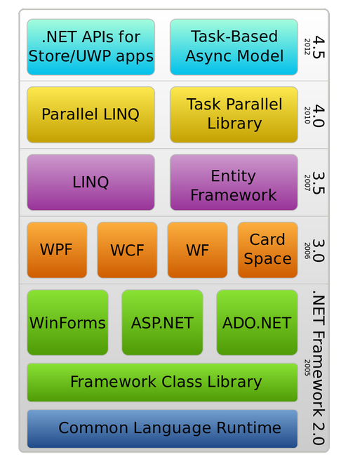

## Sommaire

- .NET en bref
- La ligne de commande .NET

---

## .NET en bref

---

### Aux origines de .NET

- Plate-forme de développement d'applications créée par Microsoft en 2002.
- Réponse à la domination du langage Java (multi-plateformes).
- Inclut plusieurs langages de programmation : C#, VB.NET, F#, PowerShell...
- Uniquement disponible sous Windows.
- Licence propriétaire.

---

---

{}

### Architecture technique de .NET

- Une application .NET s'exécute dans un environnement contrôlé appelé **CLR** (_Common Language Runtime_).
- La compilation du code source produit un résultat indépendant du système d'exploitation, conformément à un standard nommé **CLI** (_Common Language Infrastructure_).

---

{}

---

### .NET Framework et .NET Core

- [2004](https://www.mono-project.com/docs/about-mono/history/) : le projet **Mono**, indépendant de Microsoft, débute le portage de .NET vers Linux.
- [2014](https://devblogs.microsoft.com/dotnet/net-core-is-open-source/) : Microsoft publie **.NET Core**, la première version open source et multi-plateformes de .NET. La version WIndows-only de .NET est renommée **.NET Framework**.
- [2019](https://devblogs.microsoft.com/dotnet/net-core-is-the-future-of-net/) : la nouvelle version de .NET Core est renommée **.NET**, et .NET Framework passe en mode maintenance.

---

---

## La ligne de commande .NET

---

### Introduction

- **.NET CLI** (_Command Line Interface_) permet d'interagir avec .NET depuis un terminal.
- Nécessite que .NET soit installé sur la machine.
- Syntaxe : `dotnet <commande> <options>`

---

### Création d'une application

`> dotnet new <template> -o <output directory>`

| Type d'application      | Template   |
| ----------------------- | ---------- |
| Console                 | `console`  |
| Bibliothèque de classes | `classlib` |
| ASP.NET (vide)          | `web`      |
| ASP.NET (API)           | `webapi`   |
| ASP.NET (MVC)           | `mvc`      |

---

### Ajout de packages

`> dotnet add package <name>`

- Utilise [NuGet](https://www.nuget.org/) en arrière-plan.
- Vérifie la compatibilité du package à installer avec le projet.

---

### Listage des packages installés

`> dotnet list package`

---

### Lancement d'une application

`> dotnet run`

Si nécessaire, effectue la restauration des dépendances du projet (équivalent de `dotnet restore`).

---

### Surveillance des changements

`> dotnet watch run`

Pour une application web, jnjecte un script qui met à jour le contenu affiché par le navigateur lorsque des fichiers surveillés sont modifiés.

---

### Autres possibilités

- Nettoyage, test, publication, gestion des packages installés, etc.
- [Plus d'informations](https://docs.microsoft.com/en-us/dotnet/core/tools/).
