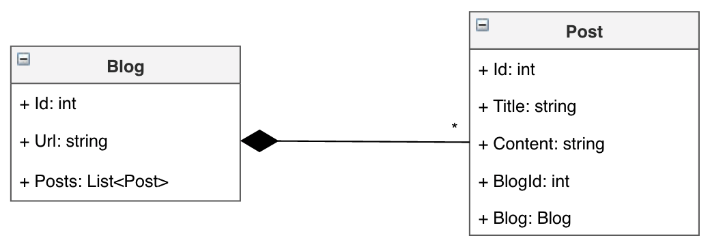

## Sommaire

- Des objets et des tables
- Présentation d'EF Core
- Mise en oeuvre d'EF Core
- Mapping d'un modèle métier

---

## Des objets et des tables

---

### Les données persistantes

- Ne disparaissent pas entre deux utilisations d'une application.
- Contraire : données _volatiles_.
- Indispensable pour une très grande majorité des applications (données métier, configuration, etc).
- Leur stockage nécessite :
  - un support dédié, appelé parfois mémoire de masse (disque dur, SSD, mémoire Flash, etc) ;
  - un format adapté.

---

### Les SGBDR et leurs avantages

- Standard actuel pour la gestion de données persistantes.
- Technologie connue depuis les années 1970.
- Fiabilité.
- Capacité à gérer de forts volumes de données.
- Sécurité (authentification, réplication, etc).
- Langage d’interrogation (SQL) standard.
- Offre logicielle riche : de ORACLE à SQLite en passant par PostgreSQL, MySQL/MariaDB ou SQL Server.

---

### Le modèle relationnel

- Unité de représentation : table.
- Caractéristiques : colonnes.
- Entité : tuple (ligne).
- Types de données : simples (nombres, chaîne, date, etc).
- Identifiant : explicite (clé primaire).
- Relations entre éléments : jointures SQL.
- Concepts spécifiques : déclencheurs, procédures stockées...

---

### Le modèle objet

- Unité de représentation : classe.
- Caractéristiques : propriétés et méthodes.
- Entité : objet.
- Types de données : simples ou complexes.
- Identifiant : implicite (référence mémoire).
- Relations entre éléments : navigation des associations.
- Concepts spécifiques : encapsulation, héritage, interfaces...

---

{}

### Object/Relational Mapping (O/RM)

- Lien entre une base de données et les objets manipulés par l’application.
- Deux modèles très éloignés ("[Impedance mismatch](https://en.wikipedia.org/wiki/Object%E2%80%93relational_impedance_mismatch)").
- Pas de solution idéale.

---

### ["O/RM is the Vietnam of Computer Science"](https://blog.codinghorror.com/object-relational-mapping-is-the-vietnam-of-computer-science/)


{}

---

### Solutions possibles pour l'O/RM

- Approches radicales : suppression du SGBDR (utilisation d'une autre technologie de stockage) ou des objets (programmation procédurale ou fonctionnelle).
- O/RM manuel : gestion de la (dé)connexion, requêtage avec SQL puis transformation des résultats en objets, etc doivent être codées.
- O/RM automatisé : utilisation d'un outil dédié pour gérer les problématiques précédentes. Le requêtage SQL est effectué par l'outil.

---

### O/RM automatisé, un bon choix ?

- Avantages :
  - Automatisation de la gestion du _mapping_.
  - Diminution du volume de code.
  - Mise en œuvre de bonnes pratiques.
  - Performances (le plus souvent).
- Inconvénients :
  - Nécessité de maitriser un outil dédié.
  - Certaines limitations liées à l’outil.
  - Aspect "boîte noire".
  - Performances (dans certains cas).

---

## Présentation d'EF Core

---

### Entity Framework Core

- Outil d'O/RM [open source](https://github.com/dotnet/efcore) maintenu par Microsoft.
- Supporte de nombreux SGDBR : SQL Server, SQLite, MySQL/MariaDB, PostgreSQL, etc.
- Standard pour l'accès aux données persistantes dans l'environnement ASP.NET Core.

---

### SQLite

- SGBDR minimaliste mais suffisamment fiable, complet et performant pour la plupart des usages standards.
- Toute la base de données tient dans un seul fichier de quelques dizaines/centaines de Ko.
- ["Le SGBD le plus utilisé dans le monde"](https://sqlite.org/mostdeployed.html).

[](https://sqlite.org)

---

### Installation d'EF Core pour SQLite

Installation globale de l'outil EF Core CLI :

`> dotnet tool install --global dotnet-ef`

Installation des packages nécessaires dans le répertoire du projet :

`> dotnet add package Microsoft.EntityFrameworkCore.Design`

`> dotnet add package Microsoft.EntityFrameworkCore.Sqlite`

---

### Support de SQLite par EF Core

- Des [fournisseurs de données](https://docs.microsoft.com/en-us/ef/core/providers/?tabs=dotnet-core-cli) permettent l'utilisation de EF Core avec un grand nombre de sources de données, dont SQLite.
- Son fournisseur possède cependant certaines petites [limitations](https://docs.microsoft.com/en-us/ef/core/providers/sqlite/limitations).

---

### Principe de fonctionnement d'EF Core

- **Modèle** : un ensemble de classes POCO, parfois appelées _classes métier_, qui modélisent les entités manipulées par l'application.
- **Contexte BD** : une classe héritant de `DbContext` qui représente une session d'échanges (lecture/écriture de données) avec une BD. Elle spécifie les classes du modèle à synchroniser avec la BD.
- **BD** : la base de données dans laquelle les instances du modèle sont lues/écrites.

---

### Migrations

- Approche _**code first**_ : le modèle objet constitue la modélisation de référence. La base de données est automatiquement synchronisée avec lui.
- [Migrations](https://docs.microsoft.com/en-us/ef/core/managing-schemas/migrations/?tabs=dotnet-core-cli) : modifications incrémentales du schéma relationnel reflétant les évolutions du modèle.

---

### Commandes liées aux migrations

`> dotnet ef migrations add {MigrationName}`

Crée une nouvelle migration dans le répertoire **Migrations/** du projet. Elle contient les mises à jour à réaliser au niveau du schéma relationnel pour le synchroniser avec le modèle objet.

`> dotnet ef database update`

Synchronise la base de données configurée par le contexte BD avec la migration la plus récente.

---

### Interactions avec la BD

- L'instanciation d'un contexte BD permet de débuter une session de travail avec la base de données.
- Sa méthode `SaveChanges()` implante dans la BD tous les changements ayant eu lieu depuis l'ouverture de la session.

```csharp
using (var context = new {App}Context())
{
    // ... (Opérations on model classes)

    // Synchronize all changes with database
    context.SaveChanges();
}
```

---

## Mise en oeuvre d'EF Core

---

### Exemple de modèle métier



---

### Création de l'application

```bash
dotnet new console -o {AppName}
cd {AppName}
dotnet new gitignore
dotnet add package Microsoft.EntityFrameworkCore.Design
dotnet add package Microsoft.EntityFrameworkCore.Sqlite
```

```csproj
<Project Sdk="Microsoft.NET.Sdk">

  <PropertyGroup>
    <OutputType>Exe</OutputType>
    <TargetFramework>net6.0</TargetFramework>
    <ImplicitUsings>enable</ImplicitUsings>
    <Nullable>disable</Nullable> <!-- A MODIFIER -->
  </PropertyGroup>

  <ItemGroup>
    <PackageReference Include="Microsoft.EntityFrameworkCore.Design" Version="6.0.9">
      <IncludeAssets>runtime; build; native; contentfiles; analyzers; buildtransitive</IncludeAssets>
      <PrivateAssets>all</PrivateAssets>
    </PackageReference>
    <PackageReference Include="Microsoft.EntityFrameworkCore.Sqlite" Version="6.0.9" />
  </ItemGroup>

</Project>

```

---

### Implémentation du modèle

Chaque classe est codée dans son propre fichier `.cs`, dans le sous-répertoire `Models/` du projet.

```csharp
public class Blog
{
    public int Id { get; set; }
    public string Url { get; set; }
    public List<Post> Posts { get; } = new List<Post>();
}
```

```csharp
public class Post
{
    public int Id { get; set; }
    public string Title { get; set; }
    public string Content { get; set; }
    public int BlogId { get; set; }
    public Blog Blog { get; set; }
}
```

---

### Création du contexte BD

Classe créée dans le sous-répertoire `Data/` du projet.

```csharp
using Microsoft.EntityFrameworkCore;
using Microsoft.Extensions.Logging;

public class BloggingContext : DbContext
{
    public DbSet<Blog> Blogs { get; set; }
    public DbSet<Post> Posts { get; set; }

    public string DbPath { get; private set; }

    public BloggingContext()
    {
        // Path to SQLite database file
        DbPath = "EFGetStarted.db";
    }

    // The following configures EF to create a SQLite database file locally
    protected override void OnConfiguring(DbContextOptionsBuilder options)
    {
        // Use SQLite as database
        options.UseSqlite($"Data Source={DbPath}");
        // Optional: log SQL queries to console
        options.LogTo(Console.WriteLine, new[] { DbLoggerCategory.Database.Command.Name }, LogLevel.Information);
    }
}

```

---

### Initialisation de la base de données

(`dotnet-ef` doit avoir été installé globalement)

```bash
dotnet ef migrations add InitialCreate
dotnet ef database update
```

---

### Extrait de la migration créée

```csharp
migrationBuilder.CreateTable(
    name: "Blogs",
    columns: table => new
    {
        Id = table.Column<int>(type: "INTEGER", nullable: false)
            .Annotation("Sqlite:Autoincrement", true),
        Url = table.Column<string>(type: "TEXT", nullable: true)
    },
    constraints: table =>
    {
        table.PrimaryKey("PK_Blogs", x => x.Id);
    });
```

---

### Base de données créée

Capture d'écran de [DB Browser pour SQLite](https://sqlitebrowser.org/) :


La colonne `BlogId` est une clé étrangère vers la colonne `Id` de la table `Blogs`.

---

### Structure de l'application

<https://github.com/ensc-glog/EFGetStarted>


---

### Opérations CRUD

```csharp
using (var context = new BloggingContext())
{
    Console.WriteLine("--- Inserting a new blog ---");
    context.Add(new Blog { Url = "http://blogs.msdn.com/adonet" });
    context.SaveChanges();

    Console.WriteLine("--- Retrieve blog with lowest id ---");
    var blog = context.Blogs
        .OrderBy(b => b.Id)
        .First();

    Console.WriteLine("--- Updating the blog and adding a post ---");
    blog.Url = "https://devblogs.microsoft.com/dotnet";
    blog.Posts.Add(
        new Post { Title = "Hello World", Content = "I wrote an app using EF Core!" });
    context.SaveChanges();

    Console.WriteLine("--- Deleting the blog ---");
    context.Remove(blog);
    context.SaveChanges();
}
```

---

### Requêtage avec LINQ

[Language Integrated Query (LINQ)](https://docs.microsoft.com/en-us/dotnet/csharp/programming-guide/concepts/linq/) est le langage standard pour le requêtage en C#, quelle que soit la source de données (SGBDR, XML, service web, etc).

```csharp
using (var context = new BloggingContext())
{
    // Retrieve a list of blogs with a rating greater than 3,
    // ordered by URL
    var blogs = context.Blogs
        .Where(b => b.Rating > 3)
        .OrderBy(b => b.Url)
        .ToList();
}
```

---

### Exemples d'utilisation de LINQ

```csharp
using (var context = new BloggingContext())
{
    // Get all blogs
    var blogs = context.Blogs.ToList();
    // Get the blog with id 1
    var blog = context.Blogs
        .Single(b => b.Id == 1);
    // Get all blogs containing "dotnet" in their URL
    var blogs = context.Blogs
        .Where(b => b.Url.Contains("dotnet"))
        .ToList();
}
```

Plus de détails :

- [Querying data](https://docs.microsoft.com/en-us/ef/core/querying/)
- [Basic LINQ Query Operations](https://learn.microsoft.com/en-us/dotnet/csharp/programming-guide/concepts/linq/basic-linq-query-operations)

---

### Syntaxe alternative pour LINQ

Pour plus de souplesse, il est possible de manipuler des requêtes LINQ en tant que variables.

```csharp
using (var context = new BloggingContext())
{
    // Get all blogs containing "dotnet" in their URL
    var query = from b in context.Blogs
                select b;
    query = query.Where(b => b.Url.Contains("dotnet"));
    var blogs = query.ToList();
}
```

---

## Mapping d'un modèle métier

---

### Configuration du modèle

Effectuée via des [annotations](https://docs.microsoft.com/en-us/ef/core/modeling/entity-properties?tabs=data-annotations%2Cwithout-nrt) dans les classes du modèle.

```csharp
public class Blog
{
    public int Id { get; set; }

    [StringLength(200, MinimumLength = 7), Required]
    public string Url { get; set; }

    [Display(Name = "Average Rating")]
    [Column(TypeName = "decimal(5, 2)")]
    [DisplayFormat(NullDisplayText = "No rating")]
    public decimal? Rating { get; set; }

    // ...
```

---

### Propriétés obligatoires et optionnelles

- Une propriété est considérée comme optionnelle si elle peut contenir `null`. La colonne BD associée accepte les valeurs nulles.
- L'attribut `[Required]` permet de rendre obligatoire une propriété ayant un type référence (exemple : `string`).
- L'utilisation d'un [type valeur nullable](https://docs.microsoft.com/en-us/dotnet/csharp/language-reference/builtin-types/nullable-value-types) (exemples : `int?`, `bool?`) rend la propriété optionnelle.

---

### Clés primaires

- Une propriété nommée `Id` ou `{NomDeLaClasse}Id` est considérée comme clé primaire.
- Par défaut, une stratégie d'[auto-génération des valeurs](https://docs.microsoft.com/en-us/ef/core/modeling/generated-properties?tabs=data-annotations) est utilisée.
- [Plus de détails](https://docs.microsoft.com/en-us/ef/core/modeling/keys?tabs=data-annotations).

---

### Mapping des associations

- Une propriété utilisant un type autre que scalaire est dite **propriété de navigation**.
- La détection d'une propriété de navigation entraine la création d'une **relation** entre les deux classes impliquées.
- Cette relation se traduit dans la base de données par la création d'une **clé étrangère** dans la table associée à la classe dépendante (fille) de la relation.
- [Plus de détails](https://learn.microsoft.com/en-us/ef/core/modeling/relationships).

---

### Association un-à-plusieurs

- Propriété de navigation de type collection dans la classe principale (mère).
- Propriété de navigation et propriété de clé étrangère dans la classe dépendante (fille).

```csharp
public class Blog
{
    public int Id { get; set; }
    // ...
    public List<Post> Posts { get; set; } = new List<Post>();
}
public class Post
{
    public int Id { get; set; }
    // ...
    public int BlogId { get; set; } // FK
    public Blog Blog { get; set; } // Navigation
}
```

---

### Association un-à-un

```csharp
public class Blog
{
    public int Id { get; set; }
    // ...
    public BlogImage BlogImage { get; set; }
}
public class BlogImage
{
    public int Id { get; set; }
    public byte[] Image { get; set; }
    public string Caption { get; set; }
    public int BlogId { get; set; } // FK
    public Blog Blog { get; set; }
}
```

---

### Association plusieurs-à-plusieurs

Entraîne la création d'une table de jointure contenant deux clés étrangères dans la base de données.

```csharp
public class Post
{
    public int Id { get; set; }
    // ...
    public ICollection<Tag> Tags { get; set; }
}
public class Tag
{
    public string Id { get; set; }
    public ICollection<Post> Posts { get; set; }
}
```

---

### Chargement des Associations

- Les méthodes `.Include()` et `.ThenInclude()` permettent de spécifier les données associées à inclure dans les résultats d'une requête.
- Ce mécanisme est appelé [chargement hâtif](https://docs.microsoft.com/en-us/ef/core/querying/related-data/eager) (_eager loading_).

```csharp
using (var context = new BloggingContext())
{
    // Load posts for each blog
    // Uncomment the .ThenInclude line to load post author
    var blogs = context.Blogs
        .Include(blog => blog.Posts)
        // .ThenInclude(post => post.Author)
        .ToList();
}
```

---

### Mapping de l'héritage

- Problème épineux : les SGBDR ne supportent pas le concept d’héritage.
- Plusieurs stratégies possibles, avec chacune des avantages et des inconvénients :
  - une table pour toute la hiérarchie (TPH) ;
  - une table par classe concrète (TPC) ;
  - une table par type (TPT).
- Le choix dépend du contexte. Donnée-clé : nombre de propriétés communes.
- [Plus de détails](https://learn.microsoft.com/en-us/ef/core/modeling/inheritance).

---

### La stratégie TPH avec EF Core

- Solution par défaut (souvent la plus simple).
- Ajoute à l'unique table qui mappe la hiérarchie :
  - une colonne par propriété de chacune des classes de la hiérarchie ;
  - une colonne `Discriminator` qui détermine le type concret de l'objet stocké en BD.

---

### Exemple de mapping de l'héritage

```csharp
internal class BloggingContext : DbContext
{
    public DbSet<Blog> Blogs { get; set; }
    public DbSet<RssBlog> RssBlogs { get; set; }
    // ...
}

public class Blog
{
    public int BlogId { get; set; }
    // ...
}

public class RssBlog : Blog
{
    public string RssUrl { get; set; }
    // ...
}
```

---

### Schéma BD après migration

```bash
dotnet ef migrations add RssBlog
dotnet ef database update
```


