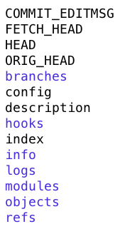
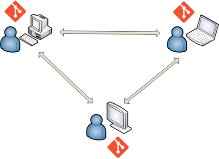
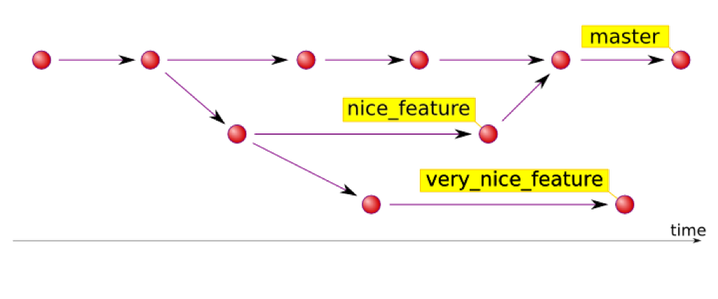

## Summary

- Git from the command line

---

### The need for source code management

- Source code is the core of any software project.
- These projects have a long lifespan, with numerous releases containing new functionalities and bug fixes.
- Throughout this lifespan, the development team needs a way to work in parallel while sharing a common code base.

---

### Manual source code management

- Relies on shared places (local or cloud-based) where snapshots of the code base are regularly pushed by developers.
- Highly impractical: no individual history of files, no release management, no handling of conflicts (simultaneous updates of a file)...

---

### Version Control Systems

Dedicated source code management tools, often called **Version Control Systems**, offer developers the ability to:

- share and update a common code base;
- work on new features and fixes without breaking current versions;
- track who did what;
- handle conflicts;
- and more!

---

{}

### Centralized VCS

- Uses only one repository, accessed by developers in a client/server way.
- Repo administration (security, backups...) is easy.
- Synchronization is impossible in a disconnected scenario.
- Examples: CVS, SVN, ClearCase.

---

{}

---

{}

### Decentralized VCS

- Each developer has its own code repository, including history and all other metadata.
- Repositories are frequently synchronized in a peer-to-peer way.
- Disconnected workflows become possible.
- Examples: Git, Mercurial.

---

{}

---

### Git in a nutshell

- Free and open source DVCS designed in 2005 to manage the Linux kernel source code.
- Has become the standard tool for versioning software.
- Can handle any text-based project: knowledge bases, books, etc.

---

### The Git repository

- Storage place for all versioning data: source code, history, versions, remote addresses...
- Corresponds physically to a `.git/` subdirectory in the project folder, with a [complex internal structure](https://git-scm.com/docs/gitrepository-layout).

---

### The .gitignore file

- Some project files don't need to be versioned:
  - generation output;
  - local settings;
  - ...
- Added in the root folder, the `.gitignore` file defines files and folders excluded from the repository.
- [This repository](https://github.com/github/gitignore) contains standard `.gitignore` files for many environments: Python, .NET, JavaScript...

---

### Working with repos

- Developers work locally, regularly archiving their code into their local repo.
- Repos are kept in sync through specific commands.

---

### The Git workflow

1. Update files in project folder, aka _working directory_.
1. Add files to index, aka _staging area_.
1. Commit indexed files into the current branch, aka _HEAD_.

---

### Branches

Branches allow parallel work in isolated contexts, for:

- new features;
- bug fixes;
- experimentations;
- ...

---

### Working with branches

- Only one branch can be active at a time.
- The content of a branch can be _merged_ into another. Once merged, a temporary branch should be destroyed.
- The default branch is named `master` (sometimes renamed `main`). In general, it is considered the "production" branch and must be kept stable: commits or merges on this branch must not introduce generation errors or regressions.
- _HEAD_ refers to the most recent commit of the active branch.

---

## Git from the command line

---

### Configuration

| Command                                                | Role           |
| ------------------------------------------------------ | -------------- |
| `git config --global user.email "{email}"`             | Set user email |
| `git config --global user.name "{firstname lastname}"` | Set user name  |

---

### Setup

| Command           | Role                                             |
| ----------------- | ------------------------------------------------ |
| `git init`        | Create an empty repository in the current folder |
| `git clone {url}` | Clone a remote repository located at `{url}`     |

---

### Working locally

| Command                     | Role                                       |
| --------------------------- | ------------------------------------------ |
| `git status`                | Show status of working directory and index |
| `git add {file}`            | Add `{file}` to index                      |
| `git add -A`                | Add all new or modified files to index     |
| `git commit -m "{message}"` | Commit indexed files to current branch     |
| `git log`                   | Show commit history                        |

---

### Managing branches

| Command                 | Role                                  |
| ----------------------- | ------------------------------------- |
| `git branch`            | List existing branches                |
| `git branch {branch}`   | Create a new branch named `{branch}`  |
| `git checkout {branch}` | Switch to `{branch}`                  |
| `git merge {branch}`    | Merge `{branch}` into the current one |

---

### Undoing things (file level)

| Command                        | Role                                                    |
| ------------------------------ | ------------------------------------------------------- |
| `git checkout {file}`          | Overwrite `{file}` with latest committed version        |
| `git checkout HEAD~{n} {file}` | Overwrite `{file}` with `{n}`-to-last committed version |
| `git checkout {commit} {file}` | Overwrite `{file}` with `{commit}` version              |
| `git reset {file}`             | Remove `{file}` from index                              |

---

### Undoing things (unshared changes)

| Command                     | Role                                               |
| --------------------------- | -------------------------------------------------- |
| `git reset`                 | Remove all files from index                        |
| `git reset --hard HEAD~{n}` | Return to `{n}`-to-last commit, losing all updates |

([More details and options](https://stackoverflow.com/a/6866485))

---

### Collaborating

| Command                        | Role                |
| ------------------------------ | ------------------- |
| `git remote add {alias} {url}` | Add a remote branch |
| `git push -u {alias} {branch}` | Add a remote branch |
