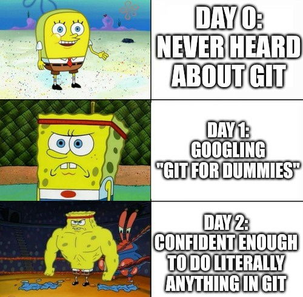
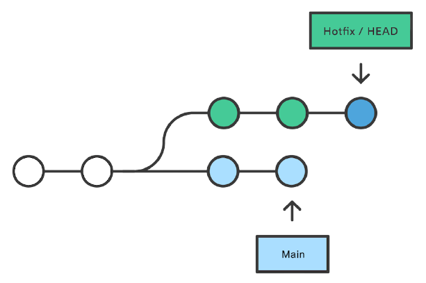
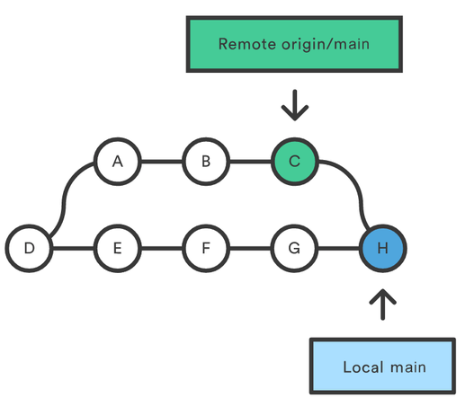
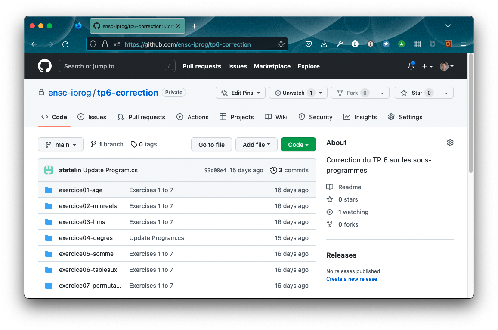
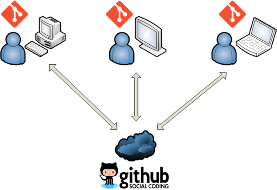
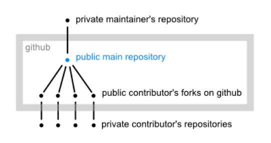

## Summary

- Introduction to software version control
- Git fundamentals
- Collaborating with Git
- Git from the command line
- GitHub

---

## Introduction to software version control

---

### The need for source code management

- Source code is the core of any software project.
- These projects have a long lifespan, with numerous releases containing new functionalities and bug fixes.
- Throughout this lifespan, the development team needs a way to work in parallel while sharing a common code base.

---

### Manual source code management

- Relies on shared places (local or cloud-based) where snapshots of the code base are regularly pushed by developers.
- Highly impractical: no individual history of files, no release management, no handling of conflicts (simultaneous updates of a file)...

---

### Version Control Systems

Dedicated source code management tools, often called **Version Control Systems**, offer developers the ability to:

- share and update a common code base;
- work on new features and fixes without breaking current versions;
- track who did what;
- handle conflicts;
- and more!

---

{}

### Centralized VCS

- Uses only one repository, accessed by developers in a client/server way.
- Repo administration (security, backups...) is easy.
- Synchronization is impossible in a disconnected scenario.
- Examples: CVS, SVN, ClearCase.

---


{}

---

{}

### Decentralized VCS

- Each developer has its own code repository, including history and all other metadata.
- Repositories are frequently synchronized in a peer-to-peer way.
- Disconnected workflows become possible.
- Examples: Git, Mercurial.

---


{}

---

## Git fundamentals

---

### Git in a nutshell

- Free and open source DVCS published in 2005 to manage the Linux kernel source code.
- Has become the standard tool for versioning software.
- Can handle any text-based project: knowledge bases, books, etc.
- Designed as a command line tool.

[](https://git-scm.com/)

---

### Git is not (that) hard



---

### The Git repository

- Storage place for all versioning data: source code, history, versions, remote addresses...
- Corresponds physically to a `.git/` subdirectory in the project folder, with a [complex internal structure](https://git-scm.com/docs/gitrepository-layout).


---

### The .gitignore file

- Some project files don't need to be versioned:
  - generation output;
  - local settings;
  - ...
- Added in the root folder, the `.gitignore` file defines files and folders excluded from the repository.
- [This repository](https://github.com/github/gitignore) contains standard `.gitignore` files for many environments: Python, .NET, JavaScript...

---

### The Git workflow

1. Update files in project folder, aka _working directory_.
1. Add files to index, aka _staging area_.
1. Commit indexed files into the current branch, aka _HEAD_.


---

### Branches

Branches allow parallel work in isolated contexts, for:

- new features;
- bug fixes;
- experimentations;
- ...


---

### Working with branches

- Only one branch can be active at a time.
- The content of a branch can be _merged_ into another. Once merged, a temporary branch should be destroyed.
- The default branch is named `master` (sometimes renamed `main`). In general, it is considered the "production" branch and must be kept stable: commits or merges on this branch must not introduce generation errors or regressions.

---

### HEAD

_HEAD_ is an alias to the most recent commit of the active branch.

[](https://www.atlassian.com/git/tutorials/resetting-checking-out-and-reverting)

---

### Under the hood

- Git uses the [SHA-1](https://en.wikipedia.org/wiki/SHA-1) hash of content to create references to commits.
- A commit object stores the metadata about a commit, such as the parent, the author, timestamps and references to the file tree of this commit.

---

### Git LFS

- [Large File System](https://git-lfs.github.com/): Git extension for versioning large files.
- The files live on an external server. Only references to them are stored in the Git repository.
- Usage examples: audio and graphical assets, datasets...

---

## Collaborating with Git

---

### Collaboration workflow

- Developers work locally, regularly commiting their code into their local repo.
- Repos are kept in sync through specific commands.


---

### Remote repositories

- Git repos that are hosted somewhere on the Internet or local network.
- Can be:

  - _cloned_ to create a local copy;
  - _fetched_ to obtain remote updates, that can be _merged_ into a local branch thereafter;
  - _pushed to_ to send local updates.

- Identified by a **remote alias** (named _origin_ after cloning a repo).

---

### Remote Git workflow


---

### Pulling changes

- Pulling = fetching & merging.
- Creates a new _merge commit_.

[](https://www.atlassian.com/git/tutorials/syncing/git-pull)

---

### Conflicts

- Simultaneous file updates on different machines can result in _conflicts_ during repos syncing.
- Git can resolve some of them by automerging files... But not all!

---


---

### Manual conflict management

- Typically, the second developer trying to push his/her updates receives a "non fast-forward" error.
- He/she has to _pull_ remote updates first.
- Files Git cannot automerge contain [conflict markers](https://wincent.com/wiki/Understanding_Git_conflict_markers). A manual merging is needed before commiting and pushing again.

```git
<<<<<<< HEAD
# My Git project
=======
# My git project
>>>>>>> c1129dfbbe585fc94978be38625b5ae7f63474bf
```

---

## Git from the command line

---

### Configuration

| Command                                                | Role           |
| ------------------------------------------------------ | -------------- |
| `git config --global user.email "{email}"`             | Set user email |
| `git config --global user.name "{firstname lastname}"` | Set user name  |

---

### Setup

| Command           | Role                                             |
| ----------------- | ------------------------------------------------ |
| `git init`        | Create an empty repository in the current folder |
| `git clone {url}` | Clone an existing repository located at `{url}`  |

---

### Working locally

| Command                     | Role                                       |
| --------------------------- | ------------------------------------------ |
| `git status`                | Show status of working directory and index |
| `git add {file}`            | Add `{file}` to index                      |
| `git add -A`                | Add all new or modified files to index     |
| `git commit -m "{message}"` | Commit indexed files to current branch     |
| `git log`                   | Show commit history                        |

---

### Managing branches

| Command                  | Role                                          |
| ------------------------ | --------------------------------------------- |
| `git branch`             | List existing branches                        |
| `git branch {branch}`    | Create a new branch named `{branch}`          |
| `git checkout {branch}`  | Switch to `{branch}`                          |
| `git merge {branch}`     | Merge `{branch}` commits into the current one |
| `git branch -d {branch}` | Delete `{branch}`                             |

---

### Undoing things

| Command                     | Role                                               |
| --------------------------- | -------------------------------------------------- |
| `git checkout {file}`       | Overwrite `{file}` with latest committed version   |
| `git reset {file}`          | Remove `{file}` from index                         |
| `git reset`                 | Empty index                                        |
| `git reset --hard HEAD~{n}` | Return to `{n}`-to-last commit, losing all updates |

(More details and options [here](https://www.atlassian.com/git/tutorials/resetting-checking-out-and-reverting) and [here](https://stackoverflow.com/a/6866485))

---

### Collaborating

| Command                        | Role                                         |
| ------------------------------ | -------------------------------------------- |
| `git remote add {alias} {url}` | Add a remote repository                      |
| `git remote -v`                | List remote repositories                     |
| `git pull {alias} {branch}`    | Fetch & merge remote commits into `{branch}` |
| `git push {alias} {branch}`    | Push `{branch}` commits to a remote repo     |

---

### Additional resources

- [What is version control?](https://www.atlassian.com/git/tutorials/what-is-version-control)
- [Git - the simple guide](http://rogerdudler.github.io/git-guide/)
- [Learn Git branching](https://learngitbranching.js.org)
- [Git cheat sheet](https://github.com/mikeizbicki/ucr-cs100/blob/2015winter/textbook/cheatsheets/git-cheatsheet.md)
- [Another Git cheat sheet](https://education.github.com/git-cheat-sheet-education.pdf)
- [Yet another Git cheat sheet](https://ndpsoftware.com/git-cheatsheet.html)
- [The Git game](https://github.com/git-game/git-game)
- [Oh sh.t, Git!?!](https://ohshitgit.com/)

---

## GitHub

---

### GitHub in a nutshell

- [GitHub](https://github.com/) is a code hosting platform for version control and collaboration.
- Its main purpose is the hosting of Git repositories.
- Launched in 2008, it has been acquired by Microsoft in 2018 for $7.5 billion.
- As of December 2021, it has approx. 73 million users worldwide.
- GitHub is the central hub for open source projects.
- Main alternatives are [BitBucket](https://bitbucket.org) and [GitLab](https://about.gitlab.com/).

---

### GitHub repo example



---

### The shared repository model

- A GitHub repo centralizes team updates.
- Efficient for small teams and small-to-average-sized projects.



---

### The "fork & pull" model

- Each developer _forks_ ($\approx$ clone on GitHub) the original repository.
- Updates are pushed to the forks, then proposed to the original repo through [Pull Requests](https://docs.github.com/en/pull-requests/collaborating-with-pull-requests/proposing-changes-to-your-work-with-pull-requests/about-pull-requests).
- Efficient for large organizations or public projects.



---

### Other features and services

- [Issues](https://docs.github.com/en/issues/tracking-your-work-with-issues/about-issues) are used to track ideas, feedback, tasks, or bugs.
- [Gists](https://docs.github.com/en/github/writing-on-github/editing-and-sharing-content-with-gists/creating-gists) are single pieces of code that can be forked and cloned like repositories.
- [Project boards](https://docs.github.com/en/issues/organizing-your-work-with-project-boards/managing-project-boards/about-project-boards) offer a Kanban-like interface for organizing and prioritizing work.
- [Codespaces](https://github.com/features/codespaces) is a cloud-based development environment mimicking Visual Studio Code.
- [Copilot](https://copilot.github.com/) is an AI-based code suggestion service.
- ...
