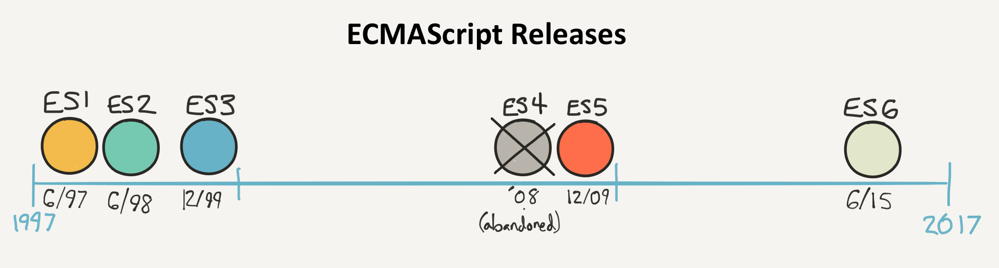

## Sommaire

- Pourquoi JavaScript ?
- Syntaxe du langage
- Environnement de travail
- TypeScript

---

## Pourquoi JavaScript ?

---

### JavaScript is eating the world


---

### Un pré-requis essentiel

La majorité des solutions mobiles multi-plateformes est basée sur JavaScript.


---

### Un langage modernisé

JavaScript est normalisé sous le nom **ECMAScript**.



La norme **ES2015** (ou ES6) a apporté de très nombreuses améliorations au langage.

---

## Syntaxe du langage

---

### Déclaration de variables

JavaScript est un langage à typage **dynamique**.

`let` et `const` remplacent avantageusement `var` pour la déclaration des variables.

La valeur d'une variable déclarée avec `const` ne peut plus être modifiée.

```js
let a = 3.14;
a = 6.28; // OK

const b = 3.14;
b = 6.28; // Erreur!
```

---

### Chaînes de caractères

Créées avec des guillemets simples (`'...'`) ou doubles (`"..."`).

**Litéraux de modèle**: chaînes créées entre _backticks_ (\`) et permettant d'intégrer des expressions.

```js
const country = "France"; // or 'France'
console.log(`I live in ${country}`); // "I live in France"
```

---

### Déclaration de fonctions

```js
function sayHello(name) {
  const message = `Hello, ${name}!`;
  return message;
}

console.log(sayHello("Richard")); // "Hello, Richard!"
```

---

### Expressions fonction

Permettent de créer des fonctions anonymes.

La valeur d'une variable JavaScript peut être une fonction.

```js
const hello = function (name) {
  const message = `Hello, ${name}!`;
  return message;
};

console.log(hello("Richard")); // "Hello, Richard!"
```

---

### Fonctions fléchées

"_Fat arrow functions_".

Syntaxe plus concise pour créer des fonctions anonymes.

```js
const hello = (name) => {
  const message = `Hello, ${name}!`;
  return message;
};

// Syntaxe alternative encore plus concise
// const hello = name => `Hello, ${name}!`;

console.log(hello("Richard")); // "Hello, Richard!"
```

---

### Tableaux

Plusieurs syntaxes existent pour les parcourir.

```js
const movies = ["The Wolf of Wall Street", "Zootopia", "Babysitting"];
console.log(movies.length); // 3

for (let i = 0; i < movies.length; i++) {
  // Use movies[i] to access each array element one by one
}

movies.forEach((movie) => {
  // Use movie to access each array element one by one
});

for (const movie of movies) {
  // Use movie to access each array element one by one
}
```

---

### Objets

Un objet JavaScript regroupe un ensemble de **propriétés** (paire clé/valeur).

```js
// Création d'un objet litéral
const pen = {
  type: "ballpoint",
  color: "blue",
  brand: "Bic",
};

// Modifcation de la valeur d'une propriété
pen.color = "red";

console.log(pen.type); // "ballpoint"
console.log(pen.color); // "red"
console.log(pen.brand); // "Bic"
```

---

### Création d'objets à partir de variables

```js
const firstName = "Baptiste";
const lastName = "Pesquet";
const twitterHandle = "@bpesquet";

const teacher = { firstName, lastName, twitterHandle };

console.log(teacher.firstName); // "Baptiste"
console.log(teacher.lastName); // "Pesquet"
console.log(teacher.twitterHandle); // "@bpesquet"
```

---

### Déstructuration d'objets

```js
const pen = {
  type: "ballpoint",
  color: "blue",
  brand: "Bic",
};

// Accès à 2 des propriétés de l'objet
const { color, brand } = pen;

console.log(color); // "blue"
console.log(brand); // "Bic"
```

---

### Déstructuration de tableaux

```js
const primaryColors = ["red", "green", "blue"];

const [red, green, blue] = primaryColors;

console.log(red); // "red"
console.log(green); // "red"
console.log(blue); // "blue"
```

---

### Opérateur de décomposition ("_spread_")

Permet de développer une valeur itérable (chaîne, tableau...).

```js
const chaine = "foo bar";
console.log(chaine); // "foo bar"
console.log([...chaine]); // ["f", "o", "o", " ", "b", "a", "r"]

const numbers = ["one", "two", "three", "four"];

const [one, two, ...rest] = numbers;

console.log(one); // "one"
console.log(two); // "two"
console.log(rest); // ["three", "four"]
```

---

### Notion de méthode

La valeur d'une propriété peut être une donnée ou une fonction. Dans le second cas, la propriété est une **méthode**.

```js
const aurora = {
  name: "Aurora",
  health: 150,
  strength: 25,

  // Renvoie la description du personnage
  describe() {
    return `${this.name} has ${this.health} health points
      and ${this.strength} as strength`;
  },
};
```

---

### Classes

```js
class Character {
  constructor(name, health, strength) {
    this.name = name;
    this.health = health;
    this.strength = strength;
  }
  describe() {
    return `${this.name} has ${this.health} health points
      and ${this.strength} as strength`;
  }
}

const aurora = new Character("Aurora", 150, 25);
console.log(aurora.describe());
```

---

### Modules et imports

JavaScript supporte la notion de **module** pour factoriser des éléments réutilisables.

```js
// Importe l'élément exporté par défaut par le module
import React from "react-native";

// Importe d'autres éléments exportés grâce à leur nom
import { View, Text, Image } from "react-native";

// Importe à la fois l'élément par défaut et d'autres éléments
import React, { View, Text, Image } from "react-native";
```

---

### Programmation asynchrone

JavaScript supporte la programmation asynchrone basée sur des **promesses** (_promises_). Une promesse représente une opération dont le résultat n'est pas encore disponible.

La programmation asynchrone évite de bloquer le _thread_ courant en cas d'opération longue ou incertaine, comme par exemple un appel réseau.

---

### Fonctionnement d'une promesse

[](https://javascript.info/promise-basics)

Le mot-clé `then()` permet de définir le traitement de la promesse sous la forme d'une fonction.

---

### [Exemple d'utilisation d'une promesse](https://codepen.io/bpesquet/pen/vYePWjr?editors=0012)

```js
function resolveAfter2Seconds() {
  return new Promise((resolve) => {
    // Wait for 2 seconds before resolving promise
    setTimeout(() => {
      resolve("Success!");
    }, 2000);
  });
}

// Doesn't work: result is not yet available!
console.log(resolveAfter2Seconds());

// Wait for the result to be available, then output it
resolveAfter2Seconds().then((result) => {
  console.log(result); // "Success!"
});
```

---

### async et await

Le mot-clé `await` interrompt l'exécution (sans bloquer le _thread_ courant) jusqu'à ce que le résultat d'une promesse soit disponible. Les fonctions utilisant `await` doivent être déclarées avec le mot-clé `async`.

`async` et `await` constituent une syntaxe alternative pour les appels asynchrones en JavaScript.

```js
async function asyncCall() {
  const result = await resolveAfter2Seconds();
  console.log(result); // "Success!"
}

asyncCall();
```

---

### Plus de détails sur JavaScript

<https://developer.mozilla.org/fr/docs/Web/JavaScript>

<https://github.com/thejsway/thejsway/>

<https://github.com/getify/You-Dont-Know-JS>

---

## Environnement de travail

---


- Plate-forme JavaScript basée sur le moteur d'exécution V8 de Chrome.

- Permet de créer des applications JS hors du navigateur (serveur, mobile, etc).

- Supporte un riche écosystème de librairies en tout genre installables sous forme de **packages**.

---

### Gestion des dépendances

Le standard historique est [npm](https://www.npmjs.com/).

```bash
npm init # Create a minimal package.json file

npm install <package name> # Install <package name> locally
npm install -g <package name> # Install <package name> globally
npm install # Install all packages listed in package.json

npm update    # Update local packages to latest version
npm update -g # Update global packages to latest version

npm list    # List locally installed packages
npm list -g # List globally installed packages

# Search the package index for <package name>
npm search <package name>
```

Autre possibilité : [yarn](https://yarnpkg.com/lang/en/) (plus récent).

---

### Le fichier package.json

Associé à un fichier verrou `package-lock.json`.

```json
{
  "main": "node_modules/expo/AppEntry.js",
  "scripts": {
    "start": "expo start",
    "android": "expo start --android",
    "ios": "expo start --ios",
    "eject": "expo eject"
  },
  "dependencies": {
    "react-native": "https://github.com/expo/react-native/archive/sdk-35.0.0.tar.gz",
    "expo": "~35.0.0",
    "react": "16.8.3"
  },
  "devDependencies": {
    "babel-preset-expo": "~8.0.0"
  },
  "private": true
}
```

---

### Versionnage des dépendances

Versionnage sémantique **X.Y.Z**

- X = version majeure (changements potentiellement non rétrocompatibles).
- Y = version mineure.
- Z = patch.

**^1.1.1** équivaut à $\geq$ 1.1.1 et $<$ 2.0.0

**~1.1.1** équivaut à $\geq$ 1.1.1 et $<$ 1.2.0

**1.1.1** cible une version exacte.

---

### Formatage automatique du code

[Prettier](https://prettier.io/) est un outil indispensable.

[](https://prettier.io/)

---

### Analyse du code

[ESLint](https://eslint.org/) est l'outil le plus utilisé. Sa configuration se fait via un fichier `.eslintrc.json`.

```json
{
  "extends": ["airbnb", "prettier"],
  "env": {
    "browser": true
  },
  "plugins": ["prettier"],
  "rules": {
    "no-console": "off",
    "no-alert": "off",
    "no-plusplus": "off",
    "default-case": "off",
    "no-param-reassign": [
      "error",
      {
        "props": false
      }
    ],
    "arrow-body-style": [
      "error",
      "as-needed",
      { "requireReturnForObjectLiteral": true }
    ]
  }
}
```

---

### Transpilation du code

- [Babel](https://babeljs.io/) transforme le code JavaScript ES2015+ en code ES5 compatible avec tous les environnements d'exécution JS.
- Il permet d'utiliser sereinement les dernières évolutions du langage.

[](https://babeljs.io/)

---

## TypeScript

---

### Des types pour JavaScript

[TypeScript](https://www.typescriptlang.org/) est un sur-ensemble syntaxique de JavaScript qui permet un typage statique optionnel du code.

Créé à l'origine par Microsoft, il est libre et open source.


---

### Installation et utilisation

TS est supporté par la plupart des éditeurs de code.

```bash
# Install TypeScript globally
npm install -g typescript
```

```bash
# The TS compiler produces a pure JS version of the TS file
tsc my_typescript_file.ts
```

---

### Annotations de type

Elles permettent de préciser les _contrats_ des fonctions ou des méthodes.

```ts
// This function is meant to receive an input of type string
function hello(person: string) {
  return "Hello, " + person;
}

const user = "Jane Doe";
// Uncomment to see TS error checking in action
//const user = [0, 1, 2];

console.log(hello(user)); // "Hello, Jane Doe"
```

---

### Interfaces

Elles permettent de définir des structures de données complexes.

```ts
// Describes objects that have a firstName and lastName field
interface Person {
  firstName: string;
  lastName: string;
}

function hello(person: Person) {
  return "Hello, " + person.firstName + " " + person.lastName;
}

// ... (see next slides)
```

---

### Duck typing

> "If it walks like a duck and quacks like a duck, then it must be a duck."

TS se base sur la structure concrète des objets, et non sur l'implémentation explicite d'une interface.

```ts
// This object is structurally compatible with the Person interface
const user = { firstName: "Jane", lastName: "Doe" };

console.log(hello(user)); // "Hello, Jane Doe"
```

---

### Définition de classes

TS supporte les définitions de classes apportées par les versions ES2015+ de JS.

```ts
class Student {
  fullName: string;

  // The public argument implicitly creates properties
  constructor(
    public firstName: string,
    public middleInitial: string,
    public lastName: string
  ) {
    this.fullName = firstName + " " + middleInitial + " " + lastName;
  }
}
```

---

### Utilisation de classes

Classes et interfaces TS sont compatibles. Le développeur peut ainsi choisir le bon niveau d'abstraction.

```ts
const user = new Student("Jane", "M.", "Doe");

console.log(hello(user)); // "Hello, Jane Doe"
```
