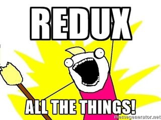

## Sommaire

- Partage de l'état entre composants
- Centralisation de l'état
- Gestion de l'état avec MobX

---

## Partage de l'état entre composants

---

## Rappels sur les propriétés

**Propriétés (_props_)** = caractéristiques définies au moment de la création du composant.

Les propriétés sont modifiables uniquement par le composant parent.

---

## Rappels sur l'état

**Etat (_state_)** = ensemble des données susceptibles d'être modifiées pendant l'exécution de l'application.

Chaque composant React Native possède un état interne, géré avec `this.state` et `this.setState()`.

Toute modification de l'état déclenche un nouveau rendu du composant.

---

## Problématique

La gestion locale de l'état devient insuffisante lorsqu'un composant doit **accéder à** ou **modifier** l'état d'un autre composant.

Nécessité de partager un état commun entre certains composants.

---

## Solution : _"lifting state up"_

- Remonter l'état au niveau du plus proche composant parent commun.
- Définir les actions de modification dans ce composant parent.
- Dans les composants enfants :
  - Remplacer l'état local par des propriétés définies par le parent.
  - Remplacer les actions locales par des appels aux actions définies dans le parent.

[Lifting State Up (React)](https://reactjs.org/docs/lifting-state-up.html)

---

## Application

<https://github.com/ensc-mobi/TempConverter>


---

## Utilisation de props dans les composants enfants

```jsx
class TemperatureInput extends React.Component {
  _onChangeText = text => {
    // Callback passed as component prop is called
    this.props.onTemperatureChange(text);
  };

  render() {
    const temperature = this.props.temperature;
    const scale = this.props.scale;
    const placeholder = `Enter temperature in ${scaleNames[scale]}`;
    return (
      <TextInput
        style={styles.text}
        placeholder={placeholder}
        value={temperature}
        onChangeText={this._onChangeText}
      />
    );
  }
}
```

---

## Remontée de l'état dans le composant parent

```jsx
class Calculator extends React.Component {
  constructor(props) {
    super(props);
    // Common state is lifted in closest parent of TemperatureInput components
    // Temperature can be set either in Celsius or in Fahrenheit
    this.state = { temperature: "", scale: "c" };
  }

  _onCelsiusChange = temperature => {
    this.setState({ scale: "c", temperature });
  };

  _onFahrenheitChange = temperature => {
    this.setState({ scale: "f", temperature });
  };
  // ...
```

---

## Appel aux actions définies dans le parent

```jsx
  // ...
  render() {
    const scale = this.state.scale;
    const temperature = this.state.temperature;
    const tempCelsius =
      scale === "f" ? tryConvert(temperature, toCelsius) : temperature;
    const tempFahrenheit =
      scale === "c" ? tryConvert(temperature, toFahrenheit) : temperature;

    return (
      <View>
        <TemperatureInput
          scale="c"
          temperature={tempCelsius}
          onTemperatureChange={this._onCelsiusChange}
        />
        <TemperatureInput
          scale="f"
          temperature={tempFahrenheit}
          onTemperatureChange={this._onFahrenheitChange}
        />
        <BoilingResult tempCelsius={parseFloat(tempCelsius)} />
      </View>
    );
  }
```

---

## Centralisation de l'état

---

## Problématique

Les composants parents rassemblent trop de choses :

- Etat commun
- Actions de modification
- Hiérarchie des composants enfants

Non-respect du principe de séparation des responsabilités.

---

## Solution

- Centraliser l'état et les actions de modifications dans des objets dédiés, souvent appelés **stores**.
- Donner accès à ces objets aux composants via des propriétés.
- Prévoir un mécanisme d'**abonnement** des composants aux mutations de l'état effectués uniquement dans les stores.

---

## Application

<https://github.com/ensc-mobi/TodoNative>


---

## Définition d'un store

```js
export default class TodoStore extends Store {
  constructor() {
    // Call to parent constructor is needed to init observation
    super();

    // The TODO task is used as key (unique identifier)
    // Therefore, each TODO must have a different task
    this.todos = [];
  }

  addTodo = task => {
    // Add new TODO at beginning of array
    this.todos = [{ task, completed: false }, ...this.todos];

    this.notifyObservers();
  };

  // ...

  // Used in parent class when notifying observers
  getState() {
    const todos = this.todos;
    return { todos };
  }
}
```

---

## Notification des changements d'état

Basée sur le Design Pattern [Observateur](https://fr.wikipedia.org/wiki/Observateur_%28patron_de_conception%29).

```js
export default class Store {
  constructor() {
    // Define an empty observer list
    this.observers = [];
  }

  // Add new observer to list
  addObserver(observer) {
    this.observers.push(observer);
  }

  // Notify all observers of a state change in the store
  notifyObservers() {
    this.observers.forEach(observer => observer.setState(this.getState()));
  }
}
```

---

## Lien entre store et composant principal

```jsx
const App = () => {
  const todoStore = new TodoStore();

  return <MainView todoStore={todoStore} />;
};

export default App;
```

---

## Abonnement d'un composant

```jsx
export default class MainView extends React.Component {
  constructor(props) {
    super(props);
    this.state = this.props.todoStore.getState();
    this.props.todoStore.addObserver(this);
  }

  render() {
    return (
      <View style={styles.container}>
        <Header title="TodoNative" />
        <Input
          placeholder="Saisissez une nouvelle tâche"
          onSubmitEditing={this.props.todoStore.addTodo}
        />
        // ...
```

---

## Gestion de l'état avec MobX

---

## Problématique

- Le nombre croissant de composants complique les évolutions de l'état.
- Les mutations de l'état peuvent déclencher un (trop) grand nombre de rendus des composants.

---

## Solution

- Utiliser une librairie dédiée à la gestion de l'état.
- [Bon choix](https://www.robinwieruch.de/redux-mobx-confusion/) pour la plupart des projets de taille intermédiaire : [MobX](https://mobx.js.org).


```bash
# Add MobX to a React Native project
expo install mobx mobx-react
expo install --save-dev babel-preset-mobx
```

---


---

## Application

<https://github.com/ensc-mobi/TodoNative-MobX>


---

## Définition d'une classe métier

```js
import { observable } from "mobx";

export default class Todo {
  @observable task;
  @observable completed;

  constructor(task = "", completed = false) {
    this.task = task;
    this.completed = completed;
  }

  toggle() {
    this.completed = !this.completed;
  }
}
```

---

## Définition d'un store

```js
import { observable } from "mobx";
import Todo from "../domain/Todo";

export default class TodoStore {
  @observable todos;
  @observable isLoading = true;

  constructor() {
    // The TODO task is used as key (unique identifier)
    // Therefore, each TODO must have a different task
    this.todos = [];
  }

  addTodo(task) {
    const todo = new Todo(task);
    // Add new TODO at beginning of array
    this.todos = [todo, ...this.todos];
  }

  // ...
}
```

---

## Lien entre store et composant principal

```jsx
const App = () => {
  const todoStore = new TodoStore();

  return <MainView todoStore={todoStore} />;
};

export default App;
```

---

## Abonnement d'un composant

```js
import { observer } from "mobx-react";
// ...

@observer
export default class MainView extends React.Component {
  onAddTodo = task => {
    this.props.todoStore.addTodo(task);
  };
  // ...
  
  render() {
    return (
      <View style={styles.container}>
        <Header title="TodoNative" />
        <Input
          placeholder="Saisissez une nouvelle tâche"
          onSubmitEditing={this.onAddTodo}
        />
        <FlatList
          style={styles.todoContainer}
          data={this.props.todoStore.todos}
          // ...
}
```

---

## Pourquoi pas Redux ?



- Librairie créée pour adresser des problématiques à l'échelle de Facebook
- Complexe et _overkill_ pour les projets "normaux"
- ["You might not need Redux"](https://medium.com/@dan_abramov/you-might-not-need-redux-be46360cf367) (écrit par son créateur)
