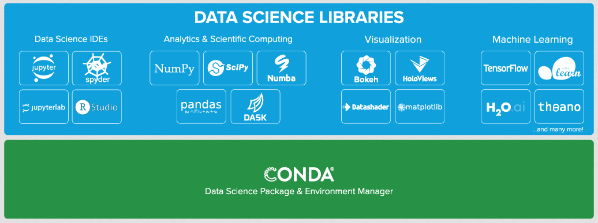
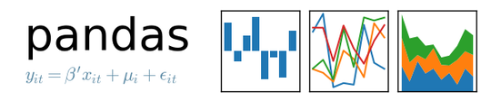
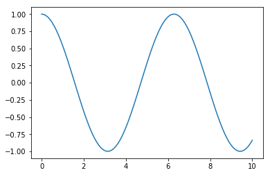
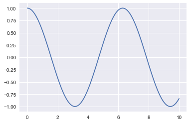

## Sommaire

- Introduction to Data Science
- Why Python?
- Python tools for data science
  - Simplified installation with Anaconda
  - Code and result sharing with Jupyter Notebook
  - Numerical computing with NumPy
  - Data analysis with Pandas
  - Plotting with Matplotlib and Seaborn

---

## Introduction to Data Science

---

## What is Data Science?

- Main objective: extract insight from data.
- Expression born in 1997 in the statistician community.
- "A Data Scientist is a statistician that lives in San Francisco".
- 2012 : "Sexiest job of the 21st century" (Harvard Business Review).
- [Controversy](https://en.wikipedia.org/wiki/Data_science#Relationship_to_statistics) on the expression's real usefulness.

---

{}

## Data Science fields



---



---



{}

---

## Why Python?

---

## The Python language

Programming language created in 1989 by [Guido van Rossum](https://en.wikipedia.org/wiki/Guido_van_Rossum) and developed under a open source license.


- Multi-paradigms (procedural, fonctional, object-oriented)
- Dynamic types
- Automatic memory management
- ...

---

## The Python syntax

```python
def hello(name):
    print("Hello ", name)

friends = ["Lou", "David", "Iggy"]

for friend in friends:
    hello(friend)
```

---

## Demo time

[Python Cheatsheet](http://nbviewer.jupyter.org/github/bpesquet/machine-learning-handbook/blob/master/tools/Python.ipynb)

---

## Python, a standard for Data Science

- Language qualities (ease of use, simplicity, versatility).
- Involvement of the scientific and academical communities.
- Ecosystem of dedicated open source libraries.

---

## Python tools for Data Science

---

## [Anaconda](https://www.anaconda.com/distribution/)

Scientific distribution including Python and many (1500+) specialized packages.



---

{}

## Jupyter Notebook

[](https://jupyter.org/)

- Web interface for using [IPython](https://ipython.org/) in a browser.
- Centralizes text, (interactive) code and images in a single notebook (file with _.ipynb_ extension).
- New standard for sharing research results.

---

## Google Colaboratory

Cloud environment for executing Jupyter notebooks through CPU, GPU or TPU.

[](https://colab.research.google.com)

{}

---

{}

[](http://www.numpy.org/)

- Python library for numerical computing
- Efficiently handles multidimensional arrays

```python
import numpy as np

x = np.array([1, 4, 2, 5, 3])
print(x[:2])  # [1 4]
print(x[2:])  # [2 5 3]
print(np.sort(x))  # [1, 2, 3, 4, 5]
```

---

## NumPy and tensors

In the context of Data Science, a **tensor** is a set of values stored in a multidimensional array.

- Vector = 1D tensor
- Matrix = 2D tensor

{}

---

## Demo time

[Tensor Management with NumPy](http://nbviewer.jupyter.org/github/bpesquet/machine-learning-handbook/blob/master/tools/NumPy.ipynb)

---

[](https://pandas.pydata.org/)

Python library for data analysis which gracefully handles heterogeneous data

```python
import pandas as pd

pop = pd.Series({'CAL':38332521, 'TEX':26448193, 'NY':19651127})
area = pd.Series({'CAL':423967, 'TEX':695662, 'NY':141297})
states = pd.DataFrame({'population':pop, 'area':area})
```


---

## Demo time

[Data Analysis with Pandas](http://nbviewer.jupyter.org/github/bpesquet/machine-learning-handbook/blob/master/tools/Pandas.ipynb)

---

{}

[](https://matplotlib.org/)

Python library for 2D plotting

```python
import numpy as np
import matplotlib.pyplot as plt

x = np.linspace(0, 10, 100)
plt.plot(x, np.cos(x))
```



---

## [Seaborn](https://seaborn.pydata.org/)

- Python library for data visualization
- Improves presentation of matplotib-generated graphics

```python
import seaborn as sns
sns.set()
```



{}

---

## Demo time

[Plotting with Matplotlib and Seaborn](http://nbviewer.jupyter.org/github/bpesquet/machine-learning-handbook/blob/master/tools/Matplotlib.ipynb)
