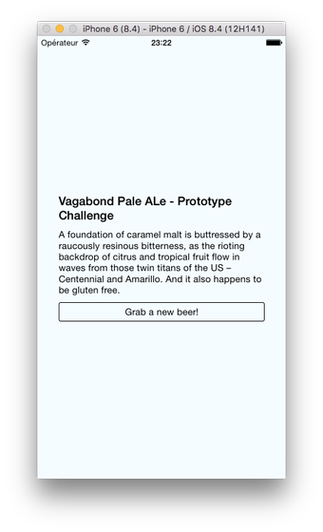

## Sommaire

- Introduction aux API web
- Appels réseau avec JavaScript
- Interactions avec un SGBDR via une API

---

## Introduction aux API web

---

## La notion d'API

Une **API** (*Application Programming Interface*) est un point d'entrée programmatique dans un système.

Elle fournit un moyen d'interagir avec ce système.

Les API permettent aux développeurs d'intégrer des services externes dans leurs applications.

---

## Spécificités des API web

Une **API web** (appelée parfois service web) est une API accessible via les technologies du web : HTTP ou HTTPS.

Elles utilisent le plus souvent le format de donnée **JSON**.

Certaines sont librement utilisables, d'autres nécessitent une authentification du client.

---

## Exemples d'API web

- [PokéAPI](https://pokeapi.co/)
- [Star Wars API](https://swapi.co/)
- [Wikipedia](https://en.wikipedia.org/w/api.php?)
- [Spotify](https://developer.spotify.com/documentation/web-api/)
- [OMDb API](https://www.omdbapi.com/)

([Source](https://shkspr.mobi/blog/2016/05/easy-apis-without-authentication/))

---

## Outils pour la gestion des API web

- [Postman](https://www.getpostman.com/).
- Extension [RESTClient](https://addons.mozilla.org/fr/firefox/addon/restclient/) pour Firefox.

---

## Appels réseau avec JavaScript

---

## Appels asynchrones

Une **promesse** (_promise_) est un objet qui encapsule une opération dont le résultat n'est pas encore connu.

La fonction JavaScript `fetch()` est importée du web.

```js
// Envoie une requête HTTP asynchrone vers l'URL spécifiée
fetch(url)
  .then(() => {
    // Code appelé ultérieurement si la requête réussit
  })
  .catch(() => {
    // Code appelé ultérieurement si la requête échoue
  });
```

---

## Accès à une ressource distante

```js
// Envoi d'une requête HTTP asynchrone vers l'URL spécifiée
// La réponse est reçue ici sous forme de données JSON
fetch("http://my-api-url")
  // Accès au contenu JSON de la réponse
  .then(response => response.json())
  // Utilisation du contenu de la réponse
  // `content` est un objet ou un tableau JavaScript
  .then(content => {
    // ...
  })
  .catch(error => {
    console.error(errpr);
  });
```

---

## Mise à jour d'une ressource distante

```js
fetch('https://mywebsite.com/endpoint/', {
  method: 'POST',
  headers: {
    Accept: 'application/json',
    'Content-Type': 'application/json',
  },
  body: JSON.stringify({
    firstParam: 'yourValue',
    secondParam: 'yourOtherValue',
  }),
});
```

---

## Application

<https://github.com/ensc-mobi/RandomBeer>



---

## Consommation d'une API web

```js
const headers = {
  "Content-Type": "application/json",
  Accept: "application/json"
};

// Retourne une recette de bière au hasard
export const getRandomBrewdog = () =>
  fetch(`${rootEndpoint}/beers/random`, { headers })
    .then(response => response.json())
    // Access first element of returned array
    .then(beers => beers[0])
    .catch(error => {
      console.error(error);
    });
```

---

## Mise à jour de l'application

```jsx
  // ...
  _getRandomBrewdogWithFeedback = () => {
    this.setState({ isLoading: true });
    getRandomBrewdog().then(beer =>
      this.setState({
        name: beer.name,
        description: beer.description,
        isLoading: false // la requête est terminée
      })
    );
  };

  componentDidMount() {
    this._getRandomBrewdogWithFeedback();
  }

  // ...
```

---

## Interactions avec un SGBDR via une API

---

## PHP-CRUD-API

<https://github.com/mevdschee/php-crud-api>

Fichier `api.php` à publier sur un serveur web PHP. Fournit une API web pour accéder aux données d'un SGBDR.

```php
// Update to reflect your local settings
$config = new Config([
  'username' => 'xxx',
  'password' => 'xxx',
  'database' => 'xxx',
]);
```

---

## Utilisation de PHP-CRUD-API

URL `http://my-server-url/api.php/records/...`

- `GET my-table` : renvoie la liste des enregistrements de la table `my-table`.
- `GET my-table/id` : renvoie l'enregistrement identifié par `id`.
- `POST my-table` : création d'un nouvel enregistrement avec les données contenues dans le corps de la requête.

---

## Application

<https://github.com/ensc-mobi/MyMoviesNative>


---

## Classe métier film

```js
export default class Movie {
  @observable id;
  @observable title;
  // ...
  @observable image;

  constructor(
    id,
    title,
    // ...
    image
  ) {
    this.id = id;
    this.title = title;
    // ...
    this.image = image;
  }
}
```

---

## Accès au SGBDR

```js
const rootEndpoint = "http://localhost/mymovies/api.php/records";

const headers = {
  "Content-Type": "application/json",
  Accept: "application/json"
};

export const getAllMovies = () =>
  fetch(`${rootEndpoint}/movie/`, { headers })
    .then(response => response.json())
    .then(jsonResponse => jsonResponse.records)
    .catch(error => {
      console.log(error);
    });
```

---

## Récupération de la liste des films

```js
export default class MovieStore {
  @observable movies;
  // ...

  fetchAll() {
    this.movies = [];
    getAllMovies().then(movies => {
      //console.log(movies);
      movies.forEach(movieData => {
        const movie = new Movie(
          movieData.mov_id,
          movieData.mov_title,
          // ...
          movieData.mov_image
        );
        this.movies = [movie, ...this.movies];
      });
    });
  }
}
```

---

## Vue principale

```jsx
export default class HomeScreen extends React.Component {
  render() {
    const movieStore = new MovieStore();
    // All React Navigation screens receive this object as prop
    const { navigation } = this.props;

    // Navigation object is passed down to children components
    return <MainView movieStore={movieStore} navigation={navigation} />;
  }
}
```

---

## Affichage d'un film dans la liste

```js
@observer
export default class MovieItem extends React.Component {
  render() {
    const { movie } = this.props;
    const { navigation } = this.props;

    return (
      <View style={styles.container}>
        <TouchableOpacity
          onPress={() => {
            navigation.navigate("Details", {
              movie: movie
            });
          }}
        >
          <Text style={styles.text}>
            {movie.title} ({movie.year})
          </Text>
        </TouchableOpacity>
      </View>
    );
  }
}
```

---

## Détails sur un film

```js
export default class DetailsScreen extends React.Component {
  render() {
    const { navigation } = this.props;
    const movie = navigation.getParam("movie");
    const imageUrl = imagesEndpoint + movie.image;

    return (
      <View style={styles.container}>
        <Text style={styles.title}>
          {movie.title} ({movie.year})
        </Text>
        <Text style={styles.director}>Réalisateur(s) : {movie.director}</Text>
        <Text style={styles.description}>{movie.shortDescription}</Text>
        <Image style={styles.image} source={{ uri: imageUrl }}></Image>
      </View>
    );
  }
}
```
