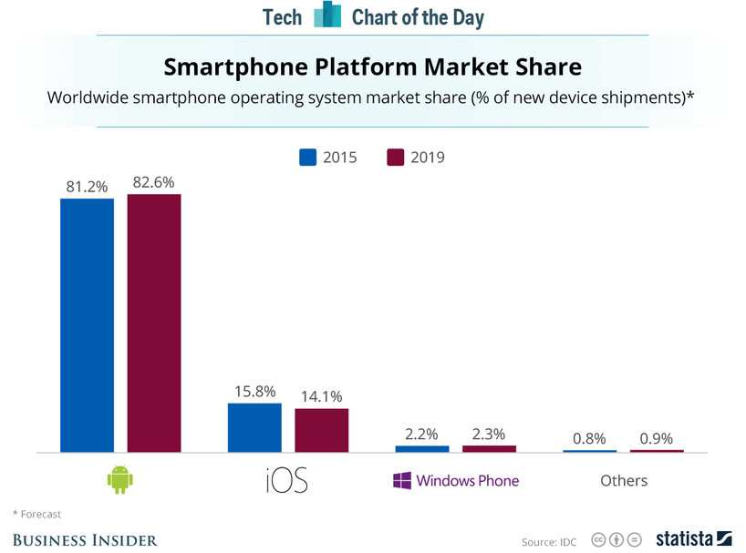
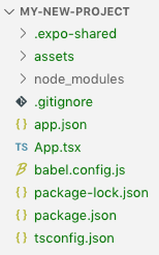
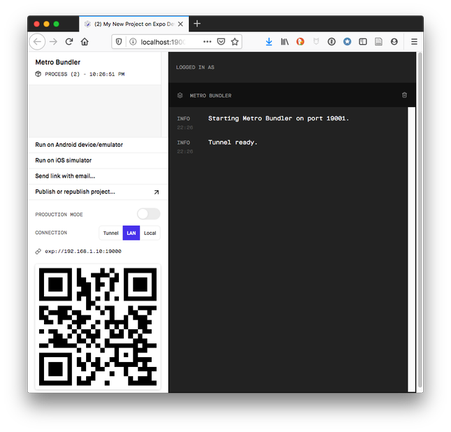
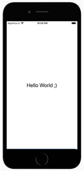
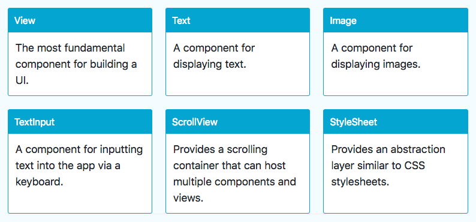

## Sommaire

- L'écosystème mobile
- Premiers pas avec React Native
- Anatomie d'une application React Native

---

### L'écosystème mobile

---


---



---


---

{}

### Développement natif

Création d'applications en utilisant la technologie prévue par le concepteur de l'OS.

- Android : Java
- IOS : Objective-C ou Swift

{}Ces technologies sont **incompatibles**.{}

---

### Avantages

- Accès à l'intégralité des fonctionnalités matérielles et logicielles du terminal mobile.
- Performances optimales.

---

### Inconvénient (majeur !)

Nécessité de créer puis de faire évoluer une application pour chaque environnement.

{}

---

{}

### Solutions hybrides

Création d'applications mobiles compatibles avec plusieurs OS mobiles grâce à un framework dédié.

Une application hybride est une application web qui s'exécute à l'intérieur d'un navigateur.

Exemples : [Apache Cordova](https://cordova.apache.org), [Ionic](https://ionicframework.com)

---

### Avantages

- Fonctionnalités et performances proches de celles d'une application native.
- Economies de ressources pour créer l'application.
- Une seule base de code : maintenance et évolution facilitées.

---

### Inconvénients

- Impossible d'accéder à certaines fonctionnalités matérielles ou logicielles spécifiques.
- _Look'n'feel_ non natif.
- Mauvaises performances dans certains scenarii.

{}

---

{}

### Développement natif multi-plateformes

Création d'applications mobiles compatibles avec plusieurs OS mobiles grâce à un framework dédié.

Le framework encapsule les véritables composants natifs de l'OS.

Exemples : [React Native](https://facebook.github.io/react-native/), [Weex](https://weex.apache.org/), [Xamarin](https://www.visualstudio.com/fr/xamarin/)

---

### Le meilleur des deux mondes ?

Combine les avantages du natif (_look'n'feel_, performances) et de l'hybride (une seule base de code).

Limite potentielle : le support de l'OS dépend entièrement du framework.

{}

---

## Premiers pas avec React Native

---

### React Native

Framework créé par Facebook, open source depuis 2015.

Déclinaison mobile du framework JavaScript [React](https://reactjs.org/).


---

### Expo

Framework pour faciliter la création et le déploiement d'applications React Native.


- [Expo CLI](https://github.com/expo/expo-cli) : outil en ligne de commande pour le développement local.
- [Expo client](https://expo.io) : application mobile à installer sur le terminal cible pour le déploiement.

---

### Création d'une application

```bash
# Install expo-cli globally
# (Node.js and Git are prerequisites)
npm install -g expo-cli

# Create a new app in the my-new-project subfolder
# Use managed TypeScript template
expo init my-new-project -t expo-template-blank-typescript
```

- Workflow _managé_ : projet entièrement géré par Expo (plus simple).

- Workflow _bare_ : plus proche d'un projet React Native pur.

---

### Contenu du répertoire créé



---

### Déploiement de l'application

```bash
cd my-new-project # move into project directory
npm start # Or 'expo start'
```

Ensuite, scan du QR Code depuis l'application Expo (Android) ou l'appareil photo du smartphone (iOS).


---

### Détails sur le déploiement

- L'application est hébergée sur un serveur web local.
- Expo s'y connecte pour la récupérer puis la lancer.
- Une interface web de gestion s'affiche.



---

### Rechargement dynamique

[](https://openclassrooms.com/fr/courses/4902061-developpez-une-application-mobile-react-native/)

---

### Connexion au serveur Expo

L'application mobile Expo client doit accéder au serveur web de la machine de développement pour pouvoir lancer l'application RN.

Il existe plusieurs modes de connexion :

- **LAN** : utilisation du réseau Wifi local. Peut poser problème dans certains environnements Wifi sécurisés.
- **Tunnel** : création d'un tunnel avec [ngrok](https://ngrok.com/) pour accéder au serveur local via le web. Nécessite que le terminal mobile dispose d'un accès internet.

---

### Utilisation d'un émulateur

- Alternative à l'emploi d'un terminal mobile pour tester l'application RN.
- Nécessite l'installation de [XCode (iOS)](https://developer.apple.com/xcode/) ou [Android Studio](https://developer.android.com/studio) sur le machine de développement.
- Documentation : [iOS](https://docs.expo.io/workflow/ios-simulator/) | [Android](https://docs.expo.io/workflow/android-studio-emulator/).



---

### Anatomie d'une application React Native

---

### Le fichier de configuration app.json

```json
{
  "expo": {
    "name": "My New Project",
    "slug": "my-new-project",
    "version": "1.0.0",
    "orientation": "portrait",
    "icon": "./assets/icon.png",
    "splash": {
      "image": "./assets/splash.png",
      "resizeMode": "contain",
      "backgroundColor": "#ffffff"
    },
    "updates": {
      "fallbackToCacheTimeout": 0
    },
    "assetBundlePatterns": ["**/*"],
    "ios": {
      "supportsTablet": true
    },
    "android": {
      "adaptiveIcon": {
        "foregroundImage": "./assets/adaptive-icon.png",
        "backgroundColor": "#FFFFFF"
      }
    },
    "web": {
      "favicon": "./assets/favicon.png"
    }
  }
}
```

---

### Le fichier package.json

```json
{
  "main": "node_modules/expo/AppEntry.js",
  "scripts": {
    "start": "expo start",
    "android": "expo start --android",
    "ios": "expo start --ios",
    "web": "expo start --web",
    "eject": "expo eject"
  },
  "dependencies": {
    "expo": "~40.0.0",
    "expo-status-bar": "~1.0.3",
    "react": "16.13.1",
    "react-dom": "16.13.1",
    "react-native": "https://github.com/expo/react-native/archive/sdk-40.0.1.tar.gz",
    "react-native-web": "~0.13.12"
  },
  "devDependencies": {
    "@babel/core": "~7.9.0",
    "@types/react": "~16.9.35",
    "@types/react-dom": "~16.9.8",
    "@types/react-native": "~0.63.2",
    "typescript": "~4.0.0"
  },
  "private": true
}
```

---

### Le fichier principal App.tsx

```tsx
import { StatusBar } from "expo-status-bar";
import React from "react";
import { StyleSheet, Text, View } from "react-native";

export default function App() {
  return (
    <View style={styles.container}>
      <Text>Open up App.tsx to start working on your app!</Text>
      <StatusBar style="auto" />
    </View>
  );
}

const styles = StyleSheet.create({
  container: {
    flex: 1,
    backgroundColor: "#fff",
    alignItems: "center",
    justifyContent: "center",
  },
});
```

---

### JSX

- Syntaxe introduite pour le framework web [React](https://reactjs.org/).
- Permet de décrire une UI en intégrant balisage et logique applicative.

```jsx
// JSX for React (web)
const name = "Clarisse Agbegnenou";
const element = <h1>Hello, {name}</h1>;
```

```jsx
// JSX for React Native (mobile)
const a = <View />;
const b = (
  <View foo="hello" bar={baz}>
    <Text>42</Text>
  </View>
);
```

---

### TSX

Equivalent du format JSX avec support de TypeScript.

---

### La notion de composant

- Les **composants** sont les blocs de base d'une application React (Native).

- Ils permettent de créer une UI sous forme **déclarative** par assemblage de composants.

- Ils doivent disposer d'une méthode `render()` qui définit leur rendu visuel.

---

### Propriétés (_props_) d'un composant

Caractéristiques définies au moment de la création. Modifiables uniquement par le composant parent. [Démo](https://snack.expo.io/@bpesquet/greeting)

```jsx
import React, { Component } from "react";
import { Text, View } from "react-native";

class Greeting extends Component {
  render() {
    return <Text>Hello {this.props.name}!</Text>;
  }
}

export default class LotsOfGreetings extends Component {
  render() {
    return (
      <View style={{ alignItems: "center" }}>
        <Greeting name="John" />
        <Greeting name="Paul" />
        <Greeting name="Jones" />
      </View>
    );
  }
}
```

---

### Etat (_state_) d'un composant

Etat interne (données) d'un composant, susceptible de changer au cours du temps (mutable). Modifié uniquement via `setState()`. [Démo](https://snack.expo.io/@bpesquet/counter)

```jsx
import React, { Component } from "react";
import { StyleSheet, Text, View } from "react-native";

class Counter extends Component {
  constructor(props) {
    super(props);
    this.state = { count: 0 };
    setInterval(() => {
      this.setState({ count: this.state.count + 1 });
    }, 1000);
  }

  render() {
    const { count } = this.state;
    const { color, size } = this.props;

    return <Text style={{ color, fontSize: size }}>{count}</Text>;
  }
}

export default class CounterApp extends Component {
  render() {
    return (
      <View style={styles.container}>
        <Counter color={"red"} size={30} />
      </View>
    );
  }
}

const styles = StyleSheet.create({
  container: {
    flex: 1,
    backgroundColor: "#fff",
    alignItems: "center",
    justifyContent: "center",
  },
});
```

---

### Composants de base



---

### Composants d'interface utilisateur


