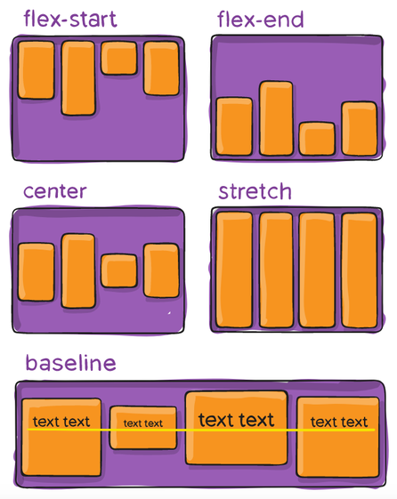

## Sommaire

- Cycle de vie d'un composant
- Style et positionnement
- Gestion de la navigation

---

## Cycle de vie d'un composant

---

## Notion de cycle de vie

Les composants RN suivent un cycle de vie bien défini composé d'étapes : **montage**, **rendu**, **mise à jour**, **démontage** et **suppression**.

[](http://projects.wojtekmaj.pl/react-lifecycle-methods-diagram/)

---

## Méthodes liées au cycle de vie

Les redéfinir permet d'exécuter du code spécifique.

1. `constructor(props)` : initialisation des propriétés et de l'état.
1. `render()` : renvoi d'un élément React Native.
1. `componentDidMount()` : appels asynchrones.
1. `shouldComponentUpdate(nextProps, nextState)` : renvoi d'un booléen pour annuler la mise à jour.
1. `componentDidUpdate(prevProps, prevState)`.

---

## Style et positionnement

---

## Gestion du style

Propriété `style` pour les composants de base.

Semblable à CSS avec nommage *camelCase*.

```jsx
import React, { Component } from 'react';
import { StyleSheet, Text, View } from 'react-native';

const styles = StyleSheet.create({
  bigblue: {
    color: 'blue',
    fontWeight: 'bold',
    fontSize: 30,
  },
  red: {
    color: 'red',
  },
});

export default class LotsOfStyles extends Component {
  render() {
    return (
      <View>
        <Text style={styles.red}>just red</Text>
        <Text style={styles.bigblue}>just bigblue</Text>
        <Text style={[styles.bigblue, styles.red]}>bigblue, then red</Text>
        <Text style={[styles.red, styles.bigblue]}>red, then bigblue</Text>
      </View>
    );
  }
}
```

---

## Gestion des dimensions

Deux possibilités :

- Dimensions fixes
- Dimensions flexibles

---

## Dimensions fixes

Utile pour les composants qui doivent toujours être affichés à la même taille.

```jsx
import React, { Component } from 'react';
import { View } from 'react-native';

export default class FixedDimensionsBasics extends Component {
  render() {
    return (
      <View>
        <View style={{width: 50, height: 50, backgroundColor: 'powderblue'}} />
        <View style={{width: 100, height: 100, backgroundColor: 'skyblue'}} />
        <View style={{width: 150, height: 150, backgroundColor: 'steelblue'}} />
      </View>
    );
  }
}
```

---

## Dimensions flexibles

Les dimensions s'adaptent à l'espace disponible.

`flex:1` => espace partagé équitablement entre tous les composants d'un même parent. [Démo](https://snack.expo.io/@bpesquet/dimensions)

```jsx
import React, { Component } from 'react';
import { View } from 'react-native';

export default class FlexDimensionsBasics extends Component {
  render() {
    return (
      // Try removing the `flex: 1` on the parent View.
      // The parent will not have dimensions, so the children can't expand.
      // What if you add `height: 300` instead of `flex: 1`?
      <View style={{flex: 1}}>
        <View style={{flex: 1, backgroundColor: 'powderblue'}} />
        <View style={{flex: 2, backgroundColor: 'skyblue'}} />
        <View style={{flex: 3, backgroundColor: 'steelblue'}} />
      </View>
    );
  }
}
```

---

## Flexbox

- Mode de mise en page pour les éléments situés à l'intérieur d'un conteneur.
- Objectif : répartir au mieux l'espace disponible.


---

## `flexDirection` : flux des éléments

`column` (par défaut), `row`, `column-reverse`, `row-reverse`.

[](https://css-tricks.com/snippets/css/a-guide-to-flexbox/)

---

## `justifyContent` : axe principal

[](https://css-tricks.com/snippets/css/a-guide-to-flexbox/)

---

## `alignItems` : axe secondaire

[](https://css-tricks.com/snippets/css/a-guide-to-flexbox/)

---

## Gestion de la navigation

---

## React Navigation

- Composant issu de la communauté des développeurs RN.
- Devenu le standard pour les applications multi-vues

[](https://reactnavigation.org)

---

## Installation de react-navigation

Utiliser `expo install` au lieu de `npm install` assure l'installation de versions compatibles avec celle d'Expo.

```bash
# Core components and dependencies
expo install react-navigation react-native-gesture-handler react-native-reanimated react-native-screens react-native-safe-area-context

# StackNavigator dependencies
expo install react-navigation-stack @react-native-community/masked-view

# BottomTabNavigator dependencies
expo install react-navigation-tabs

# DrawerNavigator dependencies
expo install react-navigation-drawer
```

---

## `StackNavigator`

Principe similaire au web : gestion d'une pile de vues.

```jsx
const AppNavigator = createStackNavigator(
  {
    Home: HomeScreen,
    Details: DetailsScreen,
  },
  {
    initialRouteName: 'Home',
  }
);

const AppContainer = createAppContainer(AppNavigator);

export default class App extends React.Component {
  render() {
    return <AppContainer />;
  }
}
```

---

{}

## Navigation entre vues

- `this.props.navigation.navigate('RouteName')`.
- `this.props.navigation.push('RouteName')` : permet d'aller plusieurs fois vers la même vue.
- `this.props.navigation.goBack()`.

---

## Exemple

```jsx
class DetailsScreen extends React.Component {
  render() {
    return (
      <View style={{ flex: 1, alignItems: 'center', justifyContent: 'center' }}>
        <Text>Details Screen</Text>
        <Button
          title="Go to Details... again"
          onPress={() => this.props.navigation.push('Details')}
        />
        <Button
          title="Go to Home"
          onPress={() => this.props.navigation.navigate('Home')}
        />
        <Button
          title="Go back"
          onPress={() => this.props.navigation.goBack()}
        />
      </View>
    );
  }
}
```

{}

---

{}

## Passage de paramètres entre vues

- `this.props.navigation.navigate('RouteName', {/* params */})`.
- `this.props.navigation.getParam(paramName, defaultValue)`.

---

## Exemple

```jsx
// Home Screen
<Button
  title="Go to Details"
  onPress={() => {
    this.props.navigation.navigate('Details', {
      itemId: 86,
      otherParam: 'anything you want here',
    });
  }}
/>

// Details Screen
<Text>
  itemId: {JSON.stringify(navigation.getParam('itemId', 'NO-ID'))}
</Text>
```

{}

---

## En-tête des vues

```jsx
class HomeScreen extends React.Component {
  static navigationOptions = {
    title: 'Home',
    headerStyle: {
      backgroundColor: '#f4511e',
    },
    headerTintColor: '#fff',
    headerTitleStyle: {
      fontWeight: 'bold',
    },
  };

  /* render function, etc */
}
```

---

## Fenêtre modale

```jsx
const RootStack = createStackNavigator(
  {
    Main: {
      screen: MainStack,
    },
    MyModal: {
      screen: ModalScreen,
    },
  },
  {
    mode: 'modal',
    headerMode: 'none',
  }
);
```

---

## Exemple récapitulatif

<https://github.com/ensc-mobi/StackNavigatorDemo>


---

## `BottomTabNavigator`

Affichage d'onglets en bas de l'écran.

```jsx
const TabNavigator = createBottomTabNavigator({
  Home: HomeScreen,
  Settings: SettingsScreen,
});

const AppContainer = createAppContainer(TabNavigator);

export default class App extends React.Component {
  render() {
    return <AppContainer />;
  }
}
```

---

## Navigation entre onglets

`this.props.navigation.navigate('TabName')`.

```jsx
<View style={{ flex: 1, justifyContent: 'center', alignItems: 'center' }}>
  <Text>Home!</Text>
  <Button
    title="Go to Settings"
    onPress={() => this.props.navigation.navigate('Settings')}
  />
</View>
```

---

## Affichage de piles dans les onglets

```jsx
const HomeStack = createStackNavigator({
  Home: HomeScreen,
  Details: DetailsScreen,
});

const SettingsStack = createStackNavigator({
  Settings: SettingsScreen,
  Details: DetailsScreen,
});

export default createAppContainer(
  createBottomTabNavigator(
    {
      Home: HomeStack,
      Settings: SettingsStack,
    }
  )
);
```

---

## Exemple récapitulatif

<https://github.com/ensc-mobi/TabNavigatorDemo>


---

## Autres possibilités de react-navigation

- [Navigation par menu accordéon ou "hamburger'](https://reactnavigation.org/docs/en/drawer-based-navigation.html) ([exemple](https://snack.expo.io/@react-navigation/9b2a43)).
- [Gestion de l'authentification](https://reactnavigation.org/docs/en/auth-flow.html).
- ...
