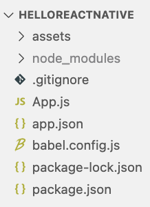
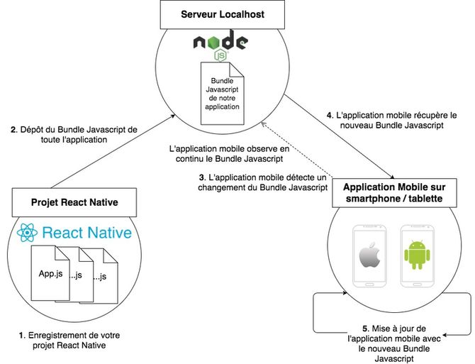
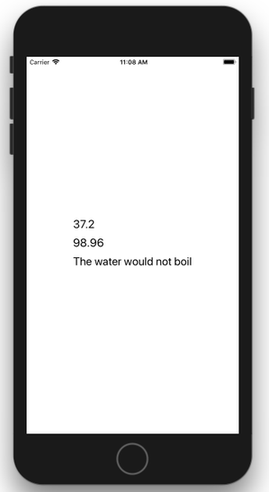
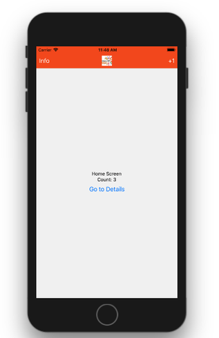

## Sommaire

- Introduction
- Composants React Native
- Gestion de l'UI
- Gestion de l'état
- Navigation
- Utilisation d'API web

---

## Introduction

---

### L'écosystème mobile

- Absence de monopole.
- Deux poids lourds : Android et iOS.
- Parts de marché stables depuis plusieurs années.

---


---


---


---

{}

### Développement mobile natif

Création d'applications en utilisant la technologie prévue par le concepteur de l'OS.

- Android : Java
- IOS : Objective-C ou Swift

{}Ces technologies sont **incompatibles**.{}

---

### Avantages

- Accès à l'intégralité des fonctionnalités matérielles et logicielles du terminal mobile.
- Performances optimales.

---

### Inconvénient (majeur !)

Nécessité de créer puis de faire évoluer une application pour chaque environnement.

{}

---

{}

### Solutions hybrides

Création d'applications mobiles compatibles avec plusieurs OS mobiles grâce à un framework dédié.

Une application hybride est une application web qui s'exécute à l'intérieur d'un navigateur.

Exemples : [Apache Cordova](https://cordova.apache.org), [Ionic](https://ionicframework.com)

---

### Avantages

- Fonctionnalités et performances proches de celles d'une application native.
- Economies de ressources pour créer l'application.
- Une seule base de code : maintenance et évolution facilitées.

---

### Inconvénients

- Impossible d'accéder à certaines fonctionnalités matérielles ou logicielles spécifiques.
- _Look'n'feel_ non natif.
- Mauvaises performances dans certains scenarii.

{}

---

{}

### Développement natif multi-plateformes

Création d'applications mobiles compatibles avec plusieurs OS mobiles grâce à un framework dédié.

Le framework encapsule les véritables composants natifs de l'OS.

Exemples : [React Native](https://facebook.github.io/react-native/), [Weex](https://weex.apache.org/), [Xamarin](https://www.visualstudio.com/fr/xamarin/)

---

### Le meilleur des deux mondes ?

Combine les avantages du natif (_look'n'feel_, performances) et de l'hybride (une seule base de code).

Limite potentielle : le support de l'OS dépend entièrement du framework.

{}

---

### React Native

Framework créé par Facebook, open source depuis 2015.

Déclinaison mobile du framework JavaScript [React](https://reactjs.org/).


---

### Expo

Framework pour faciliter la création et le déploiement d'applications React Native.

[](https://expo.dev/)

- [Expo CLI](https://github.com/expo/expo-cli) : outil en ligne de commande pour le développement local.
- [Expo Go](https://expo.io) : application mobile à installer sur le terminal cible pour le déploiement.

---

### Création d'une application

```bash
# Install expo-cli globally
# (Node.js and Git are prerequisites)
npm install -g expo-cli

# Create a new app in the my-new-project subfolder
# Use managed TypeScript template
expo init my-new-project -t expo-template-blank-typescript
```

- Workflow _managé_ : projet entièrement géré par Expo (plus simple).

- Workflow _bare_ : plus proche d'un projet React Native pur.

---

### Contenu du répertoire créé



---

### Déploiement de l'application

```bash
cd my-new-project # move into project directory
npm start # Or 'expo start'
```

Ensuite, scan du QR Code depuis l'application Expo Go (Android) ou l'appareil photo du smartphone (iOS).


---

### Détails sur le déploiement

- L'application est hébergée sur un serveur web local.
- Expo s'y connecte pour la récupérer puis la lancer.
- Une interface web de gestion s'affiche.


---

### Rechargement dynamique

[](https://openclassrooms.com/fr/courses/4902061-developpez-une-application-mobile-react-native/)

---

### Connexion au serveur Expo

L'application mobile Expo client doit accéder au serveur web de la machine de développement pour pouvoir lancer l'application RN.

Il existe plusieurs modes de connexion :

- **LAN** : utilisation du réseau Wifi local. Peut poser problème dans certains environnements Wifi sécurisés.
- **Tunnel** : création d'un tunnel avec [ngrok](https://ngrok.com/) pour accéder au serveur local via le web. Nécessite que le terminal mobile dispose d'un accès internet.

---

### Utilisation d'un émulateur

- Alternative à l'emploi d'un terminal mobile pour tester l'application RN.
- Nécessite l'installation de [XCode (iOS)](https://developer.apple.com/xcode/) ou [Android Studio](https://developer.android.com/studio) sur le machine de développement.
- Documentation : [iOS](https://docs.expo.io/workflow/ios-simulator/) | [Android](https://docs.expo.io/workflow/android-studio-emulator/).


---

### Le fichier de configuration app.json

```json
{
  "expo": {
    "name": "My New Project",
    "slug": "my-new-project",
    "version": "1.0.0",
    "orientation": "portrait",
    "icon": "./assets/icon.png",
    "splash": {
      "image": "./assets/splash.png",
      "resizeMode": "contain",
      "backgroundColor": "#ffffff"
    },
    "updates": {
      "fallbackToCacheTimeout": 0
    },
    "assetBundlePatterns": ["**/*"],
    "ios": {
      "supportsTablet": true
    },
    "android": {
      "adaptiveIcon": {
        "foregroundImage": "./assets/adaptive-icon.png",
        "backgroundColor": "#FFFFFF"
      }
    },
    "web": {
      "favicon": "./assets/favicon.png"
    }
  }
}
```

---

### Le fichier package.json

```json
{
  "main": "node_modules/expo/AppEntry.js",
  "scripts": {
    "start": "expo start",
    "android": "expo start --android",
    "ios": "expo start --ios",
    "web": "expo start --web",
    "eject": "expo eject"
  },
  "dependencies": {
    "expo": "~40.0.0",
    "expo-status-bar": "~1.0.3",
    "react": "16.13.1",
    "react-dom": "16.13.1",
    "react-native": "https://github.com/expo/react-native/archive/sdk-40.0.1.tar.gz",
    "react-native-web": "~0.13.12"
  },
  "devDependencies": {
    "@babel/core": "~7.9.0",
    "@types/react": "~16.9.35",
    "@types/react-dom": "~16.9.8",
    "@types/react-native": "~0.63.2",
    "typescript": "~4.0.0"
  },
  "private": true
}
```

---

### Le fichier principal App.tsx

```tsx
import { StatusBar } from "expo-status-bar";
import React from "react";
import { StyleSheet, Text, View } from "react-native";

export default function App() {
  return (
    <View style={styles.container}>
      <Text>Open up App.tsx to start working on your app!</Text>
      <StatusBar style="auto" />
    </View>
  );
}

const styles = StyleSheet.create({
  container: {
    flex: 1,
    backgroundColor: "#fff",
    alignItems: "center",
    justifyContent: "center",
  },
});
```

---

### Les formats JSX et TSX

- Syntaxe introduite pour le framework web [React](https://reactjs.org/).
- Permet de décrire une UI en intégrant balisage et logique applicative.
- TSX : équivalent de JSX avec support de TypeScript.

```jsx
// JSX for React (web)
const name = "Clarisse Agbegnenou";
const element = <h1>Hello, {name}</h1>;
```

```jsx
// JSX for React Native (mobile)
const a = <View />;
const b = (
  <View foo="hello" bar={baz}>
    <Text>42</Text>
  </View>
);
```

---

## Composants React Native

---

### La notion de composant

- Les **composants** sont les blocs de base d'une application React (Native).

- Ils permettent de créer une UI sous forme **déclarative** par assemblage de composants.

- Ils doivent comporter une fonction qui définit leur rendu visuel.

---

### Composants fonctions

- La valeur de retour de la fonction définit le rendu.
- Syntaxe la plus concise, pratique pour les composants simples.

```tsx
import React from "react";
import { Text } from "react-native";

const Cat = () => {
  const name = "Maru";
  return <Text>Hello, I am {name}!</Text>;
};

export default Cat;
```

---

### Composants classes

- La méthode `render()` définit le rendu.
- Syntaxe à privilégier pour les composants complexes.

```tsx
import React from "react";
import { Text } from "react-native";

class Cat extends React.Component {
  render() {
    const name = "Maru";
    return <Text>Hello, I am {name}!</Text>;
  }
}

export default Cat;
```

---

### Propriétés (_props_) d'un composant

Caractéristiques définies au moment de la création, modifiables uniquement par le composant parent ([démo](https://snack.expo.io/@bpesquet/greeting)).

```tsx
import React, { Component } from "react";
import { Text, View } from "react-native";

// Function component
// Component has a name property, which is of type string
const GreetingFun = (props: { name: string }) => {
  return <Text>Hello {props.name}!</Text>;
};

// Class component
class GreetingClass extends Component {
  // Component has a name property, which is of type string
  constructor(public props: { name: string }) {
    super(props);
  }
  render() {
    return <Text>Hello {this.props.name}!</Text>;
  }
}

export default class LotsOfGreetings extends Component {
  render() {
    return (
      <View style={{ alignItems: "center" }}>
        <GreetingFun name="John" />
        <GreetingClass name="Paul" />
        <GreetingFun name="Jones" />
      </View>
    );
  }
}
```

---

### Etat (_state_) d'un composant

Etat interne (données) d'un composant, susceptible de changer au cours du temps (mutable). Modifié uniquement via `setState()` ([démo](https://snack.expo.dev/@bpesquet/state-2)).

```tsx
import React, { Component } from "react";
import { StyleSheet, TouchableOpacity, Text, View } from "react-native";

// State shape: a "count" property of type number
interface AppState {
  count: number;
}

// React.Component is a generic type: Component<PropType, StateType>
// We can provide it with optionale prop and state shapes
// {} means an empty shape (no props or state)
class App extends Component<{}, AppState> {
  // Init state
  state: AppState = {
    count: 0,
  };

  // Function that updates state, triggering component re-rendering
  onPress = () => {
    this.setState({
      count: this.state.count + 1,
    });
  };

  render() {
    return (
      <View style={styles.container}>
        <TouchableOpacity style={styles.button} onPress={this.onPress}>
          <Text>Click me</Text>
        </TouchableOpacity>
        <View>
          <Text>You clicked {this.state.count} times</Text>
        </View>
      </View>
    );
  }
}

const styles = StyleSheet.create({
  container: {
    flex: 1,
    justifyContent: "center",
    alignItems: "center",
  },
  button: {
    alignItems: "center",
    backgroundColor: "#DDDDDD",
    padding: 10,
    marginBottom: 10,
  },
});

export default App;
```

---

### Composants de base


---

### Composants d'interface utilisateur


---

### Cycle de vie d'un composant

Les composants RN suivent un cycle de vie bien défini composé d'étapes : **montage**, **rendu**, **mise à jour**, **démontage** et **suppression**.

[](http://projects.wojtekmaj.pl/react-lifecycle-methods-diagram/)

---

### Méthodes liées au cycle de vie

Les redéfinir permet d'exécuter du code spécifique.

1. `constructor(props)` : initialisation des propriétés et de l'état.
1. `render()` : renvoi d'un élément React Native.
1. `componentDidMount()` : appels asynchrones.
1. `shouldComponentUpdate()` : renvoi d'un booléen pour annuler la mise à jour.
1. `componentDidUpdate()` : actions après la mise à jour du rendu.

---

## Gestion de l'UI

---

### Gestion du style

Propriété `style` pour les composants de base.

Semblable à CSS avec nommage _camelCase_.

```jsx
import React, { Component } from "react";
import { StyleSheet, Text, View } from "react-native";

const styles = StyleSheet.create({
  bigblue: {
    color: "blue",
    fontWeight: "bold",
    fontSize: 30,
  },
  red: {
    color: "red",
  },
});

export default class LotsOfStyles extends Component {
  render() {
    return (
      <View>
        <Text style={styles.red}>just red</Text>
        <Text style={styles.bigblue}>just bigblue</Text>
        <Text style={[styles.bigblue, styles.red]}>bigblue, then red</Text>
        <Text style={[styles.red, styles.bigblue]}>red, then bigblue</Text>
      </View>
    );
  }
}
```

---

### Gestion des dimensions

Deux possibilités :

- Dimensions fixes
- Dimensions flexibles

---

### Dimensions fixes

Utile pour les composants qui doivent toujours être affichés à la même taille.

```jsx
import React, { Component } from "react";
import { View } from "react-native";

export default class FixedDimensionsBasics extends Component {
  render() {
    return (
      <View>
        <View
          style={{ width: 50, height: 50, backgroundColor: "powderblue" }}
        />
        <View style={{ width: 100, height: 100, backgroundColor: "skyblue" }} />
        <View
          style={{ width: 150, height: 150, backgroundColor: "steelblue" }}
        />
      </View>
    );
  }
}
```

---

### Dimensions flexibles

Les dimensions s'adaptent à l'espace disponible.

`flex:1` => espace partagé équitablement entre tous les composants d'un même parent ([démo](https://snack.expo.io/@bpesquet/dimensions)).

```jsx
import React, { Component } from "react";
import { View } from "react-native";

export default class FlexDimensionsBasics extends Component {
  render() {
    return (
      // Try removing the `flex: 1` on the parent View.
      // The parent will not have dimensions, so the children can't expand.
      // What if you add `height: 300` instead of `flex: 1`?
      <View style={{ flex: 1 }}>
        <View style={{ flex: 1, backgroundColor: "powderblue" }} />
        <View style={{ flex: 2, backgroundColor: "skyblue" }} />
        <View style={{ flex: 3, backgroundColor: "steelblue" }} />
      </View>
    );
  }
}
```

---

### Flexbox

- Mode de mise en page pour les éléments situés à l'intérieur d'un conteneur.
- Objectif : répartir au mieux l'espace disponible.


---

### `flexDirection` : flux des éléments

`column` (par défaut), `row`, `column-reverse`, `row-reverse`.

[](https://css-tricks.com/snippets/css/a-guide-to-flexbox/)

---

### `justifyContent` : axe principal

[](https://css-tricks.com/snippets/css/a-guide-to-flexbox/)

---

### `alignItems` : axe secondaire

[](https://css-tricks.com/snippets/css/a-guide-to-flexbox/)

---

## Gestion de l'état

---

### Rappels sur les propriétés

**Propriétés (_props_)** = caractéristiques définies au moment de la création du composant.

Les propriétés sont modifiables uniquement par le composant parent.

---

### Rappels sur l'état

**Etat (_state_)** = ensemble des données susceptibles d'être modifiées pendant l'exécution de l'application.

Chaque composant React Native possède un état interne, géré avec `this.state` et `this.setState()`.

Toute modification de l'état déclenche un nouveau rendu du composant.

---

### Problématique

La gestion locale de l'état devient insuffisante lorsqu'un composant doit **accéder à** ou **modifier** l'état d'un autre composant.

Nécessité de partager un état commun entre certains composants.

---

### Solution : _"lifting state up"_

- Remonter l'état au niveau du plus proche composant parent commun.
- Définir les actions de modification dans ce composant parent.
- Dans les composants enfants :
  - Remplacer l'état local par des propriétés définies par le parent.
  - Remplacer les actions locales par des appels aux actions définies dans le parent.

[Lifting State Up (React)](https://reactjs.org/docs/lifting-state-up.html)

---

### Application

<https://github.com/ensc-mobi/TempConverter>



---

### Utilisation de props dans les composants enfants

```tsx
interface TemperatureInputProps {
  temperature: string;
  scale: Scale;
  onTemperatureChange: (text: string) => void;
}

// Component for displaying and inputting a temperature in a specific scale
class TemperatureInput extends React.Component<TemperatureInputProps, {}> {
  _onChangeText = (text: string) => {
    // Call callback passed as component prop
    this.props.onTemperatureChange(text);
  };

  render() {
    const temperature = this.props.temperature;
    const scale = this.props.scale;
    const placeholder = `Enter temperature in ${scale}`;
    return (
      <TextInput
        style={styles.text}
        placeholder={placeholder}
        onChangeText={this._onChangeText}
        value={temperature}
      />
    );
  }
}
```

---

### Remontée de l'état dans le composant parent

```tsx
class Calculator extends React.Component<{}, CalculatorState> {
  // Common state is lifted here, the closest parent of TemperatureInput components
  // Temperature can be set either in Celsius or in Fahrenheit
  state = { temperature: "", scale: Scale.Celsius };

  _onCelsiusChange = (temperature: string) => {
    this.setState({ scale: Scale.Celsius, temperature });
  };

  _onFahrenheitChange = (temperature: string) => {
    this.setState({ scale: Scale.Fahrenheit, temperature });
  };
  // ...
```

---

### Appel aux actions définies dans le parent

```tsx
  // ...
  render() {
    const scale = this.state.scale;
    const temperature = this.state.temperature;
    const tempCelsius =
      scale === Scale.Fahrenheit
        ? tryConvert(temperature, toCelsius)
        : temperature;
    const tempFahrenheit =
      scale === Scale.Celsius
        ? tryConvert(temperature, toFahrenheit)
        : temperature;

    return (
      <View>
        <TemperatureInput
          scale={Scale.Celsius}
          temperature={tempCelsius}
          onTemperatureChange={this._onCelsiusChange}
        />
        <TemperatureInput
          scale={Scale.Fahrenheit}
          temperature={tempFahrenheit}
          onTemperatureChange={this._onFahrenheitChange}
        />
        <BoilingResult tempCelsius={parseFloat(tempCelsius)} />
      </View>
    );
  }
  }
```

---

## Navigation

---

### Gestion de la navigation avec React Navigation

- Composant issu de la communauté des développeurs React Native.
- Devenu le standard pour les applications multi-vues.

[](https://reactnavigation.org)

---

### Installation de react-navigation

Utiliser `expo install` au lieu de `npm install` assure l'installation de versions compatibles avec celle d'Expo.

```bash
# Core components and dependencies
expo install @react-navigation/native react-native-screens react-native-safe-area-context

# StackNavigator dependencies
expo install @react-navigation/native-stack

# BottomTabNavigator dependencies
expo install @react-navigation/bottom-tabs

# DrawerNavigator dependencies
expo install @react-navigation/drawer
```

---

### StackNavigator

Principe similaire au web : gestion d'une pile de vues.

```tsx
const Stack = createStackNavigator();

export default function App() {
  return (
    <NavigationContainer>
      <Stack.Navigator>
        <Stack.Screen name="Home" component={HomeScreen} />
      </Stack.Navigator>
    </NavigationContainer>
  );
}
```

---

### Navigation entre vues

- Un objet `navigation` est automatiquement ajouté aux _props_ des vues gérées par React Navigation.
- Son API permet de naviguer entre les vues.

```ts
// Navigue vers une vue
this.props.navigation.navigate("RouteName");

// Permet d'aller plusieurs fois vers la même vue
this.props.navigation.push("RouteName");

// Revient à la vue précédente
this.props.navigation.goBack();
```

---

### Passage de paramètres entre vues

```ts
// Côté vue appelante
this.props.navigation.navigate("RouteName", {
  /* Objet dont les propriétés constituent les paramètres passés à la nouvelle vue */
  param1: "value1",
  // ...
});

// Côté vue appelée
// La propriété route.params permet de récupérer les paramètres passés à la vue
const { param1 } = this.props.route.params;
```

---

### En-tête des vues

```tsx
<MainStack.Navigator
  screenOptions={{
    headerStyle: {
      backgroundColor: "#f4511e",
    },
    headerTintColor: "#fff",
    headerTitleStyle: {
      fontWeight: "bold",
    },
  }}
>
// ...
```

---

### Vue modale

```tsx
<RootStack.Navigator mode="modal" headerMode="none">
  <RootStack.Screen
    name="Main"
    component={MainStackScreen}
    options={{ headerShown: false }}
  />
  <RootStack.Screen name="MyModal" component={ModalScreen} />
</RootStack.Navigator>
```

---

### Exemple récapitulatif

<https://github.com/ensc-mobi/StackNavigatorDemo>



---

### TabNavigator

Affichage d'onglets en bas de l'écran.

```tsx
const Tab = createBottomTabNavigator();

export default function App() {
  return (
    <NavigationContainer>
      <Tab.Navigator>
        <Tab.Screen name="Home" component={HomeScreen} />
        <Tab.Screen name="Settings" component={SettingsScreen} />
      </Tab.Navigator>
    </NavigationContainer>
  );
}
```

---

### Navigation entre onglets

Fonctionnement identique à celui de la navigation entre les vues d'un `StackNavigator`.

```tsx
<Button
  title="Go to Settings"
  onPress={() => navigation.navigate("Settings")}
/>
```

---

### Affichage de piles (_stacks_) dans les onglets

```tsx
const HomeStack = createStackNavigator();
function HomeStackScreen() {
  // Define home stack
}

const SettingsStack = createStackNavigator();
function SettingsStackScreen() {
  // Define settings stack
}

const Tab = createBottomTabNavigator();
function TabScreen() {
  return (
    <Tab.Navigator>
      <Tab.Screen name="Home" component={HomeStackScreen} />
      <Tab.Screen name="Settings" component={SettingsStackScreen} />
    </Tab.Navigator>
  );
}
```

---

### Exemple récapitulatif

<https://github.com/ensc-mobi/TabNavigatorDemo>


---

### Autres possibilités de react-navigation

- [Navigation par menu accordéon](https://reactnavigation.org/docs/drawer-based-navigation)
- [Gestion de l'authentification](https://reactnavigation.org/docs/auth-flow)
- ...

---

## Utilisation d'API web

---

### La notion d'API

Une **API** (_Application Programming Interface_) est un point d'entrée programmatique dans un système.

Elle fournit un moyen d'interagir avec ce système.

Les API permettent aux développeurs d'intégrer des services externes dans leurs applications.

---

### Spécificités des API web

Une **API web** (appelée parfois service web) est une API accessible via les technologies du web : HTTP ou HTTPS.

Les API web utilisent le plus souvent le format de donnée **JSON**.

Certaines sont librement utilisables, d'autres nécessitent une authentification du client.

---

### Exemples d'API web

- [PokéAPI](https://pokeapi.co/)
- [Star Wars API](https://swapi.dev/)
- [Wikipedia](https://en.wikipedia.org/w/api.php?)
- [Spotify](https://developer.spotify.com/documentation/web-api/)
- [OMDb API](https://www.omdbapi.com/)

([Source](https://shkspr.mobi/blog/2016/05/easy-apis-without-authentication/))

---

### Outils pour la gestion des API web

- [Postman](https://www.getpostman.com/)
- Extension [RESTClient](https://addons.mozilla.org/fr/firefox/addon/restclient/) pour Firefox
- [Insomnia](https://insomnia.rest/)

---

### Appels réseau asynchrones avec JavaScript

Une [promesse](https://web.dev/promises/) (_promise_) est un objet qui encapsule une opération dont le résultat n'est pas encore connu.

La fonction JavaScript [fetch()](https://developers.google.com/web/updates/2015/03/introduction-to-fetch) exploite les possibilités des promesses.

```js
// Envoie une requête HTTP asynchrone vers l'URL spécifiée
fetch(url)
  .then(() => {
    // Code appelé ultérieurement si la requête réussit
  })
  .catch(() => {
    // Code appelé ultérieurement si la requête échoue
  });
```

---

### Accès à une ressource distante

```js
// Envoi d'une requête HTTP asynchrone vers l'URL spécifiée
// La réponse reçue ici contient des données JSON
fetch("http://my-api-url")
  // Accès au contenu JSON de la réponse
  .then((response) => response.json())
  .then((content) => {
    // Utilisation du contenu de la réponse
    // `content` est un objet ou un tableau JavaScript
  })
  .catch((error) => {
    console.error(error);
  });
```

---

### Mise à jour d'une ressource distante

```js
fetch("https://mywebsite.com/endpoint/", {
  method: "POST",
  headers: {
    Accept: "application/json",
    "Content-Type": "application/json",
  },
  body: JSON.stringify({
    firstParam: "yourValue",
    secondParam: "yourOtherValue",
  }),
});
```

---

### Application

<https://github.com/ensc-mobi/RandomBeer>


---

### Consommation d'une API web

```ts
const rootEndpoint = "https://api.punkapi.com/v2";

export interface Beer {
  name: string;
  description: string;
}

const headers = {
  "Content-Type": "application/json",
  Accept: "application/json",
};

// Return a random beer from API
export const getRandomBrewdog = () =>
  fetch(`${rootEndpoint}/beers/random`, { headers })
    .then((response) => response.json())
    .then((beers) => beers[0]) // Access first element of returned array
    .catch((error) => {
      console.error(error);
    });
```

---

### Mise à jour de l'application

```tsx
interface AppState {
  isLoading: boolean; // Is a beer request pending?
  name: string; // Beer name
  description: string; // Beer description
}

export default class App extends Component<{}, AppState> {
  // Initial state
  state: AppState = {
    name: "",
    description: "",
    isLoading: false,
  };

  // Function called when user want to search for another beer
  _getRandomBrewdogWithFeedback = () => {
    // Begin a new request for a beer
    this.setState({ isLoading: true });

    getRandomBrewdog().then((beer: Beer) =>
      this.setState({
        name: beer.name,
        description: beer.description,
        isLoading: false, // Request is finished
      })
    );
  };
  // ...
```

---

### Interactions avec un SGBDR via une API web

<https://github.com/mevdschee/php-crud-api>

Fichier `api.php` à publier sur un serveur web PHP. Fournit une API web pour accéder aux données d'un SGBDR.

```php
// Update to reflect your local settings
$config = new Config([
  'username' => 'xxx',
  'password' => 'xxx',
  'database' => 'xxx',
]);
```

---

### Utilisation de PHP-CRUD-API

`http://my-server-url/api.php/records/...`

- `GET my-table` : renvoie la liste des enregistrements de la table `my-table`.
- `GET my-table/id` : renvoie l'enregistrement identifié par `id`.
- `POST my-table` : création d'un nouvel enregistrement avec les données contenues dans le corps de la requête.
