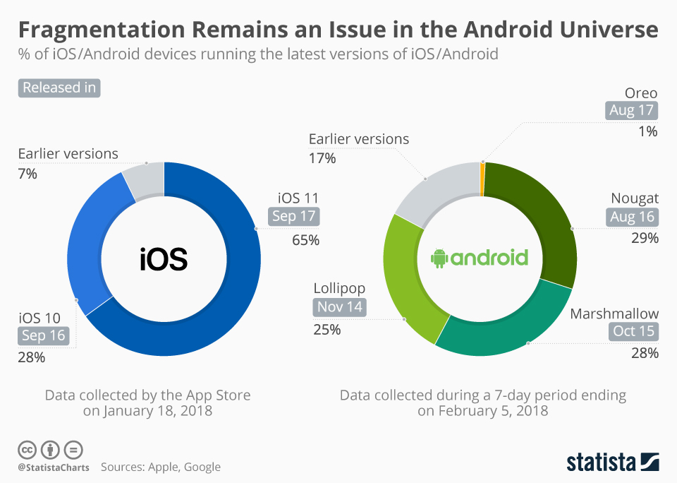
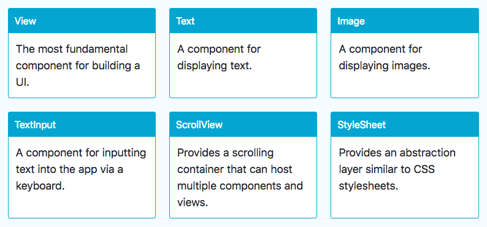
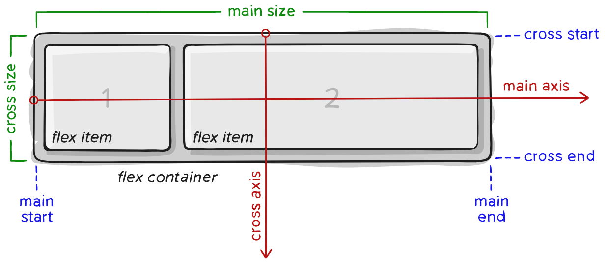
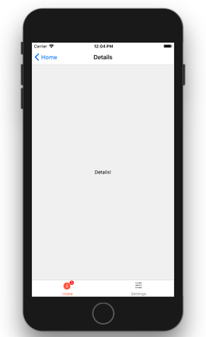

## Sommaire

- Introduction
- Composants React Native
- Gestion de l'UI
- Gestion de l'état
- Navigation
- Utilisation d'API web

---

## Introduction

---

### L'écosystème mobile

- Absence de monopole.
- Deux poids lourds : Android et iOS.
- Parts de marché stables depuis plusieurs années.

---


---


---



---

{}

### Développement mobile natif

Création d'applications en utilisant la technologie prévue par le concepteur de l'OS.

- Android : Java
- IOS : Objective-C ou Swift

{}Ces technologies sont **incompatibles**.{}

---

### Avantages

- Accès à l'intégralité des fonctionnalités matérielles et logicielles du terminal mobile.
- Performances optimales.

---

### Inconvénient (majeur !)

Nécessité de créer puis de faire évoluer une application pour chaque environnement.

{}

---

{}

### Solutions hybrides

Création d'applications mobiles compatibles avec plusieurs OS mobiles grâce à un framework dédié.

Une application hybride est une application web qui s'exécute à l'intérieur d'un navigateur.

Exemples : [Apache Cordova](https://cordova.apache.org), [Ionic](https://ionicframework.com)

---

### Avantages

- Fonctionnalités et performances proches de celles d'une application native.
- Economies de ressources pour créer l'application.
- Une seule base de code : maintenance et évolution facilitées.

---

### Inconvénients

- Impossible d'accéder à certaines fonctionnalités matérielles ou logicielles spécifiques.
- _Look'n'feel_ non natif.
- Mauvaises performances dans certains scenarii.

{}

---

{}

### Développement natif multi-plateformes

Création d'applications mobiles compatibles avec plusieurs OS mobiles grâce à un framework dédié.

Le framework encapsule les véritables composants natifs de l'OS.

Exemples : [React Native](https://facebook.github.io/react-native/), [Weex](https://weexapp.com/), [Xamarin](https://dotnet.microsoft.com/en-us/apps/xamarin)

---

### Le meilleur des deux mondes ?

Combine les avantages du natif (_look'n'feel_, performances) et de l'hybride (une seule base de code).

Limite potentielle : le support de l'OS dépend entièrement du framework.

{}

---

### React Native

Framework créé par Facebook, open source depuis 2015.

Déclinaison mobile du framework JavaScript [React](https://reactjs.org/).

[](https://reactnative.dev/)

---

### Expo

Framework pour faciliter la création et le déploiement d'applications React Native.

[](https://expo.dev/)

- [Expo CLI](https://docs.expo.dev/workflow/expo-cli/) : outil en ligne de commande pour le développement local.
- [Expo Go](https://expo.dev/expo-go) : application mobile à installer sur le terminal cible pour le déploiement.

---

### Création d'une application

```bash
# Install expo-cli globally
# (Node.js and Git are prerequisites)
npm i -g expo-cli

# Create a new app named "appname" in its own subfolder
# Created files are automatically versioned into a Git repository
# The optional -t flag is used to select an Expo app template
# Run npx create-expo-app --template to see the list of available templates.
npx create-expo-app <appname> -t <expo-template>
# Alternative: expo init <appname> -t <expo-template>
```

- Workflow _managé_ : projet entièrement géré par Expo (plus simple).

- Workflow _bare_ : plus proche d'un projet React Native pur.

---

### Déploiement de l'application

```bash
cd <appname> # Move into project directory
npm start # Or 'expo start'
```

Ensuite, scan du QR Code depuis l'application Expo Go (Android) ou l'appareil photo du smartphone (iOS).


---

### Détails sur le déploiement

- L'application est hébergée sur un serveur web local.
- Expo s'y connecte pour la récupérer puis la lancer.
- Une interface web de gestion s'affiche.


---

### Rechargement dynamique

[](https://openclassrooms.com/fr/courses/4902061-developpez-une-application-mobile-react-native/)

---

### Connexion au serveur Expo

L'application mobile Expo Go doit accéder au serveur web de la machine de développement pour pouvoir lancer l'application RN.

Il existe plusieurs modes de connexion :

- **LAN** : utilisation du réseau Wifi local. Peut poser problème dans certains environnements Wifi sécurisés.
- **Tunnel** : création d'un tunnel avec [ngrok](https://ngrok.com/) pour accéder au serveur local via le web. Nécessite que le terminal mobile dispose d'un accès internet.

---

### Utilisation d'un émulateur

- Alternative à l'emploi d'un terminal mobile pour tester l'application RN.
- Nécessite l'installation de [XCode (iOS)](https://developer.apple.com/xcode/) ou [Android Studio](https://developer.android.com/studio) sur le machine de développement.
- Documentation : [iOS](https://docs.expo.io/workflow/ios-simulator/) | [Android](https://docs.expo.io/workflow/android-studio-emulator/).


---

### Contenu du répertoire créé


---

### Le fichier de configuration app.json

```json
{
  "expo": {
    "name": "HelloReactNative",
    "slug": "HelloReactNative",
    "version": "1.0.0",
    "orientation": "portrait",
    "icon": "./assets/icon.png",
    "userInterfaceStyle": "light",
    "splash": {
      "image": "./assets/splash.png",
      "resizeMode": "contain",
      "backgroundColor": "#ffffff"
    },
    "updates": {
      "fallbackToCacheTimeout": 0
    },
    "assetBundlePatterns": [
      "**/*"
    ],
    "ios": {
      "supportsTablet": true
    },
    "android": {
      "adaptiveIcon": {
        "foregroundImage": "./assets/adaptive-icon.png",
        "backgroundColor": "#FFFFFF"
      }
    },
    "web": {
      "favicon": "./assets/favicon.png"
    }
  }
}
```

---

### Le fichier package.json

```json
{
  "name": "helloreactnative",
  "version": "1.0.0",
  "main": "node_modules/expo/AppEntry.js",
  "scripts": {
    "start": "expo start",
    "android": "expo start --android",
    "ios": "expo start --ios",
    "web": "expo start --web"
  },
  "dependencies": {
    "expo": "~47.0.9",
    "expo-status-bar": "~1.4.2",
    "react": "18.1.0",
    "react-native": "0.70.5"
  },
  "devDependencies": {
    "@babel/core": "^7.12.9"
  },
  "private": true
}
```

---

### Le fichier principal App.js

```jsx
import { StatusBar } from "expo-status-bar";
import { StyleSheet, Text, View } from "react-native";

export default function App() {
  return (
    <View style={styles.container}>
      <Text>Open up App.js to start working on your app!</Text>
      <StatusBar style="auto" />
    </View>
  );
}

const styles = StyleSheet.create({
  container: {
    flex: 1,
    backgroundColor: "#fff",
    alignItems: "center",
    justifyContent: "center",
  },
});
```

---

### Les formats JSX et TSX

- Syntaxe introduite pour le framework web [React](https://reactjs.org/).
- Permet de décrire une UI en intégrant balisage et logique applicative.
- Les accolades `{...}` permettent d'inclure du code JavaScript dans le code JSX.
- TSX : équivalent de JSX pour TypeScript.

```jsx
// JSX for React (web)
const name = "Clarisse Agbegnenou";
const element = <p>Hello, {name}</p>;
```

```jsx
// JSX for React Native (mobile)
const name = "Clarisse Agbegnenou";
const element = <Text>Hello, {name}</Text>;
```

---

## Composants React Native

---

### La notion de composant

- Les **composants** sont les blocs de base d'une application React (Native).

- Ils permettent de créer une UI sous forme **déclarative** par assemblage de composants inclus les uns dans les autres.

- Ils doivent comporter une fonction qui définit leur rendu visuel.

- Le fichier principal `App.js` d'une application RN doit exporter un composant par défaut.

---

### Composants fonctions

- La valeur de retour de la fonction définit leur rendu.
- Syntaxe standard, la plus concise.

```jsx
import React from 'react';
import { Text, View } from "react-native";

// HelloWorldApp is a function component
const HelloWorldApp = () => {
  return (
    <View
      style={{
        flex: 1,
        justifyContent: "center",
        alignItems: "center",
      }}
    >
      <Text style={{ fontSize: 24 }}>Hello from a function component!</Text>
    </View>
  );
};

export default HelloWorldApp;
```

---

### Composants classes

- La méthode obligatoire `render()` définit leur rendu.
- Syntaxe à privilégier pour les composants les plus complexes.

```jsx
import React, { Component } from "react";
import { Text, View } from "react-native";

// HelloWorldApp is a class component
class HelloWorldApp extends Component {
  render() {
    return (
      <View
        style={{
          flex: 1,
          justifyContent: "center",
          alignItems: "center",
        }}
      >
        <Text style={{ fontSize: 24 }}>Hello from a class component!</Text>
      </View>
    );
  }
}

export default HelloWorldApp;
```

---

### Composants de base

Implémentés de manière native par RN sous Android et iOS afin d'obtenir un _look'n'feel_ et des performances optimaux.



---

### Composants d'interface utilisateur


---

### Gestion du style

- Propriété `style` disponible pour les composants de base.
- Semblable à CSS avec nommage _camelCase_.
- En ligne ou externalisé sous forme d'un objet créé par la fonction `StyleSheet.create`.

```jsx
import React from "react";
import { StyleSheet, Text, View } from "react-native";

export default App = () => {
  return (
    <View style={styles.container}>
      <Text style={styles.red}>just red</Text>
      <Text style={styles.bigblue}>just bigblue</Text>
      {/* Using an array of styles:  last element has precedence */}
      <Text style={[styles.bigblue, styles.red]}>bigblue, then red</Text>
      <Text style={[styles.red, styles.bigblue]}>red, then bigblue</Text>
    </View>
  );
};

const styles = StyleSheet.create({
  container: {
    flex: 1,
    alignItems: "center",
    justifyContent: "center",
  },
  bigblue: {
    color: "blue",
    fontWeight: "bold",
    fontSize: 30,
  },
  red: {
    color: "red",
  },
});

```

---

### Composants personnalisés

Ils permettent de créer une application par assemblage de composants élémentaires.

```jsx
import React from "react";
import { StyleSheet, Text, View } from "react-native";

const Cat = () => {
  return <Text>I am a cat!</Text>;
};

export default App = () => {
  return (
    <View style={styles.container}>
      <Text>Welcome!</Text>
      <Cat />
      <Cat />
      <Cat />
    </View>
  );
};

const styles = StyleSheet.create({
  container: {
    flex: 1,
    alignItems: "center",
    justifyContent: "center",
  },
});
```

---

### _Props_ d'un composant

- Caractéristiques définies au moment de la création, modifiables uniquement par le composant parent.
- Objet composé de propriétés (paires nom/valeur).

```jsx
import React from "react";
import { StyleSheet, Text, View } from "react-native";

// This component has two props: "name" and "age"
const Cat = ({ name, age }) => {
  return (
    <Text>
      I am {name} the {age} years old cat!
    </Text>
  );
};

export default App = () => {
  return (
    <View style={styles.container}>
      <Text>Welcome!</Text>
      {/* We define the values of the props for each cat */}
      <Cat name="Madchat" age="5" />
      <Cat name="Félicette" age="3" />
      <Cat name="Fritz" age="7" />
    </View>
  );
};

const styles = StyleSheet.create({
  container: {
    flex: 1,
    alignItems: "center",
    justifyContent: "center",
  },
});
```

---

### Les hooks

- Introduits dans une version récente de React, les [hooks](https://reactjs.org/docs/hooks-overview.html) permettent d'écrire du code lié au cycle de vie des composants fonction.
- Exemple : le hook [useState](https://reactjs.org/docs/hooks-state.html) permet d'ajouter une variable d'état à un composant fonction.

```js
const [<getter>, <setter>] = useState(<initialValue>);
```

---

### Etat (_state_) d'un composant

- Etat interne (mémoire), susceptible de changer au cours du temps (_mutable_).
- Sa modification entraine une mise à jour de l'affichage du composant.

```jsx
import React, { useState } from "react";
import { StyleSheet, Button, Text, View } from "react-native";

const Counter = () => {
  // Add a variable named "count" to the component state.
  // Its initial value is zero.
  // The setCount function is used to update its value.
  const [count, setCount] = useState(0);

  return {
    // Adjacent JSX elements must be wrapped in an enclosing tag.
    // Fragments <> and </> let you do that without using an unnecessary wrapping element like View.
    <>
      <Button
        title="Click me!"
        onPress={() => {
          // Update the state variable
          setCount(count + 1);
        }}
      ></Button>
      {/* Show the current value of the state variable */}
      <Text>You clicked {count} times</Text>
    </>
  );
};

export default App = () => {
  return (
    <View style={styles.container}>
      <Counter />
    </View>
  );
};

const styles = StyleSheet.create({
  container: {
    flex: 1,
    alignItems: "center",
    justifyContent: "center",
  },
});
```

---

### Cycle de vie d'un composant

Les composants RN suivent un cycle de vie bien défini composé d'étapes : **montage**, **rendu**, **mise à jour**, **démontage** et **suppression**.

[](http://projects.wojtekmaj.pl/react-lifecycle-methods-diagram/)

---

## Gestion de l'UI

---

### Gestion des dimensions

Deux possibilités pour définir la taille des composants :

- Dimensions fixes
- Dimensions flexibles

---

### Dimensions fixes

Utile pour les composants qui doivent toujours être affichés à la même taille.

```jsx
import React from "react";
import { View } from "react-native";

export default App = () => {
  return (
    <>
      <View style={{ width: 50, height: 50, backgroundColor: "powderblue" }} />
      <View style={{ width: 100, height: 100, backgroundColor: "skyblue" }} />
      <View style={{ width: 150, height: 150, backgroundColor: "steelblue" }} />
    </>
  );
};
```

---

### Dimensions flexibles

- `flex:1` => le composant prend tout l'espace disponible, partagé équitablement entre les autres composants d'un même parent.

- Une valeur de `flex` plus élevée donne plus d'espace à un composant par rapport aux autres.

```jsx
import React from "react";
import { View } from "react-native";

export default App = () => {
  return (
    // Try removing the `flex: 1` on the parent View.
    // The parent will not have dimensions, so the children can't expand.
    // What if you add `height: 300` instead of `flex: 1`?
    <View style={{ flex: 1 }}>
      {/* Try changing the flex values to see how children views share the screen space */}
      <View style={{ flex: 1, backgroundColor: "powderblue" }} />
      <View style={{ flex: 2, backgroundColor: "skyblue" }} />
      <View style={{ flex: 3, backgroundColor: "steelblue" }} />
    </View>
  );
};
```

---

### Positionnement avec Flexbox

- Mode de mise en page pour les éléments situés à l'intérieur d'un conteneur.
- Objectif : répartir au mieux l'espace disponible.



---

### `flexDirection` : flux des éléments

`column` (par défaut), `row`, `column-reverse`, `row-reverse`.

[](https://css-tricks.com/snippets/css/a-guide-to-flexbox/)

---

### `justifyContent` : axe principal

[](https://css-tricks.com/snippets/css/a-guide-to-flexbox/)

---

### `alignItems` : axe secondaire

[](https://css-tricks.com/snippets/css/a-guide-to-flexbox/)

---

### Flexbox en action

```jsx
import React from "react";
import { View, StyleSheet } from "react-native";

export default App = () => {
  return (
    <View style={styles.container}>
      {/* Individual styles can be combined into an array */}
      {/* Thus, common style properties can be factorized */}
      <View style={[styles.box, styles.box1]} />
      <View style={[styles.box, styles.box2]} />
      <View style={[styles.box, styles.box3]} />
    </View>
  );
};

const styles = StyleSheet.create({
  container: {
    flex: 1,
    // Used to take into account the phone status bar at the top of the screen
    // marginTop: 48,
    justifyContent: "space-around",
    alignItems: "center",
  },
  box: {
    width: 100,
    height: 100,
  },
  box1: {
    backgroundColor: "powderblue",
  },
  box2: {
    backgroundColor: "skyblue",
  },
  box3: {
    backgroundColor: "steelblue",
  },
});
```

---

## Gestion de l'état

---

### Rappels sur les props

- **Props** = caractéristiques définies au moment de la création du composant.

- Les props d'un composant sont modifiables uniquement par son composant parent.

---

### Rappels sur l'état

- **Etat (_state_)** = ensemble des données susceptibles d'être modifiées pendant l'exécution de l'application.

- Chaque composant fonction React Native possède un état interne, géré via le hook `useState`.

- Toute modification de l'état déclenche un nouveau rendu du composant.

---

### Problématique

- La gestion locale de l'état devient insuffisante lorsqu'un composant doit **accéder à** ou **modifier** l'état d'un autre composant.

- Nécessité de partager un **état commun** entre certains composants.

---

### Solution : _"lifting state up"_

- Remonter l'état au niveau du plus proche composant parent commun.
- Définir les actions de modification dans ce composant parent.
- Dans les composants enfants :
  - Remplacer l'état local par des propriétés définies par le parent.
  - Remplacer les actions locales par des appels aux actions définies dans le parent.

[Lifting State Up (React)](https://reactjs.org/docs/lifting-state-up.html)

---

### Application

<https://github.com/ensc-mobi/TempConverter>


---

### Fonctions de conversion

```js
// Scale names used for display
const scaleNames = { c: "Celsius", f: "Fahrenheit" };

// Celsius/Fahrenheit conversion functions
function toCelsius(fahrenheit) {
  return ((fahrenheit - 32) * 5) / 9;
}
function toFahrenheit(celsius) {
  return (celsius * 9) / 5 + 32;
}

// Convert a temperature using a given conversion function
function tryConvert(temperature, convert) {
  const input = parseFloat(temperature);
  if (Number.isNaN(input)) {
    return "";
  }
  // Call the conversion function on input
  const output = convert(input);
  // Keep the output rounded to the third decimal place
  const rounded = Math.round(output * 1000) / 1000;
  return rounded.toString();
}
```

---

### Affichage de l'ébullition

```jsx
// Component displaying if the water would boil or not, depending on the temperature
// We choose the Celsius scale for easier comparison with the boiling temperature
const BoilingResult = ({ tempCelsius }) => {
  let message = "";
  if (!Number.isNaN(tempCelsius)) {
    message =
      tempCelsius >= 100 ? "The water would boil" : "The water would not boil";
  }
  return <Text style={styles.text}>{message}</Text>;
};
```

---

### Utilisation de props dans les composants enfants

```jsx
// Component for displaying and inputting a temperature in a specific scale
const TemperatureInput = ({ value, scale, onChange }) => {
  // Accessing scaleNames properties through bracket notation
  // https://developer.mozilla.org/en-US/docs/Web/JavaScript/Reference/Operators/Property_Accessors
  const placeholder = `Enter temperature in ${scaleNames[scale]}`;
  return (
    <TextInput
      style={styles.text}
      placeholder={placeholder}
      onChangeText={(text) => {
        // Call callback passed as component prop when input text changes
        onChange(text);
      }}
      value={value}
    />
  );
};
```

---

### Remontée de l'état dans le composant parent

```jsx
// Main component
export default App = () => {
  // Common state is lifted here because this component is the closest parent of TemperatureInput components.
  // We store only the most recently changed input with its scale.
  // Temperature is stored as a string to handle missing values.
  const [temperature, setTemperature] = useState("");
  const [scale, setScale] = useState("c");

  // Compute temperatures in both scales
  const tempCelsius =
    scale === "f" ? tryConvert(temperature, toCelsius) : temperature;
  const tempFahrenheit =
    scale === "c" ? tryConvert(temperature, toFahrenheit) : temperature;
  // ...
```

---

### Appel aux actions définies dans le composant parent

```jsx
  // ...
  return (
    <View style={styles.container}>
      {/* Display and input in Celsius degrees */}
      <TemperatureInput
        value={tempCelsius}
        scale="c"
        onChange={(newTemp) => {
          setTemperature(newTemp);
          setScale("c");
        }}
      />
      {/* Display and input in Fahrenheit degrees */}
      <TemperatureInput
        value={tempFahrenheit}
        scale="f"
        onChange={(newTemp) => {
          setTemperature(newTemp);
          setScale("f");
        }}
      />
      <BoilingResult tempCelsius={parseFloat(tempCelsius)} />
    </View>
  };
};
```

---

## Navigation

---

### Gestion de la navigation avec React Navigation

- Composant issu de la communauté des développeurs React Native.
- Devenu le standard pour les applications multi-vues.

[](https://reactnavigation.org)

---

### Installation de react-navigation

Utiliser `expo install` au lieu de `npm install` assure l'installation de versions compatibles avec celle d'Expo.

```bash
# Core components and dependencies
expo install @react-navigation/native react-native-screens react-native-safe-area-context

# StackNavigator dependencies
expo install @react-navigation/native-stack

# BottomTabNavigator dependencies
expo install @react-navigation/bottom-tabs

# DrawerNavigator dependencies
expo install @react-navigation/drawer
```

---

### StackNavigator

Principe similaire au web : gestion d'une pile de vues.

```jsx
const Stack = createStackNavigator();

export default function App() {
  return (
    <NavigationContainer>
      <Stack.Navigator>
        <Stack.Screen name="Home" component={HomeScreen} />
      </Stack.Navigator>
    </NavigationContainer>
  );
}
```

---

### Navigation entre vues

- Un objet `navigation` est automatiquement ajouté aux _props_ des vues gérées par React Navigation.
- Son API permet de naviguer entre les vues.

```ts
// Navigue vers une vue
this.props.navigation.navigate("RouteName");

// Permet d'aller plusieurs fois vers la même vue
this.props.navigation.push("RouteName");

// Revient à la vue précédente
this.props.navigation.goBack();
```

---

### Passage de paramètres entre vues

```ts
// Côté vue appelante
this.props.navigation.navigate("RouteName", {
  /* Objet dont les propriétés constituent les paramètres passés à la nouvelle vue */
  param1: "value1",
  // ...
});

// Côté vue appelée
// La propriété route.params permet de récupérer les paramètres passés à la vue
const { param1 } = this.props.route.params;
```

---

### En-tête des vues

```jsx
<MainStack.Navigator
  screenOptions={{
    headerStyle: {
      backgroundColor: "#f4511e",
    },
    headerTintColor: "#fff",
    headerTitleStyle: {
      fontWeight: "bold",
    },
  }}
>
// ...
```

---

### Vue modale

```jsx
<RootStack.Navigator mode="modal" headerMode="none">
  <RootStack.Screen
    name="Main"
    component={MainStackScreen}
    options={{ headerShown: false }}
  />
  <RootStack.Screen name="MyModal" component={ModalScreen} />
</RootStack.Navigator>
```

---

### Exemple récapitulatif

<https://github.com/ensc-mobi/StackNavigatorDemo>


---

### TabNavigator

Affichage d'onglets en bas de l'écran.

```jsx
const Tab = createBottomTabNavigator();

export default function App() {
  return (
    <NavigationContainer>
      <Tab.Navigator>
        <Tab.Screen name="Home" component={HomeScreen} />
        <Tab.Screen name="Settings" component={SettingsScreen} />
      </Tab.Navigator>
    </NavigationContainer>
  );
}
```

---

### Navigation entre onglets

Fonctionnement identique à celui de la navigation entre les vues d'un `StackNavigator`.

```jsx
<Button
  title="Go to Settings"
  onPress={() => navigation.navigate("Settings")}
/>
```

---

### Affichage de piles (_stacks_) dans les onglets

```jsx
const HomeStack = createStackNavigator();
function HomeStackScreen() {
  // Define home stack
}

const SettingsStack = createStackNavigator();
function SettingsStackScreen() {
  // Define settings stack
}

const Tab = createBottomTabNavigator();
function TabScreen() {
  return (
    <Tab.Navigator>
      <Tab.Screen name="Home" component={HomeStackScreen} />
      <Tab.Screen name="Settings" component={SettingsStackScreen} />
    </Tab.Navigator>
  );
}
```

---

### Exemple récapitulatif

<https://github.com/ensc-mobi/TabNavigatorDemo>



---

### Autres possibilités de react-navigation

- [Navigation par menu accordéon](https://reactnavigation.org/docs/drawer-based-navigation)
- [Gestion de l'authentification](https://reactnavigation.org/docs/auth-flow)
- ...

---

## Utilisation d'API web

---

### La notion d'API

Une **API** (_Application Programming Interface_) est un point d'entrée programmatique dans un système.

Elle fournit un moyen d'interagir avec ce système.

Les API permettent aux développeurs d'intégrer des services externes dans leurs applications.

---

### Spécificités des API web

Une **API web** (appelée parfois service web) est une API accessible via les technologies du web : HTTP ou HTTPS.

Les API web utilisent le plus souvent le format de donnée **JSON**.

Certaines sont librement utilisables, d'autres nécessitent une authentification du client.

---

### Exemples d'API web

- [PokéAPI](https://pokeapi.co/)
- [Star Wars API](https://swapi.dev/)
- [Wikipedia](https://en.wikipedia.org/w/api.php?)
- [Spotify](https://developer.spotify.com/documentation/web-api/)
- [OMDb API](https://www.omdbapi.com/)

([Source](https://shkspr.mobi/blog/2016/05/easy-apis-without-authentication/))

---

### Outils pour la gestion des API web

- [Postman](https://www.getpostman.com/)
- Extension [RESTClient](https://addons.mozilla.org/fr/firefox/addon/restclient/) pour Firefox
- [Insomnia](https://insomnia.rest/)

---

### Appels réseau asynchrones avec JavaScript

Une [promesse](https://web.dev/promises/) (_promise_) est un objet qui encapsule une opération dont le résultat n'est pas encore connu.

La fonction JavaScript [fetch()](https://developers.google.com/web/updates/2015/03/introduction-to-fetch) exploite les possibilités des promesses.

```js
// Envoie une requête HTTP asynchrone vers l'URL spécifiée
fetch(url)
  .then(() => {
    // Code appelé ultérieurement si la requête réussit
  })
  .catch(() => {
    // Code appelé ultérieurement si la requête échoue
  });
```

---

### Accès à une ressource distante

```js
// Envoi d'une requête HTTP asynchrone vers l'URL spécifiée
// La réponse reçue ici contient des données JSON
fetch("http://my-api-url")
  // Accès au contenu JSON de la réponse
  .then((response) => response.json())
  .then((content) => {
    // Utilisation du contenu de la réponse
    // `content` est un objet ou un tableau JavaScript
  })
  .catch((error) => {
    console.error(error);
  });
```

---

### Mise à jour d'une ressource distante

```js
fetch("https://mywebsite.com/endpoint/", {
  method: "POST",
  headers: {
    Accept: "application/json",
    "Content-Type": "application/json",
  },
  body: JSON.stringify({
    firstParam: "yourValue",
    secondParam: "yourOtherValue",
  }),
});
```

---

### Application

<https://github.com/ensc-mobi/RandomBeer>


---

### Consommation d'une API web

```ts
const rootEndpoint = "https://api.punkapi.com/v2";

export interface Beer {
  name: string;
  description: string;
}

const headers = {
  "Content-Type": "application/json",
  Accept: "application/json",
};

// Return a random beer from API
export const getRandomBrewdog = () =>
  fetch(`${rootEndpoint}/beers/random`, { headers })
    .then((response) => response.json())
    .then((beers) => beers[0]) // Access first element of returned array
    .catch((error) => {
      console.error(error);
    });
```

---

### Mise à jour de l'application

```jsx
interface AppState {
  isLoading: boolean; // Is a beer request pending?
  name: string; // Beer name
  description: string; // Beer description
}

export default class App extends Component<{}, AppState> {
  // Initial state
  state: AppState = {
    name: "",
    description: "",
    isLoading: false,
  };

  // Function called when user want to search for another beer
  _getRandomBrewdogWithFeedback = () => {
    // Begin a new request for a beer
    this.setState({ isLoading: true });

    getRandomBrewdog().then((beer: Beer) =>
      this.setState({
        name: beer.name,
        description: beer.description,
        isLoading: false, // Request is finished
      })
    );
  };
  // ...
```

---

### Interactions avec un SGBDR via une API web

<https://github.com/mevdschee/php-crud-api>

Fichier `api.php` à publier sur un serveur web PHP. Fournit une API web pour accéder aux données d'un SGBDR.

```php
// Update to reflect your local settings
$config = new Config([
  'username' => 'xxx',
  'password' => 'xxx',
  'database' => 'xxx',
]);
```

---

### Utilisation de PHP-CRUD-API

`http://my-server-url/api.php/records/...`

- `GET my-table` : renvoie la liste des enregistrements de la table `my-table`.
- `GET my-table/id` : renvoie l'enregistrement identifié par `id`.
- `POST my-table` : création d'un nouvel enregistrement avec les données contenues dans le corps de la requête.
