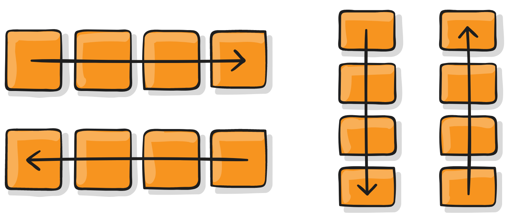
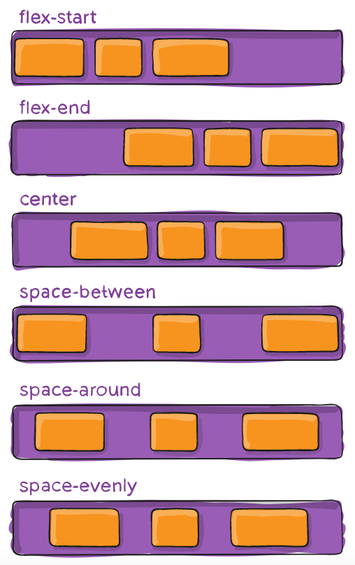
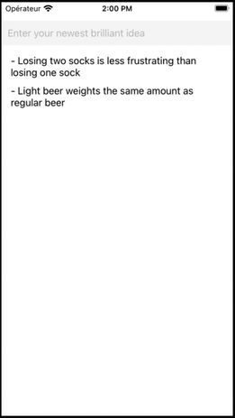

## Sommaire

- Introduction
- Composants React Native
- Gestion de l'UI
- Gestion de l'état
- Applications multi-écrans
- Utilisation d'API web
- Persistance locale

---

## Introduction

---

### L'écosystème mobile

- Absence de monopole.
- Deux poids lourds : Android et iOS.
- Parts de marché stables depuis plusieurs années.

---


---


---


---

{}

### Développement mobile natif

Création d'applications en utilisant la technologie prévue par le concepteur de l'OS.

- Android : Java
- IOS : Objective-C ou Swift

{}Ces technologies sont **incompatibles**.{}

---

### Avantages

- Accès à l'intégralité des fonctionnalités matérielles et logicielles du terminal mobile.
- Performances optimales.

---

### Inconvénient (majeur !)

Nécessité de créer puis de faire évoluer une application pour chaque environnement.

{}

---

{}

### Solutions hybrides

Création d'applications mobiles compatibles avec plusieurs OS mobiles grâce à un framework dédié.

Une application hybride est une application web qui s'exécute à l'intérieur d'un navigateur.

Exemples : [Apache Cordova](https://cordova.apache.org), [Ionic](https://ionicframework.com)

---

### Avantages

- Fonctionnalités et performances proches de celles d'une application native.
- Economies de ressources pour créer l'application.
- Une seule base de code : maintenance et évolution facilitées.

---

### Inconvénients

- Impossible d'accéder à certaines fonctionnalités matérielles ou logicielles spécifiques.
- _Look'n'feel_ non natif.
- Mauvaises performances dans certains scenarii.

{}

---

{}

### Développement natif multi-plateformes

Création d'applications mobiles compatibles avec plusieurs OS mobiles grâce à un framework dédié.

Le framework encapsule les véritables composants natifs de l'OS.

Exemples : [React Native](https://facebook.github.io/react-native/), [Weex](https://weexapp.com/), [Xamarin](https://dotnet.microsoft.com/en-us/apps/xamarin)

---

### Le meilleur des deux mondes ?

Combine les avantages du natif (_look'n'feel_, performances) et de l'hybride (une seule base de code).

Limite potentielle : le support de l'OS dépend entièrement du framework.

{}

---

### React Native

Framework créé par Facebook, open source depuis 2015.

Déclinaison mobile du framework JavaScript [React](https://reactjs.org/).

[](https://reactnative.dev/)

---

### Expo

Framework pour faciliter la création et le déploiement d'applications React Native.

[](https://expo.dev/)

- [Expo CLI](https://docs.expo.dev/workflow/expo-cli/) : outil en ligne de commande pour le développement local.
- [Expo Go](https://expo.dev/expo-go) : application mobile à installer sur le terminal cible pour le déploiement.

---

### Création d'une application

```bash
# Install expo-cli globally
# (Node.js and Git are prerequisites)
npm i -g expo-cli

# Create a new app named "appname" in its own subfolder
# Created files are automatically versioned into a Git repository
# The optional -t flag is used to select an Expo app template
# Run npx create-expo-app --template to see the list of available templates.
npx create-expo-app <appname> -t <expo-template>
# Alternative: expo init <appname> -t <expo-template>
```

- Workflow _managé_ : projet entièrement géré par Expo (plus simple).

- Workflow _bare_ : plus proche d'un projet React Native pur.

---

### Déploiement de l'application

```bash
cd <appname> # Move into project directory
npm start # Or 'expo start'
```

Ensuite, scan du QR Code depuis l'application Expo Go (Android) ou l'appareil photo du smartphone (iOS).


---

### Détails sur le déploiement

- L'application est hébergée sur un serveur web local.
- Expo s'y connecte pour la récupérer puis la lancer.
- Une interface web de gestion s'affiche.


---

### Rechargement dynamique

[](https://openclassrooms.com/fr/courses/4902061-developpez-une-application-mobile-react-native/)

---

### Connexion au serveur Expo

L'application mobile Expo Go doit accéder au serveur web de la machine de développement pour pouvoir lancer l'application RN.

Il existe plusieurs modes de connexion :

- **LAN** : utilisation du réseau Wifi local. Peut poser problème dans certains environnements Wifi sécurisés.
- **Tunnel** : création d'un tunnel avec [ngrok](https://ngrok.com/) pour accéder au serveur local via le web. Nécessite que le terminal mobile dispose d'un accès internet.

---

### Utilisation d'un émulateur

- Alternative à l'emploi d'un terminal mobile pour tester l'application RN.
- Nécessite l'installation de [XCode (iOS)](https://developer.apple.com/xcode/) ou [Android Studio](https://developer.android.com/studio) sur le machine de développement.
- Documentation : [iOS](https://docs.expo.io/workflow/ios-simulator/) | [Android](https://docs.expo.io/workflow/android-studio-emulator/).


---

### Contenu du répertoire créé


---

### Le fichier de configuration app.json

```json
{
  "expo": {
    "name": "HelloReactNative",
    "slug": "HelloReactNative",
    "version": "1.0.0",
    "orientation": "portrait",
    "icon": "./assets/icon.png",
    "userInterfaceStyle": "light",
    "splash": {
      "image": "./assets/splash.png",
      "resizeMode": "contain",
      "backgroundColor": "#ffffff"
    },
    "updates": {
      "fallbackToCacheTimeout": 0
    },
    "assetBundlePatterns": [
      "**/*"
    ],
    "ios": {
      "supportsTablet": true
    },
    "android": {
      "adaptiveIcon": {
        "foregroundImage": "./assets/adaptive-icon.png",
        "backgroundColor": "#FFFFFF"
      }
    },
    "web": {
      "favicon": "./assets/favicon.png"
    }
  }
}
```

---

### Le fichier package.json

```json
{
  "name": "helloreactnative",
  "version": "1.0.0",
  "main": "node_modules/expo/AppEntry.js",
  "scripts": {
    "start": "expo start",
    "android": "expo start --android",
    "ios": "expo start --ios",
    "web": "expo start --web"
  },
  "dependencies": {
    "expo": "~47.0.9",
    "expo-status-bar": "~1.4.2",
    "react": "18.1.0",
    "react-native": "0.70.5"
  },
  "devDependencies": {
    "@babel/core": "^7.12.9"
  },
  "private": true
}
```

---

### Le fichier principal App.js

```jsx
import { StatusBar } from "expo-status-bar";
import { StyleSheet, Text, View } from "react-native";

export default function App() {
  return (
    <View style={styles.container}>
      <Text>Open up App.js to start working on your app!</Text>
      <StatusBar style="auto" />
    </View>
  );
}

const styles = StyleSheet.create({
  container: {
    flex: 1,
    backgroundColor: "#fff",
    alignItems: "center",
    justifyContent: "center",
  },
});
```

---

### Les formats JSX et TSX

- Syntaxe introduite pour le framework web [React](https://reactjs.org/).
- Permet de décrire une UI en intégrant balisage et logique applicative.
- Les accolades `{...}` permettent d'inclure du code JavaScript dans le code JSX ([plus de détails](https://beta.reactjs.org/learn/javascript-in-jsx-with-curly-braces)).
- TSX : équivalent de JSX pour TypeScript.

```jsx
// JSX for React (web)
const name = "Clarisse Agbegnenou";
const element = <p>Hello, {name}</p>;
```

```jsx
// JSX for React Native (mobile)
const name = "Clarisse Agbegnenou";
const element = <Text>Hello, {name}</Text>;
```

---

## Composants React Native

---

### La notion de composant

- Les **composants** sont les blocs de base d'une application React (Native).

- Ils permettent de créer une UI sous forme **déclarative** par assemblage de composants inclus les uns dans les autres.

- Ils doivent comporter une fonction qui définit leur rendu visuel.

- Le fichier principal `App.js` d'une application RN doit exporter un composant par défaut.

---

### Composants fonctions

- La valeur de retour de la fonction définit leur rendu.
- Syntaxe standard, la plus concise.

```jsx
import React from 'react';
import { Text, View } from "react-native";

// HelloWorldApp is a function component
const HelloWorldApp = () => {
  return (
    <View
      style={{
        flex: 1,
        justifyContent: "center",
        alignItems: "center",
      }}
    >
      <Text style={{ fontSize: 24 }}>Hello from a function component!</Text>
    </View>
  );
};

export default HelloWorldApp;
```

---

### Composants classes

- La méthode obligatoire `render()` définit leur rendu.
- Syntaxe à privilégier pour les composants les plus complexes.

```jsx
import React, { Component } from "react";
import { Text, View } from "react-native";

// HelloWorldApp is a class component
class HelloWorldApp extends Component {
  render() {
    return (
      <View
        style={{
          flex: 1,
          justifyContent: "center",
          alignItems: "center",
        }}
      >
        <Text style={{ fontSize: 24 }}>Hello from a class component!</Text>
      </View>
    );
  }
}

export default HelloWorldApp;
```

---

### Composants de base

Implémentés de manière native par RN sous Android et iOS afin d'obtenir un _look'n'feel_ et des performances optimaux.

[](https://reactnative.dev/docs/components-and-apis)

---

### Gestion du style

- Propriété `style` disponible pour les composants de base.
- Semblable à CSS avec nommage _camelCase_.
- En ligne ou externalisé sous forme d'un objet créé par la fonction `StyleSheet.create`.

```jsx
import React from "react";
import { StyleSheet, Text, View } from "react-native";

export default App = () => {
  return (
    <View style={styles.container}>
      <Text style={styles.red}>just red</Text>
      <Text style={styles.bigblue}>just bigblue</Text>
      {/* Using an array of styles:  last element has precedence */}
      <Text style={[styles.bigblue, styles.red]}>bigblue, then red</Text>
      <Text style={[styles.red, styles.bigblue]}>red, then bigblue</Text>
    </View>
  );
};

const styles = StyleSheet.create({
  container: {
    flex: 1,
    alignItems: "center",
    justifyContent: "center",
  },
  bigblue: {
    color: "blue",
    fontWeight: "bold",
    fontSize: 30,
  },
  red: {
    color: "red",
  },
});
```

---

### Composants personnalisés

Ils permettent de créer une application par assemblage de composants élémentaires.

```jsx
import React from "react";
import { StyleSheet, Text, View } from "react-native";

const Cat = () => {
  return <Text>I am a cat!</Text>;
};

export default App = () => {
  return (
    <View style={styles.container}>
      <Text>Welcome!</Text>
      <Cat />
      <Cat />
      <Cat />
    </View>
  );
};

const styles = StyleSheet.create({
  container: {
    flex: 1,
    alignItems: "center",
    justifyContent: "center",
  },
});
```

---

### _Props_ d'un composant

- Caractéristiques définies au moment de la création, modifiables uniquement par le composant parent.
- Objet composé de propriétés (paires nom/valeur).

```jsx
import React from "react";
import { StyleSheet, Text, View } from "react-native";

// This component has two props: "name" and "age"
const Cat = ({ name, age }) => {
  return (
    <Text>
      I am {name} the {age} years old cat!
    </Text>
  );
};

export default App = () => {
  return (
    <View style={styles.container}>
      <Text>Welcome!</Text>
      {/* We define the values of the props for each cat */}
      <Cat name="Madchat" age="5" />
      <Cat name="Félicette" age="3" />
      <Cat name="Fritz" age="7" />
    </View>
  );
};

const styles = StyleSheet.create({
  container: {
    flex: 1,
    alignItems: "center",
    justifyContent: "center",
  },
});
```

---

### _Props_ et déstructuration

- Les _props_ peuvent être passées de deux manières équivalentes à un composant function.
- La seconde, plus concise et explicite, est un exemple de [déstructuration d'objet](https://developer.mozilla.org/en-US/docs/Web/JavaScript/Reference/Operators/Destructuring_assignment).

```jsx
const Cat1 = (props) => {
  const name = props.name;
  const age = props.age;
  // ...
};

const Cat2 = ({ name, age }) => {
  // ...
};
```

---

### Les hooks

- Introduits dans une version récente de React, les [hooks](https://reactjs.org/docs/hooks-overview.html) permettent d'écrire du code lié au cycle de vie des composants fonction.
- Exemple : le hook [useState](https://reactjs.org/docs/hooks-state.html) permet d'ajouter une variable d'état à un composant fonction.

```js
const [<getter>, <setter>] = useState(<initialValue>);
```

---

### Etat (_state_) d'un composant

- Etat interne (mémoire), susceptible de changer au cours du temps (_mutable_).
- Sa modification entraine une mise à jour de l'affichage du composant.

```jsx
import React, { useState } from "react";
import { StyleSheet, Button, Text, View } from "react-native";

const Counter = () => {
  // Add a variable named "count" to the component state.
  // Its initial value is zero.
  // The setCount function is used to update its value.
  const [count, setCount] = useState(0);

  return (
    // Adjacent JSX elements must be wrapped in an enclosing tag.
    // Fragments <> and </> let you do that without using an unnecessary wrapping element like View.
    <>
      <Button
        title="Click me!"
        onPress={() => {
          // Update the state variable
          setCount(count + 1);
        }}
      ></Button>
      {/* Show the current value of the state variable */}
      <Text>You clicked {count} times</Text>
    </>
  );
};

export default App = () => {
  return (
    <View style={styles.container}>
      <Counter />
    </View>
  );
};

const styles = StyleSheet.create({
  container: {
    flex: 1,
    alignItems: "center",
    justifyContent: "center",
  },
});
```

---

### Cycle de vie d'un composant

Les composants RN suivent un cycle de vie bien défini composé d'étapes : **montage**, **rendu**, **mise à jour**, **démontage** et **suppression**.

[](http://projects.wojtekmaj.pl/react-lifecycle-methods-diagram/)

---

## Gestion de l'UI

---

### Gestion des dimensions

Deux possibilités pour définir la taille des composants :

- Dimensions fixes
- Dimensions flexibles

---

### Dimensions fixes

Utile pour les composants qui doivent toujours être affichés à la même taille.

```jsx
import React from "react";
import { View } from "react-native";

export default App = () => {
  return (
    <>
      <View style={{ width: 50, height: 50, backgroundColor: "powderblue" }} />
      <View style={{ width: 100, height: 100, backgroundColor: "skyblue" }} />
      <View style={{ width: 150, height: 150, backgroundColor: "steelblue" }} />
    </>
  );
};
```

---

### Dimensions flexibles

- `flex:1` => le composant prend tout l'espace disponible, partagé équitablement entre les autres composants d'un même parent.

- Une valeur de `flex` plus élevée donne plus d'espace à un composant par rapport aux autres.

```jsx
import React from "react";
import { View } from "react-native";

export default App = () => {
  return (
    // Try removing the `flex: 1` on the parent View.
    // The parent will not have dimensions, so the children can't expand.
    // What if you add `height: 300` instead of `flex: 1`?
    <View style={{ flex: 1 }}>
      {/* Try changing the flex values to see how children views share the screen space */}
      <View style={{ flex: 1, backgroundColor: "powderblue" }} />
      <View style={{ flex: 2, backgroundColor: "skyblue" }} />
      <View style={{ flex: 3, backgroundColor: "steelblue" }} />
    </View>
  );
};
```

---

### Positionnement avec Flexbox

- Mode de mise en page pour les éléments situés à l'intérieur d'un conteneur.
- Objectif : répartir au mieux l'espace disponible.


---

### `flexDirection` : flux des éléments

`column` (par défaut), `row`, `column-reverse`, `row-reverse`.

[](https://css-tricks.com/snippets/css/a-guide-to-flexbox/)

---

### `justifyContent` : axe principal

[](https://css-tricks.com/snippets/css/a-guide-to-flexbox/)

---

### `alignItems` : axe secondaire

[](https://css-tricks.com/snippets/css/a-guide-to-flexbox/)

---

### Flexbox en action

```jsx
import React from "react";
import { View, StyleSheet } from "react-native";

export default App = () => {
  return (
    <View style={styles.container}>
      {/* Individual styles can be combined into an array */}
      {/* Thus, common style properties can be factorized */}
      <View style={[styles.box, styles.box1]} />
      <View style={[styles.box, styles.box2]} />
      <View style={[styles.box, styles.box3]} />
    </View>
  );
};

const styles = StyleSheet.create({
  container: {
    flex: 1,
    // Used to take into account the phone status bar at the top of the screen
    // marginTop: 48,
    justifyContent: "space-around",
    alignItems: "center",
  },
  box: {
    width: 100,
    height: 100,
  },
  box1: {
    backgroundColor: "powderblue",
  },
  box2: {
    backgroundColor: "skyblue",
  },
  box3: {
    backgroundColor: "steelblue",
  },
});
```

---

### Saisies utilisateur

Le composant [TextInput](https://reactnative.dev/docs/textinput) permet la saisie de texte.

```jsx
import React, { useState } from "react";
import { StyleSheet, Text, View, TextInput } from "react-native";

export default App = () => {
  // Add character count to state
  const [charCount, setCharCount] = useState(0);

  return (
    <View style={styles.container}>
      <TextInput
        style={styles.text}
        placeholder="Enter some text"
        onChangeText={(text) => {
          // Update character count after input changes
          setCharCount(text.length);
        }}
      />
      <Text>Character count: {charCount}</Text>
    </View>
  );
};

const styles = StyleSheet.create({
  container: {
    flex: 1,
    alignItems: "center",
    justifyContent: "center",
  },
  text: {
    fontSize: 22,
    paddingBottom: 10,
  },
});
```

---

## Gestion de l'état

---

### Rappels sur les props

- **Props** = caractéristiques définies au moment de la création du composant.

- Les props d'un composant sont modifiables uniquement par son composant parent.

---

### Rappels sur l'état

- **Etat (_state_)** = ensemble des données susceptibles d'être modifiées pendant l'exécution de l'application.

- Chaque composant fonction React Native possède un état interne, géré via le hook `useState`.

- Toute modification de l'état déclenche un nouveau rendu du composant.

---

### Problématique

- La gestion locale de l'état devient insuffisante lorsqu'un composant doit **accéder à** ou **modifier** l'état d'un autre composant.

- Nécessité de partager un **état commun** entre certains composants.

---

### Solution : _"lifting state up"_

- Remonter l'état au niveau du plus proche composant parent commun.
- Définir les actions de modification dans ce composant parent.
- Dans les composants enfants :
  - Remplacer l'état local par des propriétés définies par le parent.
  - Remplacer les actions locales par des appels aux actions définies dans le parent.

[Lifting State Up (React)](https://reactjs.org/docs/lifting-state-up.html)

---

### Exemple de remontée de l'état

<https://github.com/ensc-mobi/TempConverter>


---

### Mise en oeuvre

L'état (température et échelle) commun aux deux composants de saisie est remonté dans `App`, leur parent commun.

```jsx
import React, { useState } from "react";
import { StyleSheet, View, Text, TextInput } from "react-native";

// Scale names used for display
const scaleNames = { c: "Celsius", f: "Fahrenheit" };

// Celsius/Fahrenheit conversion functions
function toCelsius(fahrenheit) {
  return ((fahrenheit - 32) * 5) / 9;
}
function toFahrenheit(celsius) {
  return (celsius * 9) / 5 + 32;
}

// Component displaying if the water would boil or not, depending on the temperature
// We choose the Celsius scale for easier comparison with the boiling temperature
const BoilingResult = ({ tempCelsius }) => {
  let message = "";
  if (!Number.isNaN(tempCelsius)) {
    message =
      tempCelsius >= 100 ? "The water would boil" : "The water would not boil";
  }
  return <Text style={styles.text}>{message}</Text>;
};

// Component for displaying and inputting a temperature in a specific scale
const TemperatureInput = ({ value, scale, onChange }) => {
  // Accessing scaleNames properties through bracket notation
  // https://developer.mozilla.org/en-US/docs/Web/JavaScript/Reference/Operators/Property_Accessors
  const placeholder = `Enter temperature in ${scaleNames[scale]}`;
  return (
    <TextInput
      style={styles.text}
      placeholder={placeholder}
      onChangeText={(text) => {
        // Call callback passed as component prop when input text changes
        onChange(text);
      }}
      value={value}
    />
  );
};

// Convert a temperature using a given conversion function
function tryConvert(temperature, convert) {
  const input = parseFloat(temperature);
  if (Number.isNaN(input)) {
    return "";
  }
  // Call the conversion function on input
  const output = convert(input);
  // Keep the output rounded to the third decimal place
  const rounded = Math.round(output * 1000) / 1000;
  return rounded.toString();
}

// Main component
export default App = () => {
  // Common state is lifted here because this component is the closest parent of TemperatureInput components.
  // We store only the most recently changed input with its scale.
  // Temperature is stored as a string to handle missing values.
  const [temperature, setTemperature] = useState("");
  const [scale, setScale] = useState("c");

  // Compute temperatures in both scales
  const tempCelsius =
    scale === "f" ? tryConvert(temperature, toCelsius) : temperature;
  const tempFahrenheit =
    scale === "c" ? tryConvert(temperature, toFahrenheit) : temperature;

  return (
    <View style={styles.container}>
      {/* Display and input in Celsius degrees */}
      <TemperatureInput
        value={tempCelsius}
        scale="c"
        onChange={(newTemp) => {
          setTemperature(newTemp);
          setScale("c");
        }}
      />
      {/* Display and input in Fahrenheit degrees */}
      <TemperatureInput
        value={tempFahrenheit}
        scale="f"
        onChange={(newTemp) => {
          setTemperature(newTemp);
          setScale("f");
        }}
      />
      <BoilingResult tempCelsius={parseFloat(tempCelsius)} />
    </View>
  );
};

const styles = StyleSheet.create({
  container: {
    flex: 1,
    alignItems: "center",
    justifyContent: "center",
  },
  text: {
    fontSize: 22,
    paddingBottom: 10,
  },
});
```

---

### Restructuration du projet

- `components/` rassemble les définitions des composants élémentaires.
- Ils sont importés par le composant racine défini dans `App.js`.
- `utils/` et `theme/` factorisent les fonctions de conversion et les styles React Native communs.

```txt
MyApp/
├── components/
│   ├── BoilingResult.js
│   ├── TemperatureInput.js
├── utils/
│   ├── temperatureUtils.js
├── theme/
│   ├── styles.js
└── App.js
```

---

### Définition et export des fonctions de conversion

Dans le fichier `utils/temperatureUtils.js`.

```js
// Scale names used for display
export const scaleNames = { c: "Celsius", f: "Fahrenheit" };

// Celsius/Fahrenheit conversion functions
export function toCelsius(fahrenheit) {
  return ((fahrenheit - 32) * 5) / 9;
}
export function toFahrenheit(celsius) {
  return (celsius * 9) / 5 + 32;
}

// Convert a temperature using a given conversion function
export function tryConvert(temperature, convert) {
  const input = parseFloat(temperature);
  if (Number.isNaN(input)) {
    return "";
  }
  // Call the conversion function on input
  const output = convert(input);
  // Keep the output rounded to the third decimal place:
  const rounded = Math.round(output * 1000) / 1000;
  return rounded.toString();
}
```

---

### Définition et export du composant de saisie de température

Dans le fichier `components/TemperatureInput.js`.

```jsx
import React from "react";
import { TextInput } from "react-native";
import { scaleNames } from "../utils/temperatureUtils";
import styles from "../theme/styles";

// Component for displaying and inputting a temperature in a specific scale
const TemperatureInput = ({ value, scale, onChange }) => {
  // ...
};

export default TemperatureInput;
```

---

### Définition du composant racine

Dans le fichier `App.js`.

```jsx
import React, { useState } from "react";
import { View } from "react-native";
import BoilingResult from "./components/BoilingResult";
import TemperatureInput from "./components/TemperatureInput";
import { toCelsius, toFahrenheit, tryConvert } from "./utils/temperatureUtils";
import styles from "./theme/styles";

// Main component
export default App = () => {
  // ...
};
```

---

## Applications multi-écrans

---

### React Navigation

- Composant issu de la communauté des développeurs React Native.
- Devenu le standard pour les applications RN multi-vues.

[](https://reactnavigation.org)

---

### Installation de react-navigation

Utiliser `npx expo install` au lieu de `npm install` assure l'installation de versions compatibles avec celle d'Expo.

```bash
# Core components and common dependencies
npm install @react-navigation/native
npx expo install react-native-screens react-native-safe-area-context

# If StackNavigator is used
npm install @react-navigation/native-stack

# If BottomTabNavigator is used
npm install @react-navigation/bottom-tabs
```

---

### Exemple : navigation par piles (_stacks_)

<https://github.com/ensc-mobi/StackNavigatorDemo>


---

### NavigationContainer

- Composant racine nécessaire pour utiliser React Navigation.
- Ses descendants directs (composants enfants) sont appelés des **écrans** (_screens_).

```jsx
import React from "react";
import { NavigationContainer } from "@react-navigation/native";

export default App = () => {
  return (
    <NavigationContainer>{/* Rest of your app code */}</NavigationContainer>
  );
};
```

---

### StackNavigator

Principe similaire au web : gestion d'une pile d'écrans avec possibilité de naviguer de l'un à l'autre.

```jsx
import React from "react";
import { StyleSheet, View, Text } from "react-native";
import { NavigationContainer } from "@react-navigation/native";
import { createNativeStackNavigator } from "@react-navigation/native-stack";

const HomeScreen = () => {
  return (
    <View style={styles.container}>
      <Text style={styles.text}>This is the home screen</Text>
    </View>
  );
};

const Stack = createNativeStackNavigator();

export default App = () => {
  return (
    <NavigationContainer>
      <Stack.Navigator>
        <Stack.Screen name="Home" component={HomeScreen} />
      </Stack.Navigator>
    </NavigationContainer>
  );
};

const styles = StyleSheet.create({
  container: { flex: 1, alignItems: "center", justifyContent: "center" },
  text: { fontSize: 18, paddingBottom: 10 },
});
```

---

### API de navigation

Passé comme _prop_ d'un composant écran, l'objet `navigation` permet la gestion de la navigation:

- `navigation.navigate("RouteName")` navigue vers un nouvel écran, sauf s'il est déjà l'écran actuel.
- `navigation.push("RouteName")` navigue vers un nouvel écran même s'il est déjà l'écran actuel.
- `navigation.goBack()` permet de revenir en arrière dans la navigation.

---

### Exemple de navigation

```jsx
import React from "react";
import { StyleSheet, View, Text, Button } from "react-native";
import { NavigationContainer } from "@react-navigation/native";
import { createNativeStackNavigator } from "@react-navigation/native-stack";

const HomeScreen = ({ navigation }) => {
  return (
    <View style={styles.container}>
      <Text style={styles.text}>This is the home screen</Text>
      <Button
        title="Go to Details"
        onPress={() => navigation.navigate("Details")}
      />
    </View>
  );
};

const DetailsScreen = ({ navigation }) => {
  return (
    <View style={styles.container}>
      <Text style={styles.text}>This is the details screen</Text>
      <Button
        title="Go to Details... again"
        onPress={() => navigation.push("Details")}
      />
      <Button title="Go back" onPress={() => navigation.goBack()} />
      <Button title="Go to Home" onPress={() => navigation.navigate("Home")} />
    </View>
  );
};

const Stack = createNativeStackNavigator();

export default App = () => {
  return (
    <NavigationContainer>
      <Stack.Navigator initialRouteName="Home">
        <Stack.Screen name="Home" component={HomeScreen} />
        <Stack.Screen name="Details" component={DetailsScreen} />
      </Stack.Navigator>
    </NavigationContainer>
  );
};

const styles = StyleSheet.create({
  container: { flex: 1, alignItems: "center", justifyContent: "center" },
  text: { fontSize: 18, paddingBottom: 10 },
});
```

---

### Passage de paramètres entre écrans

`navigation.navigate` permet de transmettre des données d'un écran à l'autre sous la forme d'un objet JavaScript.

```js
// Navigate to "RouteName", passing some parameters
navigation.navigate("RouteName", { /* params go here */ })
```

L'écran d'arrivée peut lire les paramètres grâce à la propriété `params` du _prop_ `route`.

Ces paramètres sont équivalents à ceux d'une URL. Ils ne doivent pas contenir les données métiers de l'application (plutôt gérés via l'état).

---

### Exemple de passage de paramètres

```jsx
import React from "react";
import { StyleSheet, View, Text, Button } from "react-native";
import { NavigationContainer } from "@react-navigation/native";
import { createNativeStackNavigator } from "@react-navigation/native-stack";

const HomeScreen = ({ navigation }) => {
  return (
    <View style={styles.container}>
      <Text style={styles.text}>This is the home screen</Text>
      <Button
        title="Go to Details"
        onPress={() => {
          // Navigate to the Details route with 2 params
          navigation.navigate("Details", {
            itemId: 86,
            otherParam: "anything you want here",
          });
        }}
      />
    </View>
  );
};

const DetailsScreen = ({ navigation, route }) => {
  // Get the params
  const { itemId, otherParam } = route.params;
  return (
    <View style={styles.container}>
      <Text style={styles.text}>This is the details screen</Text>
      {/* Convert params to JSON strings before display */}
      <Text>itemId: {JSON.stringify(itemId)}</Text>
      <Text>otherParam: {JSON.stringify(otherParam)}</Text>
      <Button
        title="Go to Details... again"
        onPress={() => {
          // Navigate to Details again with one param
          navigation.push("Details", {
            itemId: Math.floor(Math.random() * 100),
          });
        }}
      />
      <Button title="Go back" onPress={() => navigation.goBack()} />
      <Button title="Go to Home" onPress={() => navigation.navigate("Home")} />
    </View>
  );
};

const Stack = createNativeStackNavigator();

export default App = () => {
  return (
    <NavigationContainer>
      <Stack.Navigator initialRouteName="Home">
        <Stack.Screen name="Home" component={HomeScreen} />
        <Stack.Screen name="Details" component={DetailsScreen} />
      </Stack.Navigator>
    </NavigationContainer>
  );
};

const styles = StyleSheet.create({
  container: { flex: 1, alignItems: "center", justifyContent: "center" },
  text: { fontSize: 18, paddingBottom: 10 },
});
```

---

### En-tête des écrans

La _prop_ `screenOptions` de `StackNavigator` permet de configurer l'en-tête commun à tous les écrans. La couleur de la barre de statut du téléphone peut être harmonisée grâce au composant [StatusBar](https://reactnavigation.org/docs/status-bar/).

```jsx
import React from "react";
import { StyleSheet, View, Text, Button, StatusBar } from "react-native";
import { NavigationContainer } from "@react-navigation/native";
import { createNativeStackNavigator } from "@react-navigation/native-stack";

// [...]

const Stack = createNativeStackNavigator();

export default App = () => {
  return (
    <NavigationContainer>
      <StatusBar barStyle="light-content" backgroundColor="#f4511e" />
      <Stack.Navigator
        initialRouteName="Home"
        screenOptions={{
          headerStyle: {
            backgroundColor: "#f4511e",
          },
          headerTintColor: "#fff",
          headerTitleStyle: {
            fontWeight: "bold",
          },
        }}
      >
        <Stack.Screen
          name="Home"
          component={HomeScreen}
          options={{ title: "My home" }}
        />
        <Stack.Screen name="Details" component={DetailsScreen} />
      </Stack.Navigator>
    </NavigationContainer>
  );
};

const styles = StyleSheet.create({
  container: { flex: 1, alignItems: "center", justifyContent: "center" },
  text: { fontSize: 18, paddingBottom: 10 },
});
```

---

### Restructuration du projet

- `screens/` stocke les composants définissant chaque écran de l'application.
- `navigation/` stocke les composants qui organisent la navigation entre les écrans.

```txt
MyApp/
├── screens/
│   ├── DetailsScreen.js
│   ├── HomeScreen.js
├── navigation/
│   ├── RootStackNavigator.js
├── theme/
│   ├── colors.js
│   ├── styles.js
└── App.js
```

---

### Exemple : navigation par onglets

<https://github.com/ensc-mobi/TabNavigatorDemo>


---

### TabNavigator

Affichage d'onglets en bas de l'écran.

```jsx
import React from "react";
import { StyleSheet, Text, View } from "react-native";
import Ionicons from "react-native-vector-icons/Ionicons";
import { NavigationContainer } from "@react-navigation/native";
import { createBottomTabNavigator } from "@react-navigation/bottom-tabs";

const HomeScreen = () => {
  return (
    <View style={styles.container}>
      <Text>This is the home screen</Text>
    </View>
  );
};

const SettingsScreen = () => {
  return (
    <View style={styles.container}>
      <Text>This is the settings screen</Text>
    </View>
  );
};

const Tab = createBottomTabNavigator();

export default App = () => {
  return (
    <NavigationContainer>
      <Tab.Navigator>
        <Tab.Screen name="Home" component={HomeScreen} />
        <Tab.Screen name="Settings" component={SettingsScreen} />
      </Tab.Navigator>
    </NavigationContainer>
  );
};

const styles = StyleSheet.create({
  container: { flex: 1, justifyContent: "center", alignItems: "center" },
});
```

---

### Paramétrage de l'apparence

Réalisé grâce à la _prop_ `screenOptions` de `TabNavigator`.

```jsx
import React from "react";
import { StyleSheet, Text, View, Button, StatusBar } from "react-native";
import Ionicons from "react-native-vector-icons/Ionicons";
import { NavigationContainer } from "@react-navigation/native";
import { createBottomTabNavigator } from "@react-navigation/bottom-tabs";

// [...]

const Tab = createBottomTabNavigator();

export default App = () => {
  return (
    <NavigationContainer>
      <StatusBar barStyle="light-content" backgroundColor="#f4511e" />
      <Tab.Navigator
        screenOptions={({ route }) => ({
          // Icons will be different if the tab is focused
          tabBarIcon: ({ focused, color, size }) => {
            let iconName;
            if (route.name === "Home") {
              iconName = focused
                ? "ios-information-circle"
                : "ios-information-circle-outline";
            } else if (route.name === "Settings") {
              iconName = focused ? "ios-list" : "ios-list-outline";
            }
            // You can return any component that you like here!
            return <Ionicons name={iconName} size={size} color={color} />;
          },
          tabBarActiveTintColor: "tomato",
          tabBarInactiveTintColor: "gray",
          headerStyle: {
            backgroundColor: "#f4511e",
          },
          headerTintColor: "#fff",
          headerTitleStyle: {
            fontWeight: "bold",
          },
        })}
      >
        <Tab.Screen name="Home" component={HomeScreen} />
        <Tab.Screen name="Settings" component={SettingsScreen} />
      </Tab.Navigator>
    </NavigationContainer>
  );
};

const styles = StyleSheet.create({
  container: { flex: 1, justifyContent: "center", alignItems: "center" },
  text: { fontSize: 18, paddingBottom: 10 },
});
```

---

### Navigation entre onglets

- API identique à la navigation entre les écrans d'un `StackNavigator`.
- L'objet `navigation` doit être passé comme _prop_ de l'écran.

```jsx
import React from "react";
import { StyleSheet, Text, View, Button } from "react-native";
import Ionicons from "react-native-vector-icons/Ionicons";
import { NavigationContainer } from "@react-navigation/native";
import { createBottomTabNavigator } from "@react-navigation/bottom-tabs";

const HomeScreen = ({ navigation }) => {
  return (
    <View style={styles.container}>
      <Text style={styles.text}>This is the home screen</Text>
      <Button
        title="Go to Settings"
        onPress={() => navigation.navigate("Settings")}
      />
    </View>
  );
};

const SettingsScreen = ({ navigation }) => {
  return (
    <View style={styles.container}>
      <Text style={styles.text}>This is the settings screen</Text>
      <Button title="Go to Home" onPress={() => navigation.navigate("Home")} />
    </View>
  );
};

const Tab = createBottomTabNavigator();

export default App = () => {
  return (
    <NavigationContainer>
      <Tab.Navigator
        screenOptions={({ route }) => ({
          tabBarIcon: ({ focused, color, size }) => {
            let iconName;
            if (route.name === "Home") {
              iconName = focused
                ? "ios-information-circle"
                : "ios-information-circle-outline";
            } else if (route.name === "Settings") {
              iconName = focused ? "ios-list" : "ios-list-outline";
            }
            // You can return any component that you like here!
            return <Ionicons name={iconName} size={size} color={color} />;
          },
          tabBarActiveTintColor: "tomato",
          tabBarInactiveTintColor: "gray",
        })}
      >
        <Tab.Screen name="Home" component={HomeScreen} />
        <Tab.Screen name="Settings" component={SettingsScreen} />
      </Tab.Navigator>
    </NavigationContainer>
  );
};

const styles = StyleSheet.create({
  container: { flex: 1, justifyContent: "center", alignItems: "center" },
  text: { fontSize: 18, paddingBottom: 10 },
});
```

---

### Affichage de piles dans les onglets

```jsx
import React from "react";
import { StyleSheet, Text, View, Button, StatusBar } from "react-native";
import Ionicons from "react-native-vector-icons/Ionicons";
import { NavigationContainer } from "@react-navigation/native";
import { createNativeStackNavigator } from "@react-navigation/native-stack";
import { createBottomTabNavigator } from "@react-navigation/bottom-tabs";

const HomeScreen = ({ navigation }) => {
  return (
    <View style={styles.container}>
      <Text style={styles.text}>This is the home screen</Text>
      <Button
        title="Go to Details"
        onPress={() => navigation.navigate("Details")}
      />
    </View>
  );
};

const DetailsScreen = () => {
  return (
    <View style={styles.container}>
      <Text style={styles.text}>This is the details screen</Text>
    </View>
  );
};

const SettingsScreen = () => {
  return (
    <View style={styles.container}>
      <Text style={styles.text}>This is the settings screen</Text>
    </View>
  );
};

// Screen stack for home tab
const HomeStack = createNativeStackNavigator();

const HomeStackNavigator = () => {
  return (
    <HomeStack.Navigator initialRouteName="Home" screenOptions={screenOptions}>
      <HomeStack.Screen
        name="Home"
        component={HomeScreen}
        options={{ title: "My home" }}
      />
      <HomeStack.Screen name="Details" component={DetailsScreen} />
    </HomeStack.Navigator>
  );
};

// Screen stack for settings tab
const SettingsStack = createNativeStackNavigator();

const SettingsStackNavigator = () => {
  return (
    <SettingsStack.Navigator
      initialRouteName="Home"
      screenOptions={screenOptions}
    >
      <SettingsStack.Screen name="Settings" component={SettingsScreen} />
    </SettingsStack.Navigator>
  );
};

const Tab = createBottomTabNavigator();

export default App = () => {
  return (
    <NavigationContainer>
      <StatusBar barStyle="light-content" backgroundColor="#f4511e" />
      <Tab.Navigator
        screenOptions={({ route }) => ({
          // Icons will be different if the tab is focused
          tabBarIcon: ({ focused, color, size }) => {
            let iconName;
            if (route.name === "HomeStack") {
              iconName = focused
                ? "ios-information-circle"
                : "ios-information-circle-outline";
            } else if (route.name === "SettingsStack") {
              iconName = focused ? "ios-list" : "ios-list-outline";
            }
            // You can return any component that you like here!
            return <Ionicons name={iconName} size={size} color={color} />;
          },
          tabBarActiveTintColor: "tomato",
          tabBarInactiveTintColor: "gray",
          // Hiding tab navigator header to show only stack header
          headerShown: false,
        })}
      >
        <Tab.Screen name="HomeStack" component={HomeStackNavigator} />
        <Tab.Screen name="SettingsStack" component={SettingsStackNavigator} />
      </Tab.Navigator>
    </NavigationContainer>
  );
};

const styles = StyleSheet.create({
  container: { flex: 1, justifyContent: "center", alignItems: "center" },
  text: { fontSize: 18, paddingBottom: 10 },
});

// Common stack header options
const screenOptions = {
  headerStyle: {
    backgroundColor: "#f4511e",
  },
  headerTintColor: "#fff",
  headerTitleStyle: {
    fontWeight: "bold",
  },
};
```

---

### Restructuration du projet

```txt
MyApp/
├── screens/
│   ├── DetailsScreen.js
│   ├── HomeScreen.js
│   ├── SettingsScreen.js
├── navigation/
│   ├── HomeStackNavigator.js
│   ├── SettingsStackNavigator.js
│   ├── RootTabNavigator.js
├── theme/
│   ├── colors.js
│   ├── styles.js
└── App.js
```

---

### Autres possibilités de react-navigation

- [Navigation par menu accordéon](https://reactnavigation.org/docs/drawer-based-navigation)
- [Ecran modal](https://reactnavigation.org/docs/modal)
- [Gestion de l'authentification](https://reactnavigation.org/docs/auth-flow)
- ...

---

## Utilisation d'API web

---

### La notion d'API

Une **API** (_Application Programming Interface_) est un point d'entrée programmatique dans un système.

Elle fournit un moyen d'interagir avec ce système.

Les API permettent aux développeurs d'intégrer des services externes dans leurs applications.

---

### Spécificités des API web

Une **API web** (appelée parfois service web) est une API accessible via les technologies du web : HTTP ou HTTPS.

Les API web utilisent le plus souvent le format de donnée **JSON**.

Certaines sont librement utilisables, d'autres nécessitent une authentification du client.

---

### Exemples d'API web

- [PokéAPI](https://pokeapi.co/)
- [Star Wars API](https://swapi.dev/)
- [Wikipedia](https://en.wikipedia.org/w/api.php?)
- [Spotify](https://developer.spotify.com/documentation/web-api/)
- [OMDb API](https://www.omdbapi.com/)
- ...

---

### Outils pour la gestion des API web

- [Postman](https://www.getpostman.com/)
- Extension [RESTClient](https://addons.mozilla.org/fr/firefox/addon/restclient/) pour Firefox
- [Insomnia](https://insomnia.rest/)
- ...

---

### Exemple d'utilisation d'une API

<https://github.com/ensc-mobi/RandomBeer>


---

### Appels réseau asynchrones avec `fetch`

Une [promesse](https://web.dev/promises/) (_promise_) est un objet qui encapsule une opération dont le résultat n'est pas encore connu.

La fonction JavaScript [fetch()](https://developers.google.com/web/updates/2015/03/introduction-to-fetch) exploite les possibilités des promesses.

```js
// Envoie une requête HTTP asynchrone vers l'URL spécifiée
fetch(url)
  .then(() => {
    // Code appelé ultérieurement si la requête réussit
  })
  .catch(() => {
    // Code appelé ultérieurement si la requête échoue
  });
```

---

### Accès à une ressource distante

```js
// Envoi d'une requête HTTP asynchrone vers l'URL spécifiée
// La réponse reçue ici contient des données JSON
fetch("http://my-api-url")
  // Accès au contenu JSON de la réponse
  .then((response) => response.json())
  .then((content) => {
    // Utilisation du contenu de la réponse
    // `content` est un objet ou un tableau JavaScript
    // ...
  })
  .catch((error) => {
    console.error(error);
  });
```

---

### Mise à jour d'une ressource distante

```js
fetch("https://mywebsite.com/endpoint/", {
  method: "POST",
  headers: {
    Accept: "application/json",
    "Content-Type": "application/json",
  },
  body: JSON.stringify({
    firstParam: "yourValue",
    secondParam: "yourOtherValue",
  }),
});
```

---

### Appels réseau asynchrones avec `async/await`

Les fonctions utilisant `await` doivent être déclarées avec le mot-clé `async`.

```js
// Cette fonction renvoie une promesse
const fetchRemoteApi = async () => {
  try {
    // Envoi d'une requête HTTP asynchrone vers l'URL spécifiée
    // La réponse reçue ici contient des données JSON
    const response = await fetch("http://my-api-url");
    // Accès au contenu JSON de la réponse
    const content = await response.json();
    // Utilisation du contenu de la réponse
    // `content` est un objet ou un tableau JavaScript
    // ...
  } catch (e) {
    // Gestion de l'erreur
    // ...
  }
};

fetchRemoteApi();
```

---

### Exécution de code à l'initialisation d'un composant

- Le hook [useEffect](https://reactjs.org/docs/hooks-effect.html) permet de déclencher des traitements à certains moments du cycle de vie d'un composant.
- Par défaut, le code associé est appelé à chaque réaffichage du composant. On peut définir une liste des variables dont le changement déclenche une nouvelle exécution du code du `hook`.

```js
useEffect(() => {
  // Code exécuté uniquement au chargement (mounting) du composant
  // ...
}, []);
```

---

### Affichage pendant le chargement

- Le composant [ActivityIndicator](https://reactnative.dev/docs/activityindicator) permet d'afficher un _spinner_ pendant les actions potentiellement longues (chargements réseau, etc).
- Il est souvent associé à un booléen `loading` ajouté à l'état du composant.


---

### Mise en oeuvre

```jsx
import React, { useEffect } from "react";
import { useState } from "react";
import {
  StyleSheet,
  Text,
  View,
  ActivityIndicator,
  TouchableOpacity,
} from "react-native";

// API endpoint
const rootEndpoint = "https://api.punkapi.com/v2";

// fetch API for a random beer
const fetchRandomBeer = async () => {
  const response = await fetch(`${rootEndpoint}/beers/random`);
  const beers = await response.json();
  // Access first element of returned beer array
  return beers[0];
};

export default App = () => {
  // Define state
  const [loading, setLoading] = useState(true);
  const [error, setError] = useState(false);
  const [beerName, setBeerName] = useState("");
  const [beerDescription, setBeerDescription] = useState("");

  // Load a new beer
  const loadBeer = async () => {
    setLoading(true);
    setError(false);

    try {
      const beer = await fetchRandomBeer();

      // Update state
      setBeerName(beer.name);
      setBeerDescription(beer.description);
    } catch (e) {
      setError(true);
    }

    setLoading(false);
  };

  // The empty array [] prevents the effect from running at each re-render
  useEffect(() => {
    // More details; https://www.robinwieruch.de/react-hooks-fetch-data/
    loadBeer();
  }, []);

  if (loading) {
    return (
      <View style={styles.container}>
        <ActivityIndicator size="large" />
      </View>
    );
  }

  if (error) {
    return (
      <View style={styles.container}>
        <Text>Something went wrong :\</Text>
      </View>
    );
  }

  return (
    <View style={styles.container}>
      <Text style={styles.name}>{beerName}</Text>
      <Text style={styles.description}>{beerDescription}</Text>
      {/* Add a button to fetch another beer */}
      <TouchableOpacity
        style={styles.button}
        onPress={() => {
          loadBeer();
        }}
      >
        <Text>Grab a new beer!</Text>
      </TouchableOpacity>
    </View>
  );
};

const styles = StyleSheet.create({
  container: {
    flex: 1,
    justifyContent: "center",
    margin: 30,
  },
  name: {
    fontSize: 18,
    fontWeight: "700",
    marginBottom: 10,
  },
  description: {
    marginBottom: 10,
  },
  button: {
    borderWidth: 1,
    borderColor: "black",
    borderRadius: 3,
    padding: 5,
    justifyContent: "center",
    alignItems: "center",
  },
});
```

---

### Restructuration du projet

`api/` rassemble les définitions des appels réseau asynchrones.

```txt
MyApp/
├── api/
│   ├── punkapi.js
├── theme/
│   ├── styles.js
└── App.js
```

---

## Persistance locale

---

### Besoin

- Les applications mobiles doivent souvent enregistrer une partie de leurs données (préférences utilisateurs, dernières informations consultées, etc) dans la mémoire de stockage du téléphone/tablette.
- Plusieurs solutions existent pour cela.

---

### Exemple de stockage local

<https://github.com/ensc-mobi/ShowerThoughts>



---

### Stockage local avec `AsyncStorage`

- Le composant [AsyncStorage](https://react-native-async-storage.github.io/async-storage/) permet de stocker localement des données sous forme de paires nom/valeur.
- Il gère des valeurs de type chaîne, ou objet après sérialisation JSON.
- Son API est basée sur les promesses et donc asynchrone.
- Il doit être ajouté au projet :

```bash
npx expo install @react-native-async-storage/async-storage
```

---

### Ecriture de données

`setItem` permet à la fois d'ajouter de nouveaux éléments et de modifier des éléments existants.

```js
import AsyncStorage from "@react-native-async-storage/async-storage";

const storeString = async (value) => {
  try {
    await AsyncStorage.setItem("my_storage_key", value);
  } catch (e) {
    // Saving error
  }
};

const storeObject = async (value) => {
  try {
    const jsonValue = JSON.stringify(value)
    await AsyncStorage.setItem("my_storage_key", jsonValue)
  } catch (e) {
    // Saving error
  }
}
```

---

### Lecture de données

`getItem` renvoie une promesse qui réussit si la valeur associée à la clé est trouvée, ou renvoie `null` dans le cas contraire.

```js
import AsyncStorage from "@react-native-async-storage/async-storage";

const getString = async () => {
  try {
    const value = await AsyncStorage.getItem("my_storage_key");
    if (value !== null) {
      // value previously stored
    }
  } catch (e) {
    // Error reading value
  }
};

const getObject = async () => {
  try {
    const jsonValue = await AsyncStorage.getItem("my_storage_key");
    return jsonValue != null ? JSON.parse(jsonValue) : null;
  } catch (e) {
    // Error reading value
  }
};
```

---

### Mise en oeuvre

- Les données sont chargées depuis le stockage local uniquement au démarrage de l'application.
- La validation de la saisie déclenche la sauvegarde locale, puis la mise à jour de l'état.

```jsx
import React, { useEffect, useState } from "react";
import { StyleSheet, Text, View, TextInput, FlatList } from "react-native";
import AsyncStorage from "@react-native-async-storage/async-storage";

// AsyncStorage key used for storing ideas
const STORAGE_KEY = "ASYNC_STORAGE_IDEAS";

export default function App() {
  // Value of the text input
  const [input, setInput] = useState("");
  // Ideas list, initially empty
  const [ideas, setIdeas] = useState([]);

  // Clear local storage
  const resetIdeas = async () => {
    console.log("Removing ideas from local storage...");
    try {
      await AsyncStorage.multiRemove([STORAGE_KEY]);
    } catch (e) {
      console.error("Failed to clear ideas");
    }
  };

  // Save ideas array parameter to local storage
  const saveIdeas = async (newIdeas) => {
    console.log(`Saving ideas [${newIdeas}] to local storage...`);
    try {
      // Turn ideas array into a JSON string
      const jsonIdeas = JSON.stringify(newIdeas);
      // Store ideas string
      await AsyncStorage.setItem(STORAGE_KEY, jsonIdeas);
    } catch (e) {
      console.error("Failed to save ideas");
    }
  };

  // Load ideas from local storage
  const loadIdeas = async () => {
    console.log("Loading ideas from local storage...");
    try {
      // Load ideas string
      const jsonIdeas = await AsyncStorage.getItem(STORAGE_KEY);
      if (jsonIdeas !== null) {
        // Turn stored JSON string into an array, and set it as ideas array
        setIdeas(JSON.parse(jsonIdeas));
      }
    } catch (e) {
      console.error("Failed to load ideas");
    }
  };

  // Load ideas only during initial component mounting
  useEffect(() => {
    // Uncomment to clear ideas from local storage
    // resetIdeas();
    loadIdeas();
  }, []);

  return (
    <View style={styles.container}>
      <TextInput
        style={styles.input}
        placeholder="Enter your newest brilliant idea"
        // Display input value
        value={input}
        onChangeText={(text) => {
          // Update input value
          setInput(text);
        }}
        onSubmitEditing={() => {
          if (!input) return; // Don't submit if empty

          // Creating a new ideas array with input (new idea) at the end
          const newIdeas = [...ideas, input];
          saveIdeas(newIdeas);
          // Update state
          setIdeas(newIdeas);

          // Reset input value
          setInput("");
        }}
      />
      <FlatList
        style={styles.list}
        data={ideas}
        renderItem={({ item }) => <Text style={styles.item}>- {item}</Text>}
        keyExtractor={(item) => item}
      ></FlatList>
    </View>
  );
}

const styles = StyleSheet.create({
  container: {
    flex: 1,
    marginTop: 30,
  },
  input: {
    backgroundColor: "whitesmoke",
    padding: 10,
    marginBottom: 10,
  },
  list: {
    marginLeft: 10,
    marginRight: 10,
  },
  item: {
    padding: 5,
  },
});
```

---

### Restructuration du projet

```txt
MyApp/
├── components/
│   ├── Input.js
├── utils/
│   ├── localStorage.js
├── theme/
│   ├── styles.js
└── App.js
```
