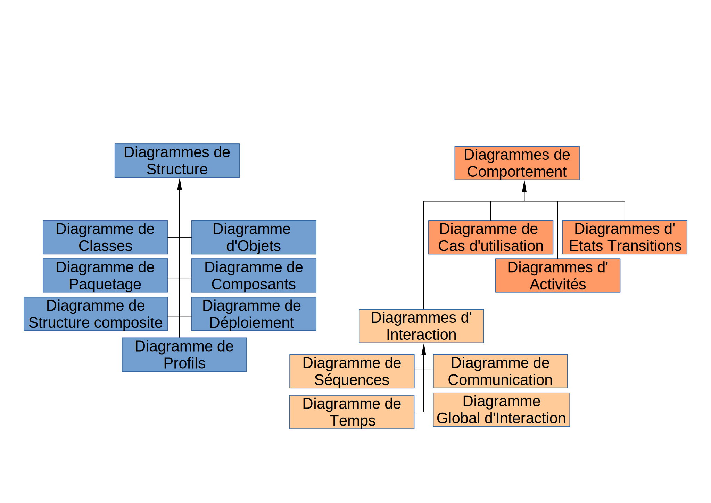

## Sommaire

- Introduction à UML
- Le diagramme de classes
- Autres diagrammes
- UML en pratique

---

## Introduction à UML

---

### Qu'est-ce qu'UML ?

- UML = *Unified Modeling Language*.
- Langage unifié (multi-langages, multi-plateformes) pour la conception de logiciels orientés objet.
- Permet de modéliser les éléments d'un logiciel sous la forme de **diagrammes** indépendants de toute technologie spécifique.

---

### Histoire d'UML

- Les premières versions datent des années 1990, période où la POO s'impose comme le nouveau standard pour la création de logiciels.
- Ses "papas" sont [Grady Booch](https://en.wikipedia.org/wiki/Grady_Booch), [James Rumbaugh](https://en.wikipedia.org/wiki/James_Rumbaugh) et [Ivar Jacobson](https://en.wikipedia.org/wiki/Ivar_Jacobson), trois architectes logiciels reconnus de l'époque.
- La version la plus récente est la 2.5, normalisée en 2017.

---

)

---

### Rôle d'UML

- UML est un langage de modélisation, pas une méthode.
- Boîte à outils dans laquelle le concepteur peut piocher pour représenter graphiquement certains aspects de son application (structure, comportement, cas d'usage, etc).
- Avantages :
  - indépendance vis-à-vis de toute implémentation spécifique ;
  - universalité.

---

### Liste des diagrammes UML

---

### Place d'UML dans le processus de conception logicielle

- Souvent utilisé pendant les phases initiales d'**analyse** et de **conception** :
  - Modélisation des concepts manipulés sous la forme d'objets en interaction ;
  - Formalisation des scénarios d'utilisation ;
  - Dynamique des interactions.
- Les diagrammes créées constituent une forme de documentation précieuse pour la suite du projet (codage, maintenance, évolutions).

---

## Le diagramme de classes

---

### Rôle du diagramme de classes

Diagramme structurel qui permet de modéliser un ensemble de classes ainsi que leurs interactions.

---

### Exemple de représentation d'une classe

---

### Caractéristiques d'une classe dans un diagramme

- Nom de la classe en caractères gras (en italique pour les classes abstraites).
- Un compartiment pour les attributs, un autre pour les méthodes.
- Symboles avant les membres = niveau d'accessibilité public (`+`), privé (`-`), protégé (`#`).
- Paramètres et type de retour des méthodes sont parfois omis.

---

### Association entre classes

- Une association représente une relation entre classes de type "**a un**" ou "**a plusieurs**".
  - Un compte bancaire a un titulaire, un livre a plusieurs pages, etc.
- Une association binaire est matérialisée en UML par un trait continu entre les deux classes enrichi d'informations sur la **navigabilité** et les **multiplicités** de l'association.
- Elle implique un lien (*couplage*) entre les classes concernées.

---

### Navigabilité d'une association

- Possibilité de parcourir l'association, cad de passer d'une instance d'une classe aux autres instances concernées par la relation.
- Matérialisée par une flèche en cas d'association unidirectionnelle.

---

### Multiplicités d'une association

La multiplicité située à une extrémité d'une association UML indique à combien d'instances de la classe une instance de l'autre classe peut être associée.

---

### Agrégation

---

### Composition

---

### Héritage entre classes

---

## Autres diagrammes

---

### Diagramme de séquences

---

### Diagramme de cas d'utilisation

---

## UML en pratique

---

### Avenir d'UML
