## Sommaire

- Introduction à UML
- Le diagramme de classes
- Principaux autres diagrammes
- UML en pratique

---

## Introduction à UML

---

### Qu'est-ce qu'UML ?

- UML = *Unified Modeling Language*.
- Langage unifié (multi-langages, multi-plateformes) pour la conception de logiciels orientés objet.
- Permet de modéliser les éléments d'un logiciel sous la forme de **diagrammes** indépendants de toute technologie spécifique.

---

### Histoire d'UML

- Les premières versions datent des années 1990, période où la POO s'impose comme le nouveau standard pour la création de logiciels.
- Ses "papas" sont [Grady Booch](https://en.wikipedia.org/wiki/Grady_Booch), [James Rumbaugh](https://en.wikipedia.org/wiki/James_Rumbaugh) et [Ivar Jacobson](https://en.wikipedia.org/wiki/Ivar_Jacobson), trois architectes logiciels reconnus de l'époque.
- La version la plus récente est la 2.5, normalisée en 2017.

---

[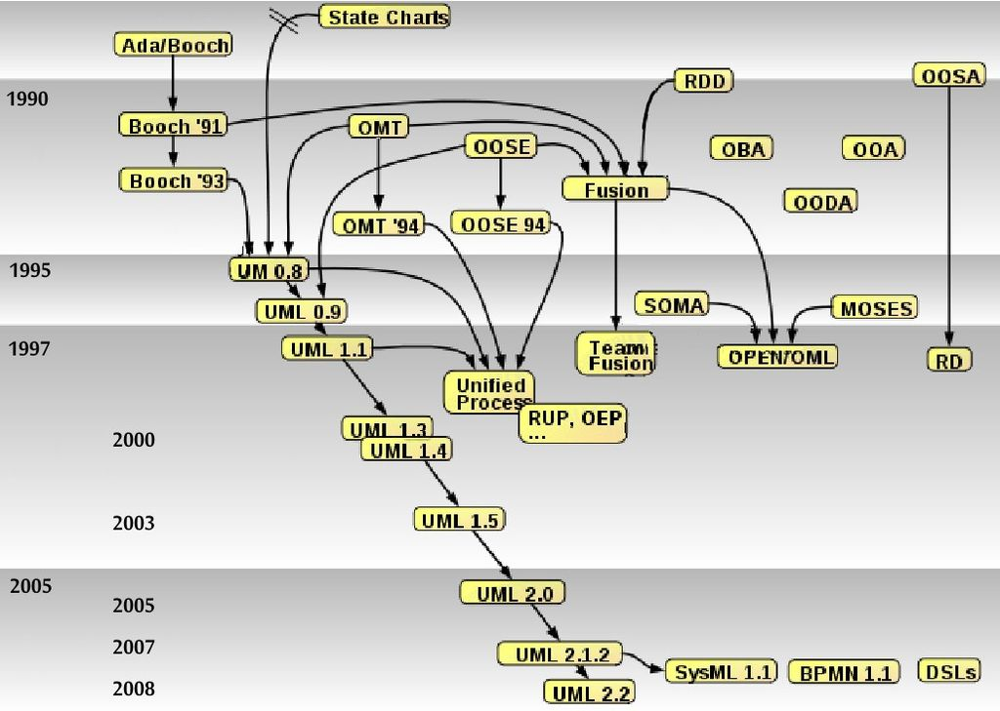](https://fr.wikipedia.org/wiki/UML_(informatique))

---

### Rôle d'UML

- UML est un langage de modélisation, pas une méthode.
- Boîte à outils dans laquelle le concepteur peut piocher pour représenter graphiquement certains aspects de son application (structure, comportement, cas d'usage, etc).
- Avantages :
  - indépendance vis-à-vis de toute implémentation spécifique ;
  - universalité.

---

### Liste des diagrammes UML

Chacun a son propre formalisme ainsi qu'une sémantique spécifique.

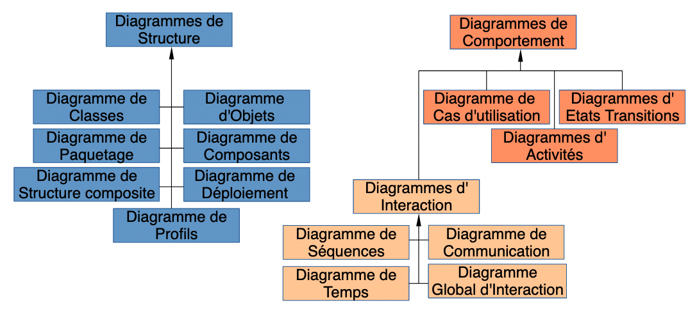

---

### Place d'UML dans le processus de conception logicielle

- Souvent utilisé pendant les phases initiales d'**analyse** et de **conception** :
  - Modélisation des concepts manipulés sous la forme d'objets en interaction ;
  - Formalisation des scénarios d'utilisation ;
  - Dynamique des interactions.
- Les diagrammes créées constituent une forme de documentation précieuse pour la suite du projet (codage, maintenance, évolutions).

---

## Le diagramme de classes

---

### Rôle du diagramme de classes

Diagramme structurel qui permet de modéliser un ensemble de classes ainsi que leurs interactions.

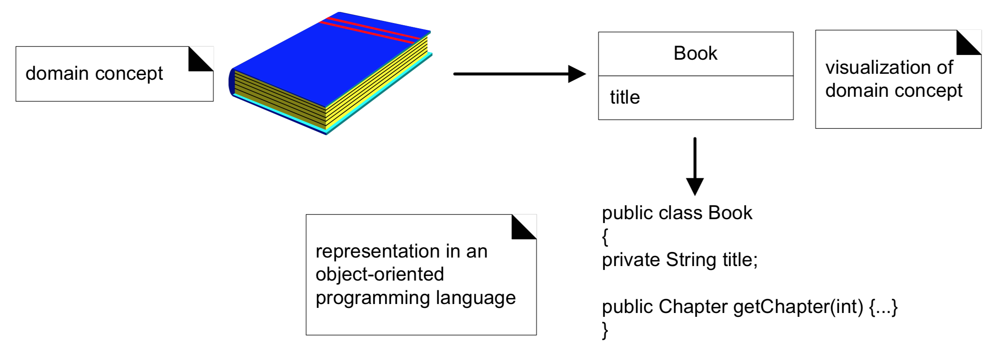

---

### Exemple de représentation d'une classe

(Peut légèrement varier selon le logiciel UML utilisé)

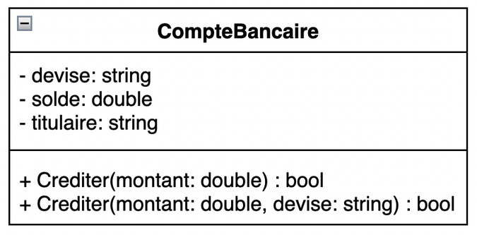

---

### Caractéristiques d'une classe dans un diagramme

- Nom de la classe en caractères gras (en italique pour les classes abstraites).
- Un compartiment pour les attributs, un autre pour les opérations (méthodes).
- Symboles avant les membres = niveau d'accessibilité public (`+`), privé (`-`), protégé (`#`).
- Paramètres et type de retour des méthodes sont parfois omis.

---

### Association entre classes

- Relation entre classes de type "**a un**" ou "**a plusieurs**".
  - Un compte bancaire a un titulaire, un livre a plusieurs pages, etc.
- Une association binaire est matérialisée en UML par un trait continu entre les deux classes enrichi d'informations sur la **navigabilité** et les **multiplicités** de l'association.
- Elle implique un lien (*couplage*) entre les classes concernées.

---

### Navigabilité d'une association

- Possibilité de parcourir l'association, cad de passer de l'instance d'une classe aux instances de l'autre classe concernées par la relation.
- Matérialisée par une flèche si unidirectionnelle.
- Peut comporter le nom du membre de la classe impliqué dans la relation.

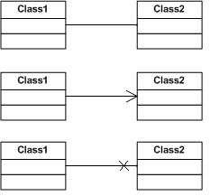

---

### Multiplicité d'une association

Situées à une extrémité d'une association, elle indique *à combien d'instances de la classe une instance de l'autre classe peut être associée*.

| Multiplicité | Signification |
|--------------|---------------|
| *0..1* | Zéro ou une |
| *1* | Une (valeur par défaut) |
| *\** | De zéro à plusieurs |
| *1..\** | De un à plusieurs |

---

### Exemples de multiplicités

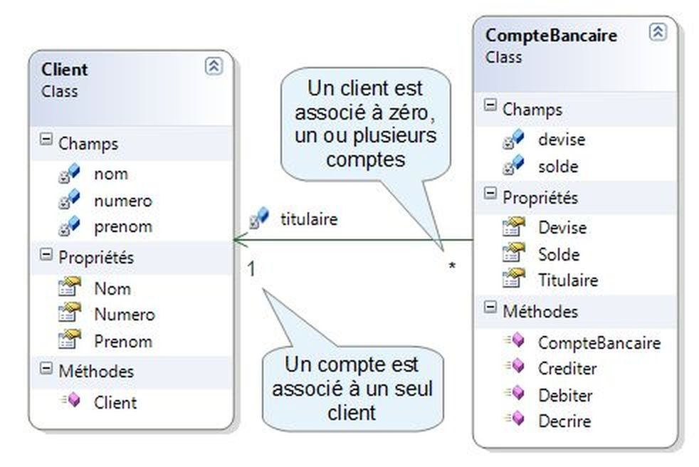

---

### Agrégation

- Type particulier d'association qui modélise une relation de subordination entre classes.
- Indiqué par un losange vide du côté "tout" de la relation.

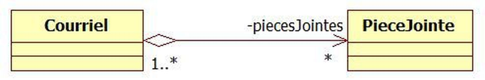

---

### Composition

- Type particulier d'association qui modélise une relation de type composant/composé dans laquelle les cycles de vie des éléments sont liés.
- La disparition du composé entraîne celle de tous ses composants.
- Indiqué par un losange plein du côté "composé" de la relation.

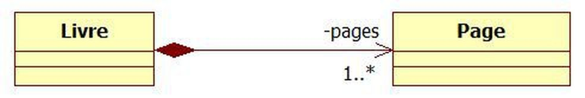

---

### Héritage entre classes

- Relation entre classes de type "**est un**".
- Représentée en UML par une flêche pleine allant de la classe dérivée (fille) vers la classe parente (classe mère ou superclasse).

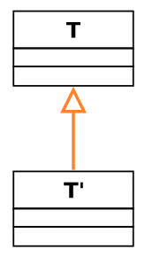

---

### Exemple récapitulatif

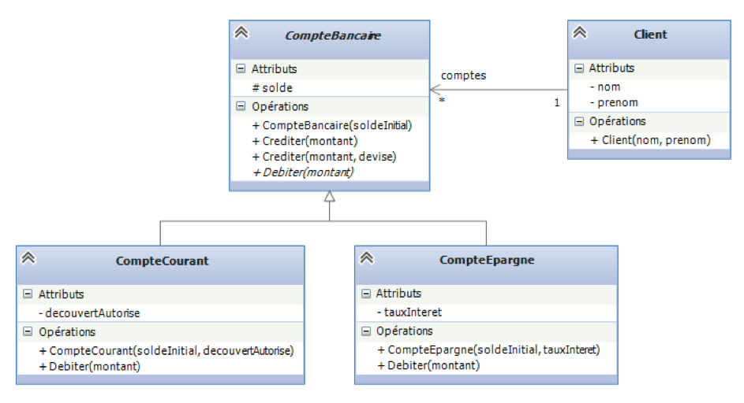

---

## Principaux autres diagrammes

---

### Diagramme de séquence(s)

- Représente les interactions entre différents éléments (objets) selon un ordre chronologique.
- Les acteurs dialoguent à l'aide de messages.

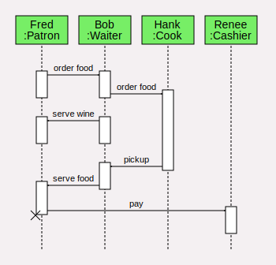

---

### Diagramme de cas d'utilisation

Représente un scénario d'utilisation du système.

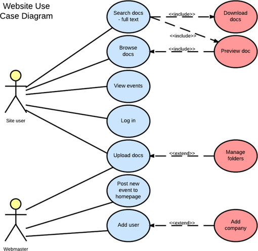

---

### Diagramme d'états-transitions

Décrit le comportement d'un élément du système à l'aide d'un automate à états finis.

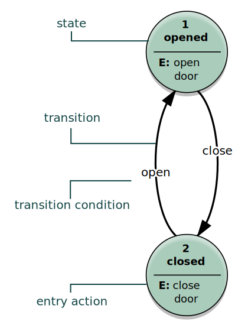

---

## UML en pratique

---

### Ecosystème logiciel

- UML est un standard depuis 25 ans.
- De très nombreux outils de développement logiciel offrent la possibilité de créer des diagrammes UML.
- Certains IDE (environnements de développement intégrés) permettent de générer du code à partir de diagrammes existants, voire l'inverse (rétroconception).
- Exemple de service gratuit en ligne : [diagrams.net](https://app.diagrams.net/)

---

### UML serait-il dépassé ?

- "Has UML Died Without Anyone Noticing?" ([blog post](https://garba.org/posts/2021/uml/), [Hacker News discussion](https://news.ycombinator.com/item?id=26934577))
- Comme langage universel permettant la génération directe d'applications à partir de diagrammes les modélisant, UML a échoué.
- Le travail itératif en mode agile a supplanté l'analyse métier exhaustive qui avait auparavant lieu au début des projets logiciels.
- Certains diagrammes restent utiles et très employés.
