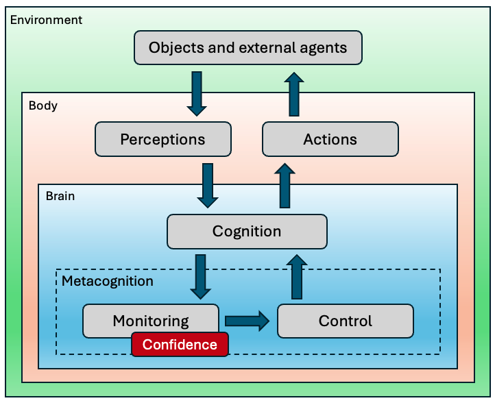
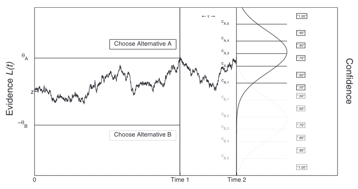

<!-- Apply header and footer to first slide only -->
<!-- _header: "" -->
<!-- _footer: "[Baptiste Pesquet](https://www.bpesquet.fr)" -->
<!-- headingDivider: 5 -->

# Confidence in decision-making

<!-- Show pagination, starting with second slide -->
<!-- paginate: true -->

## Terminology

### Confidence: general definition

Everyone knows intuitively what confidence is about, yet it is seldom defined explicitely.

In the broadest sense, **confidence quantifies a degree of belief in something or someone** [[Meyniel et al., 2015]](https://doi.org/10.1016/j.neuron.2015.09.039).

It is fundamentally linked to its object: a thought, a choice, an external actor, etc.

### Belief

A belief is **a feeling of certainty about a proposition** (i.e. a statement or a decision). It is a subjective, conscious experience.

Note: regarding perceptions, our belief usually matches our perceptual experience, but not always [[Mamassian, 2020]](https://journals.sagepub.com/doi/10.1177/0301006620928010).

### Uncertainty

Generally speaking, uncertainty (or incertitude) characterizes situations involving **imperfect, noisy or unknown information**.

In decision-making, uncertainty refers to **the variability in the representation of information before a decision is taken** [[Mamassian, 2021]](https://journals.sagepub.com/doi/10.1177/0301006620928010).

To perform well, the brain needs to be effective at dealing with many uncertainties, some of them external (changes in world state or sensorimotor variability), others internal (cognitive variables, timing or abstract states). Uncertainty is inherent to all stages of neural computation.

### Confidence: updated definition

In decision-making, confidence can be seen as **the subjective estimate of decision quality** [[Brus et al., 2021]](https://www.nature.com/articles/s41467-021-27618-5).

More formally, it can be defined as **the probability that a choice is correct given the evidence** [[Pouget et al., 2016]](https://www.nature.com/articles/nn.4240).

Confidence is a form of certainty. A key difference is that contrary to confidence, (un)certainties are *decision independant*. **Confidence quantifies the degree of certainty associated to a decision**.

### Trust

Trust is a social construct: **the belief that someone or something will behave or perform as expected**. It implies a relationship between a *trustor* and a *trustee*.

**Self-confidence** is trust in one's abilities.

### Error monitoring

In decision-making, error monitoring (EM) is **the process by which one is able to detect his/her errors as soon as a response has been made** [[Yeung & Summerfield, 2012]](https://royalsocietypublishing.org/doi/10.1098/rstb.2011.0416).

EM allows adaptation of behavior both in the short and longer terms through gradual learning of actions' outcomes.

### Metacognition

Confidence judgments and error monitoring are two related aspects of metacognition (sometimes called *higher order thinking*).

First described in [[Flavell, 1979]](https://www.semanticscholar.org/paper/Metacognition-and-Cognitive-Monitoring%3A-A-New-Area-Flavell/ee652f0f63ed5b0cfe0af4cb4ea76b2ecf790c8d), metacognition can be defined as **the ability to consider, understand and regulate one's cognitive processes**. It is a key skill to adapt to complex problems and changing environments.

---

Metacognition is classicaly divided into two subprocesses: **monitoring** and **control**.

#### Example of metacognition: metaperception

[[Mamassian, 2020]](https://journals.sagepub.com/doi/10.1177/0301006620928010)

### Cognitive control

Cognitive control refers to **the intentional selection of thoughts, emotions, and behaviors based on current task demands and social context, and the concomitant suppression of inappropriate habitual actions** [[Miller and Cohen, 2001]](https://www.annualreviews.org/content/journals/10.1146/annurev.neuro.24.1.167).

In simpler terms, cognitive control allows adapting our behaviour on-the-fly to improve performance.

## Measuring confidence

### Experimental tasks

Their setup is similar to those used to study [decision-making](../decision_making/README.md). The major difference is that before or (more frequently) after taking a decision (a *type 1* task), subjects express their confidence about it (a *type 2* task).

Example of type 1 task: is the [Gabor patch](http://neuroanatody.com/2016/05/whats-in-a-gabor-patch/) tilted to the left or to the right?

#### Flow of information for a perceptual task

[[Mamassian, 2020]](https://journals.sagepub.com/doi/10.1177/0301006620928010)

### Measures of interest

Measures of metacognition in experimental tasks seek to estimate the statistical relationship between confidence judgments and objective performance [[Fleming, 2024]](https://www.annualreviews.org/content/journals/10.1146/annurev-psych-022423-032425).

#### Sensitivity

Confidence/metacognitive/type 2 sensitivity is **the capacity to correlate confidence judgments and objective task performance**.

For example, being confident when taking correct decisions and less confident otherwise demonstrates a high degree of sensitivity.

Sensitivity is often affected by task performance itself: an individual will appear to have greater sensitivity on an easy task compared to a hard task [[Fleming and Lau, 2014]](https://www.frontiersin.org/journals/human-neuroscience/articles/10.3389/fnhum.2014.00443/full).

#### Bias

Confidence/metacognitive/type 2 bias is **a difference in subjective confidence despite constant task performance**.

Under- and over-confidence are examples of biases.

> Real confidence distributions are unlikely to be Gaussian.

[[Fleming and Lau, 2014]](https://www.frontiersin.org/journals/human-neuroscience/articles/10.3389/fnhum.2014.00443/full)

#### Efficiency

Confidence/metacognitive efficiency (or capacity) is **the level of sensitivity given a certain level of task performance**.

It is measured relative to a particular task performance level.

### Measurement methods

#### Confidence ratings

After a decision, the subject is asked to evaluate its correctness, using a dedicated scale.

Simple and frequently used, this method has several drawbacks: intersubject variability regarding bias and scale usage, and possible confusions between type 1 and type 2 judgments [[Mamassian, 2020]](https://journals.sagepub.com/doi/10.1177/0301006620928010).

#### Post-decision wagering

After a decision, subjects are asked to gamble on whether their response was correct. If the decision is correct, the wager amount is kept [[Fleming and Dolan, 2012]](https://royalsocietypublishing.org/doi/10.1098/rstb.2011.0417).

The amount of the bet is assumed to reflect a subject’s confidence in his or her decision.

#### Opt-out paradigm

In most but not all the trials, the subject has the option to decline the decision task and receive a smaller reward.

This paradigm is well suited to experiments with animals, which cannot explicitely report their confidence.

One challenge is to avoid confounding it with a three-alternative forced choice [[Kepecs et al., 2912]](https://royalsocietypublishing.org/doi/10.1098/rstb.2012.0037).

#### Confidence forced choice

After two decisions, the subject has to choose which one is more likely to be correct.

One benefit of this paradigm is that it disregards confidence biases to focus on sensitivity [[Mamassian, 2020]](https://journals.sagepub.com/doi/10.1177/0301006620928010).

## Computing confidence

### Context

Let's consider a simple two-alternative forced choice decision task.

Assuming that post-decisional confidence was measured on a binary scale (high/low), we can count the number of confidence ratings assigned to each judgment in the following type 2 table.

|Type 1 decision|Low confidence|High confidence|
|-|-|-|
|Incorrect|True Negatives ($TN_2$)|False Positives ($FP_2$)|
|Correct|False Negatives ($FN_2$)|True Positives ($TP_2$)|

### Statistical correlation

The simplest measure of confidence sensitivity is the [$\phi$ coefficient](https://en.wikipedia.org/wiki/Phi_coefficient) (a.k.a. Pearson $r$ correlation for binary variables) between task performance and confidence measurements.

$$\phi = \frac{(TN_2 *TP_2 - FN_2*FP_2)}{\sqrt{(TP_2+FP_2)(TP_2+FN_2)(TN_2+FP_2)(TN_2+FN_2)}}$$

> This metric is equivalent to the *Matthews Correlation Coefficient* (MCC) used in Machine Learning [[Chicco and Jurman, 2023]](https://biodatamining.biomedcentral.com/articles/10.1186/s13040-023-00322-4).

Another possible way of computing correlation is the *Goodman-Kruskal gamma coefficient* $G$.

Unfortunately, both $\phi$ and $G$ can be affected by bias.

### Signal Detection Theory

SDT is a framework for analyzing decision making in the presence of uncertainty.

Originally developped in the mid-20th century to assess how faithfully a radar operator is able to separate signal from noise, it has applications in many fields (psychology, diagnostics, quality control, etc).

SDT's main virtue is its ability to disentangle sensitivity from bias in a decision process.

#### Conceptual overview

##### Context

In an experiment where stimuli or signals were either present or absent, and the subject categorized each trial as having the stimulus/signal present or absent, the trials are sorted into one of four categories in the following type 1 table.

|Stimulus or signal|Response: "absent"|Response: "present"|
|-|-|-|
|Absent|Correct Rejections ($TN_1$)|False Alarms ($FP_1$)|
|Present|Misses ($FN_1$)|Hits ($TP_1$)|

##### Discrimination metrics

*True Positive Rate (TPR)* a.k.a. *hit rate* is the proportion of hits in the presence of stimulus/signal. It quantifies how well a decision maker can identify true positives.

*False Positive Rate (FPR)* a.k.a. *false alarm rate* is the proportion of false alarms in the absence of stimulus/signal.

$$\text{TPR}_1 = \frac{TP_1}{TP_1 + FN_1}$$

$$\text{FPR}_1 = \frac{FP_1}{TN_1+FP_1}$$

> $\text{TPR}_1$ is equivalent to the *recall* metric used in Machine Learning.

##### Probability distributions

SDT represents a decision as a comparison between a *decision variable* (DV), derived from a single piece of sensory evidence, and a *criterion* (the threshold between "absent" and "present" responses).

Since evidence is affected by perturbations such as neural noise and fluctuation in attention, the DV can be modelized as a random variable described by a probability distribution.

More precisely, SDT assumes that the distributions of DV values in the presence or absence of stimulus/signal are Gaussian with equal variance.

---

[[Michel, 2023]](https://wires.onlinelibrary.wiley.com/doi/10.1002/wcs.1628)

##### Example

With this criterion choice, the TPR (shaded region of the signal distribution) is 0.9332 and the FPR (shaded region of the noise distribution) is 0.3085 [[Stanislaw and Todorov, 1999]](https://link.springer.com/article/10.3758/BF03207704).

#### Type 1 sensitivity index

Type 1 sensitivity/discriminability index $d'_1$ is a measure of discrimination performance in the task. It quantifies the sensibility of the decision maker to the presence of the stimulus/signal.

$d'_1$ quantifies the distance between the means of the signal and noise distributions in standard deviation units. It can be obtained using the inverse cumulative distribution function, which computes the *standard score* a.k.a. *z-score* associated to a probability [[Stanislaw and Todorov, 1999]](https://link.springer.com/article/10.3758/BF03207704).

$$d'_1 = z(\text{TPR}_1) - z(\text{FPR}_1)$$

#### ROC curve and AUROC

The ROC curve ("Receiver Operating Characteristic") plots TPR vs. FPR for each possible value of the decision criterion.

AUC, or more precisely AUROC ("Area Under the ROC Curve"), provides an aggregate measure of performance across all possible decision criterions. It is a way to assess sensitivity independently of bias.

This non-parametric approach is free from the equal-variance Gaussian assumption needed for $d'$ to be bias-free [[Fleming and Lau, 2014]](https://www.frontiersin.org/journals/human-neuroscience/articles/10.3389/fnhum.2014.00443/full).

##### Examples

[[Michel, 2023]](https://wires.onlinelibrary.wiley.com/doi/10.1002/wcs.1628)

##### Impact of criterion choice

##### Impact of signal discriminability

#### Type 2 sensitivity index

Applying SDT to the type 2 confidence table defined above, we can compute type 2 sensitivity $d'_2$ by applying the same formula, using True and False Positive Rates that link accuracy and confidence.

$$d'_2 = z(\text{TPR}_2) - z(\text{FPR}_2)$$

However, the equal-variance Gaussian assumption for distributions is problematic in this case [[Galvin et al., 2003]](https://link.springer.com/article/10.3758/BF03196546).

#### AUROC2

With multiple confidence ratings, it is possible to construct a type 2 ROC curve by treating each confidence level as a criterion that separates high from low confidence. AUROC2 is then a (theorically) bias-free measure of confidence sensitivity.

[[Fleming and Lau, 2014]](https://www.frontiersin.org/journals/human-neuroscience/articles/10.3389/fnhum.2014.00443/full)

#### Meta-d'

This measure exploits the fact that given Gaussian variance assumptions at the type 1 level, the shapes of the type 2 distributions are known even if they are not themselves Gaussian. More precisely, the type 2 ROC curve is entirely determined by type 1 sensitivity if the subject is metacognitively ideal (perfect in placing their confidence ratings).

Using this assumption and given the subject’s type 2 performance data, we can thus obtain the underlying type 1 sensitivity. This measure is called meta-$d'$. It estimates the level of type 1 performance ($d′_1$) that would have given rise to the observed type 2 data [[Fleming and Lau, 2014]](https://www.frontiersin.org/journals/human-neuroscience/articles/10.3389/fnhum.2014.00443/full) ([more details](https://www.columbia.edu/~bsm2105/type2sdt/)).

#### M-ratio

Because meta-$d′$ is in the same units as (type 1) $d′$, the two can be directly compared.

We can define confidence efficiency as the value of meta-$d′$ relative to $d′$, or meta-$d'/d'$. This measure is called the M-ratio.

An alternative measure is meta-$d'-d'$, favored when $d'$ takes small values [[Fleming and Lau, 2014]](https://www.frontiersin.org/journals/human-neuroscience/articles/10.3389/fnhum.2014.00443/full).

### Evidence Accumulation Models

In contrast to models inspired by SDT (which is silent on decision time), accumulation of evidence models assume that new sensory evidence becomes available over time until a decision is reached.

The number of accumulators may vary from only one (à la Drift Diffusion Model) to several ones, more or less partially correlated (for example, using mutual inhibition).

#### Balance of Evidence

In a multi-accumulator model, confidence can be seen as the distance between them at the time of decision (i.e. threshold reached). This measure is called the *Balance of Evidence* (BoE) [[Mamassian, 2016]](https://www.annualreviews.org/content/journals/10.1146/annurev-vision-111815-114630).

In a DDM-like model, confidence is taken to be the current position of the accumulated evidence.

#### Two-stage Dynamic Signal Detection

Other approaches like the *Two-stage Dynamic Signal Detection* (2DSD) model postulate that the accumulation process continues after a decision has been made. The ultimate location of accumulated evidence serves as a proxy for confidence.

These approaches of confidence formation may help explain some experimentaly reported phenomena like post-decisional changes of mind.

[[Pleskac and Busemeyer, 2010]](https://psycnet.apa.org/doiLanding?doi=10.1037%2Fa0019737)

## What's next?

### Neural basis of confidence

Numerous studies demonstrate that the brain tracks uncertainty about a wide range of quantities and that such uncertainty informs metacognitive processes, such as confidence judgments [[Fleming, 2024]](https://www.annualreviews.org/content/journals/10.1146/annurev-psych-022423-032425).

Activity in the parietal cortex seems related to evidence accumulation during decision-making.

Convergent findings emphasize the importance of the prefrontal cortex, more precisely the ventromedial prefrontal cortex (vmPFC), in the formation of confidence.

Many results suggest that there are separate and perhaps multiple brain areas involved in confidence monitoring and reporting [[Grimaldi et al., 2015]](https://www.sciencedirect.com/science/article/pii/S0149763415001025?via%3Dihub).

### Usages of confidence

As part of metacognitive monitoring, confidence judgments may inform the processes of cognitive control.

Having an explicit representation of the confidence of a perceptual decision may help us compute the risk of being wrong ($1 - \text{confidence}$).

Having a good confidence sensitivity will also give us the possibility to allocate appropriate resources to a task.

Good confidence can also help us appreciate whether and how we can control the environment.
